# Activity Diagrams – Web Admin

> Dùng Mermaid `flowchart TD`. Ký hiệu: hình thoi `{}` = decision, hình chữ nhật bo góc `([])` = start/end, hình chữ nhật `[]` = activity.

| Mã | Tên |
|----|-----|
| [AD-W01](#ad-w01-đăng-nhập) | Đăng nhập |
| [AD-W02](#ad-w02-đăng-ký-businessowner) | Đăng ký BusinessOwner |
| [AD-W03](#ad-w03-dashboard-admin) | Dashboard Admin |
| [AD-W04](#ad-w04-quản-lý-business) | Quản lý Business (CRUD + Toggle Active) |
| [AD-W05](#ad-w05-quản-lý-stall) | Quản lý Stall (CRUD + Toggle + plan check) |
| [AD-W06](#ad-w06-đặt-vị-trí-stall-trên-bản-đồ) | Đặt vị trí Stall trên bản đồ |
| [AD-W07](#ad-w07-quản-lý-media-stall) | Quản lý Media Stall |
| [AD-W08](#ad-w08-quản-lý-geofence) | Quản lý GeoFence |
| [AD-W09](#ad-w09-quản-lý-narration-content) | Quản lý Narration Content |
| [AD-W10](#ad-w10-xem-chi-tiết-narration-content--cập-nhật-script) | Xem chi tiết Narration Content + Cập nhật script |
| [AD-W11](#ad-w11-theo-dõi--retry-tts) | Theo dõi & Retry TTS |
| [AD-W12](#ad-w12-upload-audio-giọng-người) | Upload Audio giọng người |
| [AD-W13](#ad-w13-thanh-toán-đăng-ký-gói) | Thanh toán đăng ký Plan |
| [AD-W14](#ad-w14-admin-cập-nhật-subscription-business) | Admin cập nhật Subscription Business |
| [AD-W15](#ad-w15-quản-lý-user--role) | Quản lý User & Role |
| [AD-W16](#ad-w16-quản-lý-mã-qr) | Quản lý Mã QR |
| [AD-W17](#ad-w17-kiosk-auto-qr) | Kiosk Tạo QR Tự động |
| [AD-W18](#ad-w18-theo-dõi-thiết-bị-online--reset) | Theo dõi Thiết bị Online + Reset |
| [AD-W19](#ad-w19-bản-đồ-nhiệt) | Bản đồ nhiệt (Heatmap) |
| [AD-W20](#ad-w20-quản-lý-tour) | Quản lý Tour |
| [AD-W21](#ad-w21-tour-designer) | Thiết kế Tour (TourDesigner) |

---

### AD-W01: Đăng nhập

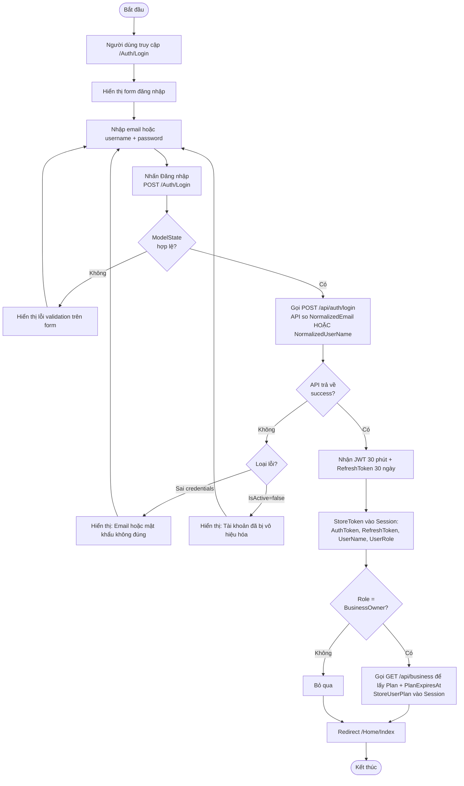
```mermaid
flowchart TD
    A([Bắt đầu]) --> B[Người dùng truy cập /Auth/Login]
    B --> C[Hiển thị form đăng nhập]
    C --> D[Nhập email hoặc username + password]
    D --> E[Nhấn Đăng nhập\nPOST /Auth/Login]
    E --> F{ModelState\nhợp lệ?}
    F -- Không --> G[Hiển thị lỗi validation trên form]
    G --> D
    F -- Có --> H[Gọi POST /api/auth/login\nAPI so NormalizedEmail HOẶC NormalizedUserName]
    H --> I{API trả về\nsuccess?}
    I -- Không --> J{Loại lỗi?}
    J -- Sai credentials --> K[Hiển thị: Email hoặc mật khẩu không đúng]
    J -- IsActive=false --> L[Hiển thị: Tài khoản đã bị vô hiệu hóa]
    K --> D
    L --> D
    I -- Có --> M[Nhận JWT 30 phút + RefreshToken 30 ngày]
    M --> N[StoreToken vào Session:\nAuthToken, RefreshToken, UserName, UserRole]
    N --> O{Role =\nBusinessOwner?}
    O -- Có --> P[Gọi GET /api/business để lấy Plan + PlanExpiresAt\nStoreUserPlan vào Session]
    O -- Không --> Q[Bỏ qua]
    P --> R[Redirect /Home/Index]
    Q --> R
    R --> S([Kết thúc])
```

---

### AD-W02: Đăng ký BusinessOwner

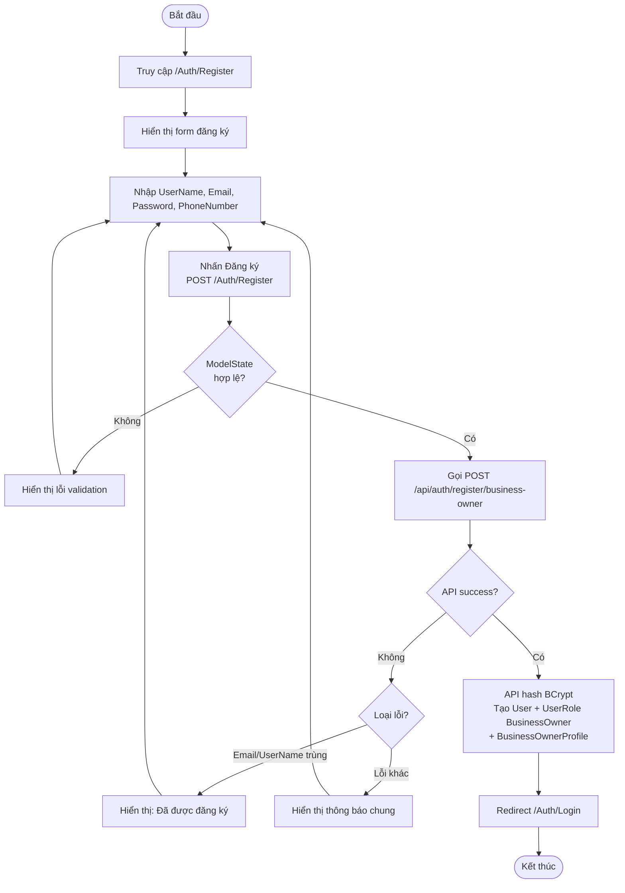
```mermaid
flowchart TD
    A([Bắt đầu]) --> B[Truy cập /Auth/Register]
    B --> C[Hiển thị form đăng ký]
    C --> D[Nhập UserName, Email, Password, PhoneNumber]
    D --> E[Nhấn Đăng ký\nPOST /Auth/Register]
    E --> F{ModelState\nhợp lệ?}
    F -- Không --> G[Hiển thị lỗi validation]
    G --> D
    F -- Có --> H[Gọi POST /api/auth/register/business-owner]
    H --> I{API success?}
    I -- Không --> J{Loại lỗi?}
    J -- Email/UserName trùng --> K[Hiển thị: Đã được đăng ký]
    J -- Lỗi khác --> L[Hiển thị thông báo chung]
    K --> D
    L --> D
    I -- Có --> M[API hash BCrypt\nTạo User + UserRole BusinessOwner\n+ BusinessOwnerProfile]
    M --> N[Redirect /Auth/Login]
    N --> O([Kết thúc])
```

---

### AD-W03: Dashboard Admin

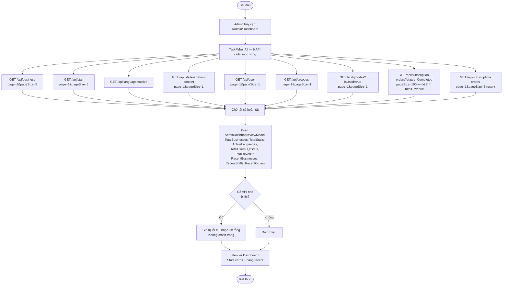
```mermaid
flowchart TD
    A([Bắt đầu]) --> B[Admin truy cập /Admin/Dashboard]
    B --> C[Task.WhenAll — 9 API calls song song]

    C --> D1[GET /api/business\npage=1&pageSize=5]
    C --> D2[GET /api/stall\npage=1&pageSize=5]
    C --> D3[GET /api/languages/active]
    C --> D4[GET /api/stall-narration-content\npage=1&pageSize=1]
    C --> D5[GET /api/user\npage=1&pageSize=1]
    C --> D6[GET /api/qrcodes\npage=1&pageSize=1]
    C --> D7[GET /api/qrcodes?isUsed=true\npage=1&pageSize=1]
    C --> D8[GET /api/subscription-orders?status=Completed\npageSize=100 — để tính TotalRevenue]
    C --> D9[GET /api/subscription-orders\npage=1&pageSize=5 recent]

    D1 --> E[Chờ tất cả hoàn tất]
    D2 --> E
    D3 --> E
    D4 --> E
    D5 --> E
    D6 --> E
    D7 --> E
    D8 --> E
    D9 --> E

    E --> F[Build AdminDashboardViewModel:\nTotalBusinesses, TotalStalls, ActiveLanguages,\nTotalUsers, QrStats, TotalRevenue,\nRecentBusinesses, RecentStalls, RecentOrders]

    F --> G{Có API nào\nbị lỗi?}
    G -- Có --> H[Giá trị lỗi = 0 hoặc list rỗng\nKhông crash trang]
    G -- Không --> I[Đủ dữ liệu]
    H --> J[Render Dashboard\nStats cards + bảng recent]
    I --> J
    J --> K([Kết thúc])
```

---

### AD-W04: Quản lý Business

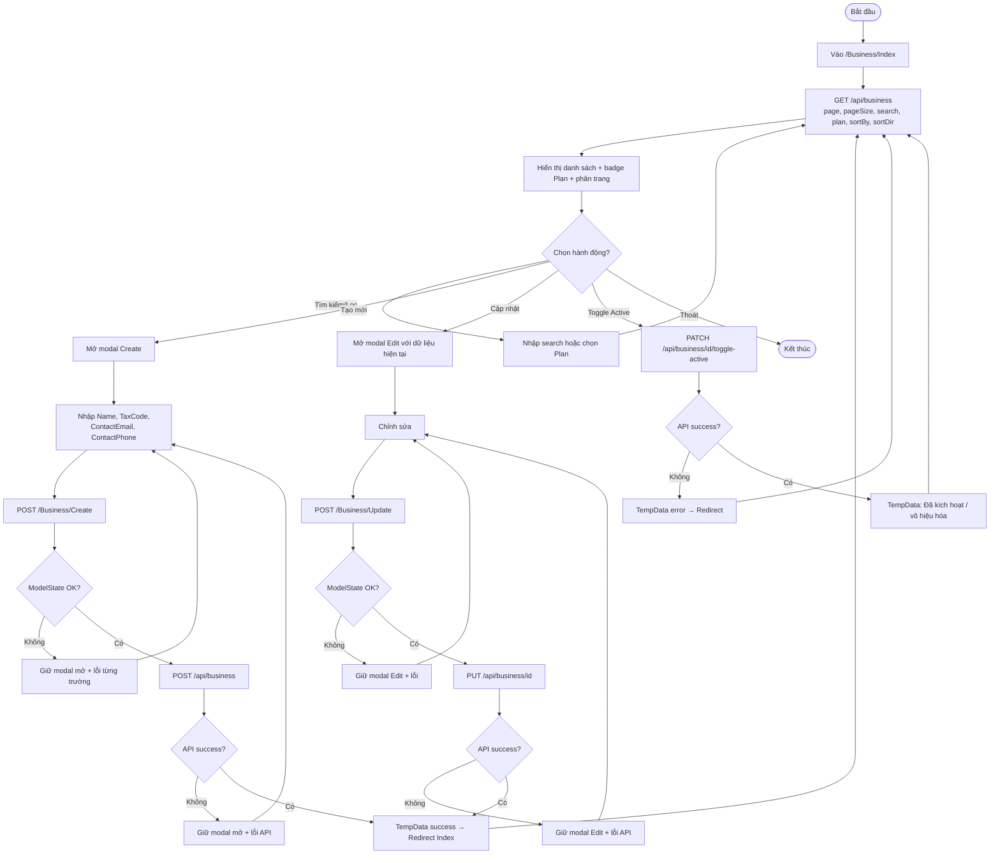
```mermaid
flowchart TD
    A([Bắt đầu]) --> B[Vào /Business/Index]
    B --> C[GET /api/business\npage, pageSize, search, plan, sortBy, sortDir]
    C --> D[Hiển thị danh sách + badge Plan + phân trang]

    D --> E{Chọn hành động?}

    E -- Tìm kiếm/Lọc --> F[Nhập search hoặc chọn Plan]
    F --> C

    E -- Tạo mới --> G[Mở modal Create]
    G --> H[Nhập Name, TaxCode,\nContactEmail, ContactPhone]
    H --> I[POST /Business/Create]
    I --> J{ModelState OK?}
    J -- Không --> K[Giữ modal mở + lỗi từng trường]
    K --> H
    J -- Có --> L[POST /api/business]
    L --> M{API success?}
    M -- Không --> N[Giữ modal mở + lỗi API]
    N --> H
    M -- Có --> O[TempData success → Redirect Index]
    O --> C

    E -- Cập nhật --> P[Mở modal Edit với dữ liệu hiện tại]
    P --> Q[Chỉnh sửa]
    Q --> R[POST /Business/Update]
    R --> S{ModelState OK?}
    S -- Không --> T[Giữ modal Edit + lỗi]
    T --> Q
    S -- Có --> U[PUT /api/business/id]
    U --> V{API success?}
    V -- Không --> W[Giữ modal Edit + lỗi API]
    W --> Q
    V -- Có --> O

    E -- Toggle Active --> X[PATCH /api/business/id/toggle-active]
    X --> Y{API success?}
    Y -- Không --> Z[TempData error → Redirect]
    Y -- Có --> AA[TempData: Đã kích hoạt / vô hiệu hóa]
    Z --> C
    AA --> C

    E -- Thoát --> AB([Kết thúc])
```

---

### AD-W05: Quản lý Stall

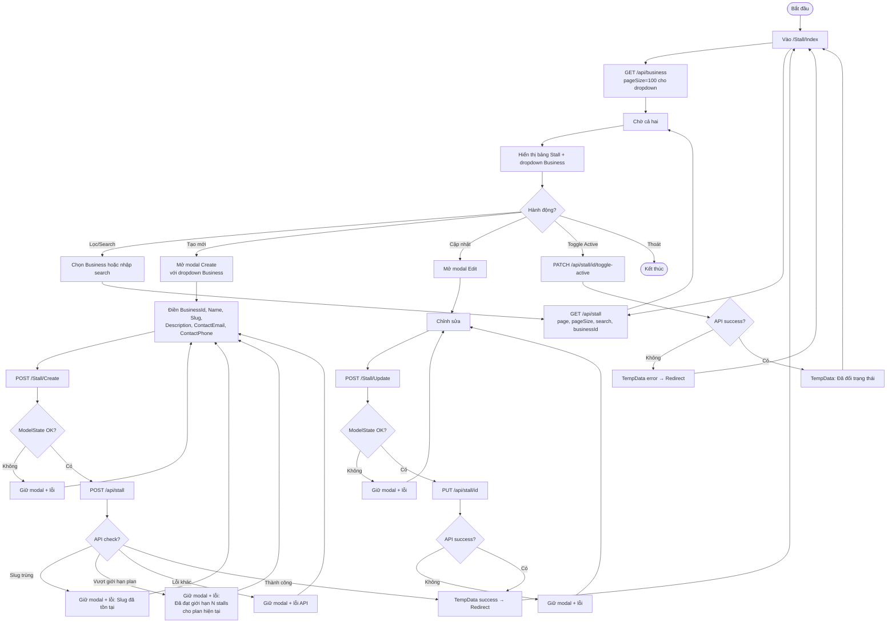
```mermaid
flowchart TD
    A([Bắt đầu]) --> B[Vào /Stall/Index]

    B --> C1[GET /api/business\npageSize=100 cho dropdown]
    B --> C2[GET /api/stall\npage, pageSize, search, businessId]
    C1 --> D[Chờ cả hai]
    C2 --> D
    D --> E[Hiển thị bảng Stall + dropdown Business]

    E --> F{Hành động?}

    F -- Lọc/Search --> G[Chọn Business hoặc nhập search]
    G --> C2

    F -- Tạo mới --> H[Mở modal Create\nvới dropdown Business]
    H --> I[Điền BusinessId, Name, Slug,\nDescription, ContactEmail, ContactPhone]
    I --> J[POST /Stall/Create]
    J --> K{ModelState OK?}
    K -- Không --> L[Giữ modal + lỗi]
    L --> I
    K -- Có --> M[POST /api/stall]
    M --> N{API check?}
    N -- Slug trùng --> O[Giữ modal + lỗi: Slug đã tồn tại]
    N -- Vượt giới hạn plan --> P[Giữ modal + lỗi:\nĐã đạt giới hạn N stalls\ncho plan hiện tại]
    N -- Lỗi khác --> Q[Giữ modal + lỗi API]
    O --> I
    P --> I
    Q --> I
    N -- Thành công --> R[TempData success → Redirect]
    R --> B

    F -- Cập nhật --> S[Mở modal Edit]
    S --> T[Chỉnh sửa]
    T --> U[POST /Stall/Update]
    U --> V{ModelState OK?}
    V -- Không --> W[Giữ modal + lỗi]
    W --> T
    V -- Có --> X[PUT /api/stall/id]
    X --> Y{API success?}
    Y -- Không --> Z[Giữ modal + lỗi]
    Z --> T
    Y -- Có --> R

    F -- Toggle Active --> AA[PATCH /api/stall/id/toggle-active]
    AA --> AB{API success?}
    AB -- Không --> AC[TempData error → Redirect]
    AB -- Có --> AD[TempData: Đã đổi trạng thái]
    AC --> B
    AD --> B

    F -- Thoát --> AE([Kết thúc])
```

---

### AD-W06: Đặt vị trí Stall trên bản đồ

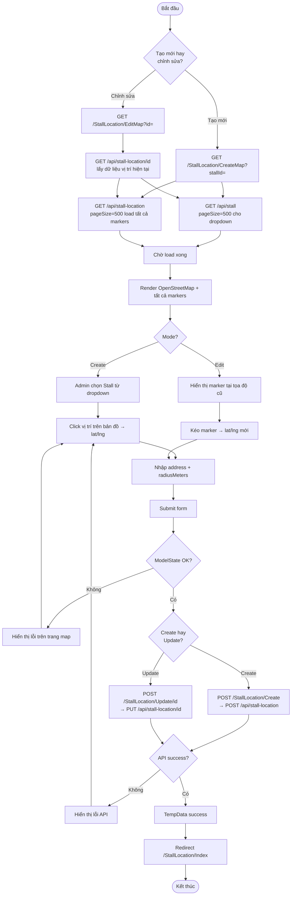
```mermaid
flowchart TD
    A([Bắt đầu]) --> B{Tạo mới hay\nchỉnh sửa?}

    B -- Tạo mới --> C[GET /StallLocation/CreateMap?stallId=]
    B -- Chỉnh sửa --> D[GET /StallLocation/EditMap?id=]

    C --> E1[GET /api/stall\npageSize=500 cho dropdown]
    C --> E2[GET /api/stall-location\npageSize=500 load tất cả markers]

    D --> F[GET /api/stall-location/id\nlấy dữ liệu vị trí hiện tại]
    F --> E1
    F --> E2

    E1 --> G[Chờ load xong]
    E2 --> G
    G --> H[Render OpenStreetMap + tất cả markers]

    H --> I{Mode?}
    I -- Create --> J[Admin chọn Stall từ dropdown]
    I -- Edit --> K[Hiển thị marker tại tọa độ cũ]

    J --> L[Click vị trí trên bản đồ → lat/lng]
    K --> M[Kéo marker → lat/lng mới]

    L --> N[Nhập address + radiusMeters]
    M --> N
    N --> O[Submit form]
    O --> P{ModelState OK?}
    P -- Không --> Q[Hiển thị lỗi trên trang map]
    Q --> L

    P -- Có --> R{Create hay\nUpdate?}
    R -- Create --> S[POST /StallLocation/Create\n→ POST /api/stall-location]
    R -- Update --> T[POST /StallLocation/Update/id\n→ PUT /api/stall-location/id]

    S --> U{API success?}
    T --> U

    U -- Không --> V[Hiển thị lỗi API]
    V --> L
    U -- Có --> W[TempData success]
    W --> X[Redirect /StallLocation/Index]
    X --> Y([Kết thúc])
```

---

### AD-W07: Quản lý Media Stall

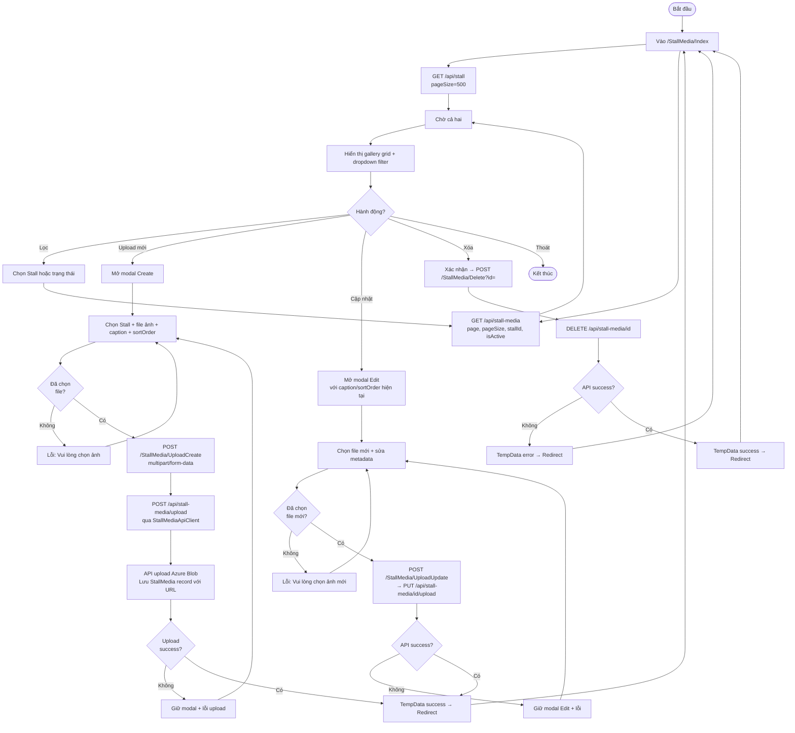
```mermaid
flowchart TD
    A([Bắt đầu]) --> B[Vào /StallMedia/Index]
    B --> C1[GET /api/stall\npageSize=500]
    B --> C2[GET /api/stall-media\npage, pageSize, stallId, isActive]
    C1 --> D[Chờ cả hai]
    C2 --> D
    D --> E[Hiển thị gallery grid + dropdown filter]

    E --> F{Hành động?}

    F -- Lọc --> G[Chọn Stall hoặc trạng thái]
    G --> C2

    F -- Upload mới --> H[Mở modal Create]
    H --> I[Chọn Stall + file ảnh + caption + sortOrder]
    I --> J{Đã chọn\nfile?}
    J -- Không --> K[Lỗi: Vui lòng chọn ảnh]
    K --> I
    J -- Có --> L[POST /StallMedia/UploadCreate\nmultipart/form-data]
    L --> M[POST /api/stall-media/upload\nqua StallMediaApiClient]
    M --> N[API upload Azure Blob\nLưu StallMedia record với URL]
    N --> O{Upload\nsuccess?}
    O -- Không --> P[Giữ modal + lỗi upload]
    P --> I
    O -- Có --> Q[TempData success → Redirect]
    Q --> B

    F -- Cập nhật --> R[Mở modal Edit\nvới caption/sortOrder hiện tại]
    R --> S[Chọn file mới + sửa metadata]
    S --> T{Đã chọn\nfile mới?}
    T -- Không --> U[Lỗi: Vui lòng chọn ảnh mới]
    U --> S
    T -- Có --> V[POST /StallMedia/UploadUpdate\n→ PUT /api/stall-media/id/upload]
    V --> W{API success?}
    W -- Không --> X[Giữ modal Edit + lỗi]
    X --> S
    W -- Có --> Q

    F -- Xóa --> Y[Xác nhận → POST /StallMedia/Delete?id=]
    Y --> Z[DELETE /api/stall-media/id]
    Z --> AA{API success?}
    AA -- Không --> AB[TempData error → Redirect]
    AA -- Có --> AC[TempData success → Redirect]
    AB --> B
    AC --> B

    F -- Thoát --> AD([Kết thúc])
```

---

### AD-W08: Quản lý GeoFence

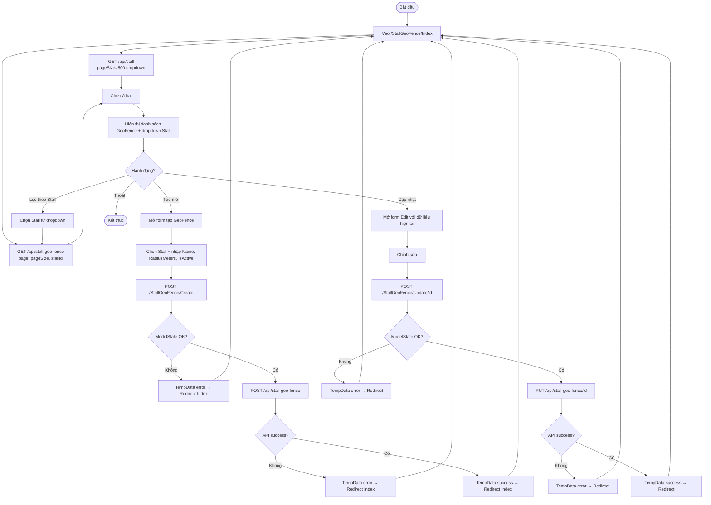
```mermaid
flowchart TD
    A([Bắt đầu]) --> B[Vào /StallGeoFence/Index]
    B --> C1[GET /api/stall\npageSize=500 dropdown]
    B --> C2[GET /api/stall-geo-fence\npage, pageSize, stallId]
    C1 --> D[Chờ cả hai]
    C2 --> D
    D --> E[Hiển thị danh sách GeoFence + dropdown Stall]

    E --> F{Hành động?}

    F -- Lọc theo Stall --> G[Chọn Stall từ dropdown]
    G --> C2

    F -- Tạo mới --> H[Mở form tạo GeoFence]
    H --> I[Chọn Stall + nhập Name, RadiusMeters, IsActive]
    I --> J[POST /StallGeoFence/Create]
    J --> K{ModelState OK?}
    K -- Không --> L[TempData error → Redirect Index]
    L --> B
    K -- Có --> M[POST /api/stall-geo-fence]
    M --> N{API success?}
    N -- Không --> O[TempData error → Redirect Index]
    O --> B
    N -- Có --> P[TempData success → Redirect Index]
    P --> B

    F -- Cập nhật --> Q[Mở form Edit với dữ liệu hiện tại]
    Q --> R[Chỉnh sửa]
    R --> S[POST /StallGeoFence/Update/id]
    S --> T{ModelState OK?}
    T -- Không --> U[TempData error → Redirect]
    U --> B
    T -- Có --> V[PUT /api/stall-geo-fence/id]
    V --> W{API success?}
    W -- Không --> X[TempData error → Redirect]
    X --> B
    W -- Có --> Y[TempData success → Redirect]
    Y --> B

    F -- Thoát --> Z([Kết thúc])
```

---

### AD-W09: Quản lý Narration Content

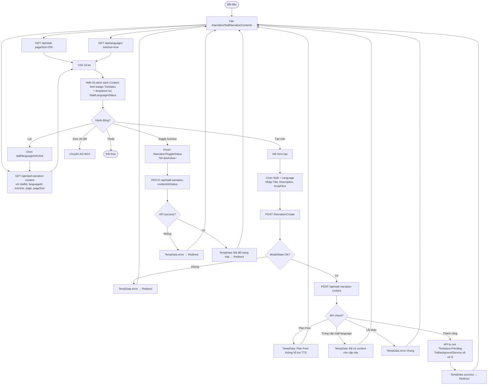
```mermaid
flowchart TD
    A([Bắt đầu]) --> B[Vào /Narration/StallNarrationContents]
    B --> C1[GET /api/stall pageSize=200]
    B --> C2[GET /api/languages isActive=true]
    B --> C3[GET /api/stall-narration-content\nvới stallId, languageId, isActive, page, pageSize]
    C1 --> D[Chờ cả ba]
    C2 --> D
    C3 --> D
    D --> E[Hiển thị danh sách Content kèm badge TtsStatus\n+ dropdown lọc Stall/Language/Status]

    E --> F{Hành động?}

    F -- Lọc --> G[Chọn stall/language/isActive]
    G --> C3

    F -- Tạo mới --> H[Mở form tạo]
    H --> I[Chọn Stall + Language\nNhập Title, Description, ScriptText]
    I --> J[POST /Narration/Create]
    J --> K{ModelState OK?}
    K -- Không --> L[TempData error → Redirect]
    L --> B
    K -- Có --> M[POST /api/stall-narration-content]
    M --> N{API check?}
    N -- Plan Free --> O[TempData: Plan Free không hỗ trợ TTS]
    N -- Trùng cặp stall-language --> P[TempData: Đã có content cho cặp này]
    N -- Lỗi khác --> Q[TempData error chung]
    O --> B
    P --> B
    Q --> B
    N -- Thành công --> R[API tự set TtsStatus=Pending\nTtsBackgroundService sẽ xử lý]
    R --> S[TempData success → Redirect]
    S --> B

    F -- Toggle IsActive --> T[POST /Narration/ToggleStatus\n?id=&isActive=]
    T --> U[PATCH /api/stall-narration-content/id/status]
    U --> V{API success?}
    V -- Không --> W[TempData error → Redirect]
    V -- Có --> X[TempData: Đã đổi trạng thái → Redirect]
    W --> B
    X --> B

    F -- Xem chi tiết --> Y[Chuyển AD-W10]

    F -- Thoát --> Z([Kết thúc])
```

---

### AD-W10: Xem chi tiết Narration Content + Cập nhật script

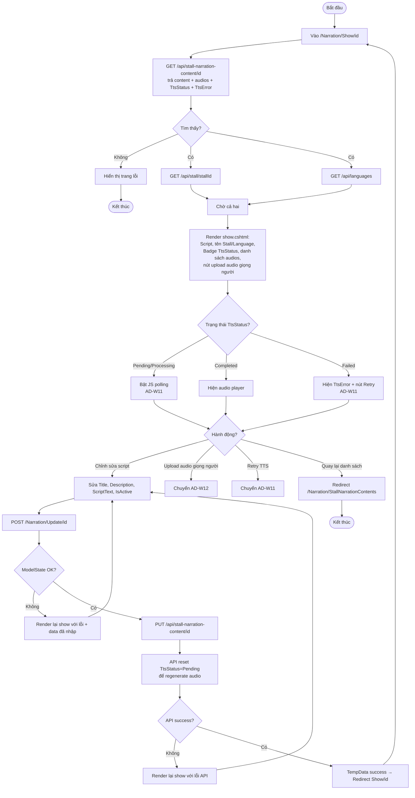
```mermaid
flowchart TD
    A([Bắt đầu]) --> B[Vào /Narration/Show/id]
    B --> C[GET /api/stall-narration-content/id\ntrả content + audios + TtsStatus + TtsError]
    C --> D{Tìm thấy?}
    D -- Không --> E[Hiển thị trang lỗi]
    E --> F([Kết thúc])

    D -- Có --> G1[GET /api/stall/stallId]
    D -- Có --> G2[GET /api/languages]
    G1 --> H[Chờ cả hai]
    G2 --> H
    H --> I[Render show.cshtml:\nScript, tên Stall/Language,\nBadge TtsStatus, danh sách audios,\nnút upload audio giọng người]

    I --> J{Trạng thái TtsStatus?}
    J -- Pending/Processing --> K[Bật JS polling\nAD-W11]
    J -- Completed --> L[Hiện audio player]
    J -- Failed --> M[Hiện TtsError + nút Retry\nAD-W11]

    L --> N{Hành động?}
    K --> N
    M --> N

    N -- Chỉnh sửa script --> O[Sửa Title, Description, ScriptText, IsActive]
    O --> P[POST /Narration/Update/id]
    P --> Q{ModelState OK?}
    Q -- Không --> R[Render lại show với lỗi + data đã nhập]
    R --> O
    Q -- Có --> S[PUT /api/stall-narration-content/id]
    S --> T[API reset TtsStatus=Pending\nđể regenerate audio]
    T --> U{API success?}
    U -- Không --> V[Render lại show với lỗi API]
    V --> O
    U -- Có --> W[TempData success → Redirect Show/id]
    W --> B

    N -- Upload audio giọng người --> X[Chuyển AD-W12]
    N -- Retry TTS --> Y[Chuyển AD-W11]
    N -- Quay lại danh sách --> Z[Redirect /Narration/StallNarrationContents]
    Z --> AA([Kết thúc])
```

---

### AD-W11: Theo dõi & Retry TTS

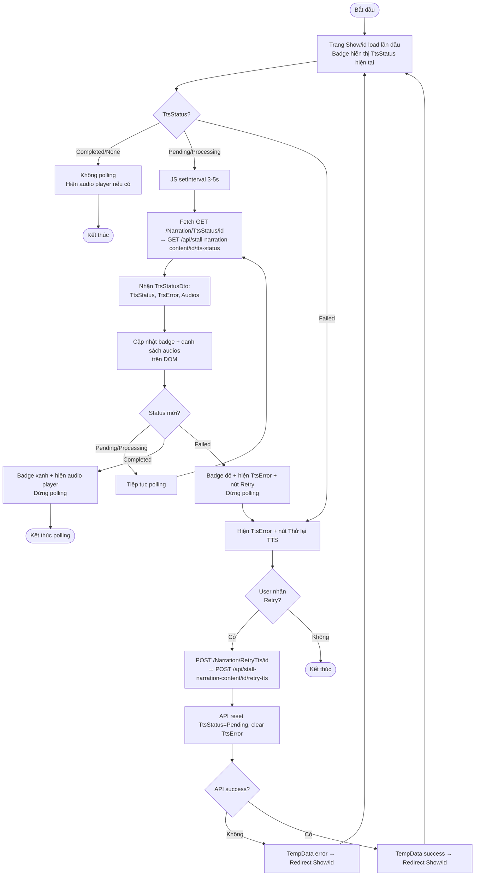
```mermaid
flowchart TD
    A([Bắt đầu]) --> B[Trang Show/id load lần đầu\nBadge hiển thị TtsStatus hiện tại]
    B --> C{TtsStatus?}

    C -- Completed/None --> D[Không polling\nHiện audio player nếu có]
    D --> E([Kết thúc])

    C -- Pending/Processing --> F[JS setInterval 3-5s]
    C -- Failed --> G[Hiện TtsError + nút Thử lại TTS]

    F --> H[Fetch GET /Narration/TtsStatus/id\n→ GET /api/stall-narration-content/id/tts-status]
    H --> I[Nhận TtsStatusDto:\nTtsStatus, TtsError, Audios]
    I --> J[Cập nhật badge + danh sách audios\ntrên DOM]
    J --> K{Status mới?}
    K -- Pending/Processing --> L[Tiếp tục polling]
    L --> H
    K -- Completed --> M[Badge xanh + hiện audio player\nDừng polling]
    K -- Failed --> N[Badge đỏ + hiện TtsError + nút Retry\nDừng polling]
    M --> O([Kết thúc polling])
    N --> G

    G --> P{User nhấn\nRetry?}
    P -- Có --> Q[POST /Narration/RetryTts/id\n→ POST /api/stall-narration-content/id/retry-tts]
    Q --> R[API reset TtsStatus=Pending, clear TtsError]
    R --> S{API success?}
    S -- Không --> T[TempData error → Redirect Show/id]
    S -- Có --> U[TempData success → Redirect Show/id]
    T --> B
    U --> B

    P -- Không --> V([Kết thúc])
```

---

### AD-W12: Upload Audio giọng người

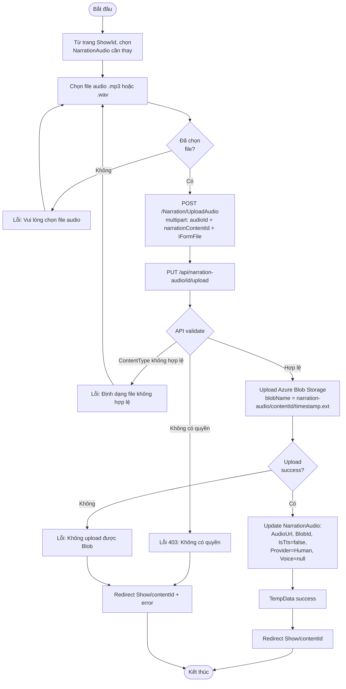
```mermaid
flowchart TD
    A([Bắt đầu]) --> B[Từ trang Show/id, chọn\nNarrationAudio cần thay]
    B --> C[Chọn file audio .mp3 hoặc .wav]
    C --> D{Đã chọn\nfile?}
    D -- Không --> E[Lỗi: Vui lòng chọn file audio]
    E --> C
    D -- Có --> F[POST /Narration/UploadAudio\nmultipart: audioId + narrationContentId + IFormFile]
    F --> G[PUT /api/narration-audio/id/upload]
    G --> H{API validate}
    H -- ContentType không hợp lệ --> I[Lỗi: Định dạng file không hợp lệ]
    H -- Không có quyền --> J[Lỗi 403: Không có quyền]
    H -- Hợp lệ --> K[Upload Azure Blob Storage\nblobName = narration-audio/contentId/timestamp.ext]
    I --> C
    J --> L[Redirect Show/contentId + error]

    K --> M{Upload\nsuccess?}
    M -- Không --> N[Lỗi: Không upload được Blob]
    N --> L

    M -- Có --> O[Update NarrationAudio:\nAudioUrl, BlobId, IsTts=false,\nProvider=Human, Voice=null]
    O --> P[TempData success]
    P --> Q[Redirect Show/contentId]
    Q --> R([Kết thúc])
    L --> R
```

---

### AD-W13: Thanh toán đăng ký Plan

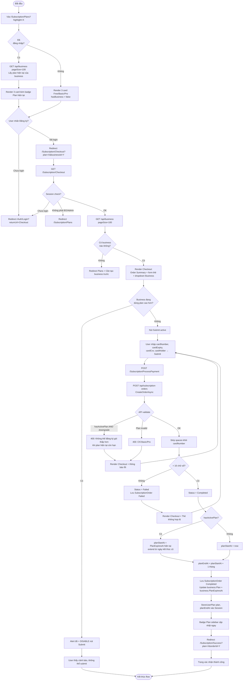
```mermaid
flowchart TD
    A([Bắt đầu]) --> B[Vào /Subscription/Plans?highlight=X]
    B --> C{Đã\nđăng nhập?}
    C -- Có --> D[GET /api/business pageSize=100\nLấy plan hiện tại của business]
    C -- Không --> E[Render 3 card Free/Basic/Pro\nhasBusiness = false]
    D --> F[Render 3 card kèm badge Plan hiện tại]

    E --> G{User nhấn Đăng ký?}
    F --> G

    G -- Chưa login --> H[Redirect /Auth/Login?returnUrl=Checkout]
    G -- Đã login --> I[Redirect /Subscription/Checkout?plan=X&businessId=Y]

    I --> J[GET /Subscription/Checkout]
    J --> K{Session check?}
    K -- Chưa login --> H
    K -- Không phải BO/Admin --> L[Redirect /Subscription/Plans]
    K -- OK --> M[GET /api/business pageSize=100]

    M --> N{Có business\nnào không?}
    N -- Không --> O[Redirect Plans + Cần tạo business trước]
    N -- Có --> P[Render Checkout:\nOrder Summary + form thẻ + dropdown Business]

    P --> Q{Business đang\ndùng plan cao hơn?}
    Q -- Có --> R[Alert đỏ + DISABLE nút Submit]
    Q -- Không --> S[Nút Submit active]
    R --> T[User thấy cảnh báo, không thể submit]
    T --> U([Kết thúc flow])

    S --> V[User nhập cardNumber, cardExpiry,\ncardCvv, cardHolder → Submit]
    V --> W[POST /Subscription/ProcessPayment]
    W --> X[POST /api/subscription-orders\nCreateOrderAsync]

    X --> Y{API validate}
    Y -- hasActivePlan AND downgrade --> Z[400: Không thể đăng ký gói thấp hơn\nkhi plan hiện tại còn hạn]
    Y -- Plan invalid --> AA[400: Chỉ Basic/Pro]
    Y -- OK --> AB[Strip spaces khỏi cardNumber]

    Z --> AC[Render Checkout + thông báo lỗi]
    AA --> AC
    AC --> V

    AB --> AD{= 16 chữ số?}
    AD -- Không --> AE[Status = Failed\nLưu SubscriptionOrder Failed]
    AD -- Có --> AF[Status = Completed]

    AE --> AG[Render Checkout + Thẻ không hợp lệ]
    AG --> V

    AF --> AH{hasActivePlan?}
    AH -- Có --> AI[planStartAt = PlanExpiresAt hiện tại\nextend từ ngày kết thúc cũ]
    AH -- Không --> AJ[planStartAt = now]
    AI --> AK[planEndAt = planStartAt + 1 tháng]
    AJ --> AK

    AK --> AL[Lưu SubscriptionOrder Completed\nUpdate business.Plan + business.PlanExpiresAt]
    AL --> AM[StoreUserPlan plan, planEndAt vào Session]
    AM --> AN[Badge Plan sidebar cập nhật ngay]
    AN --> AO[Redirect /Subscription/Success?plan=X&orderId=Y]
    AO --> AP[Trang xác nhận thành công]
    AP --> U
```

---

### AD-W14: Admin cập nhật Subscription Business

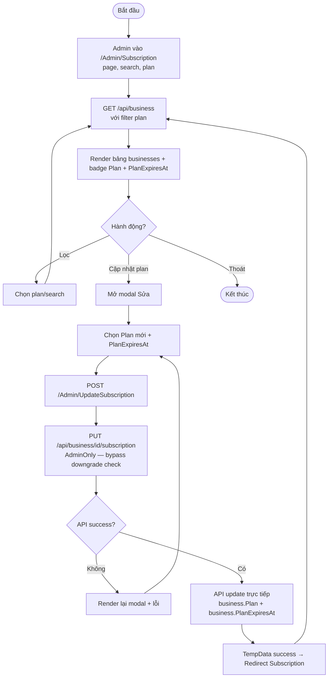
```mermaid
flowchart TD
    A([Bắt đầu]) --> B[Admin vào /Admin/Subscription\npage, search, plan]
    B --> C[GET /api/business\nvới filter plan]
    C --> D[Render bảng businesses + badge Plan + PlanExpiresAt]

    D --> E{Hành động?}

    E -- Lọc --> F[Chọn plan/search]
    F --> C

    E -- Cập nhật plan --> G[Mở modal Sửa]
    G --> H[Chọn Plan mới + PlanExpiresAt]
    H --> I[POST /Admin/UpdateSubscription]
    I --> J[PUT /api/business/id/subscription\nAdminOnly — bypass downgrade check]
    J --> K{API success?}
    K -- Không --> L[Render lại modal + lỗi]
    L --> H
    K -- Có --> M[API update trực tiếp\nbusiness.Plan + business.PlanExpiresAt]
    M --> N[TempData success → Redirect Subscription]
    N --> C

    E -- Thoát --> O([Kết thúc])
```

---

### AD-W15: Quản lý User & Role

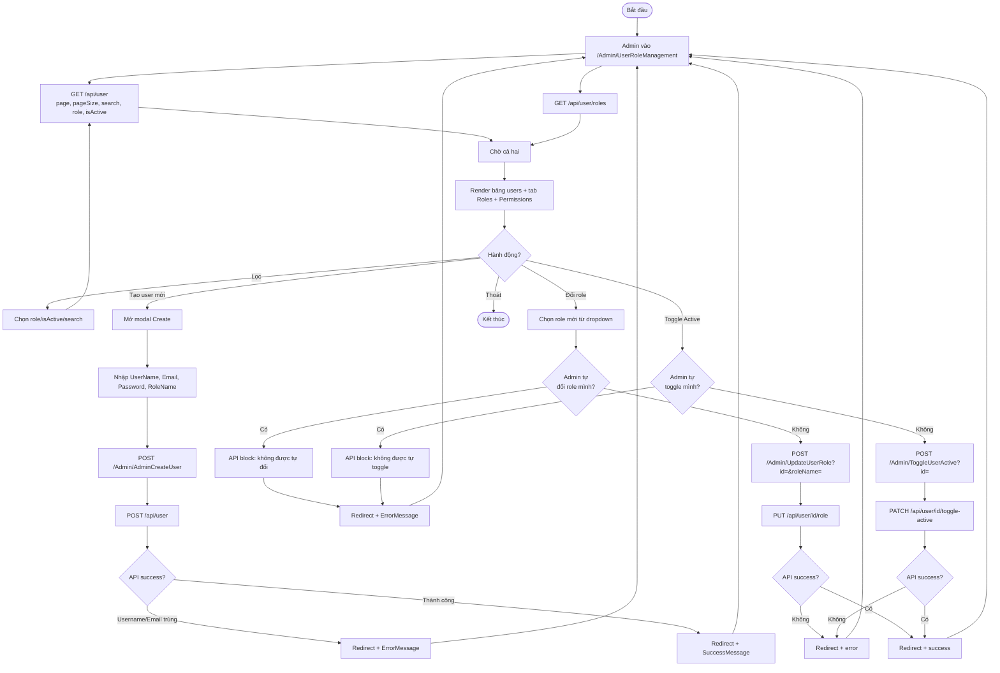
```mermaid
flowchart TD
    A([Bắt đầu]) --> B[Admin vào /Admin/UserRoleManagement]
    B --> C1[GET /api/user\npage, pageSize, search, role, isActive]
    B --> C2[GET /api/user/roles]
    C1 --> D[Chờ cả hai]
    C2 --> D
    D --> E[Render bảng users + tab Roles + Permissions]

    E --> F{Hành động?}

    F -- Lọc --> G[Chọn role/isActive/search]
    G --> C1

    F -- Tạo user mới --> H[Mở modal Create]
    H --> I[Nhập UserName, Email, Password, RoleName]
    I --> J[POST /Admin/AdminCreateUser]
    J --> K[POST /api/user]
    K --> L{API success?}
    L -- Username/Email trùng --> M[Redirect + ErrorMessage]
    L -- Thành công --> N[Redirect + SuccessMessage]
    M --> B
    N --> B

    F -- Đổi role --> O[Chọn role mới từ dropdown]
    O --> P{Admin tự\nđổi role mình?}
    P -- Có --> Q[API block: không được tự đổi]
    Q --> R[Redirect + ErrorMessage]
    P -- Không --> S[POST /Admin/UpdateUserRole?id=&roleName=]
    S --> T[PUT /api/user/id/role]
    T --> U{API success?}
    U -- Không --> V[Redirect + error]
    U -- Có --> W[Redirect + success]
    V --> B
    W --> B
    R --> B

    F -- Toggle Active --> X{Admin tự\ntoggle mình?}
    X -- Có --> Y[API block: không được tự toggle]
    Y --> R
    X -- Không --> Z[POST /Admin/ToggleUserActive?id=]
    Z --> AA[PATCH /api/user/id/toggle-active]
    AA --> AB{API success?}
    AB -- Không --> V
    AB -- Có --> W

    F -- Thoát --> AC([Kết thúc])
```

---

### AD-W16: Quản lý Mã QR

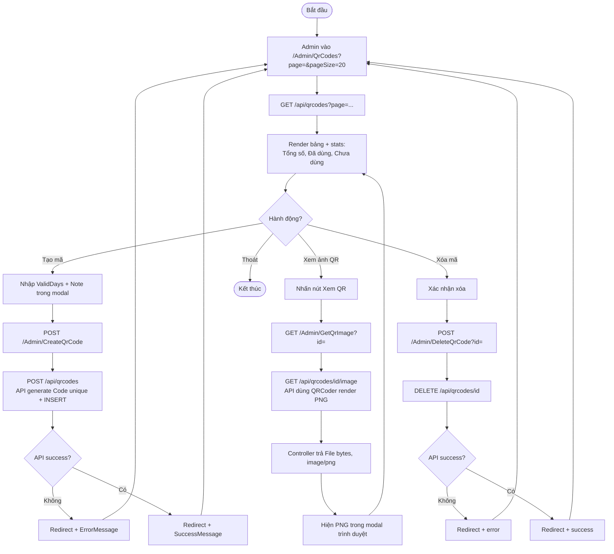
```mermaid
flowchart TD
    A([Bắt đầu]) --> B[Admin vào /Admin/QrCodes?page=&pageSize=20]
    B --> C[GET /api/qrcodes?page=...]
    C --> D[Render bảng + stats:\nTổng số, Đã dùng, Chưa dùng]

    D --> E{Hành động?}

    E -- Tạo mã --> F[Nhập ValidDays + Note trong modal]
    F --> G[POST /Admin/CreateQrCode]
    G --> H[POST /api/qrcodes\nAPI generate Code unique + INSERT]
    H --> I{API success?}
    I -- Không --> J[Redirect + ErrorMessage]
    I -- Có --> K[Redirect + SuccessMessage]
    J --> B
    K --> B

    E -- Xem ảnh QR --> L[Nhấn nút Xem QR]
    L --> M[GET /Admin/GetQrImage?id=]
    M --> N[GET /api/qrcodes/id/image\nAPI dùng QRCoder render PNG]
    N --> O[Controller trả File bytes, image/png]
    O --> P[Hiện PNG trong modal trình duyệt]
    P --> D

    E -- Xóa mã --> Q[Xác nhận xóa]
    Q --> R[POST /Admin/DeleteQrCode?id=]
    R --> S[DELETE /api/qrcodes/id]
    S --> T{API success?}
    T -- Không --> U[Redirect + error]
    T -- Có --> V[Redirect + success]
    U --> B
    V --> B

    E -- Thoát --> W([Kết thúc])
```

---

### AD-W17: Kiosk Auto QR

```mermaid
flowchart TD
    A([Bắt đầu]) --> B[Admin vào /Admin/AutoQr]
    B --> C[Nhập ValidDays + nút Bắt đầu]
    C --> D[POST /Admin/StartAutoQr\nValidateAntiForgeryToken]
    D --> E[POST /api/qrcodes\nTạo mã đầu tiên]
    E --> F{API success?}
    F -- Không --> G[JS hiện lỗi]
    F -- Có --> H[Nhận {id, code, imageUrl}]
    H --> I[GET /Admin/GetQrImage?id=\n→ GET /api/qrcodes/id/image]
    I --> J[Hiện PNG lên màn hình kiosk]
    G --> K([Kết thúc])

    J --> L[Bắt đầu vòng poll]
    L --> M[Chờ 2 giây]
    M --> N[GET /Admin/PollAutoQr?id=currentId&validDays=N]
    N --> O[Controller gọi GET /api/qrcodes/id]
    O --> P{IsUsed?}

    P -- false --> Q[Trả {used: false}]
    Q --> R[JS giữ nguyên QR]
    R --> L

    P -- true --> S[Controller gọi POST /api/qrcodes\nValidDays để tạo mã mới]
    S --> T{API success?}
    T -- Không --> U[JS giữ mã cũ, retry sau]
    U --> L
    T -- Có --> V[Trả {used: true, id, code, imageUrl}]
    V --> W[JS gọi GET /Admin/GetQrImage?id=newId]
    W --> X[Thay PNG trên kiosk\nkhông reload trang]
    X --> L

    Note([Admin đóng tab hoặc nhấn Dừng]) --> Y([Kết thúc])
```

---

### AD-W18: Theo dõi Thiết bị Online + Reset

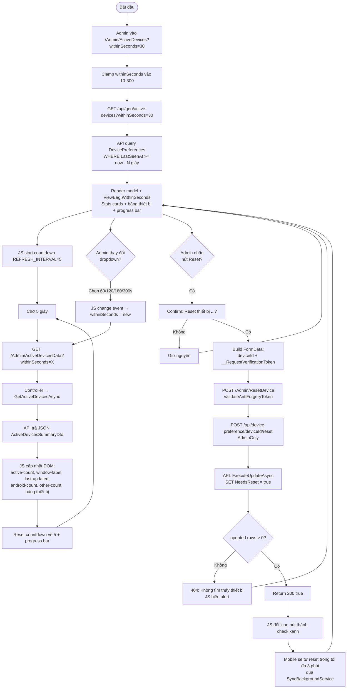
```mermaid
flowchart TD
    A([Bắt đầu]) --> B[Admin vào /Admin/ActiveDevices?withinSeconds=30]
    B --> C[Clamp withinSeconds vào 10-300]
    C --> D[GET /api/geo/active-devices?withinSeconds=30]
    D --> E[API query DevicePreferences\nWHERE LastSeenAt >= now - N giây]
    E --> F[Render model + ViewBag.WithinSeconds\nStats cards + bảng thiết bị + progress bar]

    F --> G[JS start countdown REFRESH_INTERVAL=5]
    G --> H[Chờ 5 giây]
    H --> I[GET /Admin/ActiveDevicesData?withinSeconds=X]
    I --> J[Controller → GetActiveDevicesAsync]
    J --> K[API trả JSON ActiveDevicesSummaryDto]
    K --> L[JS cập nhật DOM:\nactive-count, window-label, last-updated,\nandroid-count, other-count, bảng thiết bị]
    L --> M[Reset countdown về 5 + progress bar]
    M --> H

    F --> N{Admin thay đổi\ndropdown?}
    N -- Chọn 60/120/180/300s --> O[JS change event → withinSeconds = new]
    O --> I

    F --> P{Admin nhấn\nnút Reset?}
    P -- Có --> Q[Confirm: Reset thiết bị ...?]
    Q -- Không --> R[Giữ nguyên]
    R --> F
    Q -- Có --> S[Build FormData:\ndeviceId + __RequestVerificationToken]
    S --> T[POST /Admin/ResetDevice\nValidateAntiForgeryToken]
    T --> U[POST /api/device-preference/deviceId/reset\nAdminOnly]
    U --> V[API: ExecuteUpdateAsync\nSET NeedsReset = true]
    V --> W{updated rows > 0?}
    W -- Không --> X[404: Không tìm thấy thiết bị\nJS hiện alert]
    W -- Có --> Y[Return 200 true]
    Y --> Z[JS đổi icon nút thành check xanh]
    Z --> AA[Mobile sẽ tự reset trong tối đa 3 phút\nqua SyncBackgroundService]
    X --> F
    AA --> F
```

---

### AD-W19: Bản đồ nhiệt

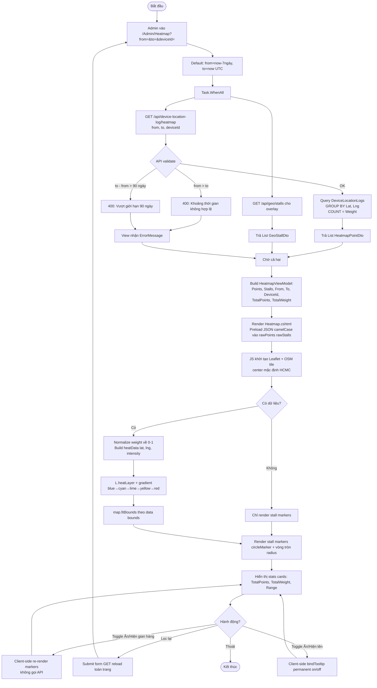
```mermaid
flowchart TD
    A([Bắt đầu]) --> B[Admin vào /Admin/Heatmap?from=&to=&deviceId=]
    B --> C[Default: from=now-7ngày, to=now UTC]
    C --> D[Task.WhenAll]

    D --> E1[GET /api/device-location-log/heatmap\nfrom, to, deviceId]
    D --> E2[GET /api/geo/stalls cho overlay]

    E1 --> F{API validate}
    F -- from > to --> G[400: Khoảng thời gian không hợp lệ]
    F -- to - from > 90 ngày --> H[400: Vượt giới hạn 90 ngày]
    F -- OK --> I[Query DeviceLocationLogs\nGROUP BY Lat, Lng\nCOUNT = Weight]
    G --> J[View nhận ErrorMessage]
    H --> J
    I --> K[Trả List HeatmapPointDto]

    E2 --> L[Trả List GeoStallDto]
    K --> M[Chờ cả hai]
    L --> M
    J --> M

    M --> N[Build HeatmapViewModel:\nPoints, Stalls, From, To, DeviceId,\nTotalPoints, TotalWeight]
    N --> O[Render Heatmap.cshtml\nPreload JSON camelCase vào rawPoints rawStalls]

    O --> P[JS khởi tạo Leaflet + OSM tile\ncenter mặc định HCMC]

    P --> Q{Có dữ liệu?}
    Q -- Có --> R[Normalize weight về 0-1\nBuild heatData lat, lng, intensity]
    Q -- Không --> S[Chỉ render stall markers]

    R --> T[L.heatLayer + gradient\nblue→cyan→lime→yellow→red]
    T --> U[map.fitBounds theo data bounds]
    S --> V[Render stall markers circleMarker + vòng tròn radius]
    U --> V

    V --> W[Hiển thị stats cards: TotalPoints, TotalWeight, Range]

    W --> X{Hành động?}
    X -- Lọc lại --> Y[Submit form GET reload toàn trang]
    Y --> B
    X -- Toggle Ẩn/Hiện gian hàng --> Z[Client-side re-render markers\nkhông gọi API]
    Z --> W
    X -- Toggle Ẩn/Hiện tên --> AA[Client-side bindTooltip permanent on/off]
    AA --> W
    X -- Thoát --> AB([Kết thúc])
```

---

### AD-W20: Quản lý Tour

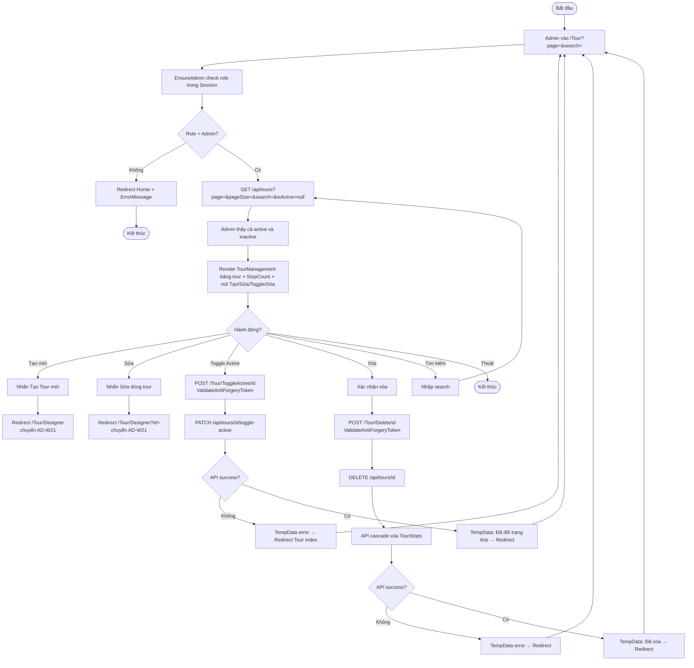
```mermaid
flowchart TD
    A([Bắt đầu]) --> B[Admin vào /Tour?page=&search=]
    B --> C[EnsureAdmin check role trong Session]
    C --> D{Role = Admin?}
    D -- Không --> E[Redirect Home + ErrorMessage]
    E --> F([Kết thúc])
    D -- Có --> G[GET /api/tours?page=&pageSize=&search=&isActive=null]
    G --> H[Admin thấy cả active và inactive]
    H --> I[Render TourManagement:\nbảng tour + StopCount + nút Tạo/Sửa/Toggle/Xóa]

    I --> J{Hành động?}

    J -- Tạo mới --> K[Nhấn Tạo Tour mới]
    K --> L[Redirect /Tour/Designer\nchuyển AD-W21]

    J -- Sửa --> M[Nhấn Sửa dòng tour]
    M --> N[Redirect /Tour/Designer?id=\nchuyển AD-W21]

    J -- Toggle Active --> O[POST /Tour/ToggleActive/id\nValidateAntiForgeryToken]
    O --> P[PATCH /api/tours/id/toggle-active]
    P --> Q{API success?}
    Q -- Không --> R[TempData error → Redirect Tour Index]
    Q -- Có --> S[TempData: Đã đổi trạng thái → Redirect]
    R --> B
    S --> B

    J -- Xóa --> T[Xác nhận xóa]
    T --> U[POST /Tour/Delete/id\nValidateAntiForgeryToken]
    U --> V[DELETE /api/tours/id]
    V --> W[API cascade xóa TourStops]
    W --> X{API success?}
    X -- Không --> Y[TempData error → Redirect]
    X -- Có --> Z[TempData: Đã xóa → Redirect]
    Y --> B
    Z --> B

    J -- Tìm kiếm --> AA[Nhập search]
    AA --> G

    J -- Thoát --> AB([Kết thúc])
```

---

### AD-W21: Tour Designer

```mermaid
flowchart TD
    A([Bắt đầu]) --> B{Create hay Edit?}
    B -- Create --> C[GET /Tour/Designer]
    B -- Edit --> D[GET /Tour/Designer?id=X]

    C --> E[EnsureAdmin check]
    D --> E
    E --> F{Role = Admin?}
    F -- Không --> G[Redirect Home + ErrorMessage]
    G --> H([Kết thúc])

    F -- Có --> I[Load song song]

    I --> J1[GeoApiClient.GetStallsForMapAsync\n→ GET /api/geo/stalls]
    I --> J2{Edit mode?}
    J2 -- Có --> K[TourApiClient.GetTourDetailAsync id\n→ GET /api/tours/id]
    J2 -- Không --> L[Skip]

    J1 --> M[Chờ load xong]
    K --> M
    L --> M

    M --> N[Build TourDesignerViewModel:\nIsEdit, Tour, AvailableStalls]
    N --> O[Render TourDesigner.cshtml]

    O --> P[JS init Leaflet map + OSM]
    P --> Q{Mode?}
    Q -- Create --> R[Tất cả markers xám\nchưa thuộc tour]
    Q -- Edit --> S[Markers xanh = stops hiện có\nMarkers xám = còn lại\nVẽ polyline nối stops theo Order]

    R --> T[Sidebar danh sách stops rỗng]
    S --> U[Sidebar list stops drag-drop SortableJS]

    T --> V{User thao tác}
    U --> V

    V -- Click marker xám --> W[Thêm stall vào stops\nMarker đổi xanh\nVẽ lại polyline]
    V -- Click marker xanh --> X[Bỏ stall khỏi stops\nMarker đổi xám\nVẽ lại polyline]
    V -- Drag-drop sidebar --> Y[Đổi thứ tự stops client-side]

    W --> V
    X --> V
    Y --> V

    V -- Nhấn Lưu --> Z[Nhập Name, Description,\nEstimatedMinutes, IsActive]
    Z --> AA[Build TourSavePayload:\nName, Description, EstimatedMinutes,\nIsActive, Stops]
    AA --> AB[POST /Tour/Save?id=optional\nJSON body + ValidateAntiForgeryToken]

    AB --> AC{Controller validate}
    AC -- Stops rỗng --> AD[400: Tour phải có ít nhất 1 stop]
    AD --> AE[JS hiện alert]
    AE --> V

    AC -- OK --> AF{id null?}
    AF -- Có Create --> AG[TourApiClient.CreateTourAsync\n→ POST /api/tours]
    AF -- Không Update --> AH[TourApiClient.UpdateTourAsync\n→ PUT /api/tours/id]

    AG --> AI{API validate}
    AH --> AI

    AI -- Stops rỗng --> AJ[400 + JS alert]
    AI -- Trùng StallId --> AK[400: Danh sách stops trùng lặp]
    AI -- StallId không tồn tại --> AL[400: stallId không tồn tại]
    AI -- Name trùng --> AM[409: Tên tour đã tồn tại]
    AJ --> V
    AK --> AE
    AL --> AE
    AM --> AE

    AI -- OK --> AN[API re-index Order 1..N\nFull replace Stops nếu Update\nCreatedByUserId từ JWT]
    AN --> AO[Trả TourDetailDto]
    AO --> AP[200 success, id]
    AP --> AQ[TempData: Đã tạo/cập nhật tour]
    AQ --> AR[Redirect /Tour Index]
    AR --> AS([Kết thúc])
```
