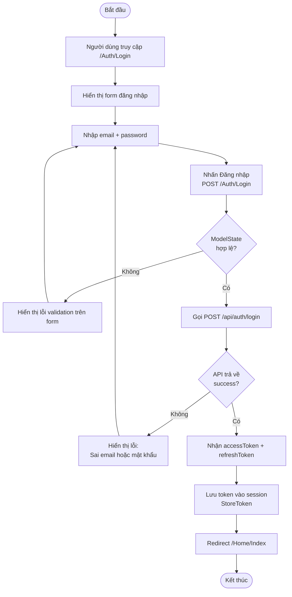
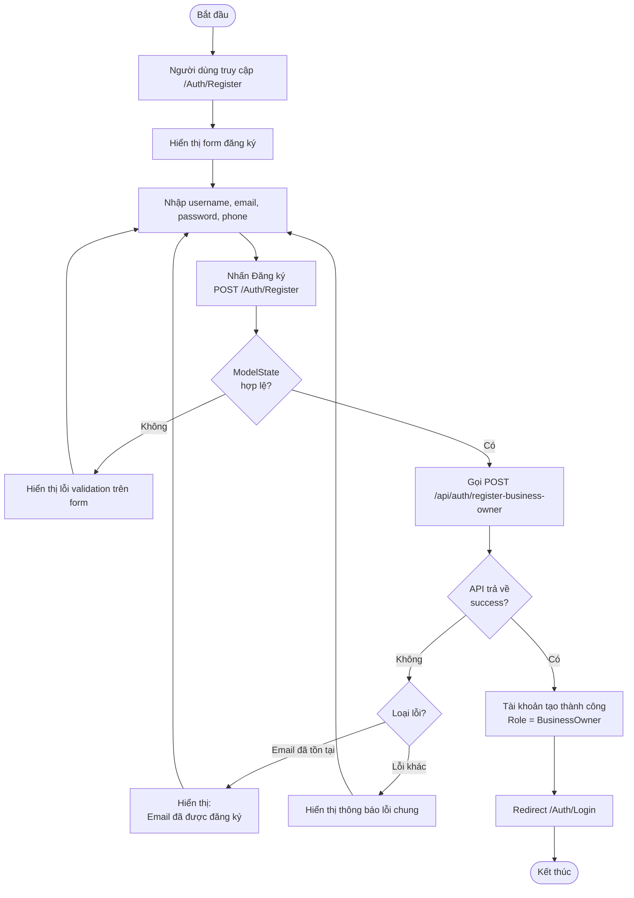
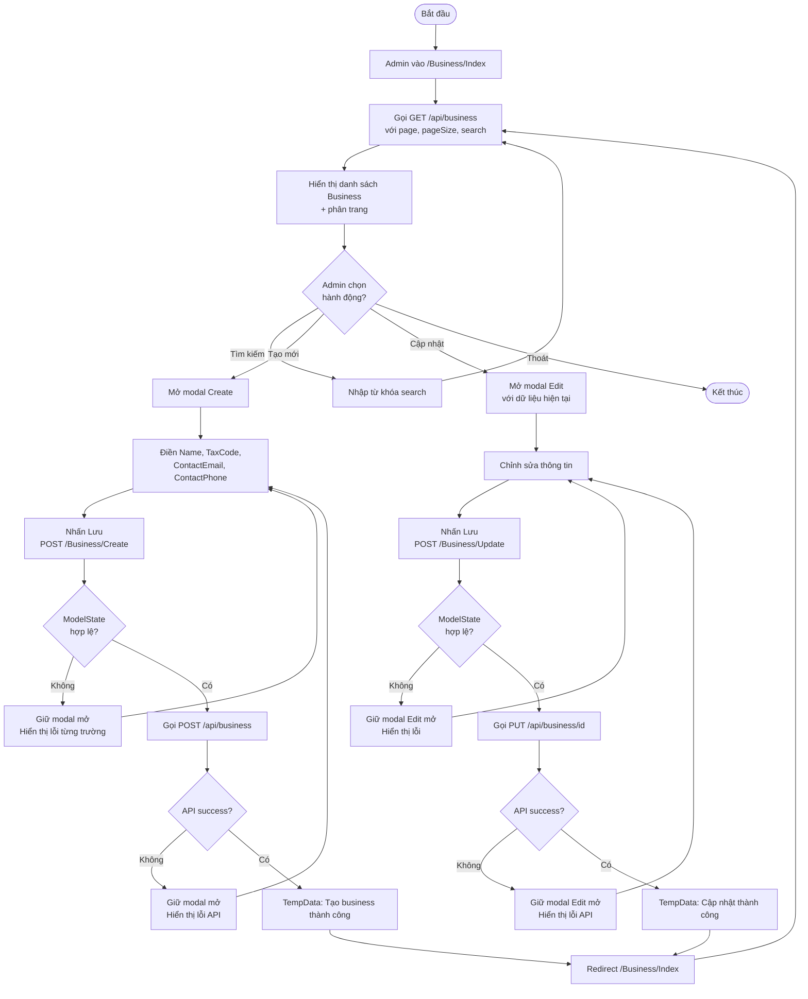
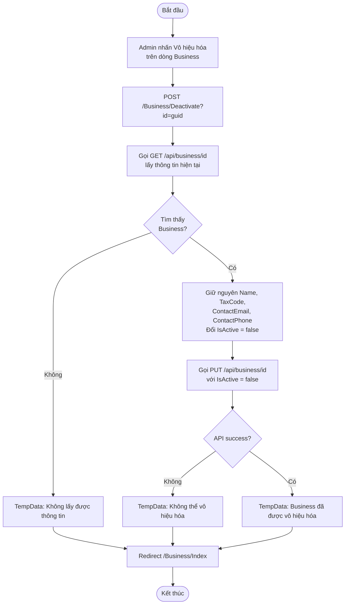
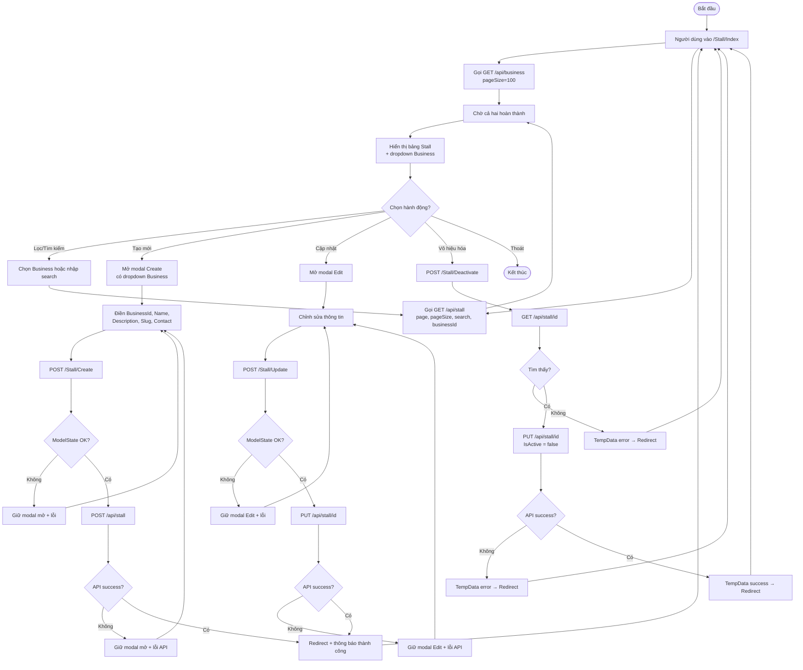
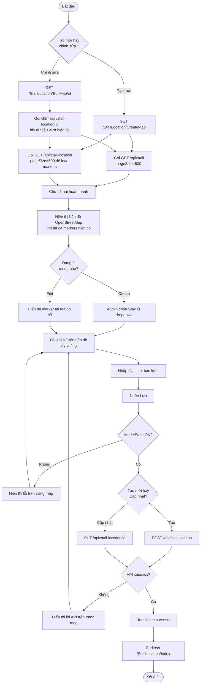
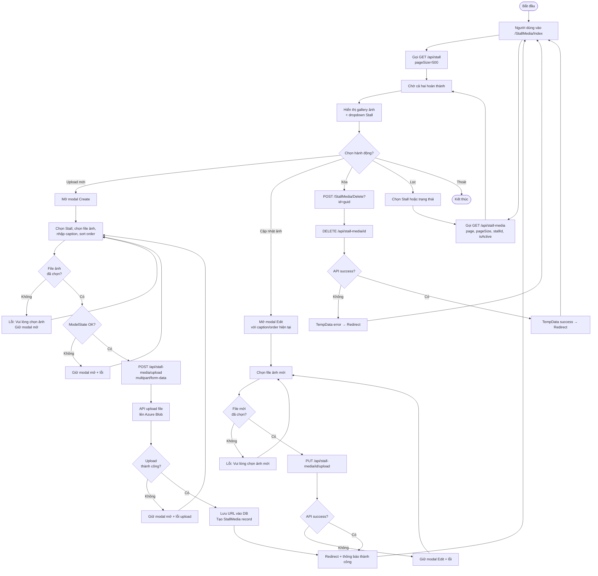
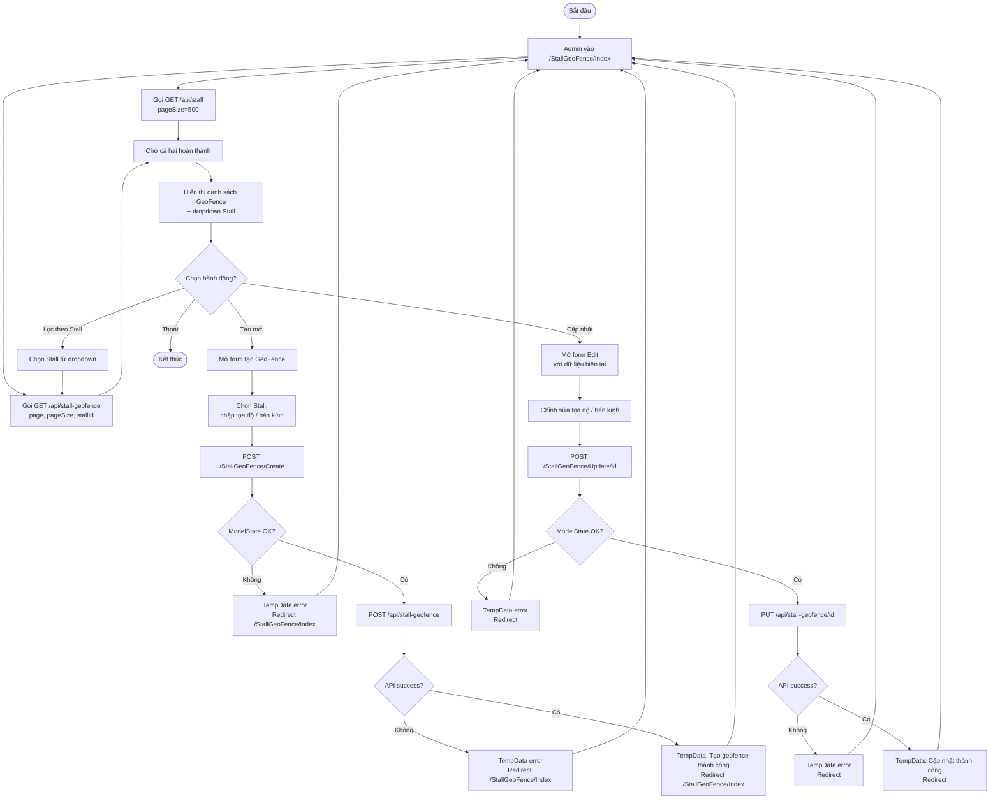
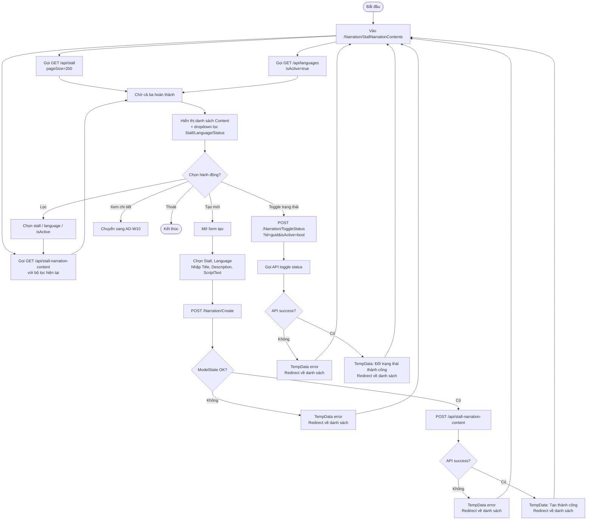
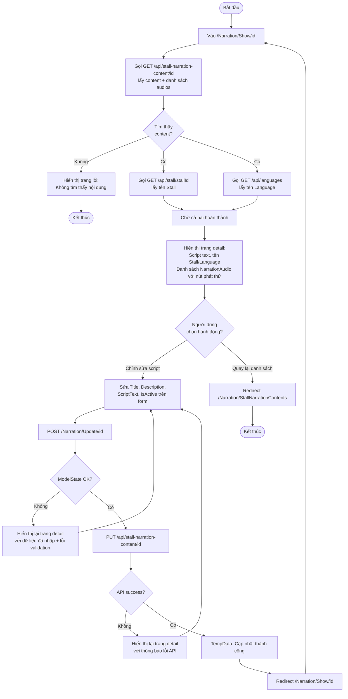

## 20. Activity Diagrams – Web Admin

> Dùng Mermaid `flowchart TD`. Ký hiệu: hình thoi `{}` = decision, hình chữ nhật bo góc `([])` = start/end, hình chữ nhật `[]` = activity, hình thoi kép `{{}}` = fork/join.

| Mã | Tên |
|----|-----|
| [AD-W01](#ad-w01-đăng-nhập) | Đăng nhập |
| [AD-W02](#ad-w02-đăng-ký-businessowner) | Đăng ký BusinessOwner |
| [AD-W03](#ad-w03-tạo--cập-nhật-business) | Tạo / Cập nhật Business |
| [AD-W04](#ad-w04-vô-hiệu-hóa-business) | Vô hiệu hóa Business |
| [AD-W05](#ad-w05-tạo--cập-nhật--vô-hiệu-hóa-stall) | Tạo / Cập nhật / Vô hiệu hóa Stall |
| [AD-W06](#ad-w06-đặt-vị-trí-stall-trên-bản-đồ) | Đặt vị trí Stall trên bản đồ |
| [AD-W07](#ad-w07-upload--cập-nhật--xóa-media-stall) | Upload / Cập nhật / Xóa Media Stall |
| [AD-W08](#ad-w08-tạo--cập-nhật-geofence) | Tạo / Cập nhật GeoFence |
| [AD-W09](#ad-w09-tạo--cập-nhật--toggle-narration-content) | Tạo / Cập nhật / Toggle Narration Content |
| [AD-W10](#ad-w10-xem-chi-tiết-narration-content--cập-nhật-script) | Xem chi tiết Narration Content + Cập nhật script |

---

### AD-W01: Đăng nhập

---

### AD-W02: Đăng ký BusinessOwner

---

### AD-W03: Tạo / Cập nhật Business

---

### AD-W04: Vô hiệu hóa Business

---

### AD-W05: Tạo / Cập nhật / Vô hiệu hóa Stall

---

### AD-W06: Đặt vị trí Stall trên bản đồ

---

### AD-W07: Upload / Cập nhật / Xóa Media Stall

---

### AD-W08: Tạo / Cập nhật GeoFence

---

### AD-W09: Tạo / Cập nhật / Toggle Narration Content

---

### AD-W10: Xem chi tiết Narration Content + Cập nhật script

