# Product Requirements Document (PRD)
# Hệ thống Thuyết minh Tự động Đa ngôn ngữ – Phố Ẩm Thực

> **Phiên bản:** 2.3 (Merged – Mobile + Web)
> **Ngày cập nhật:** Tháng 4, 2026
> **Trạng thái:** Đang phát triển
> **Mục đích tài liệu:** Mô tả đầy đủ yêu cầu sản phẩm để AI và nhóm phát triển hiểu rõ hệ thống, làm cơ sở viết tài liệu kỹ thuật, test cases, và thiết kế UI/UX.

---

## Mục lục

1. [Tổng quan sản phẩm](#1-tổng-quan-sản-phẩm)
2. [Vấn đề & Mục tiêu](#2-vấn-đề--mục-tiêu)
3. [Người dùng mục tiêu (User Personas)](#3-người-dùng-mục-tiêu-user-personas)
4. [Phạm vi sản phẩm](#4-phạm-vi-sản-phẩm)
5. [Kiến trúc hệ thống tổng quan](#5-kiến-trúc-hệ-thống-tổng-quan)
6. [Mô hình dữ liệu (Domain Model)](#6-mô-hình-dữ-liệu-domain-model)
7. [Yêu cầu chức năng – Mobile App (Khách tham quan)](#7-yêu-cầu-chức-năng--mobile-app-khách-tham-quan)
8. [Yêu cầu chức năng – Web Admin (Admin & BusinessOwner)](#8-yêu-cầu-chức-năng--web-admin-admin--businessowner)
9. [Yêu cầu chức năng – API Backend](#9-yêu-cầu-chức-năng--api-backend)
10. [Luồng người dùng (User Flows)](#10-luồng-người-dùng-user-flows)
11. [API Endpoints chính](#11-api-endpoints-chính)
12. [Tích hợp dịch vụ ngoài](#12-tích-hợp-dịch-vụ-ngoài)
13. [Yêu cầu phi chức năng](#13-yêu-cầu-phi-chức-năng)
14. [Quyết định kỹ thuật quan trọng](#14-quyết-định-kỹ-thuật-quan-trọng)
15. [Backlog – Tính năng chưa triển khai](#15-backlog--tính-năng-chưa-triển-khai)
16. [Use Cases – Mobile App](#16-use-cases--mobile-app)
17. [Sequence Diagrams – Mobile App](#17-sequence-diagrams--mobile-app)
18. [Use Cases – Web Admin](#18-use-cases--web-admin)
19. [Sequence Diagrams – Web Admin](#19-sequence-diagrams--web-admin)
20. [Activity Diagrams – Web Admin](#20-activity-diagrams--web-admin)
- [Phụ lục A – Cấu hình môi trường](#phụ-lục-a--cấu-hình-môi-trường)
- [Phụ lục B – NuGet Packages](#phụ-lục-b--nuget-packages-tham-chiếu)

---

## 1. Tổng quan sản phẩm

### 1.1 Tên hệ thống

**Hệ thống Thuyết minh Tự động Đa ngôn ngữ cho Phố Ẩm Thực**  
*(Locate & Multilingual Narration System)*

### 1.2 Mô tả ngắn

Hệ thống cung cấp trải nghiệm tham quan thông minh tại Phố Ẩm Thực thông qua **ứng dụng di động** tự động phát thuyết minh audio khi khách đến gần từng gian hàng, kết hợp **cổng quản trị web** giúp Ban Tổ Chức và các Doanh Nghiệp quản lý nội dung thuyết minh đa ngôn ngữ.

### 1.3 Thành phần hệ thống

| Thành phần | Công nghệ | Người dùng |
|-----------|-----------|-----------|
| **Mobile App** | .NET MAUI 10.0 (Android, iOS, Windows, macOS) | Khách tham quan |
| **Web Admin** | ASP.NET Core 10.0 MVC | Admin, BusinessOwner |
| **API Backend** | ASP.NET Core 10.0 Web API | Toàn hệ thống |
| **Database** | SQL Server (EF Core 10.0) | – |
| **Cloud Services** | Azure Speech, Azure Blob Storage, Azure Translator | – |

### 1.4 Stack công nghệ tóm tắt

```
Backend  : ASP.NET Core 10.0 Web API + EF Core 10.0 + SQL Server
Web      : ASP.NET Core 10.0 MVC + HttpClientFactory
Mobile   : .NET MAUI 10.0 + MVVM + Mapsui + SQLite (offline cache)
Shared   : .NET 10.0 Class Library (DTOs dùng chung)
Auth     : JWT Bearer + BCrypt + Refresh Token (30 ngày)
Map      : Mapsui / OpenStreetMap
TTS      : Azure Cognitive Services Speech
Storage  : Azure Blob Storage
Translate: Azure Translator v3.0
```

---

## 2. Vấn đề & Mục tiêu

### 2.1 Vấn đề hiện tại

- Khách tham quan Phố Ẩm Thực không có thông tin đầy đủ về từng gian hàng.
- Khách quốc tế gặp rào cản ngôn ngữ, không hiểu sản phẩm/dịch vụ được giới thiệu.
- Nhân viên giới thiệu thủ công tốn chi phí và không nhất quán.
- Doanh nghiệp khó cập nhật thông tin thuyết minh linh hoạt theo sự kiện/mùa.

### 2.2 Mục tiêu sản phẩm

| # | Mục tiêu | Đo lường thành công |
|---|----------|-------------------|
| 1 | Tự động phát thuyết minh khi khách đến gần gian hàng | Geofence trigger hoạt động chính xác trong bán kính cấu hình |
| 2 | Hỗ trợ đa ngôn ngữ (tiếng Việt + các ngôn ngữ quốc tế) | Có ≥ 2 ngôn ngữ active, audio phát đúng ngôn ngữ đã chọn |
| 3 | Khách tham quan không cần đăng ký tài khoản | App hoạt động hoàn toàn anonymous |
| 4 | Doanh nghiệp tự quản lý nội dung thuyết minh | BusinessOwner cập nhật được script và audio không cần hỗ trợ kỹ thuật |
| 5 | Hoạt động offline | App hiển thị dữ liệu và phát audio đã cache khi mất mạng |

### 2.3 Giá trị mang lại

- **Khách tham quan:** Trải nghiệm phong phú, hiểu rõ từng gian hàng bằng ngôn ngữ mẹ đẻ.
- **Doanh nghiệp:** Tăng cơ hội tiếp cận khách quốc tế, chủ động cập nhật thông tin.
- **Ban Tổ Chức:** Nâng tầm hình ảnh khu phố, thu hút sự kiện quy mô lớn.

---

## 3. Người dùng mục tiêu (User Personas)

### Persona 1: Khách tham quan (Visitor) – Anonymous

> **Không cần tạo tài khoản, không cần đăng nhập.**

| Thuộc tính | Mô tả |
|-----------|-------|
| **Đặc điểm** | Khách nội địa hoặc quốc tế, mọi độ tuổi, đến tham quan Phố Ẩm Thực |
| **Mục tiêu** | Tìm hiểu về các gian hàng, nghe thuyết minh bằng ngôn ngữ phù hợp |
| **Thiết bị** | Điện thoại Android hoặc iOS |
| **Kỳ vọng** | Mở app → chọn ngôn ngữ → nghe audio tự động, không cần thao tác phức tạp |
| **Pain point** | Không biết tiếng Việt (khách quốc tế), muốn thông tin chi tiết hơn biển hiệu |

**Định danh ẩn danh:** App tự sinh `DeviceId` duy nhất (SecureStorage) và lưu preference (ngôn ngữ, giọng đọc) lên server theo DeviceId — không cần tài khoản.

### Persona 2: Chủ doanh nghiệp (BusinessOwner)

| Thuộc tính | Mô tả |
|-----------|-------|
| **Đặc điểm** | Chủ hoặc quản lý gian hàng tại Phố Ẩm Thực |
| **Mục tiêu** | Quản lý thông tin gian hàng, nội dung thuyết minh, hình ảnh |
| **Thiết bị** | PC/Laptop, trình duyệt web |
| **Kỳ vọng** | Cập nhật nội dung dễ dàng, xem trước audio trước khi publish |
| **Pain point** | Không có kỹ năng kỹ thuật sâu, cần giao diện đơn giản |

### Persona 3: Quản trị viên (Admin)

| Thuộc tính | Mô tả |
|-----------|-------|
| **Đặc điểm** | Ban Tổ Chức / Quản trị hệ thống |
| **Mục tiêu** | Quản lý toàn bộ hệ thống: doanh nghiệp, ngôn ngữ, người dùng, cấu hình |
| **Thiết bị** | PC/Laptop |
| **Quyền hạn** | Toàn bộ hệ thống, bao gồm thêm/xóa ngôn ngữ (chỉ Admin) |

---

## 4. Phạm vi sản phẩm

### 4.1 Trong phạm vi (In Scope) – Hiện tại

**Mobile App:**
- Chọn ngôn ngữ và giọng đọc (lưu theo DeviceId)
- Bản đồ tương tác hiển thị gian hàng và vùng geofence
- Thuyết minh audio tự động / thủ công theo gian hàng đã chọn
- Quét QR Code để focus gian hàng trên bản đồ
- Danh sách gian hàng
- Cache offline (SQLite + audio files)
- Background sync mỗi 3 phút

**Web Admin:**
- Đăng nhập / đăng ký BusinessOwner
- Quản lý doanh nghiệp và gian hàng (CRUD)
- Quản lý tọa độ GPS và geofence gian hàng
- Quản lý media (hình ảnh) gian hàng
- Quản lý nội dung thuyết minh đa ngôn ngữ (text script)
- Upload audio hoặc tự sinh audio qua Azure TTS
- Dịch tự động nội dung qua Azure Translator
- Quản lý ngôn ngữ hỗ trợ (Admin only)
- Quản lý tài khoản người dùng (Admin only)

**API Backend:**
- REST API đầy đủ cho tất cả chức năng trên
- JWT authentication + refresh token
- Geo service (tìm gian hàng gần nhất, Haversine)
- DevicePreference API (anonymous, theo DeviceId)

### 4.2 Ngoài phạm vi (Out of Scope) – Phiên bản hiện tại

- Đăng nhập trên Mobile App (code tồn tại nhưng không sử dụng)
- Bookmark gian hàng yêu thích
- Xem menu / thực đơn chi tiết
- Background GPS polling liên tục (geofence auto-trigger)
- Dashboard thống kê lượt nghe, ngôn ngữ phổ biến
- Lịch sử chỉnh sửa (audit log)
- Social login (Google/Apple/Facebook)
- Role cộng tác viên (Collaborator)
- Chọn giọng đọc (nam/nữ, tốc độ) trực tiếp trên UI Mobile

---

## 5. Kiến trúc hệ thống tổng quan

### 5.1 Sơ đồ tổng quan

```
┌─────────────────────────────────────────────────────────────┐
│                      CLIENT LAYER                           │
│                                                             │
│  ┌──────────────────────┐    ┌──────────────────────────┐  │
│  │   Mobile App (MAUI)  │    │   Web Admin (MVC)        │  │
│  │  Android/iOS/Win/Mac │    │  BusinessOwner / Admin   │  │
│  │  ─ Mapsui (OSM)      │    │  ─ HttpClientFactory     │  │
│  │  ─ SQLite cache       │    │  ─ AuthTokenHandler      │  │
│  │  ─ Plugin.Maui.Audio │    │  ─ Session Auth           │  │
│  │  ─ ZXing QR Scan      │    │                          │  │
│  └──────────┬───────────┘    └────────────┬─────────────┘  │
└─────────────┼────────────────────────────┼────────────────┘
              │ HTTP/REST (JSON)            │ HTTP/REST (JSON)
              ▼                            ▼
┌─────────────────────────────────────────────────────────────┐
│                    API LAYER (ASP.NET Core 10.0)            │
│                                                             │
│  Controllers: Auth, Business, Stall, Geo, Language,        │
│  NarrationContent, NarrationAudio, StallMedia,             │
│  StallGeoFence, StallLocation, DevicePreference,           │
│  TtsVoiceProfile, VisitorPreference, VisitorLocationLog     │
│                                                             │
│  Services: JwtService, GeoService, NarrationAudioService,  │
│            AzureTranslationService                         │
│                                                             │
│  Auth: JWT Bearer + BCrypt + Refresh Token (SHA256)        │
└──────┬────────────────────────────────────────┬────────────┘
       │ EF Core 10.0                           │ Azure SDK
       ▼                                        ▼
┌──────────────────┐              ┌─────────────────────────┐
│   SQL Server     │              │   Azure Cloud Services  │
│   (19 Entities)  │              │  ─ Speech (TTS)         │
│                  │              │  ─ Blob Storage (Audio) │
│                  │              │  ─ Translator v3.0      │
└──────────────────┘              └─────────────────────────┘

       ┌──────────────────────────┐
       │   Shared Library (.NET)  │
       │   DTOs dùng chung        │
       │   Api + Web + Mobile     │
       └──────────────────────────┘
```

### 5.2 Cấu trúc Solution

```
LocateAndMultilingualNarration/
├── Api/                    # ASP.NET Core Web API
│   ├── Controllers/        # 14 controllers
│   ├── Application/
│   │   └── Services/       # JwtService, GeoService, NarrationAudioService, AzureTranslationService
│   ├── Domain/
│   │   ├── Entities/       # 19 entities
│   │   └── Settings/       # JwtSettings, AzureSpeechSettings, BlobStorageSettings, AzureTranslationSettings
│   └── Infrastructure/
│       └── Persistence/    # AppDbContext + EF Configurations
├── Web/                    # ASP.NET Core MVC
│   ├── Controllers/        # 9 controllers
│   ├── Views/              # Razor views
│   └── Services/           # ApiClient + 8 ApiClient implementations
├── Mobile/                 # .NET MAUI
│   ├── Pages/              # 8 pages (LoginPage không dùng)
│   ├── ViewModels/         # 4 ViewModels (LoginViewModel không dùng)
│   ├── Services/           # 12 services
│   └── LocalDb/            # SQLite schema + repository
├── Shared/                 # Class Library
│   └── DTOs/               # 14 nhóm DTO
└── TestAPI/                # Testing project
```

---

## 6. Mô hình dữ liệu (Domain Model)

### 6.1 Danh sách Entities (19 entities)

#### Nhóm User & Authorization

| Entity | Mô tả | Trường chính |
|--------|-------|-------------|
| `User` | Tài khoản hệ thống (Web Admin) | Id, UserName, Email, PasswordHash, CreatedAt |
| `Role` | Vai trò: Admin, BusinessOwner | Id, Name |
| `UserRole` | Bảng nối User ↔ Role | UserId, RoleId |
| `RefreshToken` | JWT refresh token | Id, UserId, TokenHash, ExpiresAt, IsRevoked |

#### Nhóm Visitor

| Entity | Mô tả | Trường chính |
|--------|-------|-------------|
| `VisitorProfile` | Hồ sơ khách tham quan | Id, DeviceId, CreatedAt |
| `VisitorPreference` | Sở thích khách | Id, VisitorProfileId, LanguageId, VoiceProfileId |
| `VisitorLocationLog` | Nhật ký vị trí GPS của khách | Id, VisitorProfileId, Latitude, Longitude, Timestamp |

#### Nhóm Device (Anonymous)

| Entity | Mô tả | Trường chính |
|--------|-------|-------------|
| `DevicePreference` | Preference ẩn danh theo DeviceId | Id, DeviceId, LanguageId, TtsVoiceProfileId, UpdatedAt |

#### Nhóm Business & Stalls

| Entity | Mô tả | Trường chính |
|--------|-------|-------------|
| `Business` | Doanh nghiệp tham gia | Id, Name, Description, UserId, CreatedAt |
| `BusinessOwnerProfile` | Profile chi tiết chủ DN | Id, UserId, PhoneNumber, Address |
| `EmployeeProfile` | Profile nhân viên | Id, UserId, BusinessId |
| `Stall` | Gian hàng | Id, BusinessId, Name, Slug, Description, Phone, IsActive |
| `StallLocation` | Tọa độ GPS | Id, StallId, Latitude, Longitude, Address |
| `StallGeoFence` | Vùng geofence | Id, StallId, RadiusMeters, IsActive |
| `StallMedia` | Hình ảnh gian hàng | Id, StallId, BlobUrl, FileName, ContentType, UploadedAt |

#### Nhóm Narration & Languages

| Entity | Mô tả | Trường chính |
|--------|-------|-------------|
| `Language` | Ngôn ngữ hỗ trợ | Id, Code (vi, en, zh...), Name, FlagUrl, IsActive |
| `StallNarrationContent` | Script thuyết minh theo ngôn ngữ | Id, StallId, LanguageId, TextContent, CreatedAt |
| `NarrationAudio` | File audio | Id, NarrationContentId, TtsVoiceProfileId, BlobUrl, DurationSeconds, Source (Upload/TTS) |
| `TtsVoiceProfile` | Cấu hình giọng Azure | Id, LanguageId, VoiceName, Gender, DisplayName |

### 6.2 Quan hệ chính

```
User (1) ──────────── (N) UserRole (N) ──────────── (1) Role
User (1) ──────────── (1) Business
Business (1) ─────── (N) Stall
Stall (1) ─────────── (1) StallLocation
Stall (1) ─────────── (N) StallGeoFence
Stall (1) ─────────── (N) StallMedia
Stall (1) ─────────── (N) StallNarrationContent
StallNarrationContent (N) ──── (1) Language
StallNarrationContent (1) ─── (N) NarrationAudio
NarrationAudio (N) ──────────── (1) TtsVoiceProfile
Language (1) ────────────────── (N) TtsVoiceProfile
DevicePreference (N) ──────── (1) Language
DevicePreference (N) ──────── (1) TtsVoiceProfile
```

---

## 7. Yêu cầu chức năng – Mobile App (Khách tham quan)

> **Nguyên tắc:** App hoàn toàn anonymous. Không đăng nhập, không tạo tài khoản.  
> **Định danh:** `DeviceId` tự sinh, lưu SecureStorage, gửi kèm mọi request cần preference.

### 7.1 Module Khởi động (StartPage)

**FR-M-01: Màn hình chào mừng**
- Hiển thị logo/tên khu phố và giới thiệu ngắn về ứng dụng.
- Có nút "Bắt đầu" điều hướng đến chọn ngôn ngữ.
- Kiểm tra DeviceId, nếu đã có preference → bỏ qua bước chọn ngôn ngữ và voice, vào thẳng MapPage.

### 7.2 Module Chọn ngôn ngữ (LanguagePage)

**FR-M-02: Lấy danh sách ngôn ngữ**
- Gọi API `GET /api/languages/active` để lấy danh sách ngôn ngữ đang active.
- Hiển thị danh sách ngôn ngữ kèm tên và cờ quốc gia.
- Xử lý lỗi mạng: hiển thị thông báo, không crash app.

**FR-M-03: Chọn ngôn ngữ**
- User tap chọn ngôn ngữ.
- Lưu lựa chọn tạm thời trong memory, chuyển sang VoicePage.

### 7.3 Module Chọn giọng đọc (VoicePage)

**FR-M-04: Lấy danh sách giọng đọc**
- Gọi API `GET /api/tts-voice-profiles?languageId={id}` để lấy danh sách giọng theo ngôn ngữ đã chọn.
- Hiển thị giọng đọc kèm tên hiển thị và giới tính (Nam/Nữ).

**FR-M-05: Chọn giọng đọc & lưu preference**
- User tap chọn giọng.
- Gọi API `POST /api/device-preference` với `{ deviceId, languageId, ttsVoiceProfileId }`.
- Điều hướng vào MapPage.

### 7.4 Module Bản đồ (MapPage)

**FR-M-06: Hiển thị bản đồ**
- Hiển thị bản đồ OpenStreetMap qua Mapsui.
- Hiển thị các gian hàng dưới dạng pin có label tên gian hàng.
- Vẽ vùng geofence (hình tròn bán kính `RadiusMeters`) quanh mỗi gian hàng bằng SkiaSharp.

**FR-M-07: Tải dữ liệu gian hàng (Cache-First)**
- Ưu tiên 1: Đọc từ SQLite local → hiển thị ngay lập tức.
- Ưu tiên 2: Async gọi `GET /api/geo/stalls?deviceId={deviceId}` → upsert SQLite → refresh UI.
- Ưu tiên 3 (offline): Nếu API fail → dùng data SQLite đã có, không crash.
- API trả `GeoStallDto` chứa `List<GeoStallNarrationContentDto>` (mỗi item: LanguageCode, AudioUrl, TextContent).

**FR-M-08: Chọn gian hàng**
- Tap pin gian hàng trên bản đồ → hiển thị `StallPopup`.
- StallPopup hiển thị: tên gian hàng, mô tả, hình ảnh (nếu có), text thuyết minh theo ngôn ngữ đã chọn, controls audio.

**FR-M-09: Phát audio thuyết minh**
- Ưu tiên 1: Phát từ file audio đã cache local (AudioCacheService).
- Ưu tiên 2: Stream từ `AudioUrl` (Azure Blob Storage URL).
- Controls: Play / Pause / Resume / Stop.
- Chỉ 1 audio phát tại một thời điểm; chuyển gian hàng → tự động dừng audio cũ.

**FR-M-10: Background Sync**
- `SyncBackgroundService` chạy timer mỗi **3 phút**.
- Khi connectivity thay đổi từ offline → online → trigger sync ngay.
- `SyncService` orchestrate: gọi API → upsert SQLite → download audio mới về cache.

### 7.5 Module Quét QR (ScanPage)

**FR-M-11: Quét QR/Barcode nhận diện gian hàng**
- Dùng ZXing.Net.Maui để quét QR Code.
- Giải mã kết quả QR → tìm gian hàng tương ứng trong danh sách.
- Focus (zoom + select) gian hàng đó trên MapPage.
- Hiển thị `StallPopup` tự động sau khi quét thành công.

### 7.6 Yêu cầu chung Mobile

**FR-M-12: Xử lý offline**
- App phải hoạt động được khi không có internet (với dữ liệu đã sync trước đó).
- Audio đã cache phát được offline.
- Hiển thị indicator "Đang offline" trên UI.

**FR-M-13: Quản lý HttpClient**
- HttpClient timeout: **10 giây**.
- Retry logic: không retry tự động, hiển thị lỗi cho user.

---

## 16. Use Cases – Mobile App

> **Actor chính:** Visitor (Anonymous) – Khách tham quan, không cần đăng nhập, định danh qua `DeviceId`.
> **Actor phụ:** SyncBackgroundService – tiến trình hệ thống tự động.

### 16.1 Bảng tổng hợp Use Cases Mobile

| Mã UC | Tên Use Case | Actor | Mục tiêu nghiệp vụ |
|-------|-------------|-------|-------------------|
| UC-M01 | Khởi động & kiểm tra Session + DeviceId | Visitor | Nhận diện thiết bị, điều hướng đúng màn hình |
| UC-M02 | Quét QR | Visitor | Truy cập nhanh gian hàng mục tiêu |
| UC-M03 | Chọn ngôn ngữ & giọng đọc (DevicePreference) | Visitor | Cá nhân hóa trải nghiệm nghe |
| UC-M04 | Hiển thị bản đồ tương tác & geofence | Visitor | Quan sát gian hàng theo không gian thực |
| UC-M05 | Tự động thuyết minh khi vào vùng geofence | Visitor | Tự động phát nội dung đúng ngôn ngữ |
| UC-M06 | Xem danh sách gian hàng nổi bật (lọc & tìm kiếm) | Visitor | Khám phá nhanh nội dung quan tâm |
| UC-M07 | Xem chi tiết gian hàng (gallery, thông tin, CTA) | Visitor | Nắm thông tin đầy đủ trước khi tương tác |
| UC-M08 | Phát audio thuyết minh thủ công | Visitor | Chủ động nghe narration |
| UC-M09 | Tính đường đi & chỉ đường (OSRM) | Visitor | Điều hướng tới stall mục tiêu |
| UC-M10 | Theo dõi và theo tour có sẵn | Visitor | Khám phá theo hành trình định sẵn |
| UC-M11 | Khám phá gian hàng gần nhất (Nearest Stall) | Visitor | Đề xuất gian hàng gần người dùng |
| UC-M12 | Background Sync & chế độ Offline | Hệ thống + Visitor | Đảm bảo dữ liệu luôn khả dụng |
| UC-M13 | Quản lý Profile / Device Preferences | Visitor | Điều chỉnh thiết lập cá nhân |

### 16.2 Use Case Diagram – Mobile App

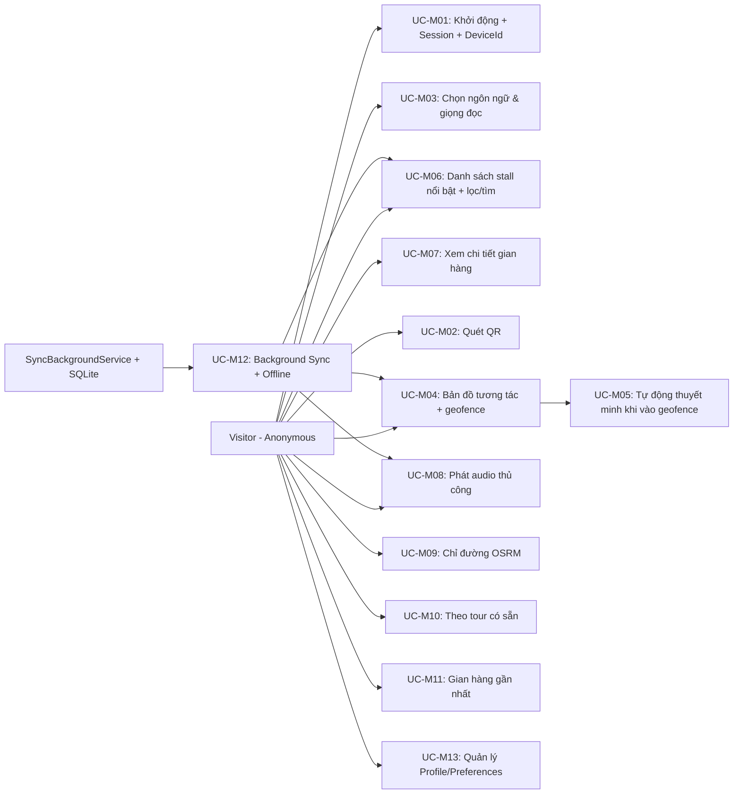
```mermaid
flowchart LR
    V[Visitor - Anonymous] --> M01[UC-M01: Khởi động + Session + DeviceId]
    V --> M03[UC-M03: Chọn ngôn ngữ & giọng đọc]
    V --> M06[UC-M06: Danh sách stall nổi bật + lọc/tìm]
    V --> M07[UC-M07: Xem chi tiết gian hàng]
    V --> M02[UC-M02: Quét QR]
    V --> M04[UC-M04: Bản đồ tương tác + geofence]
    M04 --> M05[UC-M05: Tự động thuyết minh khi vào geofence]
    V --> M08[UC-M08: Phát audio thủ công]
    V --> M09[UC-M09: Chỉ đường OSRM]
    V --> M10[UC-M10: Theo tour có sẵn]
    V --> M11[UC-M11: Gian hàng gần nhất]
    V --> M13[UC-M13: Quản lý Profile/Preferences]
    SYS[SyncBackgroundService + SQLite] --> M12[UC-M12: Background Sync + Offline]
    M12 --> M06
    M12 --> M04
    M12 --> M08
```

### 16.3 Đặc tả chi tiết Use Cases Mobile

#### UC-M01 – Khởi động & kiểm tra Session + DeviceId

| Trường | Nội dung |
|--------|---------|
| **Actor** | Visitor (Anonymous) |
| **Mô tả** | Ứng dụng kiểm tra session cục bộ, đọc/sinh `DeviceId`, truy vấn `DevicePreference`, sau đó điều hướng luồng phù hợp. |
| **Tiền điều kiện** | Ứng dụng đã cài đặt; có quyền lưu `SecureStorage`. |
| **Hậu điều kiện** | Có `DeviceId` hợp lệ; xác định được màn hình đích (`LanguagePage` hoặc `MainPage`). |

**Luồng chính:**
1. Visitor mở ứng dụng.
2. Hệ thống kiểm tra session hiện tại.
3. Đọc `DeviceId` từ `SecureStorage`.
4. Nếu chưa có → sinh mới và lưu `DeviceId`.
5. Gọi API lấy `DevicePreference` theo `DeviceId`.
6. Điều hướng sang `MainPage` khi đã có preference; ngược lại → `LanguagePage`.

**Luồng thay thế:**
- **5a.** API phản hồi chậm: hiển thị loading và retry ngắn.
- **5b.** Thiết bị offline: dùng preference cục bộ gần nhất.

**Ngoại lệ:**
- Không truy cập được `SecureStorage` → hiển thị cảnh báo hệ thống.

---

#### UC-M02 – Quét QR

| Trường | Nội dung |
|--------|---------|
| **Actor** | Visitor |
| **Mô tả** | Quét mã QR tại khu vực Phố Ẩm Thực để kích hoạt và bắt đầu sử dụng app. |
| **Tiền điều kiện** | Camera được cấp quyền; QR code hợp lệ được đặt tại khu vực. |
| **Hậu điều kiện** | App được kích hoạt, người dùng vào `MainPage` và bắt đầu trải nghiệm. |

**Luồng chính:**
1. Visitor mở `ScanPage`.
2. Ứng dụng kích hoạt camera và nhận payload QR.
3. Xác thực mã QR hợp lệ.
4. Điều hướng vào `MainPage` để bắt đầu trải nghiệm.

**Luồng thay thế:**
- **3a.** Payload QR dạng URL: trích xuất và xác thực tham số.

**Ngoại lệ:**
- QR không hợp lệ → thông báo "Mã QR không hợp lệ".
- Không có quyền camera → hướng dẫn cấp quyền.

---

#### UC-M03 – Chọn ngôn ngữ & giọng đọc (DevicePreference)

| Trường | Nội dung |
|--------|---------|
| **Actor** | Visitor (Anonymous) |
| **Mô tả** | Visitor chọn ngôn ngữ và giọng đọc; hệ thống lưu preference theo `DeviceId` không yêu cầu đăng nhập. |
| **Tiền điều kiện** | Có `DeviceId`; API ngôn ngữ và voice profile sẵn sàng. |
| **Hậu điều kiện** | `DevicePreference` được lưu ở server và local, có hiệu lực toàn app. |

**Luồng chính:**
1. Tải danh sách `Language` active từ `GET /api/languages/active`.
2. Visitor chọn ngôn ngữ.
3. Tải `TtsVoiceProfile` theo ngôn ngữ đã chọn.
4. Visitor chọn giọng đọc.
5. Gửi `POST /api/device-preference` lưu preference.
6. Điều hướng vào `MainPage`.

**Luồng thay thế:**
- **5a.** Mất mạng tạm thời: lưu local và đánh dấu pending sync.
- **4a.** Chưa chọn voice: dùng voice mặc định theo ngôn ngữ.

**Ngoại lệ:**
- API trả rỗng danh sách voice → fallback voice mặc định hệ thống.

---

#### UC-M04 – Hiển thị bản đồ tương tác & geofence

| Trường | Nội dung |
|--------|---------|
| **Actor** | Visitor |
| **Mô tả** | Hiển thị bản đồ với vị trí hiện tại, pin gian hàng, vùng geofence, và tương tác chọn stall theo không gian thực. |
| **Tiền điều kiện** | Đã cấp quyền vị trí; có dữ liệu `StallLocation`, `StallGeoFence`. |
| **Hậu điều kiện** | Người dùng quan sát và tương tác được với các stall trên bản đồ. |

**Luồng chính:**
1. Mở `MapPage`.
2. Lấy vị trí người dùng.
3. Nạp danh sách stall từ cache/API.
4. Render pin, geofence radius, user marker.
5. Chạm pin để xem popup và hành động nhanh.

**Luồng thay thế:**
- **2a.** GPS yếu: sử dụng vị trí gần nhất đã biết.
- **3a.** Offline: render dữ liệu từ SQLite cache.

**Ngoại lệ:**
- Từ chối quyền GPS → hiển thị bản đồ tĩnh và danh sách stall gần khu vực mặc định.

---

#### UC-M05 – Tự động thuyết minh khi vào vùng geofence

| Trường | Nội dung |
|--------|---------|
| **Actor** | Visitor |
| **Mô tả** | Ứng dụng tự động kích hoạt narration khi phát hiện người dùng đi vào geofence của stall, ưu tiên audio cache, fallback stream/TTS. |
| **Tiền điều kiện** | Bật định vị; có geofence active; có `DevicePreference`; `AutoPlay = true`. |
| **Hậu điều kiện** | Audio narration được phát đúng ngôn ngữ/voice hoặc có thông báo fallback phù hợp. |

**Luồng chính:**
1. Hệ thống nhận GPS update liên tục.
2. Tính khoảng cách Haversine đến các stall.
3. Phát hiện trạng thái vào geofence mới.
4. Tìm audio theo `Language` + `Voice` đã chọn.
5. Ưu tiên phát cache local, nếu thiếu thì stream từ URL.
6. Lưu cache nền cho lần sử dụng tiếp theo.

**Luồng thay thế:**
- **4a.** `AutoPlay = false`: hiển thị CTA "Nghe ngay".
- **4b.** Không có audio đúng voice: fallback audio active cùng ngôn ngữ.
- **3a.** Trigger lặp liên tiếp: debounce chống phát trùng.

**Ngoại lệ:**
- Audio URL lỗi/hết hạn → retry nhẹ và thông báo không gián đoạn.

---

#### UC-M06 – Xem danh sách gian hàng nổi bật (lọc & tìm kiếm)

| Trường | Nội dung |
|--------|---------|
| **Actor** | Visitor |
| **Mô tả** | Hiển thị danh sách featured stalls theo chiến lược cache-first, hỗ trợ tìm kiếm theo từ khóa và lọc theo khoảng cách/trạng thái. |
| **Tiền điều kiện** | Có dữ liệu cache hoặc API stall hoạt động bình thường. |
| **Hậu điều kiện** | Danh sách hiển thị đúng tiêu chí người dùng chọn, cập nhật nhanh và ổn định. |

**Luồng chính:**
1. Mở `MainPage`.
2. Đọc danh sách từ SQLite để hiển thị tức thì.
3. Đồng bộ nền từ `GET /api/geo/stalls?deviceId=...`.
4. Visitor nhập từ khóa/chọn filter.
5. Cập nhật danh sách và khoảng cách tương ứng.

**Luồng thay thế:**
- **4a.** Không có kết quả: hiển thị trạng thái rỗng và gợi ý bỏ lọc.
- **3a.** Chế độ offline: vẫn tìm kiếm trên dữ liệu local.

**Ngoại lệ:**
- API timeout → giữ dữ liệu cache và cho phép thao tác liên tục.

---

#### UC-M07 – Xem chi tiết gian hàng

| Trường | Nội dung |
|--------|---------|
| **Actor** | Visitor |
| **Mô tả** | Trình bày chi tiết gian hàng gồm thông tin mô tả, hình ảnh, vị trí, khoảng cách, và các nút hành động trọng yếu. |
| **Tiền điều kiện** | Visitor đã chọn một stall hợp lệ. |
| **Hậu điều kiện** | Visitor có đủ thông tin để nghe thuyết minh, chỉ đường, hoặc theo tour. |

**Luồng chính:**
1. Visitor chọn stall từ danh sách/map/QR.
2. Mở trang chi tiết stall.
3. Hiển thị gallery, mô tả, địa chỉ, khoảng cách.
4. Hiển thị nút: Nghe ngay, Chỉ đường, Theo tour.
5. Visitor chọn hành động tiếp theo.

**Luồng thay thế:**
- **3a.** Gallery rỗng: hiển thị ảnh mặc định.
- **3b.** Thiếu dữ liệu online: ghép thông tin từ cache local.

**Ngoại lệ:**
- Stall ngừng hoạt động sau sync: hiển thị trạng thái "Tạm ngừng".

---

#### UC-M08 – Phát audio thuyết minh thủ công

| Trường | Nội dung |
|--------|---------|
| **Actor** | Visitor |
| **Mô tả** | Visitor chủ động phát audio narration thủ công ngoài cơ chế geofence tự động. |
| **Tiền điều kiện** | Stall có narration hợp lệ theo ngôn ngữ ưu tiên hoặc fallback. |
| **Hậu điều kiện** | Audio phát thành công, hỗ trợ play/pause/stop, ghi nhận trạng thái player. |

**Luồng chính:**
1. Visitor bấm "Nghe thuyết minh".
2. Hệ thống xác định audio phù hợp preference.
3. Kiểm tra cache local và phát nếu có.
4. Nếu chưa có cache: stream từ URL và lưu cache nền.
5. Cập nhật UI tiến trình phát.

**Luồng thay thế:**
- **2a.** Đổi ngôn ngữ/voice khi đang phát: tải nguồn mới và phát lại.
- **4a.** Mất mạng giữa phiên: fallback đoạn cache sẵn có.

**Ngoại lệ:**
- Không tìm thấy audio khả dụng → hiển thị thông báo và đề xuất thử lại.

---

#### UC-M09 – Tính đường đi & chỉ đường (OSRM)

| Trường | Nội dung |
|--------|---------|
| **Actor** | Visitor |
| **Mô tả** | Tính tuyến đường từ vị trí hiện tại đến stall bằng dịch vụ OSRM, hỗ trợ hiển thị trực quan trên bản đồ. |
| **Tiền điều kiện** | Có tọa độ hiện tại và tọa độ đích hợp lệ. |
| **Hậu điều kiện** | Trả tuyến đường, khoảng cách và thời gian ước tính để điều hướng. |

**Luồng chính:**
1. Visitor chọn nút "Chỉ đường".
2. Ứng dụng lấy điểm xuất phát và điểm đích.
3. Gọi dịch vụ OSRM để tính route.
4. Nhận polyline + metadata tuyến đường.
5. Vẽ route và hiển thị thông tin hành trình.

**Luồng thay thế:**
- **2a.** GPS không ổn định: dùng vị trí gần nhất đã lưu.
- **3a.** OSRM chậm: hiển thị loading + retry giới hạn.

**Ngoại lệ:**
- Không tìm được route phù hợp → chuyển hướng dẫn sang map cơ bản.

---

#### UC-M10 – Theo dõi và theo tour có sẵn

| Trường | Nội dung |
|--------|---------|
| **Actor** | Visitor |
| **Mô tả** | Cho phép visitor chọn và theo lộ trình tham quan đã định nghĩa sẵn, theo dõi tiến độ từng điểm dừng. |
| **Tiền điều kiện** | Có dữ liệu tour và danh sách điểm dừng đã đồng bộ. |
| **Hậu điều kiện** | Cập nhật trạng thái các điểm đã đi, hỗ trợ tiếp tục tour ở phiên sau. |

**Luồng chính:**
1. Visitor mở danh sách tour.
2. Chọn tour phù hợp nhu cầu.
3. Hệ thống hiển thị điểm dừng theo thứ tự.
4. Visitor di chuyển và check-in theo tuyến.
5. Hệ thống cập nhật tiến độ hoàn thành tour.

**Luồng thay thế:**
- **4a.** Bỏ qua một điểm dừng: cho phép chuyển điểm kế tiếp.
- **4b.** Rời tour tạm thời: lưu trạng thái để tiếp tục sau.

**Ngoại lệ:**
- Dữ liệu tour lỗi hoặc thiếu điểm dừng: khóa nút bắt đầu tour và yêu cầu sync lại.

---

#### UC-M11 – Khám phá gian hàng gần nhất (Nearest Stall)

| Trường | Nội dung |
|--------|---------|
| **Actor** | Visitor |
| **Mô tả** | Đề xuất stall gần người dùng nhất dựa trên dữ liệu vị trí thời gian thực. |
| **Tiền điều kiện** | Có GPS; có dữ liệu stall với tọa độ hợp lệ. |
| **Hậu điều kiện** | Hiển thị stall gần nhất kèm CTA: xem chi tiết, nghe ngay, chỉ đường. |

**Luồng chính:**
1. Visitor chọn "Khám phá gần tôi".
2. Lấy vị trí hiện tại.
3. Gọi `GET /api/geo/nearest-stall` hoặc tính cục bộ fallback.
4. Trả kết quả stall gần nhất và khoảng cách.
5. Hiển thị các hành động tương ứng.

**Luồng thay thế:**
- **3a.** Nhiều stall có khoảng cách tương đương: ưu tiên stall active có audio đầy đủ.

**Ngoại lệ:**
- Không có dữ liệu vị trí hợp lệ → hiển thị danh sách gợi ý theo khu vực mặc định.

---

#### UC-M12 – Background Sync & chế độ Offline

| Trường | Nội dung |
|--------|---------|
| **Actor** | Hệ thống Mobile (tự động) + Visitor |
| **Mô tả** | Đồng bộ dữ liệu định kỳ nền, duy trì tính sẵn sàng của danh sách stall, map, narration và audio cache khi mạng yếu/mất mạng. |
| **Tiền điều kiện** | `SyncBackgroundService` hoạt động; local DB SQLite sẵn sàng. |
| **Hậu điều kiện** | Dữ liệu local được cập nhật nhất quán; app hoạt động liên tục trong trạng thái offline. |

**Luồng chính:**
1. Ứng dụng mở màn hình và tải dữ liệu từ SQLite.
2. Kích hoạt đồng bộ nền theo chu kỳ cấu hình (3 phút).
3. Lấy dữ liệu mới/delta từ API.
4. Upsert vào local database.
5. Cập nhật UI và duy trì audio cache cho offline playback.

**Luồng thay thế:**
- **2a.** Mạng yếu: tăng backoff và retry theo ngưỡng.
- **5a.** Dung lượng thấp: dọn audio cache theo chính sách ưu tiên.

**Ngoại lệ:**
- Lỗi DB cục bộ: khởi tạo lại kho dữ liệu local có kiểm soát.
- Sync thất bại nhiều lần: ghi log, giữ nguyên dữ liệu cache trước đó.

---

#### UC-M13 – Quản lý Profile / Device Preferences

| Trường | Nội dung |
|--------|---------|
| **Actor** | Visitor |
| **Mô tả** | Visitor quản lý cấu hình cá nhân gồm ngôn ngữ, giọng đọc, tốc độ nói (`SpeechRate`) và tự động phát (`AutoPlay`). |
| **Tiền điều kiện** | Có `DeviceId` hợp lệ; tải được profile hiện tại. |
| **Hậu điều kiện** | Thay đổi preference được lưu và áp dụng cho các luồng nghe thuyết minh kế tiếp. |

**Luồng chính:**
1. Visitor mở `ProfilePage`.
2. Hệ thống tải `DevicePreference` hiện tại.
3. Visitor cập nhật thông số mong muốn.
4. Lưu preference lên API và local cache.
5. Áp dụng ngay cho audio thủ công và geofence trigger.

**Luồng thay thế:**
- **4a.** Offline: lưu local và đợi đồng bộ nền.
- **3a.** Đổi ngôn ngữ: tự động nạp lại danh sách voice tương thích.

**Ngoại lệ:**
- Giá trị `SpeechRate` ngoài ngưỡng → từ chối lưu, yêu cầu chỉnh lại.

---

## 8. Yêu cầu chức năng – Web Admin (Admin & BusinessOwner)

### 8.1 Module Xác thực (AuthController)

**FR-W-01: Đăng nhập**
- Form đăng nhập với Email + Password.
- Gọi `POST /api/auth/login` → nhận JWT token + refresh token.
- Lưu token vào Session.
- `AuthTokenHandler` tự động inject Bearer token vào mọi request API.
- `TokenExpirationFilter` kiểm tra token còn hạn trước mỗi action → redirect login nếu hết hạn.

**FR-W-02: Đăng ký BusinessOwner**
- Form đăng ký: UserName, Email, Password, PhoneNumber.
- Gọi `POST /api/auth/register/business-owner`.

**FR-W-03: Đăng xuất**
- Gọi `POST /api/auth/logout` (revoke refresh token).
- Xóa token khỏi Session, redirect về Login.

### 8.2 Module Quản lý Doanh nghiệp (BusinessController)

**FR-W-04: CRUD Doanh nghiệp**
- Xem danh sách doanh nghiệp (có phân trang).
- Tạo mới / chỉnh sửa doanh nghiệp: Name, Description, liên hệ.
- Xem chi tiết doanh nghiệp và danh sách gian hàng thuộc doanh nghiệp.

### 8.3 Module Quản lý Gian hàng (StallController)

**FR-W-05: CRUD Gian hàng**
- Danh sách gian hàng có lọc theo Business, tìm kiếm theo tên.
- Tạo mới / chỉnh sửa: Name, Slug (URL-friendly), Description, Phone, IsActive.
- Xóa / vô hiệu hóa gian hàng.

### 8.4 Module Quản lý Địa điểm & Geofence

**FR-W-06: Quản lý tọa độ GPS (StallLocationController)**
- Đặt tọa độ (Latitude, Longitude) cho từng gian hàng.
- Hiển thị trực quan trên bản đồ (StallLocationMap view).

**FR-W-07: Quản lý Geofence (StallGeoFenceController)**
- Tạo / chỉnh sửa vùng geofence bán kính tròn (RadiusMeters) cho từng gian hàng.
- Kích hoạt / vô hiệu hóa geofence (IsActive).
- Xóa geofence.

### 8.5 Module Quản lý Media (StallMediaController)

**FR-W-08: Upload hình ảnh gian hàng**
- Upload file ảnh (multipart/form-data) → lưu Azure Blob Storage.
- Xem danh sách ảnh của gian hàng.
- Xóa ảnh.

### 8.6 Module Quản lý Nội dung Thuyết minh (NarrationController)

**FR-W-09: CRUD Nội dung thuyết minh (StallNarrationContent)**
- Xem danh sách nội dung thuyết minh theo gian hàng.
- Tạo mới nội dung thuyết minh: chọn Gian hàng + Ngôn ngữ + TextContent (script).
- Chỉnh sửa script thuyết minh.

**FR-W-10: Dịch tự động nội dung**
- Từ nội dung gốc (ví dụ tiếng Việt) → chọn ngôn ngữ đích → gọi Azure Translator → tạo bản dịch mới.
- Nếu source = target language → bỏ qua dịch.

**FR-W-11: Quản lý Audio (NarrationAudioController)**
- **Upload audio thủ công:** Upload file audio (mp3/wav) → lưu Azure Blob.
- **Sinh TTS tự động:** Từ TextContent + chọn giọng TTS → gọi Azure Speech → lưu Blob.
- Xem danh sách audio của nội dung thuyết minh.
- Chọn audio "active" làm audio mặc định cho nội dung (`StallAudioSelection`).
- Xóa audio.

### 8.7 Module Quản lý Ngôn ngữ (Admin only)

**FR-W-12: CRUD Ngôn ngữ (LanguageController)**
- Danh sách ngôn ngữ hỗ trợ.
- Thêm ngôn ngữ mới: Code (vi, en, zh...), Name, FlagUrl.
- Kích hoạt / vô hiệu hóa ngôn ngữ (IsActive).
- Xóa ngôn ngữ (nếu không có dữ liệu liên quan).
- **Chỉ role Admin** mới có quyền thực hiện.

### 8.8 Module Quản trị hệ thống (Admin only)

**FR-W-13: Quản lý người dùng (AdminController + UserController)**
- Xem danh sách user.
- Xem thông tin user và vai trò.
- Gán / thu hồi vai trò (Admin only).

---

## 9. Yêu cầu chức năng – API Backend

### 9.1 Authentication & Authorization

**FR-A-01: Đăng ký BusinessOwner**
- `POST /api/auth/register/business-owner`
- Input: `RegisterBusinessOwnerDto` (userName, email, password, phoneNumber)
- Validate email chưa tồn tại, hash password BCrypt, tạo User + UserRole(BusinessOwner) + BusinessOwnerProfile.
- Output: `ApiResult<RegisterResponseDto>`

**FR-A-02: Đăng nhập**
- `POST /api/auth/login`
- Input: `LoginRequestDto` (email, password)
- Validate credentials (BCrypt.Verify), sinh JWT (30 phút) + Refresh Token (30 ngày, hash SHA256, lưu DB).
- Output: `ApiResult<LoginResponseDto>` (token, refreshToken, expiresAt, userId, userName, roles)

**FR-A-03: Refresh Token**
- `POST /api/auth/refresh`
- Input: `RefreshTokenRequestDto` (refreshToken)
- Validate hash, kiểm tra IsRevoked và ExpiresAt → sinh token mới.

**FR-A-04: Logout**
- `POST /api/auth/logout`
- Input: `LogoutRequestDto` (refreshToken)
- Revoke refresh token (IsRevoked = true).

### 9.2 Geo Service (AllowAnonymous)

**FR-A-05: Lấy tất cả gian hàng**
- `GET /api/geo/stalls?deviceId={deviceId}`
- Lấy tất cả stall có `IsActive = true`, kèm tọa độ, geofence, narration content.
- Nếu có `deviceId` → tìm `DevicePreference` → lọc/ưu tiên audio theo ngôn ngữ của device.
- Nếu không có `deviceId` hoặc không tìm thấy preference → fallback ngôn ngữ `vi`.
- Output: `ApiResult<List<GeoStallDto>>`

**FR-A-06: Tìm gian hàng gần nhất**
- `GET /api/geo/nearest-stall?lat={lat}&lng={lng}&langCode={code}&radius={meters}`
- Tính khoảng cách Haversine từ tọa độ input đến tất cả stall.
- Lọc stall trong bán kính radius (nếu truyền), trả về gian hàng gần nhất.
- Output: `ApiResult<GeoNearestStallDto>`

### 9.3 Device Preference (AllowAnonymous)

**FR-A-07: Lưu preference thiết bị**
- `POST /api/device-preference` (Upsert)
- Input: `DevicePreferenceUpsertDto` (deviceId, languageId, ttsVoiceProfileId)
- Tạo mới hoặc cập nhật DevicePreference theo DeviceId.

**FR-A-08: Lấy preference thiết bị**
- `GET /api/device-preference/{deviceId}`
- Trả về `DevicePreferenceDetailDto` hoặc 404 nếu chưa có.

### 9.4 Narration Audio Service

**FR-A-09: Sinh TTS tự động**
- Input: `NarrationAudioCreateDto` với Source = "TTS", NarrationContentId, TtsVoiceProfileId.
- Lấy TextContent từ NarrationContent.
- Gọi Azure Cognitive Services Speech API với VoiceName từ TtsVoiceProfile.
- Upload audio stream → Azure Blob Storage (container: `narration-audio`).
- Lưu NarrationAudio với BlobUrl.

**FR-A-10: Upload audio thủ công**
- Input: multipart/form-data với file audio + NarrationContentId.
- Upload file → Azure Blob Storage.
- Lưu NarrationAudio với Source = "Upload".

### 9.5 Pagination

**FR-A-11: Phân trang**
- Tất cả list endpoints hỗ trợ phân trang.
- Query params: `page` (default 1), `pageSize` (default 10, max 100).
- Output wrapper: `PagedResult<T>` (items, page, pageSize, totalCount).

---

## 10. Luồng người dùng (User Flows)

### 10.1 Flow chính – Khách tham quan (lần đầu)

```
[Mở App]
    │
    ▼
[StartPage] ──── Đã có DevicePreference? ──── CÓ ──→ [MapPage]
    │                                          
   KHÔNG
    │
    ▼
[LanguagePage]
  Gọi GET /api/languages/active
  Hiển thị danh sách ngôn ngữ
  User chọn ngôn ngữ
    │
    ▼
[VoicePage]
  Gọi GET /api/tts-voice-profiles?languageId=X
  Hiển thị danh sách giọng đọc
  User chọn giọng
  Gọi POST /api/device-preference (upsert)
    │
    ▼
[MapPage]
  Đọc SQLite (cache) → hiển thị ngay
  Async: GET /api/geo/stalls?deviceId=X → upsert SQLite
  Hiển thị bản đồ + pins + geofence circles
    │
    ▼
[User tap gian hàng] → [StallPopup]
  Hiển thị thông tin + text thuyết minh + audio controls
    │
    ▼
[Play Audio]
  Ưu tiên: local cache → stream URL
  Controls: Play / Pause / Stop
```

### 10.2 Flow Quét QR

```
[ScanPage]
  Camera → ZXing quét QR
  Decode → StallId hoặc Slug
    │
    ▼
[Tìm trong danh sách stall]
  Nếu tìm thấy → Focus trên MapPage + mở StallPopup
  Nếu không tìm thấy → Thông báo lỗi
```

### 10.3 Flow Background Sync

```
[SyncBackgroundService]
  Timer 3 phút HOẶC Connectivity thay đổi (offline→online)
    │
    ▼
[SyncService.SyncAsync()]
  GET /api/geo/stalls?deviceId=X
    │
    ▼
  LocalStallRepository.UpsertBatchAsync(stalls) → SQLite
    │
    ▼
  AudioCacheService.DownloadAsync(audioUrls) → Local files
    │
    ▼
  Notify MapViewModel → Refresh UI (nếu app đang foreground)
```

### 10.4 Flow Admin – Tạo nội dung thuyết minh có audio TTS

```
[Web Admin – NarrationController]
  1. Chọn Gian hàng
  2. Nhập TextContent (script tiếng Việt)
  3. POST /api/stall-narration-content → tạo NarrationContent (vi)
     │
     ▼
  4. (Tùy chọn) Dịch tự động: chọn ngôn ngữ đích
     POST /api/stall-narration-content (với dịch từ Azure Translator)
     → tạo NarrationContent (en/zh/...)
     │
     ▼
  5. Sinh TTS: chọn NarrationContent + TtsVoiceProfile
     POST /api/narration-audio (source=TTS)
     → Azure Speech API → Azure Blob Storage
     → lưu NarrationAudio với BlobUrl
     │
     ▼
  6. Chọn audio active (StallAudioSelection)
     → audio này được trả về trong GeoStallDto.AudioUrl
```

---

## 11. API Endpoints chính

### 11.1 Authentication

| Method | Endpoint | Auth | Mô tả |
|--------|----------|------|-------|
| POST | `/api/auth/register/business-owner` | Anonymous | Đăng ký BusinessOwner |
| POST | `/api/auth/login` | Anonymous | Đăng nhập → JWT + RefreshToken |
| POST | `/api/auth/refresh` | Anonymous | Refresh JWT |
| POST | `/api/auth/logout` | [Authorize] | Logout, revoke RefreshToken |

### 11.2 Geo (AllowAnonymous)

| Method | Endpoint | Auth | Mô tả |
|--------|----------|------|-------|
| GET | `/api/geo/stalls?deviceId=` | Anonymous | Tất cả stall + narration content |
| GET | `/api/geo/nearest-stall?lat=&lng=&langCode=&radius=` | Anonymous | Gian hàng gần nhất |

### 11.3 Device Preference (AllowAnonymous)

| Method | Endpoint | Auth | Mô tả |
|--------|----------|------|-------|
| POST | `/api/device-preference` | Anonymous | Upsert preference theo DeviceId |
| GET | `/api/device-preference/{deviceId}` | Anonymous | Lấy preference của device |

### 11.4 Business & Stalls

| Method | Endpoint | Auth | Mô tả |
|--------|----------|------|-------|
| GET | `/api/business` | [Authorize] | Danh sách doanh nghiệp |
| POST | `/api/business` | [Authorize] | Tạo doanh nghiệp |
| PUT | `/api/business/{id}` | [Authorize] | Cập nhật doanh nghiệp |
| GET | `/api/stall` | [Authorize] | Danh sách gian hàng |
| POST | `/api/stall` | [Authorize] | Tạo gian hàng |
| PUT | `/api/stall/{id}` | [Authorize] | Cập nhật gian hàng |
| GET | `/api/stall-location` | [Authorize] | Tọa độ GPS |
| POST | `/api/stall-location` | [Authorize] | Tạo/cập nhật tọa độ |
| GET | `/api/stall-geofence` | [Authorize] | Danh sách geofence |
| POST | `/api/stall-geofence` | [Authorize] | Tạo geofence |
| PUT | `/api/stall-geofence/{id}` | [Authorize] | Cập nhật geofence |
| DELETE | `/api/stall-geofence/{id}` | [Authorize] | Xóa geofence |
| POST | `/api/stall-media` | [Authorize] | Upload ảnh gian hàng |
| GET | `/api/stall-media?stallId=` | [Authorize] | Danh sách ảnh |

### 11.5 Narration & Audio

| Method | Endpoint | Auth | Mô tả |
|--------|----------|------|-------|
| GET | `/api/stall-narration-content` | [Authorize] | Danh sách nội dung thuyết minh |
| POST | `/api/stall-narration-content` | [Authorize] | Tạo nội dung (+ tùy chọn dịch tự động) |
| PUT | `/api/stall-narration-content/{id}` | [Authorize] | Cập nhật nội dung |
| GET | `/api/narration-audio` | [Authorize] | Danh sách audio |
| POST | `/api/narration-audio` | [Authorize] | Upload hoặc sinh TTS |
| PUT | `/api/narration-audio/{id}` | [Authorize] | Cập nhật audio |

### 11.6 Languages & Voices (Admin)

| Method | Endpoint | Auth | Mô tả |
|--------|----------|------|-------|
| GET | `/api/languages` | [Authorize] | Danh sách ngôn ngữ |
| GET | `/api/languages/active` | Anonymous | Ngôn ngữ đang active |
| POST | `/api/languages` | [Authorize(Admin)] | Tạo ngôn ngữ |
| PUT | `/api/languages/{id}` | [Authorize(Admin)] | Cập nhật ngôn ngữ |
| DELETE | `/api/languages/{id}` | [Authorize(Admin)] | Xóa ngôn ngữ |
| GET | `/api/tts-voice-profiles?languageId=` | [Authorize] | Giọng đọc theo ngôn ngữ |

### 11.7 Response Wrapper chuẩn

```json
// Thành công
{
  "success": true,
  "data": { ... },
  "error": null
}

// Lỗi
{
  "success": false,
  "data": null,
  "error": {
    "code": "STALL_NOT_FOUND",
    "message": "Gian hàng không tồn tại",
    "field": null
  }
}

// Danh sách có phân trang
{
  "success": true,
  "data": {
    "items": [ ... ],
    "page": 1,
    "pageSize": 10,
    "totalCount": 45
  }
}
```

---

## 12. Tích hợp dịch vụ ngoài

### 12.1 Azure Cognitive Services Speech (TTS)

| Thuộc tính | Giá trị |
|-----------|---------|
| **Mục đích** | Tự động sinh file audio từ text script |
| **Endpoint** | `https://eastasia.api.cognitive.microsoft.com/` |
| **Giọng mặc định** | `vi-VN-HoaiMyNeural` |
| **SDK** | `Microsoft.CognitiveServices.Speech 1.48.2` |
| **Output** | Audio stream → upload Azure Blob |

### 12.2 Azure Blob Storage

| Thuộc tính | Giá trị |
|-----------|---------|
| **Mục đích** | Lưu trữ file audio thuyết minh và hình ảnh gian hàng |
| **Container audio** | `narration-audio` |
| **SDK** | `Azure.Storage.Blobs 12.25.0` |
| **Access** | URL công khai (Azure Blob URL trả cho Mobile) |

### 12.3 Azure Translator

| Thuộc tính | Giá trị |
|-----------|---------|
| **Mục đích** | Dịch nội dung thuyết minh sang ngôn ngữ khác |
| **Endpoint** | `https://api.cognitive.microsofttranslator.com` |
| **Version** | v3.0 |
| **Logic** | Bỏ qua nếu source language = target language |

### 12.4 Mapsui / OpenStreetMap (Mobile)

| Thuộc tính | Giá trị |
|-----------|---------|
| **Mục đích** | Hiển thị bản đồ tương tác |
| **NuGet** | `Mapsui.Maui 5.0.2` |
| **Tile source** | OpenStreetMap (không cần API key) |
| **Đặc điểm** | Vẽ geofence circle bằng SkiaSharp + NTS geometry |

---

## 13. Yêu cầu phi chức năng

### 13.1 Hiệu năng

| Yêu cầu | Mục tiêu |
|---------|---------|
| API response time | < 500ms cho Geo endpoints, < 1s cho CRUD |
| Mobile app startup | < 3 giây đến màn hình bản đồ |
| Audio playback | Bắt đầu phát trong < 2 giây |
| SQLite read | < 100ms (instant UX) |
| Pagination | Tối đa 100 items/trang |

### 13.2 Độ tin cậy (Reliability)

- App Mobile không crash khi mất kết nối mạng (offline mode với SQLite).
- API trả structured error response (`ApiResult<T>`) thay vì unhandled exceptions.
- Refresh token 30 ngày đảm bảo Web Admin không bị logout đột ngột.
- EF Core InMemory fallback cho dev/test khi không có SQL Server.

### 13.3 Bảo mật

| Yêu cầu | Cách thực hiện |
|---------|---------------|
| Password hashing | BCrypt.Net-Next (adaptive hashing) |
| JWT signing | HS256, secret key từ config |
| Refresh token | Hash SHA256 lưu DB, không lưu plain text |
| Authorization | [Authorize] mặc định, explicit [AllowAnonymous] cho public endpoints |
| HTTPS | Bắt buộc trên production |
| Azure keys | Lưu trong appsettings (không commit key vào Git) |

### 13.4 Khả năng mở rộng (Scalability)

- API stateless (JWT-based) → scale horizontal dễ dàng.
- Audio và media lưu Azure Blob → không phụ thuộc local disk.
- SQLite cache trên Mobile → giảm tải API.
- Pagination trên tất cả list endpoints.

### 13.5 Khả năng bảo trì (Maintainability)

- Không dùng AutoMapper → mapping rõ ràng trong Service layer.
- Shared DTOs tránh trùng lặp code giữa API/Web/Mobile.
- EF Core Fluent API configuration tách riêng trong `Configurations/`.
- Structured logging với `ILogger<T>` trên tất cả services.
- Swagger/OpenAPI documentation tự động (Development only): `http://localhost:5299/swagger`.

### 13.6 Nền tảng hỗ trợ (Mobile)

| Nền tảng | Version tối thiểu |
|---------|-----------------|
| Android | API 21 (Android 5.0+) |
| iOS | 15.0+ |
| Windows | 10.0.17763.0+ |
| macOS Catalyst | 15.0+ |

---

## 14. Quyết định kỹ thuật quan trọng

> Những quyết định này đã được xác nhận và **không thay đổi** trong phạm vi hiện tại.

| Quyết định | Lý do |
|-----------|-------|
| **Không dùng AutoMapper** | Mapping thủ công trong Service layer – kiểm soát rõ ràng, tránh magic |
| **Không dùng Google Maps** | Dùng Mapsui (OpenStreetMap) – miễn phí, không cần API key |
| **Không dùng Google TTS / AWS S3** | Toàn bộ Azure ecosystem (Speech + Blob + Translator) – nhất quán, 1 nhà cung cấp |
| **Không dùng SQL Server GEOGRAPHY type** | Tính khoảng cách bằng Haversine thuần C# – đơn giản, portable |
| **Target .NET 10.0** | Phiên bản mới nhất, LTS; không dùng net8.0/net9.0 |
| **Timezone SE Asia Standard Time** | Múi giờ Việt Nam (UTC+7) |
| **Mobile không cần đăng nhập** | Visitor là anonymous hoàn toàn; DeviceId thay thế user account |
| **Cache-First + SQLite** | Đảm bảo UX mượt mà và offline support |
| **DeviceId qua SecureStorage** | Định danh ẩn danh bền vững giữa các phiên, không cần tài khoản |
| **Haversine formula** | Tính khoảng cách 2 điểm GPS trên trái đất (đủ chính xác cho scale khu phố) |

---

## 15. Backlog – Tính năng chưa triển khai

| # | Tính năng | Mô tả | Phụ thuộc |
|---|-----------|-------|-----------|
| B-01 | Geofence auto-trigger liên tục | Background GPS polling tự động phát audio khi vào vùng geofence | Permission OS, battery optimization |
| B-02 | Bookmark gian hàng | Khách lưu gian hàng yêu thích | Thêm entity `FavoriteStall` |
| B-03 | Xem menu / thực đơn | Danh sách món ăn của gian hàng | Thêm entity `Menu`, `MenuItem` |
| B-04 | Chọn giọng đọc trên Mobile UI | Giao diện cho khách chọn giọng nam/nữ, tốc độ | `TtsVoiceProfile` đã có, cần UI |
| B-05 | Dashboard thống kê | Lượt nghe, ngôn ngữ phổ biến, heatmap vị trí | `VisitorLocationLog` đã có, cần aggregate queries |
| B-06 | Audit log | Lịch sử chỉnh sửa dữ liệu | Thêm entity `AuditLog`, middleware |
| B-07 | Role Collaborator | Cộng tác viên hỗ trợ BusinessOwner | Thêm Role + phân quyền |
| B-08 | Social login | Google/Apple/Facebook login cho Web Admin | OAuth 2.0 integration |
| B-09 | Push notification | Thông báo sự kiện đặc biệt tại gian hàng | Firebase FCM |
| B-10 | Multi-branch stall | 1 gian hàng có nhiều địa điểm chi nhánh | `StallLocation` đã hỗ trợ 1:N |

---

## Phụ lục A – Cấu hình môi trường

### Development

```json
// Api/appsettings.Development.json
{
  "ConnectionStrings": {
    "DefaultConnection": "Server=...;Database=...;..."
  },
  "Jwt": {
    "Key": "...",
    "Issuer": "LocateAndMultilingualNarrationApi",
    "Audience": "LocateAndMultilingualNarrationClient",
    "ExpiryMinutes": 30
  },
  "AzureSpeech": {
    "Endpoint": "https://eastasia.api.cognitive.microsoft.com/",
    "Key": "",
    "DefaultVoice": "vi-VN-HoaiMyNeural",
    "Provider": "AzureTts"
  },
  "BlobStorage": {
    "ConnectionString": "",
    "ContainerName": "narration-audio"
  },
  "AzureTranslation": {
    "Endpoint": "https://api.cognitive.microsofttranslator.com",
    "Key": "",
    "Region": "",
    "Provider": "AzureTranslator"
  }
}
```

### Mobile – API Base URL

| Môi trường | Base URL |
|-----------|---------|
| Android Emulator | `http://10.0.2.2:5299/` |
| iOS Simulator | `http://localhost:5299/` |
| Production | `https://{api-domain}/` |

### Swagger

URL: `http://localhost:5299/swagger/index.html` (chỉ Development)

---

## Phụ lục B – NuGet Packages tham chiếu

### API Project

```
BCrypt.Net-Next 4.1.0
Azure.Storage.Blobs 12.25.0
Microsoft.AspNetCore.Authentication.JwtBearer 10.0.2
Microsoft.CognitiveServices.Speech 1.48.2
Microsoft.EntityFrameworkCore 10.0.5
Microsoft.EntityFrameworkCore.SqlServer 10.0.5
Microsoft.EntityFrameworkCore.InMemory 10.0.5
Microsoft.EntityFrameworkCore.Design 10.0.5
Swashbuckle.AspNetCore.SwaggerUI 10.1.5
System.IdentityModel.Tokens.Jwt 8.15.0
```

### Mobile Project

```
CommunityToolkit.Maui 14.0.1
Mapsui.Maui 5.0.2
Plugin.Maui.Audio 4.0.0
SkiaSharp.Views.Maui.Controls 3.119.2
ZXing.Net.Maui 0.7.4
ZXing.Net.Maui.Controls 0.7.4
sqlite-net-pcl 1.9.172
SQLitePCLRaw.bundle_green 2.1.10
Microsoft.Extensions.Http 10.0.5
Microsoft.Maui.Controls 10.0.51
```

### Web Project

```
Microsoft.Extensions.Http (HttpClientFactory)
```

---

## 17. Sequence Diagrams – Mobile App

> Các sequence diagram mô tả luồng tương tác chính của Mobile App. Ký hiệu: **KTV** = Khách tham quan, **APP** = MAUI App, **SEC** = SecureStorage, **API** = Web API, **DB** = SQLite Cache.

| Mã | Tên |
|----|-----|
| [SD-M01](#sd-m01-khởi-động-ứng-dụng--kiểm-tra-session--deviceid) | Khởi động ứng dụng & kiểm tra Session + DeviceId |
| [SD-M02](#sd-m02-chọn-ngôn-ngữ--giọng-đọc--lưu-devicepreference) | Chọn ngôn ngữ & giọng đọc + lưu DevicePreference |
| [SD-M03](#sd-m03-quét-qr-code-để-dùng-app) | Quét QR Code để dùng app |
| [SD-M04](#sd-m04-tự-động-phát-thuyết-minh-khi-vào-vùng-geofence) | Tự động phát thuyết minh khi vào vùng Geofence |
| [SD-M05](#sd-m05-tải-danh-sách-gian-hàng--cache-first--background-sync) | Tải danh sách gian hàng – Cache-First + Background Sync |
| [SD-M06](#sd-m06-tính-đường-đi--chỉ-đường-osrm) | Tính đường đi & chỉ đường (OSRM) |

---

### SD-M01: Khởi động ứng dụng & kiểm tra Session + DeviceId

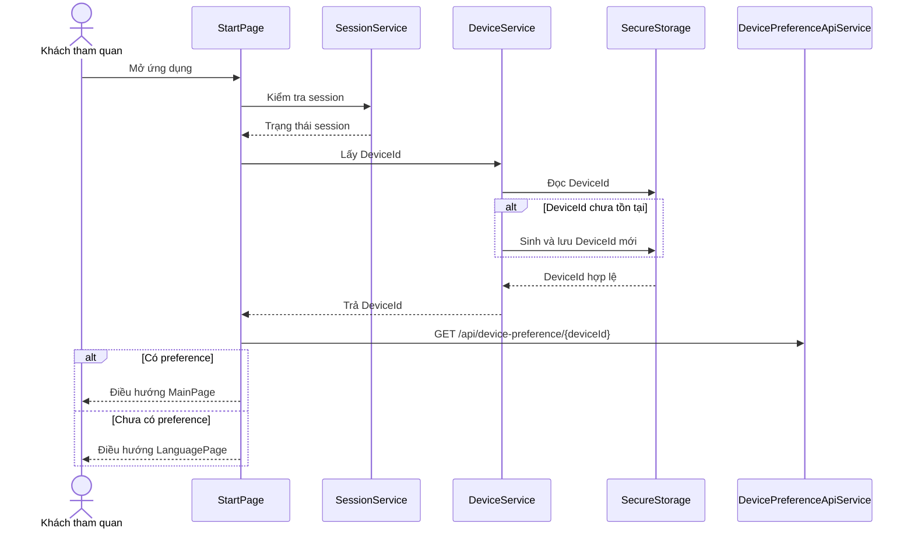
```mermaid
sequenceDiagram
    actor KTV as Khách tham quan
    participant SP as StartPage
    participant SS as SessionService
    participant DS as DeviceService
    participant SEC as SecureStorage
    participant DP as DevicePreferenceApiService

    KTV->>SP: Mở ứng dụng
    SP->>SS: Kiểm tra session
    SS-->>SP: Trạng thái session
    SP->>DS: Lấy DeviceId
    DS->>SEC: Đọc DeviceId
    alt DeviceId chưa tồn tại
        DS->>SEC: Sinh và lưu DeviceId mới
    end
    SEC-->>DS: DeviceId hợp lệ
    DS-->>SP: Trả DeviceId
    SP->>DP: GET /api/device-preference/{deviceId}
    alt Có preference
        SP-->>KTV: Điều hướng MainPage
    else Chưa có preference
        SP-->>KTV: Điều hướng LanguagePage
    end
```

---

### SD-M02: Chọn ngôn ngữ & giọng đọc + lưu DevicePreference

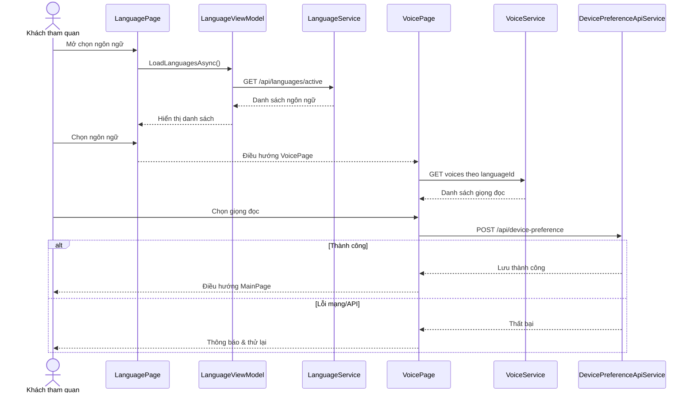
```mermaid
sequenceDiagram
    actor KTV as Khách tham quan
    participant LP as LanguagePage
    participant LVM as LanguageViewModel
    participant LS as LanguageService
    participant VP as VoicePage
    participant VS as VoiceService
    participant DPS as DevicePreferenceApiService

    KTV->>LP: Mở chọn ngôn ngữ
    LP->>LVM: LoadLanguagesAsync()
    LVM->>LS: GET /api/languages/active
    LS-->>LVM: Danh sách ngôn ngữ
    LVM-->>LP: Hiển thị danh sách
    KTV->>LP: Chọn ngôn ngữ
    LP-->>VP: Điều hướng VoicePage
    VP->>VS: GET voices theo languageId
    VS-->>VP: Danh sách giọng đọc
    KTV->>VP: Chọn giọng đọc
    VP->>DPS: POST /api/device-preference
    alt Thành công
        DPS-->>VP: Lưu thành công
        VP-->>KTV: Điều hướng MainPage
    else Lỗi mạng/API
        DPS-->>VP: Thất bại
        VP-->>KTV: Thông báo & thử lại
    end
```

---

### SD-M03: Quét QR Code để dùng app

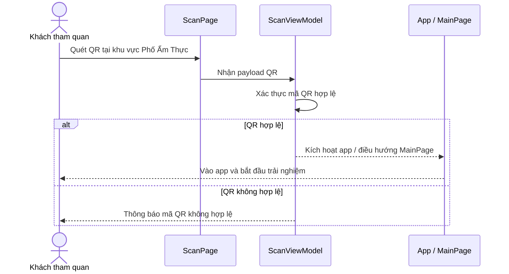
```mermaid
sequenceDiagram
    actor KTV as Khách tham quan
    participant SC as ScanPage
    participant SVM as ScanViewModel
    participant APP as App / MainPage

    KTV->>SC: Quét QR tại khu vực Phố Ẩm Thực
    SC->>SVM: Nhận payload QR
    SVM->>SVM: Xác thực mã QR hợp lệ
    alt QR hợp lệ
        SVM-->>APP: Kích hoạt app / điều hướng MainPage
        APP-->>KTV: Vào app và bắt đầu trải nghiệm
    else QR không hợp lệ
        SVM-->>KTV: Thông báo mã QR không hợp lệ
    end
```

---

### SD-M04: Tự động phát thuyết minh khi vào vùng Geofence

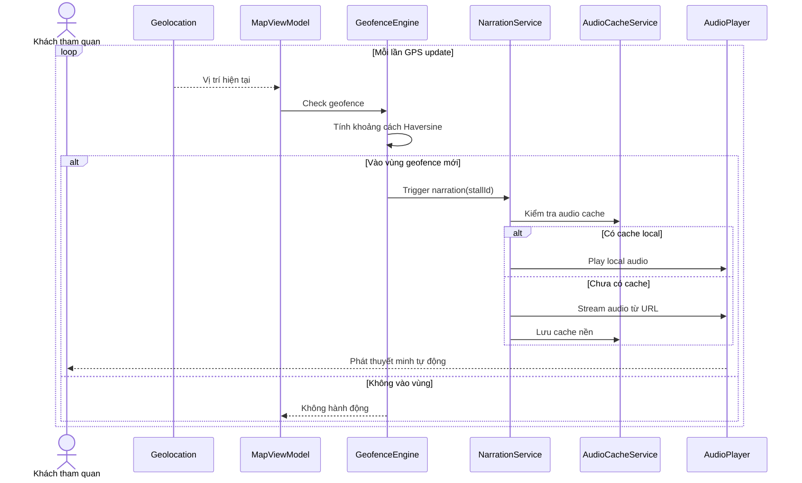
```mermaid
sequenceDiagram
    actor KTV as Khách tham quan
    participant GPS as Geolocation
    participant MAP as MapViewModel
    participant GE as GeofenceEngine
    participant NS as NarrationService
    participant AC as AudioCacheService
    participant AP as AudioPlayer

    loop Mỗi lần GPS update
        GPS-->>MAP: Vị trí hiện tại
        MAP->>GE: Check geofence
        GE->>GE: Tính khoảng cách Haversine
        alt Vào vùng geofence mới
            GE->>NS: Trigger narration(stallId)
            NS->>AC: Kiểm tra audio cache
            alt Có cache local
                NS->>AP: Play local audio
            else Chưa có cache
                NS->>AP: Stream audio từ URL
                NS->>AC: Lưu cache nền
            end
            AP-->>KTV: Phát thuyết minh tự động
        else Không vào vùng
            GE-->>MAP: Không hành động
        end
    end
```

---

### SD-M05: Tải danh sách gian hàng – Cache-First + Background Sync

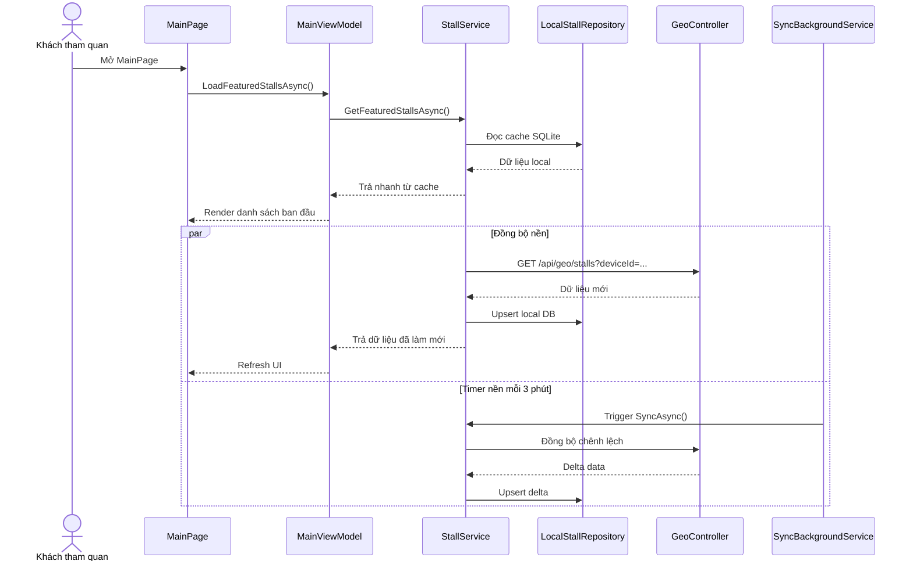
```mermaid
sequenceDiagram
    actor KTV as Khách tham quan
    participant MP as MainPage
    participant MVM as MainViewModel
    participant ST as StallService
    participant DB as LocalStallRepository
    participant API as GeoController
    participant SYNC as SyncBackgroundService

    KTV->>MP: Mở MainPage
    MP->>MVM: LoadFeaturedStallsAsync()
    MVM->>ST: GetFeaturedStallsAsync()
    ST->>DB: Đọc cache SQLite
    DB-->>ST: Dữ liệu local
    ST-->>MVM: Trả nhanh từ cache
    MVM-->>MP: Render danh sách ban đầu

    par Đồng bộ nền
        ST->>API: GET /api/geo/stalls?deviceId=...
        API-->>ST: Dữ liệu mới
        ST->>DB: Upsert local DB
        ST-->>MVM: Trả dữ liệu đã làm mới
        MVM-->>MP: Refresh UI
    and Timer nền mỗi 3 phút
        SYNC->>ST: Trigger SyncAsync()
        ST->>API: Đồng bộ chênh lệch
        API-->>ST: Delta data
        ST->>DB: Upsert delta
    end
```

---

### SD-M06: Tính đường đi & chỉ đường (OSRM)

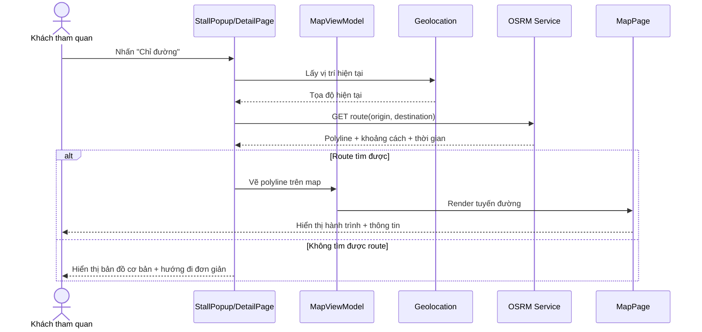
```mermaid
sequenceDiagram
    actor KTV as Khách tham quan
    participant SP as StallPopup/DetailPage
    participant MVM as MapViewModel
    participant GPS as Geolocation
    participant OSRM as OSRM Service
    participant MAP as MapPage

    KTV->>SP: Nhấn "Chỉ đường"
    SP->>GPS: Lấy vị trí hiện tại
    GPS-->>SP: Tọa độ hiện tại
    SP->>OSRM: GET route(origin, destination)
    OSRM-->>SP: Polyline + khoảng cách + thời gian
    alt Route tìm được
        SP->>MVM: Vẽ polyline trên map
        MVM->>MAP: Render tuyến đường
        MAP-->>KTV: Hiển thị hành trình + thông tin
    else Không tìm được route
        SP-->>KTV: Hiển thị bản đồ cơ bản + hướng đi đơn giản
    end
```

---

## 18. Use Cases – Web Admin

> **Actors:**
> - **Admin** – Quản trị viên hệ thống, có toàn quyền.
> - **BusinessOwner** – Chủ doanh nghiệp, chỉ quản lý dữ liệu thuộc business của mình.
> - **Anonymous** – Người dùng chưa đăng nhập.

---

### UC-W01: Đăng nhập hệ thống

| Trường | Nội dung |
|--------|---------|
| **Actor** | Admin, BusinessOwner |
| **Mô tả** | Người dùng nhập email và mật khẩu để xác thực và nhận JWT. |
| **Tiền điều kiện** | Người dùng chưa đăng nhập, tài khoản đã tồn tại trong hệ thống. |
| **Hậu điều kiện** | JWT và RefreshToken được lưu vào session, người dùng được chuyển về Dashboard. |

**Luồng chính:**
1. Người dùng truy cập `/Auth/Login`.
2. Nhập email và password, nhấn **Đăng nhập**.
3. Web gửi `POST /api/auth/login`.
4. API xác thực BCrypt, tạo JWT (30 phút) + RefreshToken (30 ngày).
5. Web lưu token vào session, redirect về `/Home/Index`.

**Luồng thay thế:**
- **3a.** ModelState không hợp lệ → hiển thị lỗi validation, không gọi API.
- **4a.** Sai email hoặc password → API trả lỗi → hiển thị "Đăng nhập thất bại".

---

### UC-W02: Đăng ký tài khoản BusinessOwner

| Trường | Nội dung |
|--------|---------|
| **Actor** | Anonymous |
| **Mô tả** | Người dùng mới tạo tài khoản BusinessOwner. |
| **Tiền điều kiện** | Người dùng chưa có tài khoản, email chưa được đăng ký. |
| **Hậu điều kiện** | Tài khoản mới được tạo với Role `BusinessOwner`, người dùng được redirect về trang Login. |

**Luồng chính:**
1. Người dùng truy cập `/Auth/Register`.
2. Điền username, email, password, số điện thoại.
3. Web gửi `POST /api/auth/register-business-owner`.
4. API hash password bằng BCrypt, tạo User, gán Role `BusinessOwner`.
5. Web redirect về `/Auth/Login`.

**Luồng thay thế:**
- **3a.** ModelState không hợp lệ → hiển thị lỗi validation.
- **4a.** Email hoặc username đã tồn tại → API trả lỗi → hiển thị thông báo trùng.

---

### UC-W03: Đăng xuất

| Trường | Nội dung |
|--------|---------|
| **Actor** | Admin, BusinessOwner |
| **Mô tả** | Người dùng kết thúc phiên làm việc, xóa token khỏi session. |
| **Tiền điều kiện** | Người dùng đang đăng nhập. |
| **Hậu điều kiện** | Token bị xóa khỏi session, người dùng bị redirect về trang Login. |

**Luồng chính:**
1. Người dùng nhấn **Đăng xuất**.
2. Web gửi `POST /Auth/Logout`.
3. Web gọi `ClearToken()` xóa token khỏi session.
4. Redirect về `/Auth/Login`.

---

### UC-W04: Xem & tìm kiếm danh sách Business

| Trường | Nội dung |
|--------|---------|
| **Actor** | Admin |
| **Mô tả** | Admin xem danh sách Business với phân trang và tìm kiếm theo tên. |
| **Tiền điều kiện** | Đã đăng nhập với Role `Admin`. |
| **Hậu điều kiện** | Hiển thị danh sách Business theo điều kiện lọc. |

**Luồng chính:**
1. Admin vào `/Business/Index`.
2. Web gọi `GET /api/business?page=1&pageSize=10&search=...`.
3. API truy vấn DB, trả về `PagedResult<BusinessDetailDto>`.
4. Hiển thị bảng danh sách với phân trang.

**Luồng thay thế:**
- **2a.** Admin nhập từ khóa tìm kiếm → Web gọi lại API với `search={keyword}`.
- **3a.** Không có kết quả → hiển thị bảng rỗng, không báo lỗi.

---

### UC-W05: Tạo Business mới

| Trường | Nội dung |
|--------|---------|
| **Actor** | Admin |
| **Mô tả** | Admin tạo một Business mới trong hệ thống. |
| **Tiền điều kiện** | Đã đăng nhập với Role `Admin`. |
| **Hậu điều kiện** | Business mới được lưu vào DB, danh sách được làm mới. |

**Luồng chính:**
1. Admin nhấn **Tạo mới**, modal hiện ra.
2. Điền tên, mã số thuế, email liên hệ, số điện thoại.
3. Nhấn **Lưu** → Web gửi `POST /api/business`.
4. API insert vào DB, trả về Business mới.
5. Web redirect với TempData `"Tạo business thành công."`.

**Luồng thay thế:**
- **3a.** Validation lỗi → giữ modal mở, hiển thị lỗi từng trường.
- **4a.** API trả lỗi (trùng mã thuế...) → hiển thị lỗi trong modal.

---

### UC-W06: Cập nhật thông tin Business

| Trường | Nội dung |
|--------|---------|
| **Actor** | Admin |
| **Mô tả** | Admin chỉnh sửa thông tin của một Business đã tồn tại. |
| **Tiền điều kiện** | Business tồn tại, Admin đã đăng nhập. |
| **Hậu điều kiện** | Thông tin Business được cập nhật trong DB. |

**Luồng chính:**
1. Admin nhấn **Sửa** trên dòng Business, modal Edit hiện ra với dữ liệu hiện tại.
2. Chỉnh sửa thông tin, nhấn **Lưu**.
3. Web gửi `POST /Business/Update` → API `PUT /api/business/{id}`.
4. DB cập nhật, Web redirect với thông báo thành công.

**Luồng thay thế:**
- **2a.** Validation lỗi → giữ modal Edit mở, hiển thị lỗi.
- **3a.** API lỗi → hiển thị thông báo lỗi trong modal.

---

### UC-W07: Vô hiệu hóa Business

| Trường | Nội dung |
|--------|---------|
| **Actor** | Admin |
| **Mô tả** | Admin tắt hoạt động của một Business (set `IsActive = false`). Không xóa dữ liệu. |
| **Tiền điều kiện** | Business đang Active, Admin đã đăng nhập. |
| **Hậu điều kiện** | `IsActive = false`, Business không còn hiển thị với khách tham quan. |

**Luồng chính:**
1. Admin nhấn **Vô hiệu hóa** trên dòng Business.
2. Web gửi `POST /Business/Deactivate?id={guid}`.
3. Web gọi `GET /api/business/{id}` để lấy dữ liệu hiện tại.
4. Web gọi `PUT /api/business/{id}` với `IsActive = false`.
5. Redirect với thông báo thành công.

**Luồng thay thế:**
- **3a.** Business không tồn tại → hiển thị lỗi, redirect về danh sách.
- **4a.** API lỗi → TempData error, redirect về danh sách.

---

### UC-W08: Xem & lọc danh sách Stall

| Trường | Nội dung |
|--------|---------|
| **Actor** | Admin, BusinessOwner |
| **Mô tả** | Xem danh sách Stall với phân trang, tìm kiếm theo tên và lọc theo Business. |
| **Tiền điều kiện** | Đã đăng nhập. |
| **Hậu điều kiện** | Hiển thị danh sách Stall theo điều kiện lọc. |

**Luồng chính:**
1. Người dùng vào `/Stall/Index`.
2. Web gọi song song `GET /api/business` (load dropdown) và `GET /api/stall?...` (load danh sách).
3. Hiển thị bảng Stall + dropdown lọc theo Business.

**Luồng thay thế:**
- **2a.** Chọn Business từ dropdown → Web gọi lại API với `businessId={guid}`.
- **2b.** Nhập từ khóa → gọi lại API với `search={keyword}`.

---

### UC-W09: Tạo Stall mới

| Trường | Nội dung |
|--------|---------|
| **Actor** | Admin, BusinessOwner |
| **Mô tả** | Tạo Stall mới và gán vào một Business. |
| **Tiền điều kiện** | Đã đăng nhập, có ít nhất một Business tồn tại. |
| **Hậu điều kiện** | Stall mới được lưu vào DB và gán đúng Business. |

**Luồng chính:**
1. Nhấn **Tạo mới**, modal hiện ra với dropdown Business.
2. Chọn Business, điền tên, mô tả, slug, email, số điện thoại.
3. Nhấn **Lưu** → Web gửi `POST /api/stall`.
4. API insert, trả về Stall mới.
5. Redirect với thông báo thành công.

**Luồng thay thế:**
- **3a.** Validation lỗi → giữ modal mở, hiển thị lỗi.
- **4a.** Slug trùng → API trả lỗi → hiển thị trong modal.

---

### UC-W10: Cập nhật thông tin Stall

| Trường | Nội dung |
|--------|---------|
| **Actor** | Admin, BusinessOwner |
| **Mô tả** | Chỉnh sửa thông tin của một Stall đã tồn tại. |
| **Tiền điều kiện** | Stall tồn tại, người dùng đã đăng nhập. |
| **Hậu điều kiện** | Thông tin Stall được cập nhật trong DB. |

**Luồng chính:**
1. Nhấn **Sửa** trên dòng Stall, modal Edit hiện ra.
2. Chỉnh sửa thông tin, nhấn **Lưu**.
3. Web gửi `POST /Stall/Update` → API `PUT /api/stall/{id}`.
4. Redirect với thông báo thành công.

**Luồng thay thế:**
- **2a.** Validation lỗi → giữ modal Edit mở.
- **3a.** API lỗi → hiển thị lỗi trong modal.

---

### UC-W11: Vô hiệu hóa Stall

| Trường | Nội dung |
|--------|---------|
| **Actor** | Admin, BusinessOwner |
| **Mô tả** | Tắt hoạt động của một Stall (`IsActive = false`). Không xóa dữ liệu. |
| **Tiền điều kiện** | Stall đang Active. |
| **Hậu điều kiện** | `IsActive = false`, Stall ẩn khỏi danh sách hiển thị với khách. |

**Luồng chính:**
1. Nhấn **Vô hiệu hóa** trên dòng Stall.
2. Web `GET /api/stall/{id}` → lấy dữ liệu hiện tại.
3. Web `PUT /api/stall/{id}` với `IsActive = false`.
4. Redirect với thông báo thành công.

**Luồng thay thế:**
- **2a.** Stall không tồn tại → TempData error, redirect.
- **3a.** API lỗi → TempData error, redirect.

---

### UC-W12: Xem danh sách vị trí Stall

| Trường | Nội dung |
|--------|---------|
| **Actor** | Admin |
| **Mô tả** | Xem danh sách tất cả `StallLocation` với phân trang, lọc theo tên stall và trạng thái. |
| **Tiền điều kiện** | Đã đăng nhập với Role `Admin`. |
| **Hậu điều kiện** | Hiển thị danh sách vị trí Stall. |

**Luồng chính:**
1. Admin vào `/StallLocation/Index`.
2. Web gọi `GET /api/stall-location?page=1&pageSize=10&stallName=...&isActive=...`.
3. Hiển thị bảng danh sách với thông tin tọa độ, địa chỉ, bán kính.

**Luồng thay thế:**
- **2a.** Lọc theo tên stall hoặc trạng thái → gọi lại API với params tương ứng.

---

### UC-W13: Tạo vị trí Stall trên bản đồ

| Trường | Nội dung |
|--------|---------|
| **Actor** | Admin |
| **Mô tả** | Admin chọn tọa độ trên bản đồ tương tác (OpenStreetMap) để đặt vị trí cho Stall. |
| **Tiền điều kiện** | Stall chưa có vị trí, Admin đã đăng nhập. |
| **Hậu điều kiện** | `StallLocation` mới được lưu với tọa độ lat/lng, địa chỉ, bán kính. |

**Luồng chính:**
1. Admin vào `/StallLocation/CreateMap`.
2. Web load danh sách Stall (dropdown) và tất cả locations hiện tại (markers trên map).
3. Admin chọn Stall từ dropdown, click vị trí trên bản đồ.
4. Nhập địa chỉ, bán kính (meters), nhấn **Lưu**.
5. Web gửi `POST /StallLocation/Create` → API `POST /api/stall-location`.
6. Redirect với thông báo thành công.

**Luồng thay thế:**
- **4a.** Validation lỗi → hiển thị lỗi ngay trên trang map.
- **5a.** API lỗi → hiển thị lỗi trên trang map.

---

### UC-W14: Cập nhật vị trí Stall trên bản đồ

| Trường | Nội dung |
|--------|---------|
| **Actor** | Admin |
| **Mô tả** | Admin kéo marker hoặc chọn lại tọa độ để cập nhật vị trí đã tồn tại. |
| **Tiền điều kiện** | `StallLocation` đã tồn tại. |
| **Hậu điều kiện** | `StallLocation` được cập nhật tọa độ mới trong DB. |

**Luồng chính:**
1. Admin nhấn **Sửa** trên dòng Location → vào `/StallLocation/EditMap/{id}`.
2. Web load location hiện tại, hiển thị marker tại tọa độ cũ.
3. Admin kéo marker / click vị trí mới, điều chỉnh bán kính.
4. Nhấn **Lưu** → Web gửi `POST /StallLocation/Update/{id}` → API `PUT /api/stall-location/{id}`.
5. Redirect với thông báo thành công.

**Luồng thay thế:**
- **4a.** Validation lỗi → hiển thị lỗi trên trang map.

---

### UC-W15: Xem danh sách GeoFence

| Trường | Nội dung |
|--------|---------|
| **Actor** | Admin |
| **Mô tả** | Xem danh sách `StallGeoFence` với phân trang, lọc theo Stall. |
| **Tiền điều kiện** | Đã đăng nhập với Role `Admin`. |
| **Hậu điều kiện** | Hiển thị danh sách GeoFence. |

**Luồng chính:**
1. Admin vào `/StallGeoFence/Index`.
2. Web gọi song song `GET /api/stall` (dropdown) và `GET /api/stall-geofence?...`.
3. Hiển thị bảng danh sách GeoFence kèm dropdown lọc theo Stall.

---

### UC-W16: Tạo GeoFence cho Stall

| Trường | Nội dung |
|--------|---------|
| **Actor** | Admin |
| **Mô tả** | Tạo vùng GeoFence (polygon hoặc circle) cho một Stall để trigger audio khi khách vào vùng. |
| **Tiền điều kiện** | Stall tồn tại và đã có `StallLocation`. |
| **Hậu điều kiện** | `StallGeoFence` mới được lưu vào DB. |

**Luồng chính:**
1. Nhấn **Tạo GeoFence** → form hiện ra với dropdown Stall.
2. Điền thông tin (chọn Stall, nhập tọa độ / bán kính).
3. Nhấn **Lưu** → Web gửi `POST /api/stall-geofence`.
4. Redirect với thông báo thành công.

**Luồng thay thế:**
- **3a.** Validation lỗi → TempData error, redirect.
- **3b.** API lỗi → TempData error, redirect.

---

### UC-W17: Cập nhật GeoFence

| Trường | Nội dung |
|--------|---------|
| **Actor** | Admin |
| **Mô tả** | Chỉnh sửa thông số GeoFence đã tồn tại. |
| **Tiền điều kiện** | `StallGeoFence` tồn tại. |
| **Hậu điều kiện** | GeoFence được cập nhật trong DB. |

**Luồng chính:**
1. Nhấn **Sửa** → form điền sẵn dữ liệu cũ.
2. Chỉnh sửa, nhấn **Lưu** → Web gửi `POST /StallGeoFence/Update/{id}` → API `PUT /api/stall-geofence/{id}`.
3. Redirect với thông báo thành công.

**Luồng thay thế:**
- **2a.** Validation lỗi → TempData error, redirect.

---

### UC-W18: Xem danh sách ảnh Stall (Media)

| Trường | Nội dung |
|--------|---------|
| **Actor** | Admin, BusinessOwner |
| **Mô tả** | Xem danh sách ảnh của Stall với phân trang, lọc theo Stall và trạng thái. |
| **Tiền điều kiện** | Đã đăng nhập. |
| **Hậu điều kiện** | Hiển thị gallery ảnh các Stall. |

**Luồng chính:**
1. Vào `/StallMedia/Index`.
2. Web gọi song song `GET /api/stall` (dropdown) và `GET /api/stall-media?...`.
3. Hiển thị dạng grid ảnh (pageSize=12) với tên stall, caption.

**Luồng thay thế:**
- **2a.** Lọc theo stallId hoặc isActive → gọi lại API với params tương ứng.

---

### UC-W19: Upload ảnh mới cho Stall

| Trường | Nội dung |
|--------|---------|
| **Actor** | Admin, BusinessOwner |
| **Mô tả** | Upload file ảnh mới lên Azure Blob thông qua API, gán cho một Stall. |
| **Tiền điều kiện** | Đã đăng nhập, Stall tồn tại. |
| **Hậu điều kiện** | Ảnh được lưu trên Azure Blob, `StallMedia` record được tạo với URL ảnh. |

**Luồng chính:**
1. Nhấn **Upload ảnh**, modal Create hiện ra.
2. Chọn Stall, chọn file ảnh từ máy, điền caption (tuỳ chọn), sắp xếp thứ tự.
3. Nhấn **Lưu** → Web gửi `POST /StallMedia/UploadCreate` (multipart/form-data).
4. Web gọi `POST /api/stall-media/upload` qua `StallMediaApiClient`.
5. API upload file lên Azure Blob, lưu URL vào DB.
6. Redirect với thông báo thành công.

**Luồng thay thế:**
- **2a.** Không chọn file ảnh → lỗi validation "Vui lòng chọn ảnh", giữ modal mở.
- **5a.** Upload Azure thất bại → API trả lỗi → hiển thị lỗi trong modal.

---

### UC-W20: Cập nhật ảnh Stall

| Trường | Nội dung |
|--------|---------|
| **Actor** | Admin, BusinessOwner |
| **Mô tả** | Thay thế ảnh hiện tại bằng ảnh mới, có thể cập nhật caption và thứ tự. |
| **Tiền điều kiện** | `StallMedia` tồn tại. |
| **Hậu điều kiện** | File ảnh mới được upload lên Azure Blob, record được cập nhật URL mới. |

**Luồng chính:**
1. Nhấn **Sửa** trên ảnh, modal Edit hiện ra với dữ liệu cũ.
2. Chọn file ảnh mới, chỉnh caption/thứ tự, nhấn **Lưu**.
3. Web gửi `POST /StallMedia/UploadUpdate` → API `PUT /api/stall-media/{id}/upload`.
4. Redirect với thông báo thành công.

**Luồng thay thế:**
- **2a.** Không chọn file mới → lỗi "Vui lòng chọn ảnh mới", giữ modal mở.

---

### UC-W21: Xóa ảnh Stall

| Trường | Nội dung |
|--------|---------|
| **Actor** | Admin, BusinessOwner |
| **Mô tả** | Xóa vĩnh viễn một ảnh Stall khỏi hệ thống. |
| **Tiền điều kiện** | `StallMedia` tồn tại. |
| **Hậu điều kiện** | Record bị xóa khỏi DB (và Azure Blob nếu API xử lý). |

**Luồng chính:**
1. Nhấn **Xóa** trên ảnh.
2. Web gửi `POST /StallMedia/Delete?id={guid}`.
3. Web gọi `DELETE /api/stall-media/{id}`.
4. Redirect với thông báo thành công.

**Luồng thay thế:**
- **3a.** API lỗi → TempData error, redirect.

---

### UC-W22: Xem & lọc danh sách Narration Content

| Trường | Nội dung |
|--------|---------|
| **Actor** | Admin, BusinessOwner |
| **Mô tả** | Xem danh sách `StallNarrationContent` với phân trang, lọc theo stall, ngôn ngữ và trạng thái. |
| **Tiền điều kiện** | Đã đăng nhập. |
| **Hậu điều kiện** | Hiển thị danh sách narration content theo bộ lọc. |

**Luồng chính:**
1. Vào `/Narration/StallNarrationContents`.
2. Web gọi song song 3 API: `GET /api/stall`, `GET /api/languages`, `GET /api/stall-narration-content?...`.
3. Hiển thị bảng danh sách + dropdown lọc theo stall, ngôn ngữ, trạng thái.

---

### UC-W23: Tạo Narration Content mới

| Trường | Nội dung |
|--------|---------|
| **Actor** | Admin, BusinessOwner |
| **Mô tả** | Tạo nội dung thuyết minh mới cho một Stall ở một ngôn ngữ cụ thể. |
| **Tiền điều kiện** | Stall và Language tồn tại, chưa có content cho cặp (stall, language) này. |
| **Hậu điều kiện** | `StallNarrationContent` mới được lưu vào DB với trạng thái chờ generate audio. |

**Luồng chính:**
1. Nhấn **Tạo mới**, form hiện ra với dropdown Stall và Language.
2. Chọn Stall, chọn Language, nhập tiêu đề, mô tả, script text.
3. Nhấn **Lưu** → Web gửi `POST /Narration/Create` → API `POST /api/stall-narration-content`.
4. Redirect với thông báo thành công.

**Luồng thay thế:**
- **2a.** ModelState lỗi → TempData error, redirect về danh sách.
- **3a.** API lỗi (trùng cặp stall-language...) → TempData error, redirect.

---

### UC-W24: Xem chi tiết Narration Content và danh sách Audio

| Trường | Nội dung |
|--------|---------|
| **Actor** | Admin, BusinessOwner |
| **Mô tả** | Xem toàn bộ thông tin một `StallNarrationContent` kèm danh sách file audio đã được generate. |
| **Tiền điều kiện** | `StallNarrationContent` tồn tại. |
| **Hậu điều kiện** | Trang detail hiển thị script text, thông tin stall/ngôn ngữ, và toàn bộ `NarrationAudio`. |

**Luồng chính:**
1. Nhấn vào một content → vào `/Narration/Show/{id}`.
2. Web gọi `GET /api/stall-narration-content/{id}` (trả về content + danh sách audios).
3. Web gọi song song `GET /api/stall/{stallId}` và `GET /api/languages` để lấy tên hiển thị.
4. Render trang detail với đầy đủ thông tin và danh sách audio kèm nút phát thử.

**Luồng thay thế:**
- **2a.** Content không tồn tại → hiển thị trang lỗi.

---

### UC-W25: Cập nhật nội dung script Narration

| Trường | Nội dung |
|--------|---------|
| **Actor** | Admin, BusinessOwner |
| **Mô tả** | Chỉnh sửa tiêu đề, mô tả, script text của một `StallNarrationContent`. |
| **Tiền điều kiện** | `StallNarrationContent` tồn tại. |
| **Hậu điều kiện** | Nội dung được cập nhật trong DB. Audio cũ vẫn còn cho đến khi generate lại. |

**Luồng chính:**
1. Từ trang detail (`/Narration/Show/{id}`), chỉnh sửa các trường.
2. Nhấn **Lưu** → Web gửi `POST /Narration/Update/{id}` → API `PUT /api/stall-narration-content/{id}`.
3. Redirect về trang detail với thông báo thành công.

**Luồng thay thế:**
- **2a.** ModelState lỗi → trang detail hiển thị lại form với dữ liệu đã nhập và thông báo lỗi.
- **2b.** API lỗi → trang detail hiển thị thông báo lỗi.

---

### UC-W26: Bật / tắt trạng thái Narration Content

| Trường | Nội dung |
|--------|---------|
| **Actor** | Admin, BusinessOwner |
| **Mô tả** | Toggle `IsActive` của một `StallNarrationContent` để bật hoặc tắt thuyết minh cho khách tham quan. |
| **Tiền điều kiện** | `StallNarrationContent` tồn tại. |
| **Hậu điều kiện** | Trạng thái `IsActive` được cập nhật, ảnh hưởng ngay đến việc Mobile có nhận audio này không. |

**Luồng chính:**
1. Từ danh sách, nhấn nút toggle trạng thái trên dòng content.
2. Web gửi `POST /Narration/ToggleStatus?id={guid}&isActive={bool}`.
3. Web gọi API tương ứng để cập nhật trạng thái.
4. Redirect về danh sách với thông báo thành công.

**Luồng thay thế:**
- **3a.** API lỗi → TempData error, redirect về danh sách.

---

### UC-W27: Xem Dashboard tổng quan hệ thống

| Trường | Nội dung |
|--------|---------|
| **Actor** | Admin |
| **Mô tả** | Admin xem các chỉ số tổng quan: tổng số Business, Stall, ngôn ngữ active, narration content, cùng danh sách gần đây. |
| **Tiền điều kiện** | Đã đăng nhập với Role `Admin`. |
| **Hậu điều kiện** | Dashboard hiển thị số liệu thời gian thực từ DB. |

**Luồng chính:**
1. Admin vào `/Admin/Dashboard`.
2. Web gọi đồng thời 4 API (`Task.WhenAll`):
   - `GET /api/business?page=1&pageSize=5`
   - `GET /api/stall?page=1&pageSize=5`
   - `GET /api/languages?isActive=true`
   - `GET /api/stall-narration-content?page=1&pageSize=1`
3. Tổng hợp `AdminDashboardViewModel` với các chỉ số và danh sách recent.
4. Render Dashboard với thẻ thống kê + bảng recent businesses + recent stalls.

**Luồng thay thế:**
- **2a.** Một API bị lỗi → giá trị tương ứng hiển thị 0 hoặc danh sách rỗng, không crash toàn trang.

---

## 19. Sequence Diagrams – Web Admin

> Ký hiệu dùng Mermaid `sequenceDiagram`. Participant viết tắt:
> - **User** – Người dùng (Admin hoặc BusinessOwner) thao tác trên trình duyệt
> - **Browser** – Trang web MVC (Razor View + form submit)
> - **WebCtrl** – Web MVC Controller tương ứng
> - **ApiClient** – Service `*ApiClient.cs` trong `Web/Services/`
> - **API** – ASP.NET Core Web API (endpoint cụ thể ghi chú trong từng diagram)
> - **DB** – SQL Server qua EF Core

| Mã | Tên |
|----|-----|
| [SD-W01](#sd-w01-đăng-nhập-login) | Đăng nhập (Login) |
| [SD-W02](#sd-w02-đăng-ký-businessowner-register) | Đăng ký BusinessOwner (Register) |
| [SD-W03](#sd-w03-xem--tìm-kiếm-danh-sách-business) | Xem & tìm kiếm danh sách Business |
| [SD-W04](#sd-w04-tạo-business) | Tạo Business |
| [SD-W05](#sd-w05-vô-hiệu-hóa-business-deactivate) | Vô hiệu hóa Business (Deactivate) |
| [SD-W06](#sd-w06-tạo--cập-nhật-stall) | Tạo / Cập nhật Stall |
| [SD-W07](#sd-w07-đặt-vị-trí-stall-trên-bản-đồ-stalllocation--stallgeofence) | Đặt vị trí Stall trên bản đồ (StallLocation + StallGeoFence) |
| [SD-W08](#sd-w08-tạo--cập-nhật-stallnarrationcontent) | Tạo & cập nhật StallNarrationContent |
| [SD-W09](#sd-w09-xem-chi-tiết-narration-content-show--audio-list) | Xem chi tiết Narration Content (Show + Audio list) |
| [SD-W10](#sd-w10-load-admin-dashboard) | Load Admin Dashboard |

---

### SD-W01: Đăng nhập (Login)

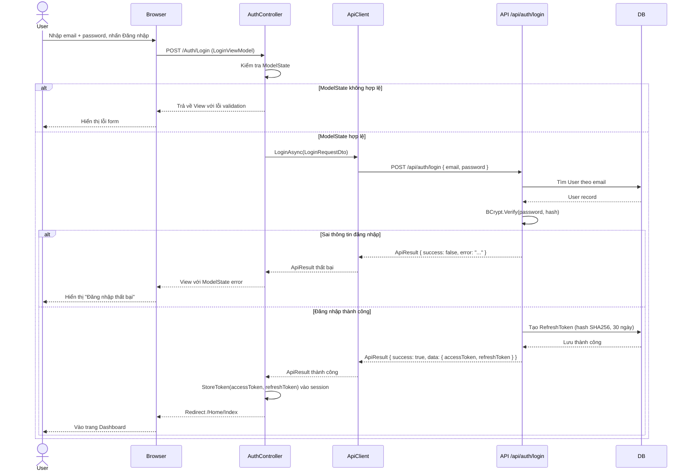
```mermaid
sequenceDiagram
    actor User
    participant Browser
    participant WebCtrl as AuthController
    participant ApiClient as ApiClient
    participant API as API /api/auth/login
    participant DB

    User->>Browser: Nhập email + password, nhấn Đăng nhập
    Browser->>WebCtrl: POST /Auth/Login (LoginViewModel)
    WebCtrl->>WebCtrl: Kiểm tra ModelState
    alt ModelState không hợp lệ
        WebCtrl-->>Browser: Trả về View với lỗi validation
        Browser-->>User: Hiển thị lỗi form
    else ModelState hợp lệ
        WebCtrl->>ApiClient: LoginAsync(LoginRequestDto)
        ApiClient->>API: POST /api/auth/login { email, password }
        API->>DB: Tìm User theo email
        DB-->>API: User record
        API->>API: BCrypt.Verify(password, hash)
        alt Sai thông tin đăng nhập
            API-->>ApiClient: ApiResult { success: false, error: "..." }
            ApiClient-->>WebCtrl: ApiResult thất bại
            WebCtrl-->>Browser: View với ModelState error
            Browser-->>User: Hiển thị "Đăng nhập thất bại"
        else Đăng nhập thành công
            API->>DB: Tạo RefreshToken (hash SHA256, 30 ngày)
            DB-->>API: Lưu thành công
            API-->>ApiClient: ApiResult { success: true, data: { accessToken, refreshToken } }
            ApiClient-->>WebCtrl: ApiResult thành công
            WebCtrl->>WebCtrl: StoreToken(accessToken, refreshToken) vào session
            WebCtrl-->>Browser: Redirect /Home/Index
            Browser-->>User: Vào trang Dashboard
        end
    end
```

---

### SD-W02: Đăng ký BusinessOwner (Register)

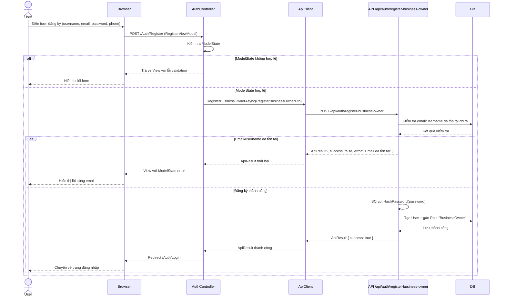
```mermaid
sequenceDiagram
    actor User
    participant Browser
    participant WebCtrl as AuthController
    participant ApiClient as ApiClient
    participant API as API /api/auth/register-business-owner
    participant DB

    User->>Browser: Điền form đăng ký (username, email, password, phone)
    Browser->>WebCtrl: POST /Auth/Register (RegisterViewModel)
    WebCtrl->>WebCtrl: Kiểm tra ModelState
    alt ModelState không hợp lệ
        WebCtrl-->>Browser: Trả về View với lỗi validation
        Browser-->>User: Hiển thị lỗi form
    else ModelState hợp lệ
        WebCtrl->>ApiClient: RegisterBusinessOwnerAsync(RegisterBusinessOwnerDto)
        ApiClient->>API: POST /api/auth/register-business-owner
        API->>DB: Kiểm tra email/username đã tồn tại chưa
        DB-->>API: Kết quả kiểm tra
        alt Email/username đã tồn tại
            API-->>ApiClient: ApiResult { success: false, error: "Email đã tồn tại" }
            ApiClient-->>WebCtrl: ApiResult thất bại
            WebCtrl-->>Browser: View với ModelState error
            Browser-->>User: Hiển thị lỗi trùng email
        else Đăng ký thành công
            API->>API: BCrypt.HashPassword(password)
            API->>DB: Tạo User + gán Role "BusinessOwner"
            DB-->>API: Lưu thành công
            API-->>ApiClient: ApiResult { success: true }
            ApiClient-->>WebCtrl: ApiResult thành công
            WebCtrl-->>Browser: Redirect /Auth/Login
            Browser-->>User: Chuyển về trang đăng nhập
        end
    end
```

---

### SD-W03: Xem & tìm kiếm danh sách Business

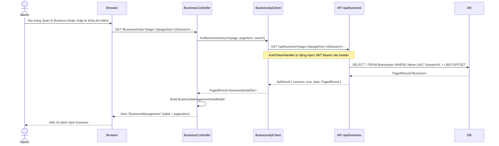
```mermaid
sequenceDiagram
    actor User as Admin
    participant Browser
    participant WebCtrl as BusinessController
    participant ApiClient as BusinessApiClient
    participant API as API /api/business
    participant DB

    User->>Browser: Vào trang Quản lý Business (hoặc nhập từ khóa tìm kiếm)
    Browser->>WebCtrl: GET /Business/Index?page=1&pageSize=10&search=...
    WebCtrl->>ApiClient: GetBusinessesAsync(page, pageSize, search)
    ApiClient->>API: GET /api/business?page=1&pageSize=10&search=...
    Note over ApiClient,API: AuthTokenHandler tự động inject JWT Bearer vào header
    API->>DB: SELECT * FROM Businesses WHERE Name LIKE '%search%' + LIMIT/OFFSET
    DB-->>API: PagedResult<Business>
    API-->>ApiClient: ApiResult { success: true, data: PagedResult }
    ApiClient-->>WebCtrl: PagedResult<BusinessDetailDto>
    WebCtrl->>WebCtrl: Build BusinessManagementViewModel
    WebCtrl-->>Browser: View "BusinessManagement" (table + pagination)
    Browser-->>User: Hiển thị danh sách business
```

---

### SD-W04: Tạo Business

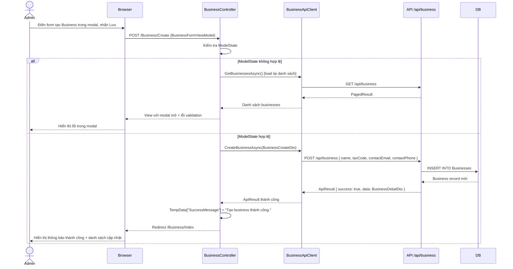
```mermaid
sequenceDiagram
    actor User as Admin
    participant Browser
    participant WebCtrl as BusinessController
    participant ApiClient as BusinessApiClient
    participant API as API /api/business
    participant DB

    User->>Browser: Điền form tạo Business trong modal, nhấn Lưu
    Browser->>WebCtrl: POST /Business/Create (BusinessFormViewModel)
    WebCtrl->>WebCtrl: Kiểm tra ModelState
    alt ModelState không hợp lệ
        WebCtrl->>ApiClient: GetBusinessesAsync() [load lại danh sách]
        ApiClient->>API: GET /api/business
        API-->>ApiClient: PagedResult
        ApiClient-->>WebCtrl: Danh sách businesses
        WebCtrl-->>Browser: View với modal mở + lỗi validation
        Browser-->>User: Hiển thị lỗi trong modal
    else ModelState hợp lệ
        WebCtrl->>ApiClient: CreateBusinessAsync(BusinessCreateDto)
        ApiClient->>API: POST /api/business { name, taxCode, contactEmail, contactPhone }
        API->>DB: INSERT INTO Businesses
        DB-->>API: Business record mới
        API-->>ApiClient: ApiResult { success: true, data: BusinessDetailDto }
        ApiClient-->>WebCtrl: ApiResult thành công
        WebCtrl->>WebCtrl: TempData["SuccessMessage"] = "Tạo business thành công."
        WebCtrl-->>Browser: Redirect /Business/Index
        Browser-->>User: Hiển thị thông báo thành công + danh sách cập nhật
    end
```

---

### SD-W05: Vô hiệu hóa Business (Deactivate)

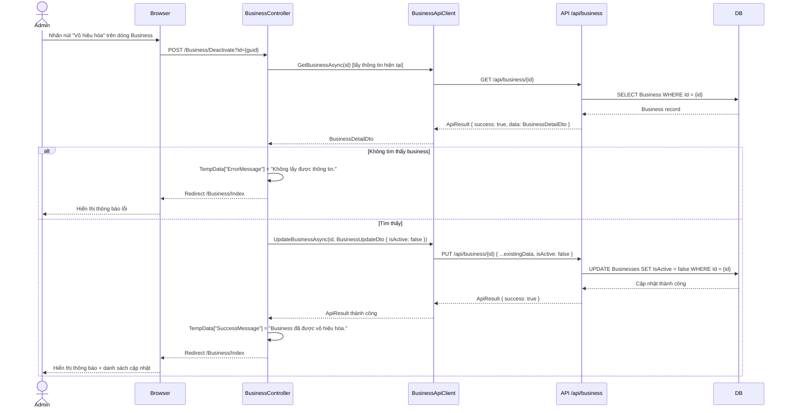
```mermaid
sequenceDiagram
    actor User as Admin
    participant Browser
    participant WebCtrl as BusinessController
    participant ApiClient as BusinessApiClient
    participant API as API /api/business
    participant DB

    User->>Browser: Nhấn nút "Vô hiệu hóa" trên dòng Business
    Browser->>WebCtrl: POST /Business/Deactivate?id={guid}
    WebCtrl->>ApiClient: GetBusinessAsync(id) [lấy thông tin hiện tại]
    ApiClient->>API: GET /api/business/{id}
    API->>DB: SELECT Business WHERE Id = {id}
    DB-->>API: Business record
    API-->>ApiClient: ApiResult { success: true, data: BusinessDetailDto }
    ApiClient-->>WebCtrl: BusinessDetailDto
    alt Không tìm thấy business
        WebCtrl->>WebCtrl: TempData["ErrorMessage"] = "Không lấy được thông tin."
        WebCtrl-->>Browser: Redirect /Business/Index
        Browser-->>User: Hiển thị thông báo lỗi
    else Tìm thấy
        WebCtrl->>ApiClient: UpdateBusinessAsync(id, BusinessUpdateDto { isActive: false })
        ApiClient->>API: PUT /api/business/{id} { ...existingData, isActive: false }
        API->>DB: UPDATE Businesses SET IsActive = false WHERE Id = {id}
        DB-->>API: Cập nhật thành công
        API-->>ApiClient: ApiResult { success: true }
        ApiClient-->>WebCtrl: ApiResult thành công
        WebCtrl->>WebCtrl: TempData["SuccessMessage"] = "Business đã được vô hiệu hóa."
        WebCtrl-->>Browser: Redirect /Business/Index
        Browser-->>User: Hiển thị thông báo + danh sách cập nhật
    end
```

---

### SD-W06: Tạo / Cập nhật Stall

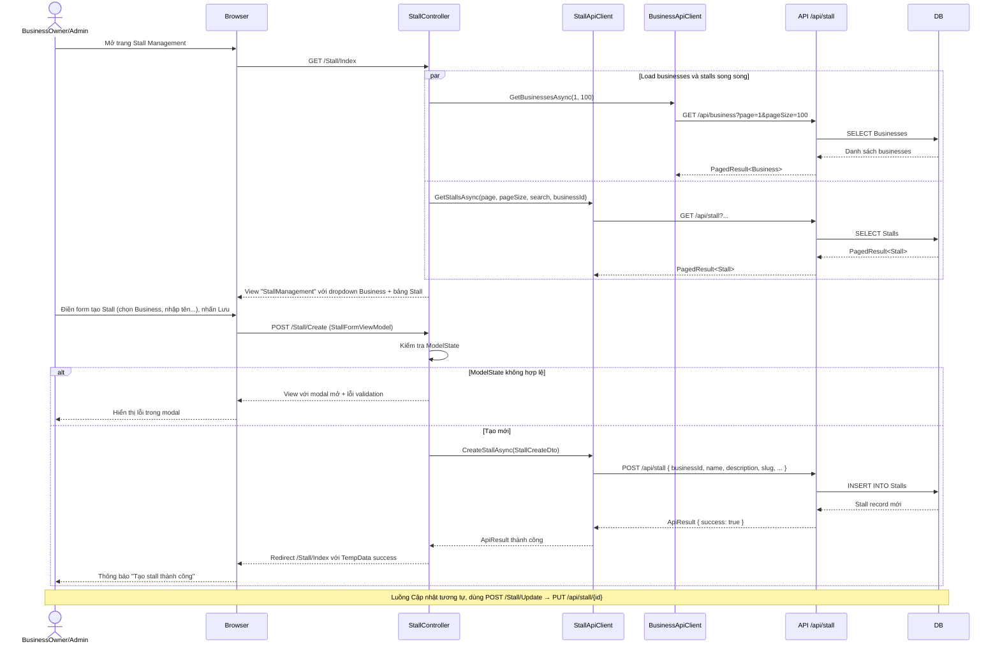
```mermaid
sequenceDiagram
    actor User as BusinessOwner/Admin
    participant Browser
    participant WebCtrl as StallController
    participant StallApi as StallApiClient
    participant BizApi as BusinessApiClient
    participant API as API /api/stall
    participant DB

    User->>Browser: Mở trang Stall Management
    Browser->>WebCtrl: GET /Stall/Index
    par Load businesses và stalls song song
        WebCtrl->>BizApi: GetBusinessesAsync(1, 100)
        BizApi->>API: GET /api/business?page=1&pageSize=100
        API->>DB: SELECT Businesses
        DB-->>API: Danh sách businesses
        API-->>BizApi: PagedResult<Business>
    and
        WebCtrl->>StallApi: GetStallsAsync(page, pageSize, search, businessId)
        StallApi->>API: GET /api/stall?...
        API->>DB: SELECT Stalls
        DB-->>API: PagedResult<Stall>
        API-->>StallApi: PagedResult<Stall>
    end
    WebCtrl-->>Browser: View "StallManagement" với dropdown Business + bảng Stall

    User->>Browser: Điền form tạo Stall (chọn Business, nhập tên...), nhấn Lưu
    Browser->>WebCtrl: POST /Stall/Create (StallFormViewModel)
    WebCtrl->>WebCtrl: Kiểm tra ModelState
    alt ModelState không hợp lệ
        WebCtrl-->>Browser: View với modal mở + lỗi validation
        Browser-->>User: Hiển thị lỗi trong modal
    else Tạo mới
        WebCtrl->>StallApi: CreateStallAsync(StallCreateDto)
        StallApi->>API: POST /api/stall { businessId, name, description, slug, ... }
        API->>DB: INSERT INTO Stalls
        DB-->>API: Stall record mới
        API-->>StallApi: ApiResult { success: true }
        StallApi-->>WebCtrl: ApiResult thành công
        WebCtrl-->>Browser: Redirect /Stall/Index với TempData success
        Browser-->>User: Thông báo "Tạo stall thành công"
    end

    Note over User,DB: Luồng Cập nhật tương tự, dùng POST /Stall/Update → PUT /api/stall/{id}
```

---

### SD-W07: Đặt vị trí Stall trên bản đồ (StallLocation + StallGeoFence)

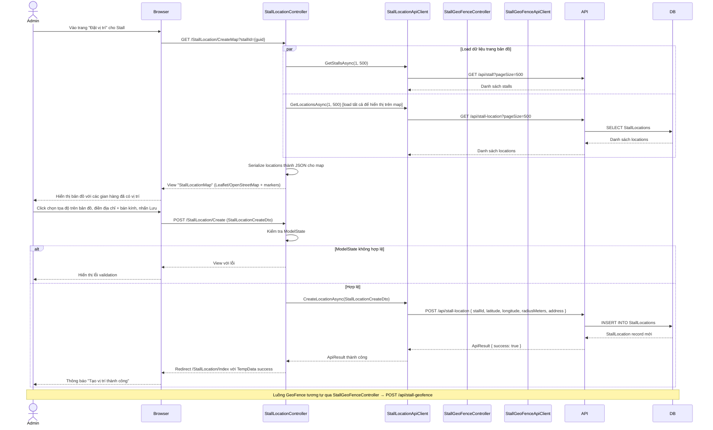
```mermaid
sequenceDiagram
    actor User as Admin
    participant Browser
    participant WebCtrl as StallLocationController
    participant LocApi as StallLocationApiClient
    participant GeoCtrl as StallGeoFenceController
    participant GeoApi as StallGeoFenceApiClient
    participant API as API
    participant DB

    User->>Browser: Vào trang "Đặt vị trí" cho Stall
    Browser->>WebCtrl: GET /StallLocation/CreateMap?stallId={guid}
    par Load dữ liệu trang bản đồ
        WebCtrl->>LocApi: GetStallsAsync(1, 500)
        LocApi->>API: GET /api/stall?pageSize=500
        API-->>LocApi: Danh sách stalls
    and
        WebCtrl->>LocApi: GetLocationsAsync(1, 500) [load tất cả để hiển thị trên map]
        LocApi->>API: GET /api/stall-location?pageSize=500
        API->>DB: SELECT StallLocations
        DB-->>API: Danh sách locations
        API-->>LocApi: Danh sách locations
    end
    WebCtrl->>WebCtrl: Serialize locations thành JSON cho map
    WebCtrl-->>Browser: View "StallLocationMap" (Leaflet/OpenStreetMap + markers)
    Browser-->>User: Hiển thị bản đồ với các gian hàng đã có vị trí

    User->>Browser: Click chọn tọa độ trên bản đồ, điền địa chỉ + bán kính, nhấn Lưu
    Browser->>WebCtrl: POST /StallLocation/Create (StallLocationCreateDto)
    WebCtrl->>WebCtrl: Kiểm tra ModelState
    alt ModelState không hợp lệ
        WebCtrl-->>Browser: View với lỗi
        Browser-->>User: Hiển thị lỗi validation
    else Hợp lệ
        WebCtrl->>LocApi: CreateLocationAsync(StallLocationCreateDto)
        LocApi->>API: POST /api/stall-location { stallId, latitude, longitude, radiusMeters, address }
        API->>DB: INSERT INTO StallLocations
        DB-->>API: StallLocation record mới
        API-->>LocApi: ApiResult { success: true }
        LocApi-->>WebCtrl: ApiResult thành công
        WebCtrl-->>Browser: Redirect /StallLocation/Index với TempData success
        Browser-->>User: Thông báo "Tạo vị trí thành công"
    end

    Note over User,DB: Luồng GeoFence tương tự qua StallGeoFenceController → POST /api/stall-geofence
```

---

### SD-W08: Tạo & cập nhật StallNarrationContent

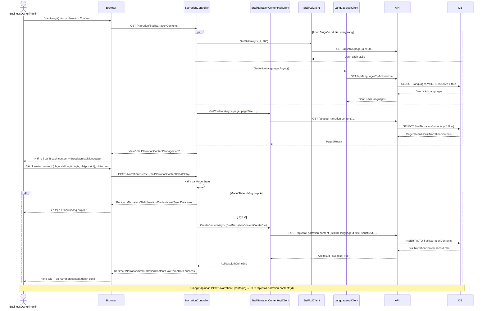
```mermaid
sequenceDiagram
    actor User as BusinessOwner/Admin
    participant Browser
    participant WebCtrl as NarrationController
    participant ContentApi as StallNarrationContentApiClient
    participant StallApi as StallApiClient
    participant LangApi as LanguageApiClient
    participant API as API
    participant DB

    User->>Browser: Vào trang Quản lý Narration Content
    Browser->>WebCtrl: GET /Narration/StallNarrationContents
    par Load 3 nguồn dữ liệu song song
        WebCtrl->>StallApi: GetStallsAsync(1, 200)
        StallApi->>API: GET /api/stall?pageSize=200
        API-->>StallApi: Danh sách stalls
    and
        WebCtrl->>LangApi: GetActiveLanguagesAsync()
        LangApi->>API: GET /api/languages?isActive=true
        API->>DB: SELECT Languages WHERE IsActive = true
        DB-->>API: Danh sách languages
        API-->>LangApi: Danh sách languages
    and
        WebCtrl->>ContentApi: GetContentsAsync(page, pageSize, ...)
        ContentApi->>API: GET /api/stall-narration-content?...
        API->>DB: SELECT StallNarrationContents (có filter)
        DB-->>API: PagedResult<StallNarrationContent>
        API-->>ContentApi: PagedResult
    end
    WebCtrl-->>Browser: View "StallNarrationContentManagement"
    Browser-->>User: Hiển thị danh sách content + dropdown stall/language

    User->>Browser: Điền form tạo content (chọn stall, ngôn ngữ, nhập script), nhấn Lưu
    Browser->>WebCtrl: POST /Narration/Create (StallNarrationContentCreateDto)
    WebCtrl->>WebCtrl: Kiểm tra ModelState
    alt ModelState không hợp lệ
        WebCtrl-->>Browser: Redirect /Narration/StallNarrationContents với TempData error
        Browser-->>User: Hiển thị "Dữ liệu không hợp lệ"
    else Hợp lệ
        WebCtrl->>ContentApi: CreateContentAsync(StallNarrationContentCreateDto)
        ContentApi->>API: POST /api/stall-narration-content { stallId, languageId, title, scriptText, ... }
        API->>DB: INSERT INTO StallNarrationContents
        DB-->>API: StallNarrationContent record mới
        API-->>ContentApi: ApiResult { success: true }
        ContentApi-->>WebCtrl: ApiResult thành công
        WebCtrl-->>Browser: Redirect /Narration/StallNarrationContents với TempData success
        Browser-->>User: Thông báo "Tạo narration content thành công"
    end

    Note over User,DB: Luồng Cập nhật: POST /Narration/Update/{id} → PUT /api/stall-narration-content/{id}
```

---

### SD-W09: Xem chi tiết Narration Content (Show + Audio list)

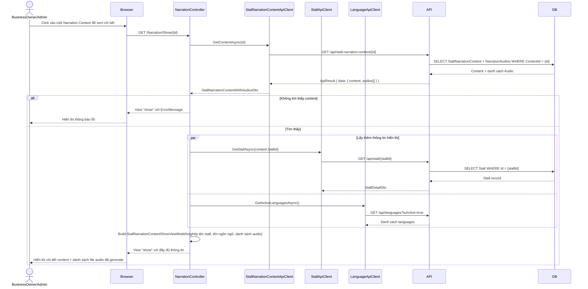
```mermaid
sequenceDiagram
    actor User as BusinessOwner/Admin
    participant Browser
    participant WebCtrl as NarrationController
    participant ContentApi as StallNarrationContentApiClient
    participant StallApi as StallApiClient
    participant LangApi as LanguageApiClient
    participant API as API
    participant DB

    User->>Browser: Click vào một Narration Content để xem chi tiết
    Browser->>WebCtrl: GET /Narration/Show/{id}
    WebCtrl->>ContentApi: GetContentAsync(id)
    ContentApi->>API: GET /api/stall-narration-content/{id}
    API->>DB: SELECT StallNarrationContent + NarrationAudios WHERE ContentId = {id}
    DB-->>API: Content + danh sách Audio
    API-->>ContentApi: ApiResult { data: { content, audios[] } }
    ContentApi-->>WebCtrl: StallNarrationContentWithAudiosDto

    alt Không tìm thấy content
        WebCtrl-->>Browser: View "show" với ErrorMessage
        Browser-->>User: Hiển thị thông báo lỗi
    else Tìm thấy
        par Lấy thêm thông tin hiển thị
            WebCtrl->>StallApi: GetStallAsync(content.StallId)
            StallApi->>API: GET /api/stall/{stallId}
            API->>DB: SELECT Stall WHERE Id = {stallId}
            DB-->>API: Stall record
            API-->>StallApi: StallDetailDto
        and
            WebCtrl->>LangApi: GetActiveLanguagesAsync()
            LangApi->>API: GET /api/languages?isActive=true
            API-->>LangApi: Danh sách languages
        end
        WebCtrl->>WebCtrl: Build StallNarrationContentShowViewModel\n(ghép tên stall, tên ngôn ngữ, danh sách audio)
        WebCtrl-->>Browser: View "show" với đầy đủ thông tin
        Browser-->>User: Hiển thị chi tiết content + danh sách file audio đã generate
    end
```

---

### SD-W10: Load Admin Dashboard

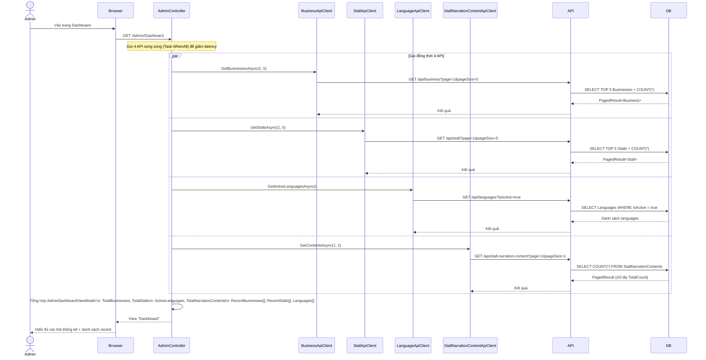
```mermaid
sequenceDiagram
    actor User as Admin
    participant Browser
    participant WebCtrl as AdminController
    participant BizApi as BusinessApiClient
    participant StallApi as StallApiClient
    participant LangApi as LanguageApiClient
    participant ContentApi as StallNarrationContentApiClient
    participant API as API
    participant DB

    User->>Browser: Vào trang Dashboard
    Browser->>WebCtrl: GET /Admin/Dashboard
    Note over WebCtrl: Gọi 4 API song song (Task.WhenAll) để giảm latency

    par Gọi đồng thời 4 API
        WebCtrl->>BizApi: GetBusinessesAsync(1, 5)
        BizApi->>API: GET /api/business?page=1&pageSize=5
        API->>DB: SELECT TOP 5 Businesses + COUNT(*)
        DB-->>API: PagedResult<Business>
        API-->>BizApi: Kết quả
    and
        WebCtrl->>StallApi: GetStallsAsync(1, 5)
        StallApi->>API: GET /api/stall?page=1&pageSize=5
        API->>DB: SELECT TOP 5 Stalls + COUNT(*)
        DB-->>API: PagedResult<Stall>
        API-->>StallApi: Kết quả
    and
        WebCtrl->>LangApi: GetActiveLanguagesAsync()
        LangApi->>API: GET /api/languages?isActive=true
        API->>DB: SELECT Languages WHERE IsActive = true
        DB-->>API: Danh sách languages
        API-->>LangApi: Kết quả
    and
        WebCtrl->>ContentApi: GetContentsAsync(1, 1)
        ContentApi->>API: GET /api/stall-narration-content?page=1&pageSize=1
        API->>DB: SELECT COUNT(*) FROM StallNarrationContents
        DB-->>API: PagedResult (chỉ lấy TotalCount)
        API-->>ContentApi: Kết quả
    end

    WebCtrl->>WebCtrl: Tổng hợp AdminDashboardViewModel:\n- TotalBusinesses, TotalStalls\n- ActiveLanguages, TotalNarrationContents\n- RecentBusinesses[], RecentStalls[], Languages[]
    WebCtrl-->>Browser: View "Dashboard"
    Browser-->>User: Hiển thị các thẻ thống kê + danh sách recent
```

---

## 20. Activity Diagrams – Web Admin

> Dùng Mermaid `flowchart TD`. Ký hiệu: hình thoi `{}` = decision, hình chữ nhật bo góc `([])` = start/end, hình chữ nhật `[]` = activity, hình thoi kép `{{}}` = fork/join.

| Mã | Tên |
|----|-----|
| [AD-W01](#ad-w01-đăng-nhập) | Đăng nhập |
| [AD-W02](#ad-w02-đăng-ký-businessowner) | Đăng ký BusinessOwner |
| [AD-W03](#ad-w03-tạo--cập-nhật-business) | Tạo / Cập nhật Business |
| [AD-W04](#ad-w04-vô-hiệu-hóa-business) | Vô hiệu hóa Business |
| [AD-W05](#ad-w05-tạo--cập-nhật--vô-hiệu-hóa-stall) | Tạo / Cập nhật / Vô hiệu hóa Stall |
| [AD-W06](#ad-w06-đặt-vị-trí-stall-trên-bản-đồ) | Đặt vị trí Stall trên bản đồ |
| [AD-W07](#ad-w07-upload--cập-nhật--xóa-media-stall) | Upload / Cập nhật / Xóa Media Stall |
| [AD-W08](#ad-w08-tạo--cập-nhật-geofence) | Tạo / Cập nhật GeoFence |
| [AD-W09](#ad-w09-tạo--cập-nhật--toggle-narration-content) | Tạo / Cập nhật / Toggle Narration Content |
| [AD-W10](#ad-w10-xem-chi-tiết-narration-content--cập-nhật-script) | Xem chi tiết Narration Content + Cập nhật script |

---

### AD-W01: Đăng nhập

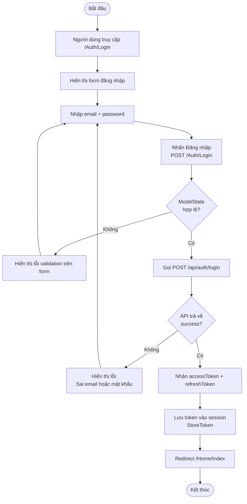
```mermaid
flowchart TD
    A([Bắt đầu]) --> B[Người dùng truy cập /Auth/Login]
    B --> C[Hiển thị form đăng nhập]
    C --> D[Nhập email + password]
    D --> E[Nhấn Đăng nhập\nPOST /Auth/Login]
    E --> F{ModelState\nhợp lệ?}
    F -- Không --> G[Hiển thị lỗi validation trên form]
    G --> D
    F -- Có --> H[Gọi POST /api/auth/login]
    H --> I{API trả về\nsuccess?}
    I -- Không --> J[Hiển thị lỗi:\nSai email hoặc mật khẩu]
    J --> D
    I -- Có --> K[Nhận accessToken + refreshToken]
    K --> L[Lưu token vào session\nStoreToken]
    L --> M[Redirect /Home/Index]
    M --> N([Kết thúc])
```

---

### AD-W02: Đăng ký BusinessOwner

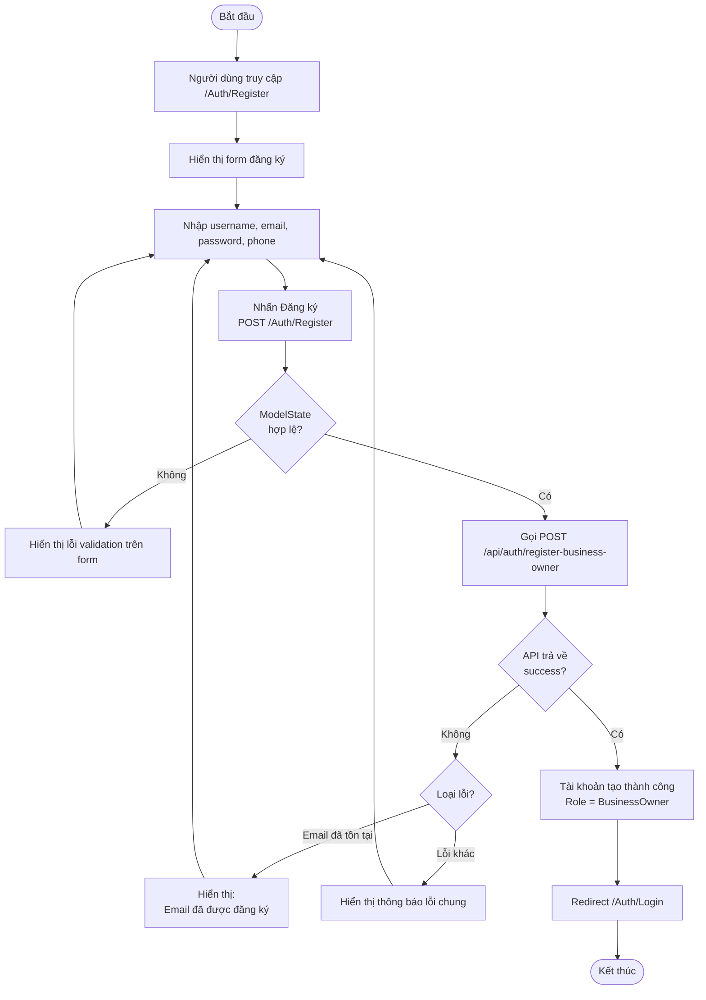
```mermaid
flowchart TD
    A([Bắt đầu]) --> B[Người dùng truy cập /Auth/Register]
    B --> C[Hiển thị form đăng ký]
    C --> D[Nhập username, email, password, phone]
    D --> E[Nhấn Đăng ký\nPOST /Auth/Register]
    E --> F{ModelState\nhợp lệ?}
    F -- Không --> G[Hiển thị lỗi validation trên form]
    G --> D
    F -- Có --> H[Gọi POST /api/auth/register-business-owner]
    H --> I{API trả về\nsuccess?}
    I -- Không --> J{Loại lỗi?}
    J -- Email đã tồn tại --> K[Hiển thị:\nEmail đã được đăng ký]
    J -- Lỗi khác --> L[Hiển thị thông báo lỗi chung]
    K --> D
    L --> D
    I -- Có --> M[Tài khoản tạo thành công\nRole = BusinessOwner]
    M --> N[Redirect /Auth/Login]
    N --> O([Kết thúc])
```

---

### AD-W03: Tạo / Cập nhật Business

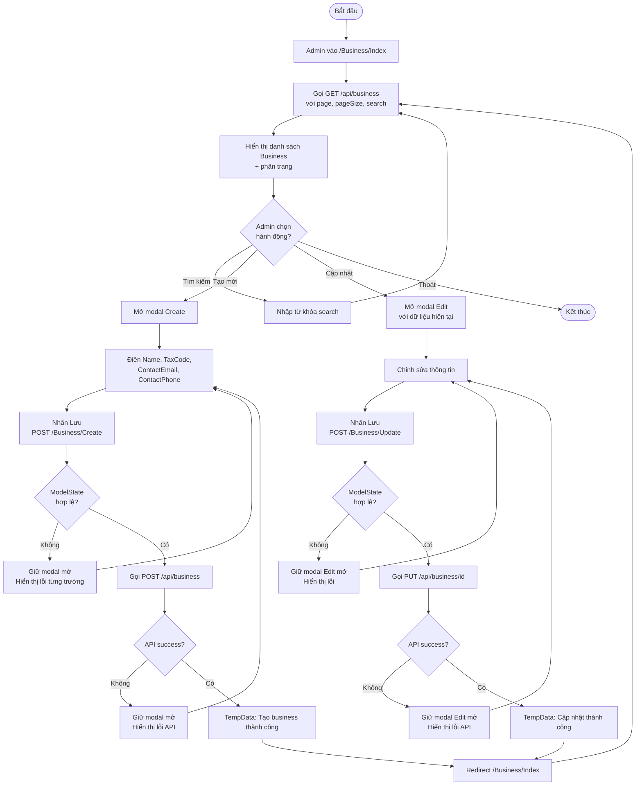
```mermaid
flowchart TD
    A([Bắt đầu]) --> B[Admin vào /Business/Index]
    B --> C[Gọi GET /api/business\nvới page, pageSize, search]
    C --> D[Hiển thị danh sách Business\n+ phân trang]
    D --> E{Admin chọn\nhành động?}

    E -- Tìm kiếm --> F[Nhập từ khóa search]
    F --> C

    E -- Tạo mới --> G[Mở modal Create]
    G --> H[Điền Name, TaxCode,\nContactEmail, ContactPhone]
    H --> I[Nhấn Lưu\nPOST /Business/Create]
    I --> J{ModelState\nhợp lệ?}
    J -- Không --> K[Giữ modal mở\nHiển thị lỗi từng trường]
    K --> H
    J -- Có --> L[Gọi POST /api/business]
    L --> M{API success?}
    M -- Không --> N[Giữ modal mở\nHiển thị lỗi API]
    N --> H
    M -- Có --> O[TempData: Tạo business thành công]
    O --> P[Redirect /Business/Index]
    P --> C

    E -- Cập nhật --> Q[Mở modal Edit\nvới dữ liệu hiện tại]
    Q --> R[Chỉnh sửa thông tin]
    R --> S[Nhấn Lưu\nPOST /Business/Update]
    S --> T{ModelState\nhợp lệ?}
    T -- Không --> U[Giữ modal Edit mở\nHiển thị lỗi]
    U --> R
    T -- Có --> V[Gọi PUT /api/business/id]
    V --> W{API success?}
    W -- Không --> X[Giữ modal Edit mở\nHiển thị lỗi API]
    X --> R
    W -- Có --> Y[TempData: Cập nhật thành công]
    Y --> P

    E -- Thoát --> Z([Kết thúc])
```

---

### AD-W04: Vô hiệu hóa Business

```mermaid
flowchart TD
    A([Bắt đầu]) --> B[Admin nhấn Vô hiệu hóa\ntrên dòng Business]
    B --> C[POST /Business/Deactivate?id=guid]
    C --> D[Gọi GET /api/business/id\nlấy thông tin hiện tại]
    D --> E{Tìm thấy\nBusiness?}
    E -- Không --> F[TempData: Không lấy được thông tin]
    F --> G[Redirect /Business/Index]
    G --> H([Kết thúc])
    E -- Có --> I[Giữ nguyên Name, TaxCode,\nContactEmail, ContactPhone\nĐổi IsActive = false]
    I --> J[Gọi PUT /api/business/id\nvới IsActive = false]
    J --> K{API success?}
    K -- Không --> L[TempData: Không thể vô hiệu hóa]
    L --> G
    K -- Có --> M[TempData: Business đã được vô hiệu hóa]
    M --> G
```

---

### AD-W05: Tạo / Cập nhật / Vô hiệu hóa Stall

```mermaid
flowchart TD
    A([Bắt đầu]) --> B[Người dùng vào /Stall/Index]

    B --> C1[Gọi GET /api/business\npageSize=100]
    B --> C2[Gọi GET /api/stall\npage, pageSize, search, businessId]
    C1 --> D[Chờ cả hai hoàn thành]
    C2 --> D
    D --> E[Hiển thị bảng Stall\n+ dropdown Business]

    E --> F{Chọn hành động?}

    F -- Lọc/Tìm kiếm --> G[Chọn Business hoặc nhập search]
    G --> C2

    F -- Tạo mới --> H[Mở modal Create\ncó dropdown Business]
    H --> I[Điền BusinessId, Name,\nDescription, Slug, Contact]
    I --> J[POST /Stall/Create]
    J --> K{ModelState OK?}
    K -- Không --> L[Giữ modal mở + lỗi]
    L --> I
    K -- Có --> M[POST /api/stall]
    M --> N{API success?}
    N -- Không --> O[Giữ modal mở + lỗi API]
    O --> I
    N -- Có --> P[Redirect + thông báo thành công]
    P --> B

    F -- Cập nhật --> Q[Mở modal Edit]
    Q --> R[Chỉnh sửa thông tin]
    R --> S[POST /Stall/Update]
    S --> T{ModelState OK?}
    T -- Không --> U[Giữ modal Edit + lỗi]
    U --> R
    T -- Có --> V[PUT /api/stall/id]
    V --> W{API success?}
    W -- Không --> X[Giữ modal Edit + lỗi API]
    X --> R
    W -- Có --> P

    F -- Vô hiệu hóa --> Y[POST /Stall/Deactivate]
    Y --> Z[GET /api/stall/id]
    Z --> AA{Tìm thấy?}
    AA -- Không --> AB[TempData error → Redirect]
    AB --> B
    AA -- Có --> AC[PUT /api/stall/id\nIsActive = false]
    AC --> AD{API success?}
    AD -- Không --> AE[TempData error → Redirect]
    AE --> B
    AD -- Có --> AF[TempData success → Redirect]
    AF --> B

    F -- Thoát --> AG([Kết thúc])
```

---

### AD-W06: Đặt vị trí Stall trên bản đồ

```mermaid
flowchart TD
    A([Bắt đầu]) --> B{Tạo mới hay\nchỉnh sửa?}

    B -- Tạo mới --> C[GET /StallLocation/CreateMap]
    B -- Chỉnh sửa --> D[GET /StallLocation/EditMap/id]

    C --> E1[Gọi GET /api/stall\npageSize=500]
    C --> E2[Gọi GET /api/stall-location\npageSize=500 để load markers]
    D --> F[Gọi GET /api/stall-location/id\nlấy dữ liệu vị trí hiện tại]
    F --> E1
    F --> E2

    E1 --> G[Chờ cả hai hoàn thành]
    E2 --> G
    G --> H[Hiển thị bản đồ OpenStreetMap\nvới tất cả markers hiện có]

    H --> I{Đang ở\nmode nào?}
    I -- Create --> J[Admin chọn Stall từ dropdown]
    I -- Edit --> K[Hiển thị marker tại tọa độ cũ]

    J --> L[Click vị trí trên bản đồ\nlấy lat/lng]
    K --> L

    L --> M[Nhập địa chỉ + bán kính]
    M --> N[Nhấn Lưu]
    N --> O{ModelState OK?}
    O -- Không --> P[Hiển thị lỗi trên trang map]
    P --> L

    O -- Có --> Q{Tạo mới hay\nCập nhật?}
    Q -- Tạo --> R[POST /api/stall-location]
    Q -- Cập nhật --> S[PUT /api/stall-location/id]

    R --> T{API success?}
    S --> T

    T -- Không --> U[Hiển thị lỗi API trên trang map]
    U --> L
    T -- Có --> V[TempData success]
    V --> W[Redirect /StallLocation/Index]
    W --> X([Kết thúc])
```

---

### AD-W07: Upload / Cập nhật / Xóa Media Stall

```mermaid
flowchart TD
    A([Bắt đầu]) --> B[Người dùng vào /StallMedia/Index]
    B --> C1[Gọi GET /api/stall\npageSize=500]
    B --> C2[Gọi GET /api/stall-media\npage, pageSize, stallId, isActive]
    C1 --> D[Chờ cả hai hoàn thành]
    C2 --> D
    D --> E[Hiển thị gallery ảnh\n+ dropdown Stall]

    E --> F{Chọn hành động?}

    F -- Upload mới --> G[Mở modal Create]
    G --> H[Chọn Stall, chọn file ảnh,\nnhập caption, sort order]
    H --> I{File ảnh\nđã chọn?}
    I -- Không --> J[Lỗi: Vui lòng chọn ảnh\nGiữ modal mở]
    J --> H
    I -- Có --> K{ModelState OK?}
    K -- Không --> L[Giữ modal mở + lỗi]
    L --> H
    K -- Có --> M[POST /api/stall-media/upload\nmultipart/form-data]
    M --> N[API upload file\nlên Azure Blob]
    N --> O{Upload\nthành công?}
    O -- Không --> P[Giữ modal mở + lỗi upload]
    P --> H
    O -- Có --> Q[Lưu URL vào DB\nTạo StallMedia record]
    Q --> R[Redirect + thông báo thành công]
    R --> B

    F -- Cập nhật ảnh --> S[Mở modal Edit\nvới caption/order hiện tại]
    S --> T[Chọn file ảnh mới]
    T --> U{File mới\nđã chọn?}
    U -- Không --> V[Lỗi: Vui lòng chọn ảnh mới]
    V --> T
    U -- Có --> W[PUT /api/stall-media/id/upload]
    W --> X{API success?}
    X -- Không --> Y[Giữ modal Edit + lỗi]
    Y --> T
    X -- Có --> R

    F -- Xóa --> Z[POST /StallMedia/Delete?id=guid]
    Z --> AA[DELETE /api/stall-media/id]
    AA --> AB{API success?}
    AB -- Không --> AC[TempData error → Redirect]
    AC --> B
    AB -- Có --> AD[TempData success → Redirect]
    AD --> B

    F -- Lọc --> AE[Chọn Stall hoặc trạng thái]
    AE --> C2

    F -- Thoát --> AF([Kết thúc])
```

---

### AD-W08: Tạo / Cập nhật GeoFence

```mermaid
flowchart TD
    A([Bắt đầu]) --> B[Admin vào /StallGeoFence/Index]
    B --> C1[Gọi GET /api/stall\npageSize=500]
    B --> C2[Gọi GET /api/stall-geofence\npage, pageSize, stallId]
    C1 --> D[Chờ cả hai hoàn thành]
    C2 --> D
    D --> E[Hiển thị danh sách GeoFence\n+ dropdown Stall]

    E --> F{Chọn hành động?}

    F -- Lọc theo Stall --> G[Chọn Stall từ dropdown]
    G --> C2

    F -- Tạo mới --> H[Mở form tạo GeoFence]
    H --> I[Chọn Stall,\nnhập tọa độ / bán kính]
    I --> J[POST /StallGeoFence/Create]
    J --> K{ModelState OK?}
    K -- Không --> L[TempData error\nRedirect /StallGeoFence/Index]
    L --> B
    K -- Có --> M[POST /api/stall-geofence]
    M --> N{API success?}
    N -- Không --> O[TempData error\nRedirect /StallGeoFence/Index]
    O --> B
    N -- Có --> P[TempData: Tạo geofence thành công\nRedirect /StallGeoFence/Index]
    P --> B

    F -- Cập nhật --> Q[Mở form Edit\nvới dữ liệu hiện tại]
    Q --> R[Chỉnh sửa tọa độ / bán kính]
    R --> S[POST /StallGeoFence/Update/id]
    S --> T{ModelState OK?}
    T -- Không --> U[TempData error\nRedirect]
    U --> B
    T -- Có --> V[PUT /api/stall-geofence/id]
    V --> W{API success?}
    W -- Không --> X[TempData error\nRedirect]
    X --> B
    W -- Có --> Y[TempData: Cập nhật thành công\nRedirect]
    Y --> B

    F -- Thoát --> Z([Kết thúc])
```

---

### AD-W09: Tạo / Cập nhật / Toggle Narration Content

```mermaid
flowchart TD
    A([Bắt đầu]) --> B[Vào /Narration/StallNarrationContents]
    B --> C1[Gọi GET /api/stall\npageSize=200]
    B --> C2[Gọi GET /api/languages\nisActive=true]
    B --> C3[Gọi GET /api/stall-narration-content\nvới bộ lọc hiện tại]
    C1 --> D[Chờ cả ba hoàn thành]
    C2 --> D
    C3 --> D
    D --> E[Hiển thị danh sách Content\n+ dropdown lọc Stall/Language/Status]

    E --> F{Chọn hành động?}

    F -- Lọc --> G[Chọn stall / language / isActive]
    G --> C3

    F -- Tạo mới --> H[Mở form tạo]
    H --> I[Chọn Stall, Language\nNhập Title, Description, ScriptText]
    I --> J[POST /Narration/Create]
    J --> K{ModelState OK?}
    K -- Không --> L[TempData error\nRedirect về danh sách]
    L --> B
    K -- Có --> M[POST /api/stall-narration-content]
    M --> N{API success?}
    N -- Không --> O[TempData error\nRedirect về danh sách]
    O --> B
    N -- Có --> P[TempData: Tạo thành công\nRedirect về danh sách]
    P --> B

    F -- Toggle trạng thái --> Q[POST /Narration/ToggleStatus\n?id=guid&isActive=bool]
    Q --> R[Gọi API toggle status]
    R --> S{API success?}
    S -- Không --> T[TempData error\nRedirect về danh sách]
    T --> B
    S -- Có --> U[TempData: Đổi trạng thái thành công\nRedirect về danh sách]
    U --> B

    F -- Xem chi tiết --> V[Chuyển sang AD-W10]

    F -- Thoát --> W([Kết thúc])
```

---

### AD-W10: Xem chi tiết Narration Content + Cập nhật script

```mermaid
flowchart TD
    A([Bắt đầu]) --> B[Vào /Narration/Show/id]
    B --> C[Gọi GET /api/stall-narration-content/id\nlấy content + danh sách audios]
    C --> D{Tìm thấy\ncontent?}
    D -- Không --> E[Hiển thị trang lỗi:\nKhông tìm thấy nội dung]
    E --> F([Kết thúc])

    D -- Có --> G1[Gọi GET /api/stall/stallId\nlấy tên Stall]
    D -- Có --> G2[Gọi GET /api/languages\nlấy tên Language]
    G1 --> H[Chờ cả hai hoàn thành]
    G2 --> H
    H --> I[Hiển thị trang detail:\nScript text, tên Stall/Language\nDanh sách NarrationAudio với nút phát thử]

    I --> J{Người dùng\nchọn hành động?}

    J -- Chỉnh sửa script --> K[Sửa Title, Description,\nScriptText, IsActive trên form]
    K --> L[POST /Narration/Update/id]
    L --> M{ModelState OK?}
    M -- Không --> N[Hiển thị lại trang detail\nvới dữ liệu đã nhập + lỗi validation]
    N --> K
    M -- Có --> O[PUT /api/stall-narration-content/id]
    O --> P{API success?}
    P -- Không --> Q[Hiển thị lại trang detail\nvới thông báo lỗi API]
    Q --> K
    P -- Có --> R[TempData: Cập nhật thành công]
    R --> S[Redirect /Narration/Show/id]
    S --> B

    J -- Quay lại danh sách --> T[Redirect /Narration/StallNarrationContents]
    T --> U([Kết thúc])
```
