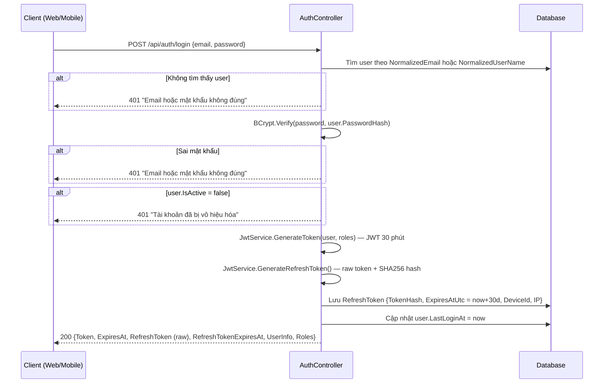
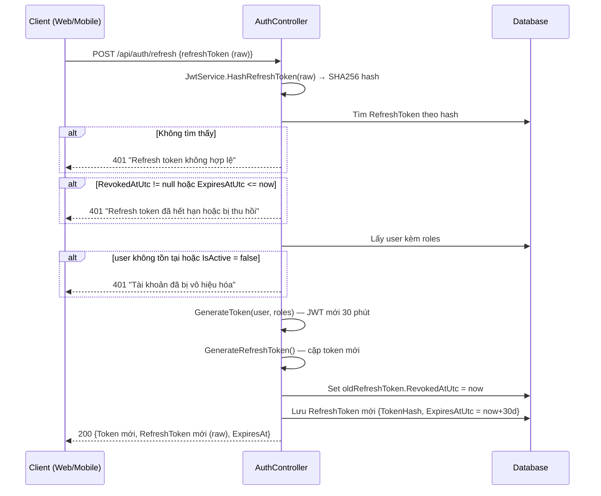
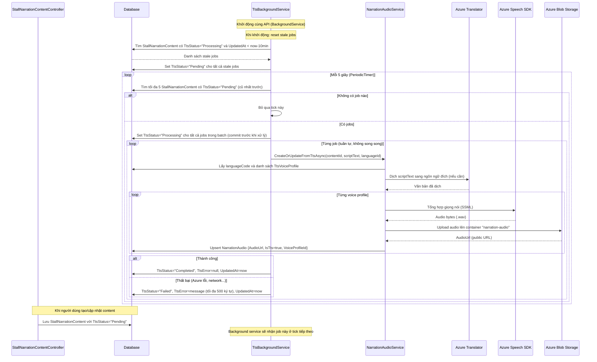
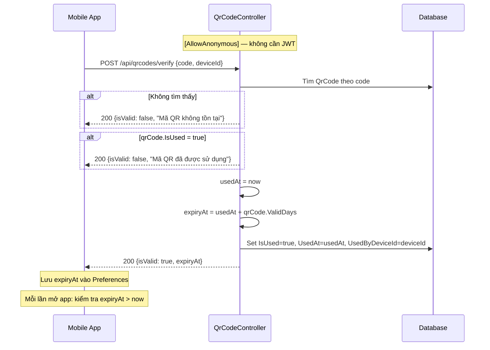
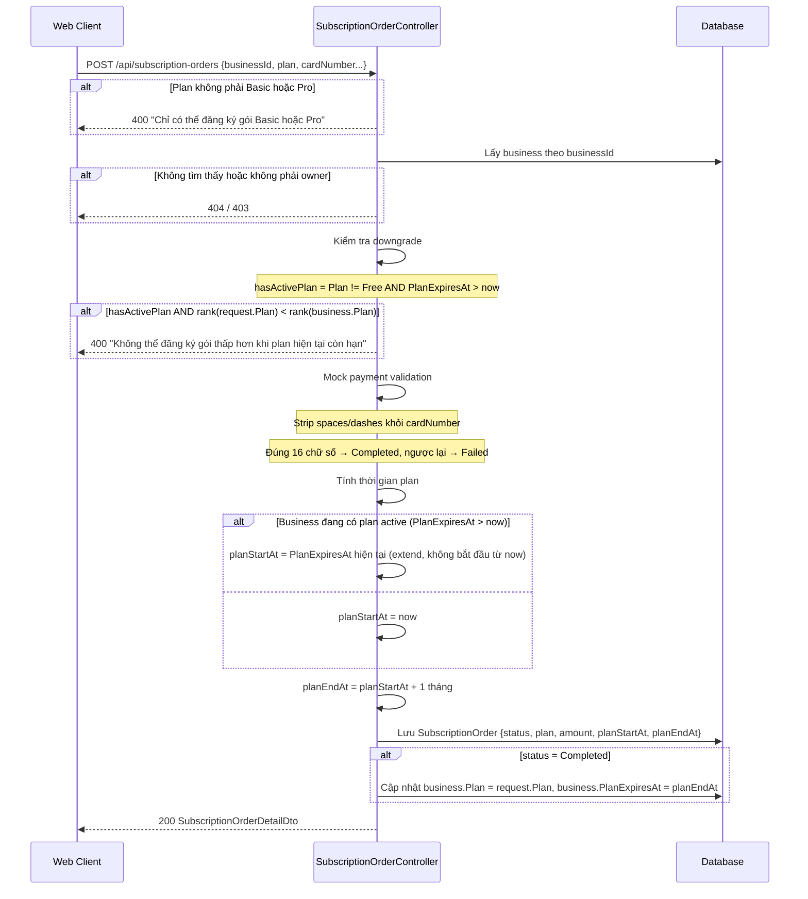
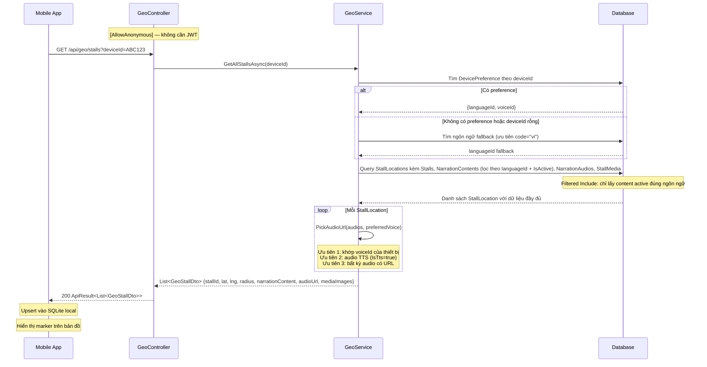

> Các sequence diagram mô tả những luồng API phức tạp hoặc có business rule đặc thù — không bao gồm CRUD thông thường. Ký hiệu: **CLIENT** = Web MVC hoặc Mobile MAUI, **CTR** = API Controller, **SVC** = Application Service, **DB** = SQL Server qua EF Core, **EXT** = External Service (Azure).

| Mã | Tên |
|----|-----|
| [SD-A01](#sd-a01-đăng-nhập--phát-hành-token) | Đăng nhập & Phát hành Token |
| [SD-A02](#sd-a02-refresh-token) | Refresh Token |
| [SD-A03](#sd-a03-tts-background-service) | TTS Background Service |
| [SD-A04](#sd-a04-xác-thực-mã-qr-mobile) | Xác thực Mã QR (Mobile) |
| [SD-A05](#sd-a05-thanh-toán--kích-hoạt-plan) | Thanh toán & Kích hoạt Plan |
| [SD-A06](#sd-a06-lấy-danh-sách-gian-hàng-geo) | Lấy danh sách Gian hàng (Geo) |

---

### SD-A01: Đăng nhập & Phát hành Token

---

### SD-A02: Refresh Token

---

### SD-A03: TTS Background Service

---

### SD-A04: Xác thực Mã QR (Mobile)

---

### SD-A05: Thanh toán & Kích hoạt Plan

---

### SD-A06: Lấy danh sách Gian hàng (Geo)

