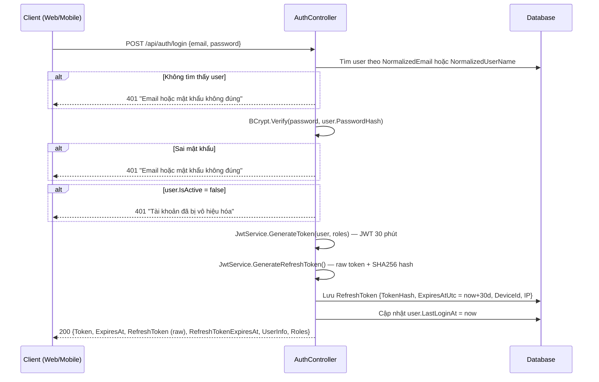
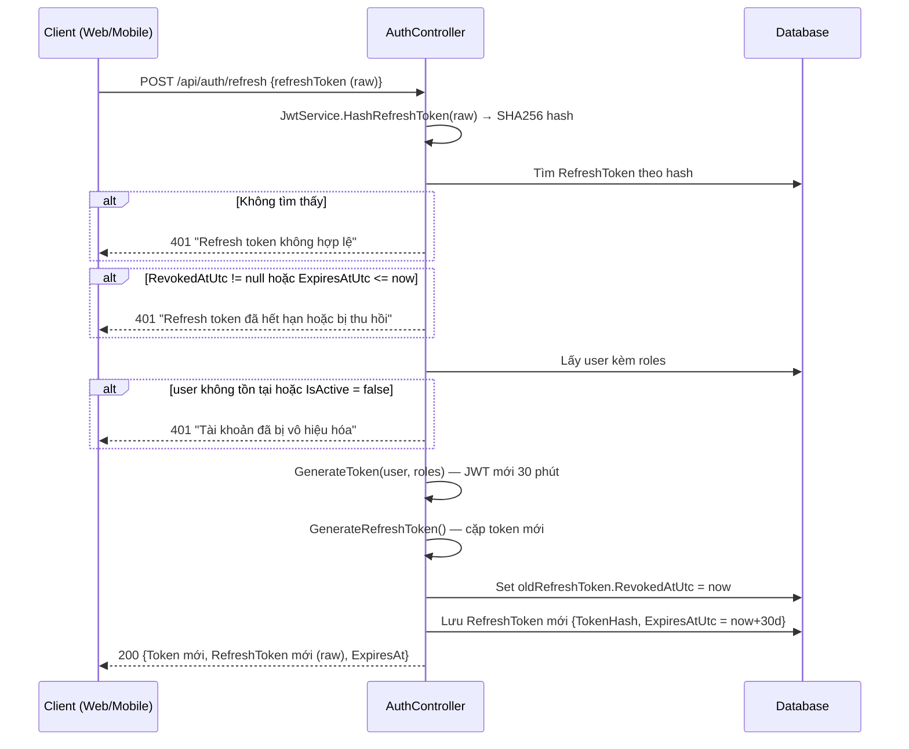
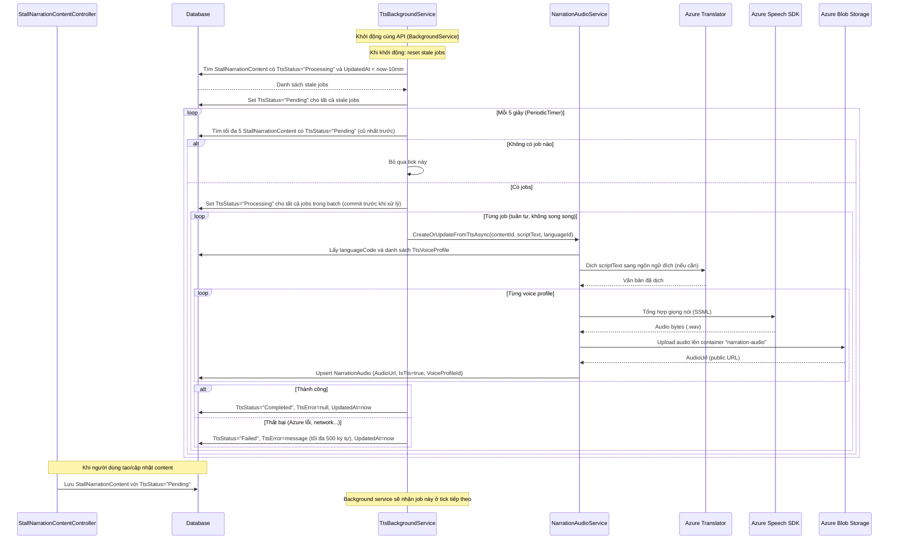
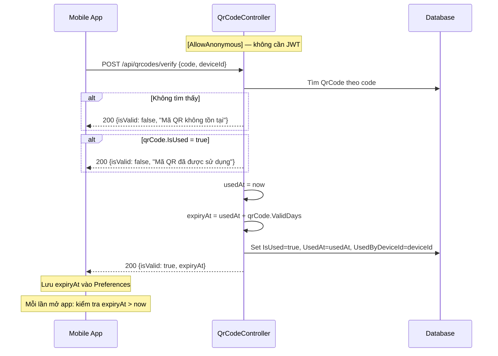
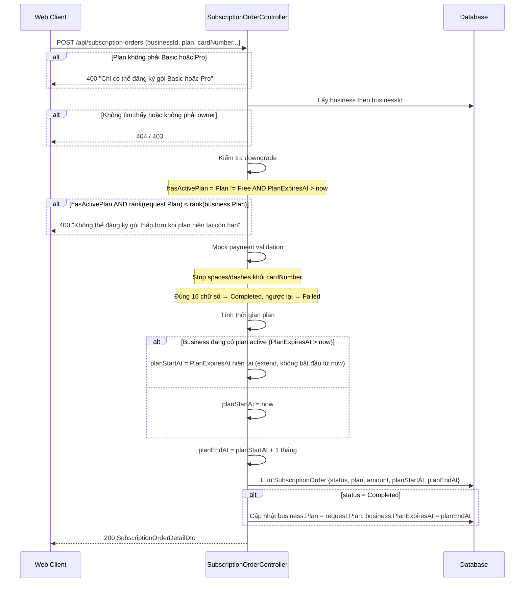
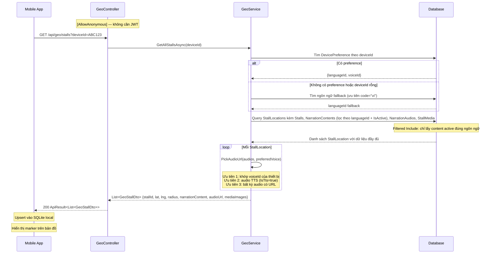
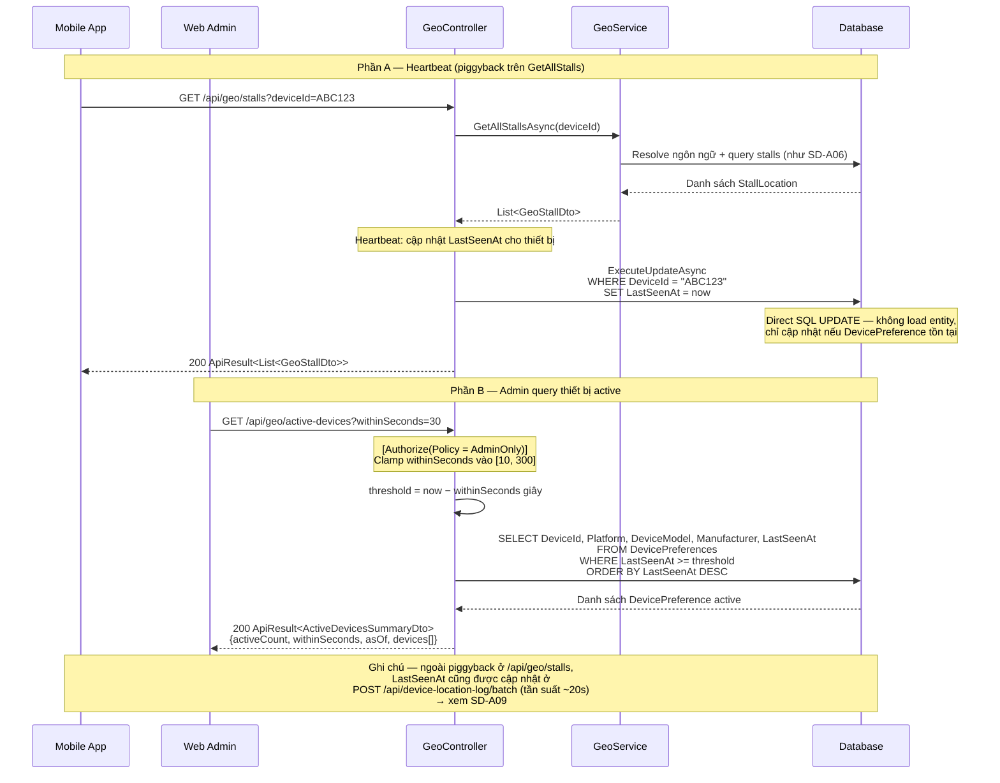
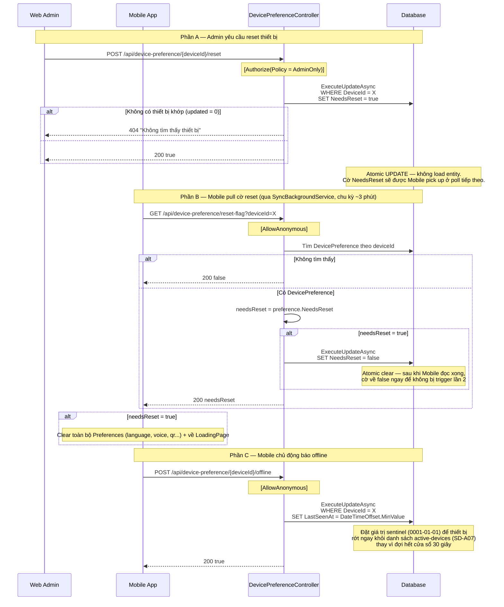

> Các sequence diagram mô tả những luồng API phức tạp hoặc có business rule đặc thù — không bao gồm CRUD thông thường. Ký hiệu: **CLIENT** = Web MVC hoặc Mobile MAUI, **CTR** = API Controller, **SVC** = Application Service, **DB** = SQL Server qua EF Core, **EXT** = External Service (Azure).

| Mã | Tên |
|----|-----|
| [SD-A01](#sd-a01-đăng-nhập--phát-hành-token) | Đăng nhập & Phát hành Token |
| [SD-A02](#sd-a02-refresh-token) | Refresh Token |
| [SD-A03](#sd-a03-tts-background-service) | TTS Background Service |
| [SD-A04](#sd-a04-xác-thực-mã-qr-mobile) | Xác thực Mã QR (Mobile) |
| [SD-A05](#sd-a05-thanh-toán--kích-hoạt-plan) | Thanh toán & Kích hoạt Plan |
| [SD-A06](#sd-a06-lấy-danh-sách-gian-hàng-geo) | Lấy danh sách Gian hàng (Geo) |
| [SD-A07](#sd-a07-heartbeat-thiết-bị--lấy-thiết-bị-đang-hoạt-động) | Heartbeat Thiết bị & Lấy Thiết bị Đang Hoạt Động |
| [SD-A08](#sd-a08-quản-lý-tour) | Quản lý Tour |
| [SD-A09](#sd-a09-upload-gps-batch--bản-đồ-nhiệt) | Upload GPS Batch & Bản đồ nhiệt |
| [SD-A10](#sd-a10-cờ-reset-thiết-bị--offline-notification) | Cờ Reset Thiết bị & Offline Notification |

---

### SD-A01: Đăng nhập & Phát hành Token

```mermaid
sequenceDiagram
    participant CLIENT as Client (Web/Mobile)
    participant CTR as AuthController
    participant DB as Database

    CLIENT->>CTR: POST /api/auth/login {email, password}
    CTR->>DB: Tìm user theo NormalizedEmail hoặc NormalizedUserName

    alt Không tìm thấy user
        CTR-->>CLIENT: 401 "Email hoặc mật khẩu không đúng"
    end

    CTR->>CTR: BCrypt.Verify(password, user.PasswordHash)
    alt Sai mật khẩu
        CTR-->>CLIENT: 401 "Email hoặc mật khẩu không đúng"
    end

    alt user.IsActive = false
        CTR-->>CLIENT: 401 "Tài khoản đã bị vô hiệu hóa"
    end

    CTR->>CTR: JwtService.GenerateToken(user, roles) — JWT 30 phút
    CTR->>CTR: JwtService.GenerateRefreshToken() — raw token + SHA256 hash
    CTR->>DB: Lưu RefreshToken {TokenHash, ExpiresAtUtc = now+30d, DeviceId, IP}
    CTR->>DB: Cập nhật user.LastLoginAt = now
    CTR-->>CLIENT: 200 {Token, ExpiresAt, RefreshToken (raw), RefreshTokenExpiresAt, UserInfo, Roles}
```

---

### SD-A02: Refresh Token

```mermaid
sequenceDiagram
    participant CLIENT as Client (Web/Mobile)
    participant CTR as AuthController
    participant DB as Database

    CLIENT->>CTR: POST /api/auth/refresh {refreshToken (raw)}
    CTR->>CTR: JwtService.HashRefreshToken(raw) → SHA256 hash
    CTR->>DB: Tìm RefreshToken theo hash

    alt Không tìm thấy
        CTR-->>CLIENT: 401 "Refresh token không hợp lệ"
    end

    alt RevokedAtUtc != null hoặc ExpiresAtUtc <= now
        CTR-->>CLIENT: 401 "Refresh token đã hết hạn hoặc bị thu hồi"
    end

    CTR->>DB: Lấy user kèm roles
    alt user không tồn tại hoặc IsActive = false
        CTR-->>CLIENT: 401 "Tài khoản đã bị vô hiệu hóa"
    end

    CTR->>CTR: GenerateToken(user, roles) — JWT mới 30 phút
    CTR->>CTR: GenerateRefreshToken() — cặp token mới
    CTR->>DB: Set oldRefreshToken.RevokedAtUtc = now
    CTR->>DB: Lưu RefreshToken mới {TokenHash, ExpiresAtUtc = now+30d}
    CTR-->>CLIENT: 200 {Token mới, RefreshToken mới (raw), ExpiresAt}
```

---

### SD-A03: TTS Background Service

```mermaid
sequenceDiagram
    participant CTRL as StallNarrationContentController
    participant DB as Database
    participant BG as TtsBackgroundService
    participant SVC as NarrationAudioService
    participant AZ_TR as Azure Translator
    participant AZ_TTS as Azure Speech SDK
    participant AZ_BLOB as Azure Blob Storage

    Note over BG: Khởi động cùng API (BackgroundService)

    Note over BG: Khi khởi động: reset stale jobs
    BG->>DB: Tìm StallNarrationContent có TtsStatus="Processing" và UpdatedAt < now-10min
    DB-->>BG: Danh sách stale jobs
    BG->>DB: Set TtsStatus="Pending" cho tất cả stale jobs

    loop Mỗi 5 giây (PeriodicTimer)
        BG->>DB: Tìm tối đa 5 StallNarrationContent có TtsStatus="Pending" (cũ nhất trước)
        alt Không có job nào
            BG->>BG: Bỏ qua tick này
        else Có jobs
            BG->>DB: Set TtsStatus="Processing" cho tất cả jobs trong batch (commit trước khi xử lý)

            loop Từng job (tuần tự, không song song)
                BG->>SVC: CreateOrUpdateFromTtsAsync(contentId, scriptText, languageId)
                SVC->>DB: Lấy languageCode và danh sách TtsVoiceProfile
                SVC->>AZ_TR: Dịch scriptText sang ngôn ngữ đích (nếu cần)
                AZ_TR-->>SVC: Văn bản đã dịch
                loop Từng voice profile
                    SVC->>AZ_TTS: Tổng hợp giọng nói (SSML)
                    AZ_TTS-->>SVC: Audio bytes (.wav)
                    SVC->>AZ_BLOB: Upload audio lên container "narration-audio"
                    AZ_BLOB-->>SVC: AudioUrl (public URL)
                    SVC->>DB: Upsert NarrationAudio {AudioUrl, IsTts=true, VoiceProfileId}
                end

                alt Thành công
                    BG->>DB: TtsStatus="Completed", TtsError=null, UpdatedAt=now
                else Thất bại (Azure lỗi, network...)
                    BG->>DB: TtsStatus="Failed", TtsError=message (tối đa 500 ký tự), UpdatedAt=now
                end
            end
        end
    end

    Note over CTRL,DB: Khi người dùng tạo/cập nhật content
    CTRL->>DB: Lưu StallNarrationContent với TtsStatus="Pending"
    Note over BG: Background service sẽ nhận job này ở tick tiếp theo
```

---

### SD-A04: Xác thực Mã QR (Mobile)

```mermaid
sequenceDiagram
    participant MOBILE as Mobile App
    participant CTR as QrCodeController
    participant DB as Database

    Note over CTR: [AllowAnonymous] — không cần JWT

    MOBILE->>CTR: POST /api/qrcodes/verify {code, deviceId}

    CTR->>DB: Tìm QrCode theo code

    alt Không tìm thấy
        CTR-->>MOBILE: 200 {isValid: false, "Mã QR không tồn tại"}
    end

    alt qrCode.IsUsed = true
        CTR-->>MOBILE: 200 {isValid: false, "Mã QR đã được sử dụng"}
    end

    CTR->>CTR: usedAt = now
    CTR->>CTR: expiryAt = usedAt + qrCode.ValidDays
    CTR->>DB: Set IsUsed=true, UsedAt=usedAt, UsedByDeviceId=deviceId

    CTR-->>MOBILE: 200 {isValid: true, expiryAt}

    Note over MOBILE: Lưu expiryAt vào Preferences
    Note over MOBILE: Mỗi lần mở app: kiểm tra expiryAt > now
```

---

### SD-A05: Thanh toán & Kích hoạt Plan

```mermaid
sequenceDiagram
    participant CLIENT as Web Client
    participant CTR as SubscriptionOrderController
    participant DB as Database

    CLIENT->>CTR: POST /api/subscription-orders {businessId, plan, cardNumber...}

    alt Plan không phải Basic hoặc Pro
        CTR-->>CLIENT: 400 "Chỉ có thể đăng ký gói Basic hoặc Pro"
    end

    CTR->>DB: Lấy business theo businessId
    alt Không tìm thấy hoặc không phải owner
        CTR-->>CLIENT: 404 / 403
    end

    CTR->>CTR: Kiểm tra downgrade
    Note over CTR: hasActivePlan = Plan != Free AND PlanExpiresAt > now
    alt hasActivePlan AND rank(request.Plan) < rank(business.Plan)
        CTR-->>CLIENT: 400 "Không thể đăng ký gói thấp hơn khi plan hiện tại còn hạn"
    end

    CTR->>CTR: Mock payment validation
    Note over CTR: Strip spaces/dashes khỏi cardNumber
    Note over CTR: Đúng 16 chữ số → Completed, ngược lại → Failed

    CTR->>CTR: Tính thời gian plan
    alt Business đang có plan active (PlanExpiresAt > now)
        CTR->>CTR: planStartAt = PlanExpiresAt hiện tại (extend, không bắt đầu từ now)
    else
        CTR->>CTR: planStartAt = now
    end
    CTR->>CTR: planEndAt = planStartAt + 1 tháng

    CTR->>DB: Lưu SubscriptionOrder {status, plan, amount, planStartAt, planEndAt}

    alt status = Completed
        CTR->>DB: Cập nhật business.Plan = request.Plan, business.PlanExpiresAt = planEndAt
    end

    CTR-->>CLIENT: 200 SubscriptionOrderDetailDto
```

---

### SD-A06: Lấy danh sách Gian hàng (Geo)

```mermaid
sequenceDiagram
    participant MOBILE as Mobile App
    participant CTR as GeoController
    participant SVC as GeoService
    participant DB as Database

    Note over CTR: [AllowAnonymous] — không cần JWT

    MOBILE->>CTR: GET /api/geo/stalls?deviceId=ABC123
    CTR->>SVC: GetAllStallsAsync(deviceId)

    SVC->>DB: Tìm DevicePreference theo deviceId
    alt Có preference
        DB-->>SVC: {languageId, voiceId}
    else Không có preference hoặc deviceId rỗng
        SVC->>DB: Tìm ngôn ngữ fallback (ưu tiên code="vi")
        DB-->>SVC: languageId fallback
    end

    SVC->>DB: Query StallLocations kèm Stalls, NarrationContents (lọc theo languageId + IsActive), NarrationAudios, StallMedia
    Note over DB: Filtered Include: chỉ lấy content active đúng ngôn ngữ

    DB-->>SVC: Danh sách StallLocation với dữ liệu đầy đủ

    loop Mỗi StallLocation
        SVC->>SVC: PickAudioUrl(audios, preferredVoice)
        Note over SVC: Ưu tiên 1: khớp voiceId của thiết bị<br/>Ưu tiên 2: audio TTS (IsTts=true)<br/>Ưu tiên 3: bất kỳ audio có URL
    end

    SVC-->>CTR: List<GeoStallDto> {stallId, lat, lng, radius, narrationContent, audioUrl, mediaImages}
    CTR-->>MOBILE: 200 ApiResult<List<GeoStallDto>>

    Note over MOBILE: Upsert vào SQLite local
    Note over MOBILE: Hiển thị marker trên bản đồ
```

---

### SD-A07: Heartbeat Thiết bị & Lấy Thiết bị Đang Hoạt Động

```mermaid
sequenceDiagram
    participant MOBILE as Mobile App
    participant ADMIN as Web Admin
    participant CTR as GeoController
    participant SVC as GeoService
    participant DB as Database

    %% ── Phần A: Heartbeat (xảy ra mỗi khi Mobile gọi geo/stalls) ──
    Note over MOBILE,DB: Phần A — Heartbeat (piggyback trên GetAllStalls)

    MOBILE->>CTR: GET /api/geo/stalls?deviceId=ABC123
    CTR->>SVC: GetAllStallsAsync(deviceId)
    SVC->>DB: Resolve ngôn ngữ + query stalls (như SD-A06)
    DB-->>SVC: Danh sách StallLocation
    SVC-->>CTR: List<GeoStallDto>

    Note over CTR: Heartbeat: cập nhật LastSeenAt cho thiết bị
    CTR->>DB: ExecuteUpdateAsync<br/>WHERE DeviceId = "ABC123"<br/>SET LastSeenAt = now
    Note over DB: Direct SQL UPDATE — không load entity,<br/>chỉ cập nhật nếu DevicePreference tồn tại

    CTR-->>MOBILE: 200 ApiResult<List<GeoStallDto>>

    %% ── Phần B: Admin lấy danh sách thiết bị đang hoạt động ──
    Note over ADMIN,DB: Phần B — Admin query thiết bị active

    ADMIN->>CTR: GET /api/geo/active-devices?withinSeconds=30
    Note over CTR: [Authorize(Policy = AdminOnly)]<br/>Clamp withinSeconds vào [10, 300]

    CTR->>CTR: threshold = now − withinSeconds giây
    CTR->>DB: SELECT DeviceId, Platform, DeviceModel, Manufacturer, LastSeenAt<br/>FROM DevicePreferences<br/>WHERE LastSeenAt >= threshold<br/>ORDER BY LastSeenAt DESC

    DB-->>CTR: Danh sách DevicePreference active

    CTR-->>ADMIN: 200 ApiResult<ActiveDevicesSummaryDto><br/>{activeCount, withinSeconds, asOf, devices[]}

    Note over MOBILE,DB: Ghi chú — ngoài piggyback ở /api/geo/stalls,<br/>LastSeenAt cũng được cập nhật ở<br/>POST /api/device-location-log/batch (tần suất ~20s)<br/>→ xem SD-A09
```

---

### SD-A08: Quản lý Tour

```mermaid
sequenceDiagram
    participant CLIENT as Client (Web Admin / Mobile)
    participant CTR as TourController
    participant DB as Database

    %% ── Danh sách (anonymous) ──
    CLIENT->>CTR: GET /api/tours?page=&pageSize=&search=&isActive=
    Note over CTR: [AllowAnonymous]
    alt Không phải Admin
        CTR->>CTR: Force query.Where(t => t.IsActive)
    else Admin và có isActive param
        CTR->>CTR: query.Where(t => t.IsActive == param)
    end
    CTR->>DB: Query Tours + Projection {StopCount = t.Stops.Count}
    DB-->>CTR: PagedResult<TourListItemDto>
    CTR-->>CLIENT: 200 ApiResult

    %% ── Chi tiết (anonymous, có filter inactive) ──
    CLIENT->>CTR: GET /api/tours/{id}
    Note over CTR: [AllowAnonymous]
    CTR->>DB: Include Stops OrderBy Order → Stall → StallLocations + StallMedia
    alt Không tìm thấy
        CTR-->>CLIENT: 404 "Không tìm thấy tour"
    else Tour inactive AND không phải Admin
        CTR-->>CLIENT: 404 "Không tìm thấy tour"
    else Tìm thấy
        CTR->>CTR: MapTourDetail — chọn primary location (IsActive trước), thumbnail (MediaType=image, SortOrder asc)
        CTR-->>CLIENT: 200 TourDetailDto
    end

    %% ── Tạo tour ──
    CLIENT->>CTR: POST /api/tours (TourCreateDto)
    Note over CTR: [Authorize(Policy = AdminOnly)]
    CTR->>CTR: TryGetUserId(out userId) từ JWT

    alt Stops rỗng
        CTR-->>CLIENT: 400 "Tour phải có ít nhất 1 stop"
    end
    alt Stops trùng StallId
        CTR-->>CLIENT: 400 "Danh sách stops chứa stall trùng lặp"
    end
    CTR->>DB: COUNT Stalls WHERE Id IN (distinctStallIds)
    alt Có StallId không tồn tại
        CTR-->>CLIENT: 400 "Một hoặc nhiều stallId không tồn tại"
    end
    CTR->>DB: NameExistsAsync(name)
    alt Tên trùng
        CTR-->>CLIENT: 409 "Tên tour đã tồn tại"
    end

    CTR->>CTR: Re-index Order 1..N theo thứ tự client gửi (bỏ Order gốc)
    CTR->>DB: INSERT Tour + INSERT TourStops (cascade qua navigation)
    CTR->>DB: Reload với Include Stops → Stall → Locations + Media
    CTR-->>CLIENT: 200 TourDetailDto

    %% ── Cập nhật tour (full replace stops) ──
    CLIENT->>CTR: PUT /api/tours/{id} (TourUpdateDto)
    Note over CTR: [Authorize(Policy = AdminOnly)]
    Note over CTR: Cùng bộ validate như Create: Stops rỗng, trùng StallId, StallId tồn tại
    CTR->>DB: Load Tour + Stops
    alt Không tìm thấy
        CTR-->>CLIENT: 404
    end
    alt Name đổi AND trùng tour khác (excludeId=id)
        CTR-->>CLIENT: 409 "Tên tour đã tồn tại"
    end

    CTR->>DB: RemoveRange(tour.Stops) — full replace
    CTR->>CTR: Build lại stops với Order re-index 1..N
    CTR->>DB: SaveChanges (delete cũ + insert mới trong 1 transaction)
    CTR->>DB: Reload detail
    CTR-->>CLIENT: 200 TourDetailDto

    %% ── Reorder stops ──
    CLIENT->>CTR: POST /api/tours/{id}/stops/reorder (List<TourStopReorderDto>)
    Note over CTR: [Authorize(Policy = AdminOnly)]
    alt request rỗng
        CTR-->>CLIENT: 400 "Danh sách reorder rỗng"
    end
    CTR->>DB: Load Tour + Stops
    alt Không tìm thấy
        CTR-->>CLIENT: 404
    end
    alt request.Count != tour.Stops.Count
        CTR-->>CLIENT: 400 "Số lượng stop không khớp"
    end
    alt requestStallIds.SetEquals(tourStallIds) = false
        CTR-->>CLIENT: 400 "Danh sách stallId không khớp với tour"
    end
    CTR->>CTR: Foreach stop → set Order = i+1 theo request order
    CTR->>DB: SaveChanges
    CTR-->>CLIENT: 200 TourDetailDto

    %% ── Toggle Active & Delete ──
    CLIENT->>CTR: PATCH /api/tours/{id}/toggle-active
    Note over CTR: [Authorize(Policy = AdminOnly)]
    CTR->>DB: tour.IsActive = !tour.IsActive; SaveChanges
    CTR-->>CLIENT: 200 TourDetailDto

    CLIENT->>CTR: DELETE /api/tours/{id}
    Note over CTR: [Authorize(Policy = AdminOnly)]
    CTR->>DB: Remove Tour (FK Cascade xóa TourStops)
    CTR-->>CLIENT: 200 true
```

---

### SD-A09: Upload GPS Batch & Bản đồ nhiệt

```mermaid
sequenceDiagram
    participant MOBILE as Mobile App
    participant ADMIN as Web Admin
    participant CTR as DeviceLocationLogController
    participant DB as Database

    %% ── Phần A: Mobile gửi batch GPS ──
    Note over MOBILE,DB: Phần A — Batch GPS upload (Mobile, ~mỗi 20s)

    MOBILE->>CTR: POST /api/device-location-log/batch<br/>{deviceId, points[{lat,lng,accuracy,capturedAt}]}
    Note over CTR: [AllowAnonymous]

    alt DeviceId rỗng
        CTR-->>MOBILE: 400 "DeviceId không được để trống"
    end
    alt Points rỗng
        CTR-->>MOBILE: 400 "Danh sách tọa độ không được rỗng"
    end
    alt Points.Count > 500
        CTR-->>MOBILE: 400 "Tối đa 500 điểm mỗi lần gửi"
    end

    CTR->>DB: INSERT Range DeviceLocationLogs (Guid mới, Lat/Lng decimal, AccuracyMeters, CapturedAtUtc)

    Note over CTR,DB: Piggyback heartbeat — cập nhật LastSeenAt<br/>(cao tần hơn SD-A07 ở /api/geo/stalls)
    CTR->>DB: ExecuteUpdateAsync<br/>WHERE DeviceId = X<br/>SET LastSeenAt = now
    Note over DB: Direct SQL UPDATE — không load entity.<br/>Nếu DevicePreference chưa có thì 0 rows affected (bỏ qua).

    CTR-->>MOBILE: 200 ApiResult<int> — số điểm đã lưu

    %% ── Phần B: Admin truy xuất heatmap ──
    Note over ADMIN,DB: Phần B — Admin đọc heatmap

    ADMIN->>CTR: GET /api/device-location-log/heatmap?from=&to=&deviceId=
    Note over CTR: [Authorize(Policy = AdminOnly)]

    CTR->>CTR: toUtc = to ?? now; fromUtc = from ?? toUtc − 7 days
    alt fromUtc > toUtc
        CTR-->>ADMIN: 400 "Khoảng thời gian không hợp lệ: from > to"
    end
    alt (toUtc − fromUtc) > 90 ngày
        CTR-->>ADMIN: 400 "Khoảng thời gian tối đa 90 ngày"
    end

    CTR->>DB: SELECT Latitude, Longitude, COUNT(*) AS Weight<br/>FROM DeviceLocationLogs<br/>WHERE CapturedAtUtc BETWEEN fromUtc AND toUtc<br/>[AND DeviceId = X]<br/>GROUP BY Latitude, Longitude
    Note over DB: Lat/Lng decimal 9,6 (~0.11m) — GROUP BY gom các điểm trùng toạ độ

    DB-->>CTR: List<{Lat, Lng, Weight}>
    CTR-->>ADMIN: 200 ApiResult<List<HeatmapPointDto>>
```

---

### SD-A10: Cờ Reset Thiết bị & Offline Notification

```mermaid
sequenceDiagram
    participant ADMIN as Web Admin
    participant MOBILE as Mobile App
    participant CTR as DevicePreferenceController
    participant DB as Database

    %% ── A. Admin gửi lệnh reset ──
    Note over ADMIN,DB: Phần A — Admin yêu cầu reset thiết bị

    ADMIN->>CTR: POST /api/device-preference/{deviceId}/reset
    Note over CTR: [Authorize(Policy = AdminOnly)]

    CTR->>DB: ExecuteUpdateAsync<br/>WHERE DeviceId = X<br/>SET NeedsReset = true
    alt Không có thiết bị khớp (updated = 0)
        CTR-->>ADMIN: 404 "Không tìm thấy thiết bị"
    else
        CTR-->>ADMIN: 200 true
    end
    Note over DB: Atomic UPDATE — không load entity.<br/>Cờ NeedsReset sẽ được Mobile pick up ở poll tiếp theo.

    %% ── B. Mobile poll cờ reset & auto-clear ──
    Note over MOBILE,DB: Phần B — Mobile pull cờ reset (qua SyncBackgroundService, chu kỳ ~3 phút)

    MOBILE->>CTR: GET /api/device-preference/reset-flag?deviceId=X
    Note over CTR: [AllowAnonymous]

    CTR->>DB: Tìm DevicePreference theo deviceId
    alt Không tìm thấy
        CTR-->>MOBILE: 200 false
    else Có DevicePreference
        CTR->>CTR: needsReset = preference.NeedsReset
        alt needsReset = true
            CTR->>DB: ExecuteUpdateAsync<br/>SET NeedsReset = false
            Note over DB: Atomic clear — sau khi Mobile đọc xong,<br/>cờ về false ngay để không bị trigger lần 2
        end
        CTR-->>MOBILE: 200 needsReset
    end

    alt needsReset = true
        Note over MOBILE: Clear toàn bộ Preferences (language, voice, qr...) + về LoadingPage
    end

    %% ── C. Mobile báo offline khi thoát app ──
    Note over MOBILE,DB: Phần C — Mobile chủ động báo offline

    MOBILE->>CTR: POST /api/device-preference/{deviceId}/offline
    Note over CTR: [AllowAnonymous]

    CTR->>DB: ExecuteUpdateAsync<br/>WHERE DeviceId = X<br/>SET LastSeenAt = DateTimeOffset.MinValue
    Note over DB: Đặt giá trị sentinel (0001-01-01) để thiết bị<br/>rớt ngay khỏi danh sách active-devices (SD-A07)<br/>thay vì đợi hết cửa sổ 30 giây

    CTR-->>MOBILE: 200 true
```
