> Các sequence diagram của app Mobile (.NET MAUI 10.0). Mobile hoàn toàn anonymous — dùng `DeviceId` sinh tự động, không có tài khoản. Ký hiệu: **USER** = khách tham quan, **VM** = ViewModel, **SVC** = Service (Singleton), **API** = ASP.NET Core Web API, **Pref** = `Microsoft.Maui.Storage.Preferences`, **SQLite** = `stalls.db3` via `sqlite-net-pcl`.

| Mã | Tên |
|----|-----|
| [SD-M01](#sd-m01-startup-routing) | Startup Routing (LoadingPage) |
| [SD-M02](#sd-m02-quét-mã-qr) | Quét Mã QR |
| [SD-M03](#sd-m03-chọn-ngôn-ngữ--giọng-đọc) | Chọn Ngôn ngữ & Giọng đọc |
| [SD-M04](#sd-m04-mainpage--điều-hướng-chính) | MainPage & Điều hướng chính |
| [SD-M05](#sd-m05-bản-đồ--cache-first-stall) | Bản đồ & Cache-First Stall |
| [SD-M06](#sd-m06-tap-pin--popup--phát-narration) | Tap pin → Popup → Phát narration |
| [SD-M07](#sd-m07-geofence-auto-play) | Geofence Auto-Play |
| [SD-M08](#sd-m08-background-sync--flush-gps) | Background Sync & Flush GPS |
| [SD-M09](#sd-m09-tour-flow) | Tour Flow (chọn → bắt đầu → hoàn tất) |
| [SD-M10](#sd-m10-pull-cờ-reset-thiết-bị) | Pull cờ Reset Thiết bị |
| [SD-M11](#sd-m11-offline-notification--app-lifecycle) | Offline Notification & App Lifecycle |
| [SD-M12](#sd-m12-stall-list-page) | Stall List Page |

---

### SD-M01: Startup Routing

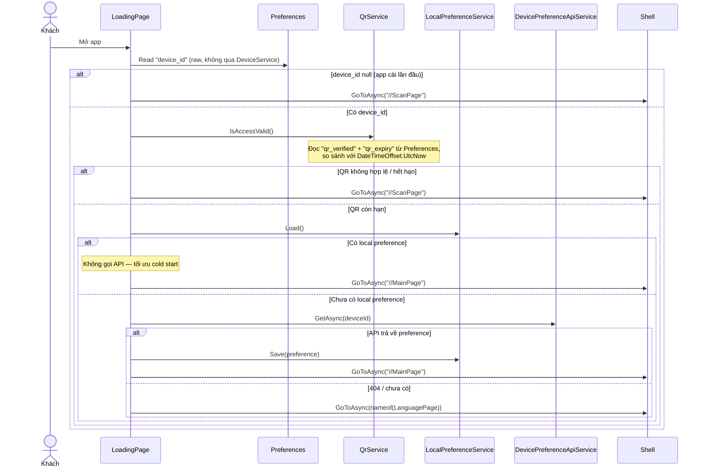

---

### SD-M02: Quét Mã QR

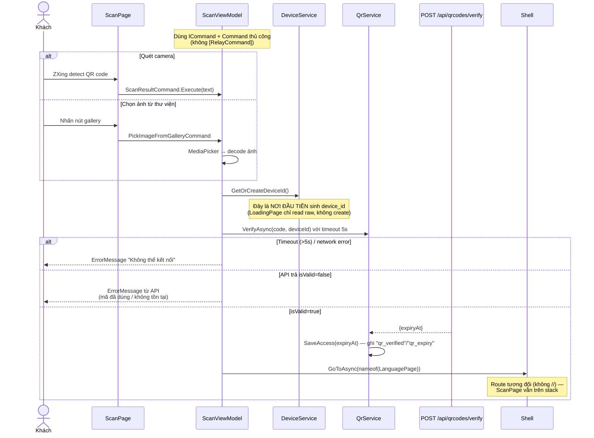

---

### SD-M03: Chọn Ngôn ngữ & Giọng đọc

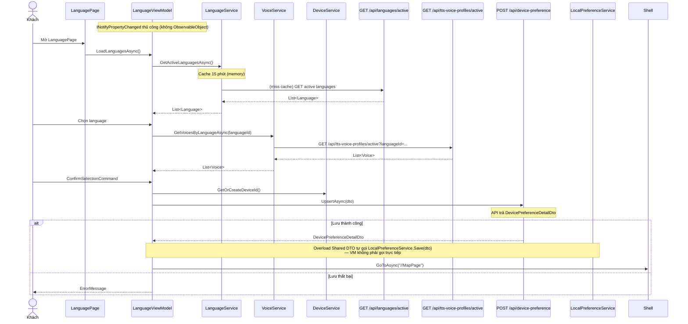

---

### SD-M04: MainPage & Điều hướng chính

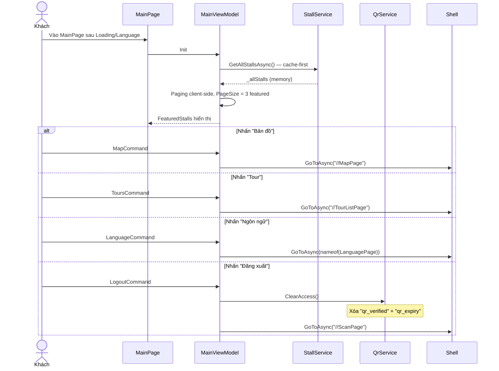

---

### SD-M05: Bản đồ & Cache-First Stall

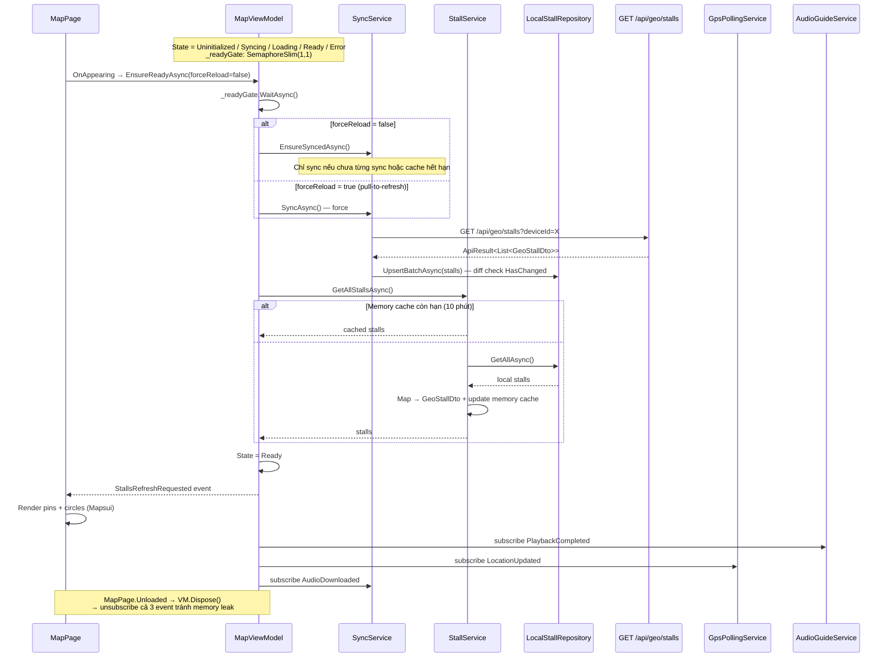

---

### SD-M06: Tap pin → Popup → Phát narration

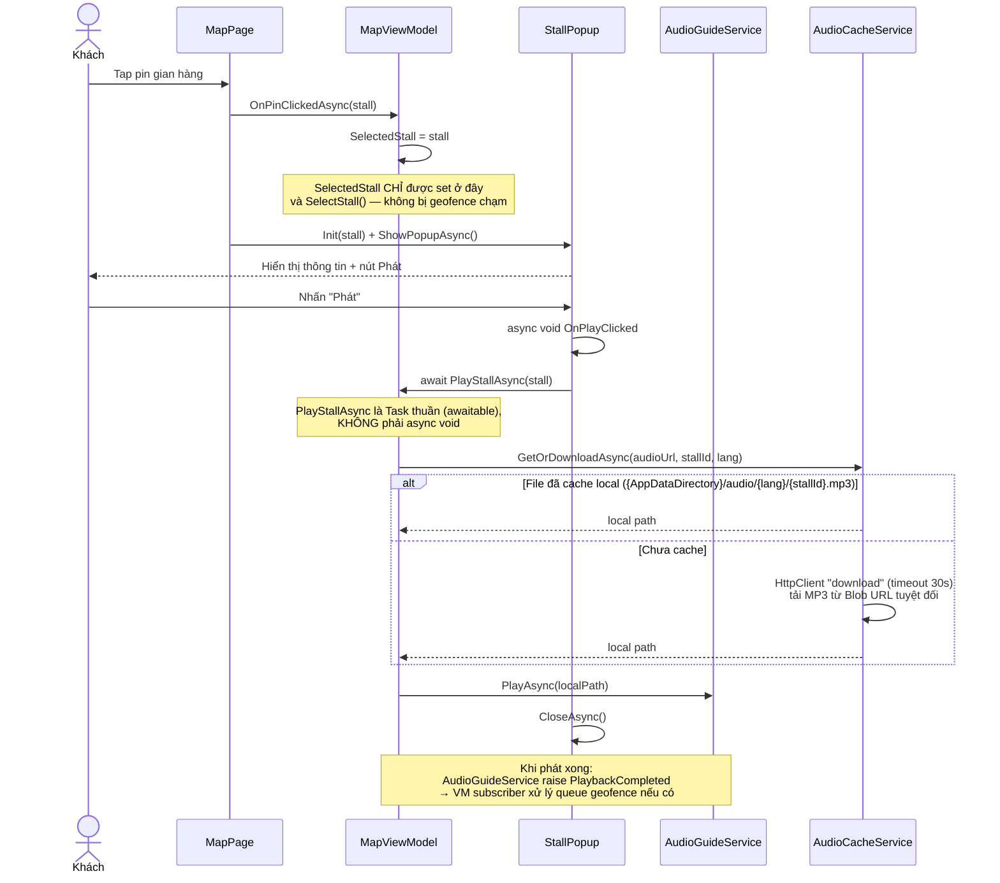

---

### SD-M07: Geofence Auto-Play

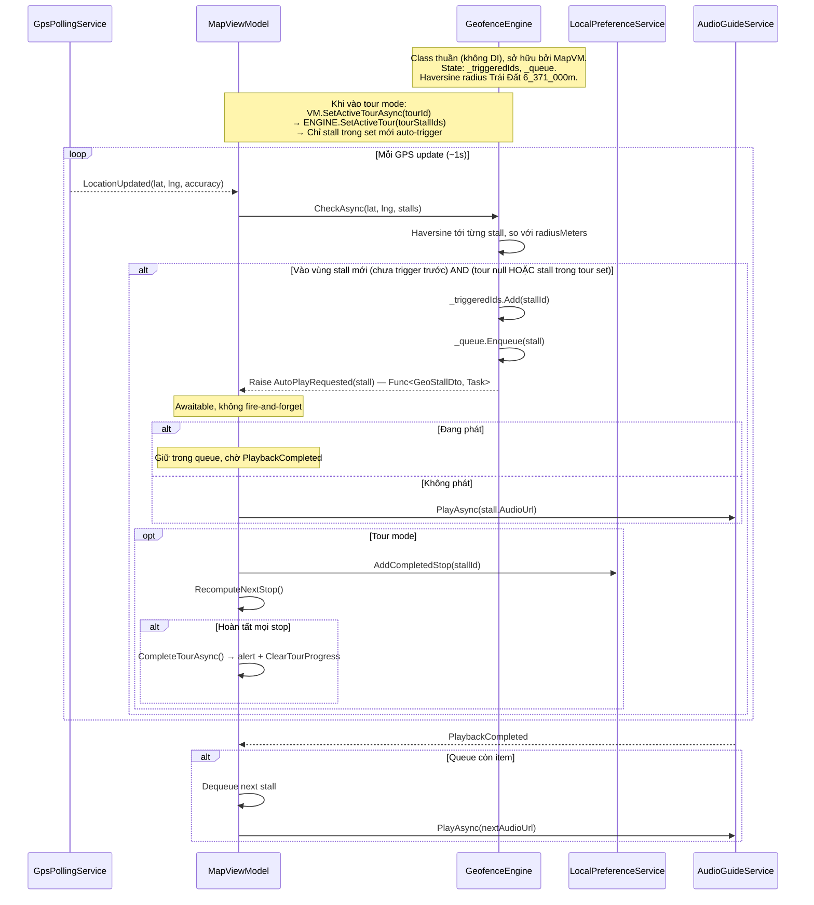

---

### SD-M08: Background Sync & Flush GPS

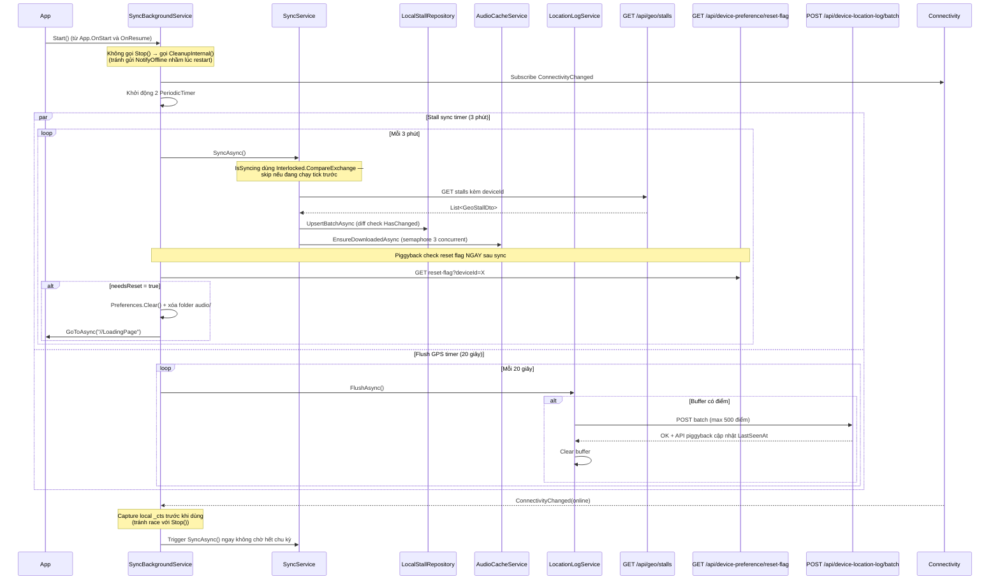

---

### SD-M09: Tour Flow

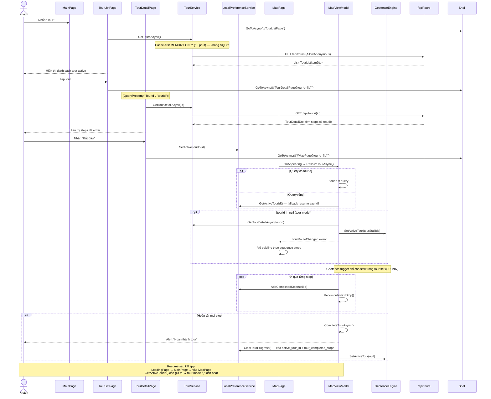

---

### SD-M10: Pull cờ Reset Thiết bị

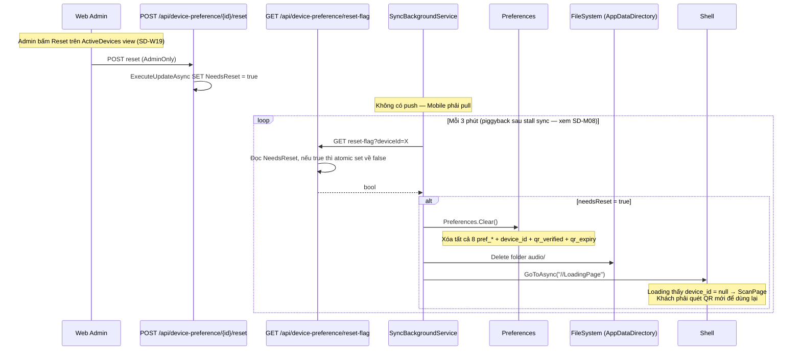

---

### SD-M11: Offline Notification & App Lifecycle

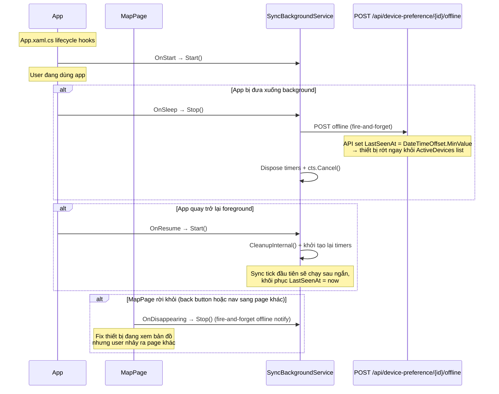

---

### SD-M12: Stall List Page

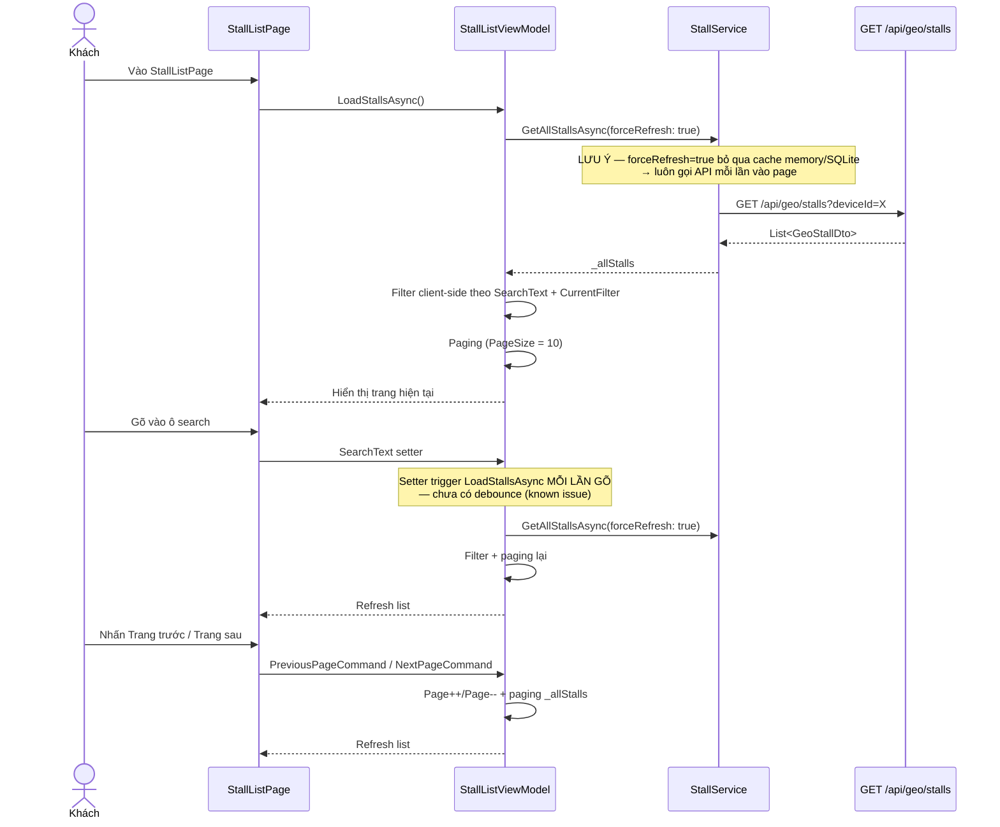
