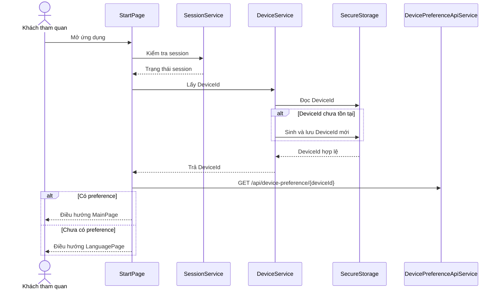
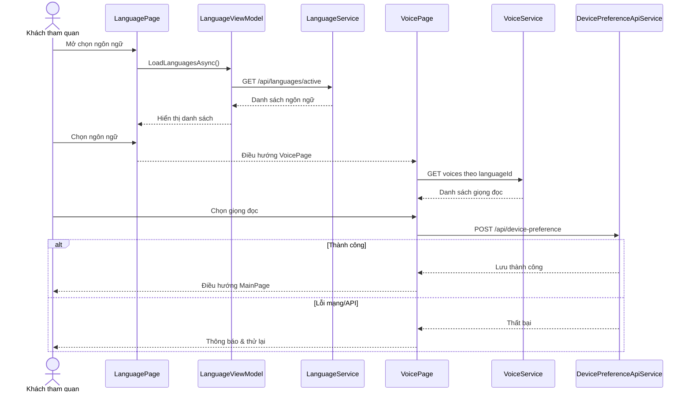
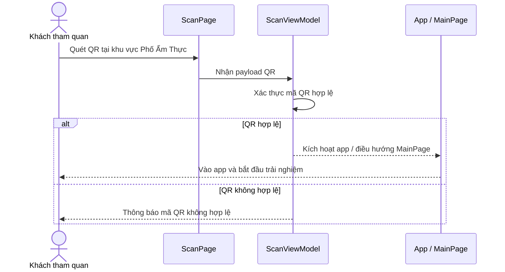
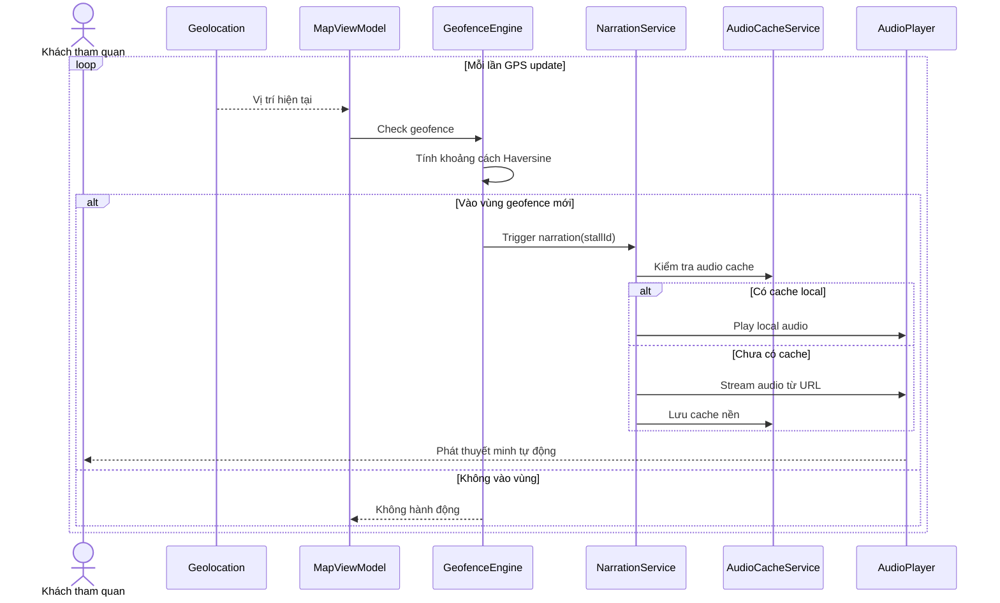
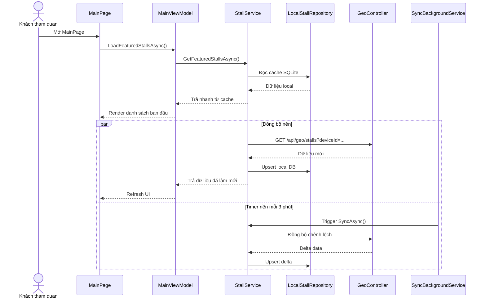
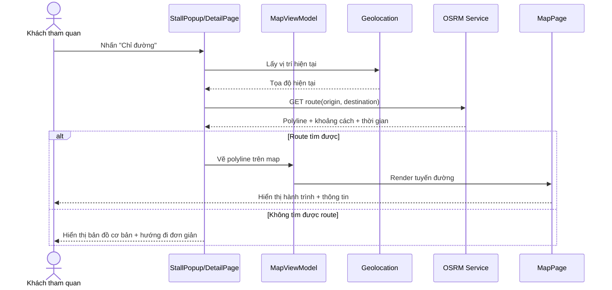

> Các sequence diagram mô tả luồng tương tác chính của Mobile App. Ký hiệu: **KTV** = Khách tham quan, **APP** = MAUI App, **SEC** = SecureStorage, **API** = Web API, **DB** = SQLite Cache.

| Mã | Tên |
|----|-----|
| [SD-M01](#sd-m01-khởi-động-ứng-dụng--kiểm-tra-session--deviceid) | Khởi động ứng dụng & kiểm tra Session + DeviceId |
| [SD-M02](#sd-m02-chọn-ngôn-ngữ--giọng-đọc--lưu-devicepreference) | Chọn ngôn ngữ & giọng đọc + lưu DevicePreference |
| [SD-M03](#sd-m03-quét-qr-code-để-dùng-app) | Quét QR Code để dùng app |
| [SD-M04](#sd-m04-tự-động-phát-thuyết-minh-khi-vào-vùng-geofence) | Tự động phát thuyết minh khi vào vùng Geofence |
| [SD-M05](#sd-m05-tải-danh-sách-gian-hàng--cache-first--background-sync) | Tải danh sách gian hàng – Cache-First + Background Sync |
| [SD-M06](#sd-m06-tính-đường-đi--chỉ-đường-osrm) | Tính đường đi & chỉ đường (OSRM) |

---

### SD-M01: Khởi động ứng dụng & kiểm tra Session + DeviceId

---

### SD-M02: Chọn ngôn ngữ & giọng đọc + lưu DevicePreference

---

### SD-M03: Quét QR Code để dùng app

---

### SD-M04: Tự động phát thuyết minh khi vào vùng Geofence

---

### SD-M05: Tải danh sách gian hàng – Cache-First + Background Sync

---

### SD-M06: Tính đường đi & chỉ đường (OSRM)

