> Các sequence diagram mô tả luồng tương tác chính của Web Admin. Ký hiệu: **USER** = Admin hoặc BusinessOwner, **VIEW** = Razor View (Browser), **CTR** = MVC Controller, **SVC** = ApiClient Service, **API** = ASP.NET Core Web API, **SESSION** = Server-side Session.

| Mã | Tên |
|----|-----|
| [SD-W01](#sd-w01-đăng-nhập) | Đăng nhập |
| [SD-W02](#sd-w02-đăng-ký-businessowner) | Đăng ký BusinessOwner |
| [SD-W03](#sd-w03-đăng-xuất) | Đăng xuất |
| [SD-W04](#sd-w04-quản-lý-doanh-nghiệp) | Quản lý Doanh nghiệp |
| [SD-W05](#sd-w05-quản-lý-gian-hàng) | Quản lý Gian hàng |
| [SD-W06](#sd-w06-đặt-vị-trí-gian-hàng-trên-bản-đồ) | Đặt vị trí Gian hàng trên bản đồ |
| [SD-W07](#sd-w07-quản-lý-media-gian-hàng) | Quản lý Media Gian hàng |
| [SD-W08](#sd-w08-quản-lý-nội-dung-thuyết-minh) | Quản lý Nội dung Thuyết minh |
| [SD-W09](#sd-w09-theo-dõi--retry-tts) | Theo dõi & Retry TTS |
| [SD-W10](#sd-w10-upload-audio-giọng-người) | Upload Audio giọng người |
| [SD-W11](#sd-w11-xem-bảng-giá) | Xem bảng giá |
| [SD-W12](#sd-w12-thanh-toán-đăng-ký-gói) | Thanh toán đăng ký gói |
| [SD-W13](#sd-w13-dashboard-admin) | Dashboard Admin |
| [SD-W14](#sd-w14-quản-lý-user--role) | Quản lý User & Role |
| [SD-W15](#sd-w15-quản-lý-mã-qr) | Quản lý Mã QR |
| [SD-W16](#sd-w16-kiosk-tạo-qr-tự-động) | Kiosk Tạo QR Tự Động |
| [SD-W17](#sd-w17-admin-cập-nhật-subscription-business) | Admin cập nhật Subscription Business |
| [SD-W18](#sd-w18-lịch-sử-đơn-đăng-ký) | Lịch sử Đơn đăng ký |
| [SD-W19](#sd-w19-theo-dõi-thiết-bị-online) | Theo dõi Thiết bị Online |
| [SD-W20](#sd-w20-quản-lý-tour) | Quản lý Tour |
| [SD-W21](#sd-w21-bản-đồ-nhiệt-vị-trí-người-dùng) | Bản đồ nhiệt vị trí người dùng |

---

### SD-W01: Đăng nhập

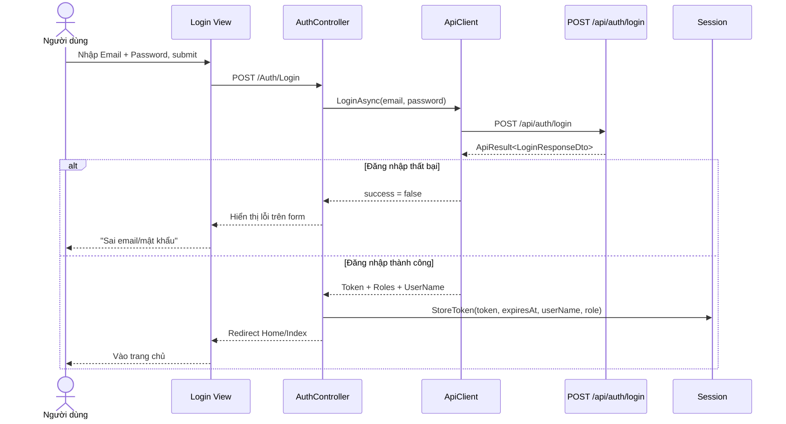
```mermaid
sequenceDiagram
    actor USER as Người dùng
    participant VIEW as Login View
    participant CTR as AuthController
    participant SVC as ApiClient
    participant API as POST /api/auth/login
    participant SESSION as Session

    USER->>VIEW: Nhập Email + Password, submit
    VIEW->>CTR: POST /Auth/Login
    CTR->>SVC: LoginAsync(email, password)
    SVC->>API: POST /api/auth/login
    API-->>SVC: ApiResult<LoginResponseDto>

    alt Đăng nhập thất bại
        SVC-->>CTR: success = false
        CTR-->>VIEW: Hiển thị lỗi trên form
        VIEW-->>USER: "Sai email/mật khẩu"
    else Đăng nhập thành công
        SVC-->>CTR: Token + Roles + UserName
        CTR->>SESSION: StoreToken(token, expiresAt, userName, role)
        CTR-->>VIEW: Redirect Home/Index
        VIEW-->>USER: Vào trang chủ
    end
```

---

### SD-W02: Đăng ký BusinessOwner

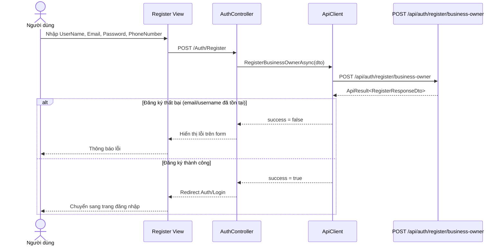
```mermaid
sequenceDiagram
    actor USER as Người dùng
    participant VIEW as Register View
    participant CTR as AuthController
    participant SVC as ApiClient
    participant API as POST /api/auth/register/business-owner

    USER->>VIEW: Nhập UserName, Email, Password, PhoneNumber
    VIEW->>CTR: POST /Auth/Register
    CTR->>SVC: RegisterBusinessOwnerAsync(dto)
    SVC->>API: POST /api/auth/register/business-owner
    API-->>SVC: ApiResult<RegisterResponseDto>

    alt Đăng ký thất bại (email/username đã tồn tại)
        SVC-->>CTR: success = false
        CTR-->>VIEW: Hiển thị lỗi trên form
        VIEW-->>USER: Thông báo lỗi
    else Đăng ký thành công
        SVC-->>CTR: success = true
        CTR-->>VIEW: Redirect Auth/Login
        VIEW-->>USER: Chuyển sang trang đăng nhập
    end
```

---

### SD-W03: Đăng xuất

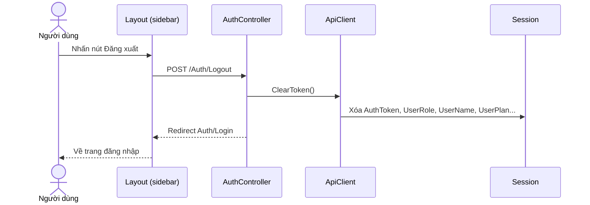
```mermaid
sequenceDiagram
    actor USER as Người dùng
    participant VIEW as Layout (sidebar)
    participant CTR as AuthController
    participant SVC as ApiClient
    participant SESSION as Session

    USER->>VIEW: Nhấn nút Đăng xuất
    VIEW->>CTR: POST /Auth/Logout
    CTR->>SVC: ClearToken()
    SVC->>SESSION: Xóa AuthToken, UserRole, UserName, UserPlan...
    CTR-->>VIEW: Redirect Auth/Login
    VIEW-->>USER: Về trang đăng nhập
```

---

### SD-W04: Quản lý Doanh nghiệp

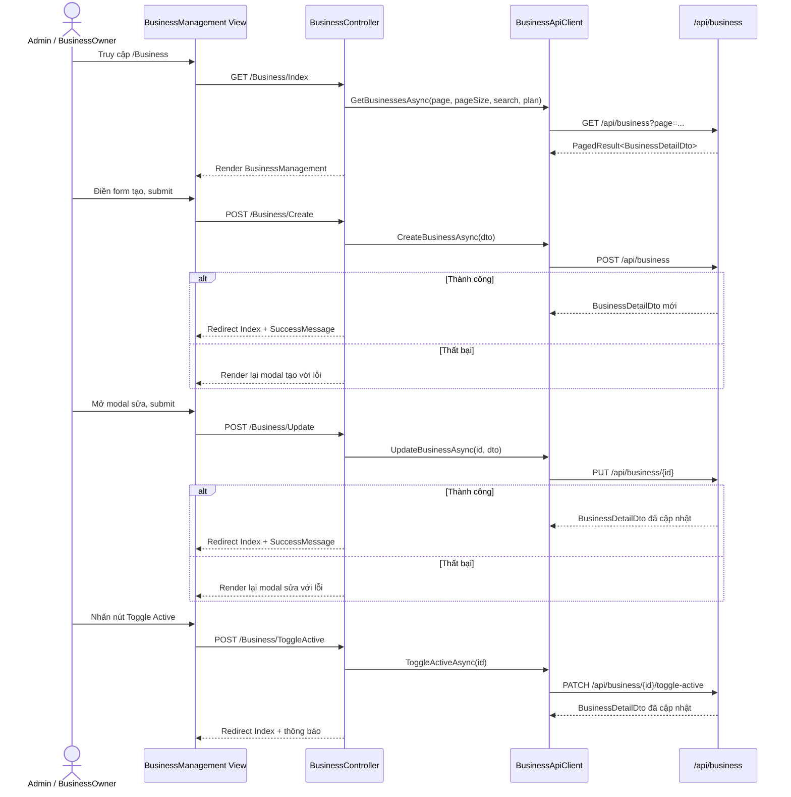
```mermaid
sequenceDiagram
    actor USER as Admin / BusinessOwner
    participant VIEW as BusinessManagement View
    participant CTR as BusinessController
    participant SVC as BusinessApiClient
    participant API as /api/business

    %% Xem danh sách
    USER->>VIEW: Truy cập /Business
    VIEW->>CTR: GET /Business/Index
    CTR->>SVC: GetBusinessesAsync(page, pageSize, search, plan)
    SVC->>API: GET /api/business?page=...
    API-->>SVC: PagedResult<BusinessDetailDto>
    CTR-->>VIEW: Render BusinessManagement

    %% Tạo mới
    USER->>VIEW: Điền form tạo, submit
    VIEW->>CTR: POST /Business/Create
    CTR->>SVC: CreateBusinessAsync(dto)
    SVC->>API: POST /api/business
    alt Thành công
        API-->>SVC: BusinessDetailDto mới
        CTR-->>VIEW: Redirect Index + SuccessMessage
    else Thất bại
        CTR-->>VIEW: Render lại modal tạo với lỗi
    end

    %% Cập nhật
    USER->>VIEW: Mở modal sửa, submit
    VIEW->>CTR: POST /Business/Update
    CTR->>SVC: UpdateBusinessAsync(id, dto)
    SVC->>API: PUT /api/business/{id}
    alt Thành công
        API-->>SVC: BusinessDetailDto đã cập nhật
        CTR-->>VIEW: Redirect Index + SuccessMessage
    else Thất bại
        CTR-->>VIEW: Render lại modal sửa với lỗi
    end

    %% Kích hoạt / Vô hiệu hóa
    USER->>VIEW: Nhấn nút Toggle Active
    VIEW->>CTR: POST /Business/ToggleActive
    CTR->>SVC: ToggleActiveAsync(id)
    SVC->>API: PATCH /api/business/{id}/toggle-active
    API-->>SVC: BusinessDetailDto đã cập nhật
    CTR-->>VIEW: Redirect Index + thông báo
```

---

### SD-W05: Quản lý Gian hàng

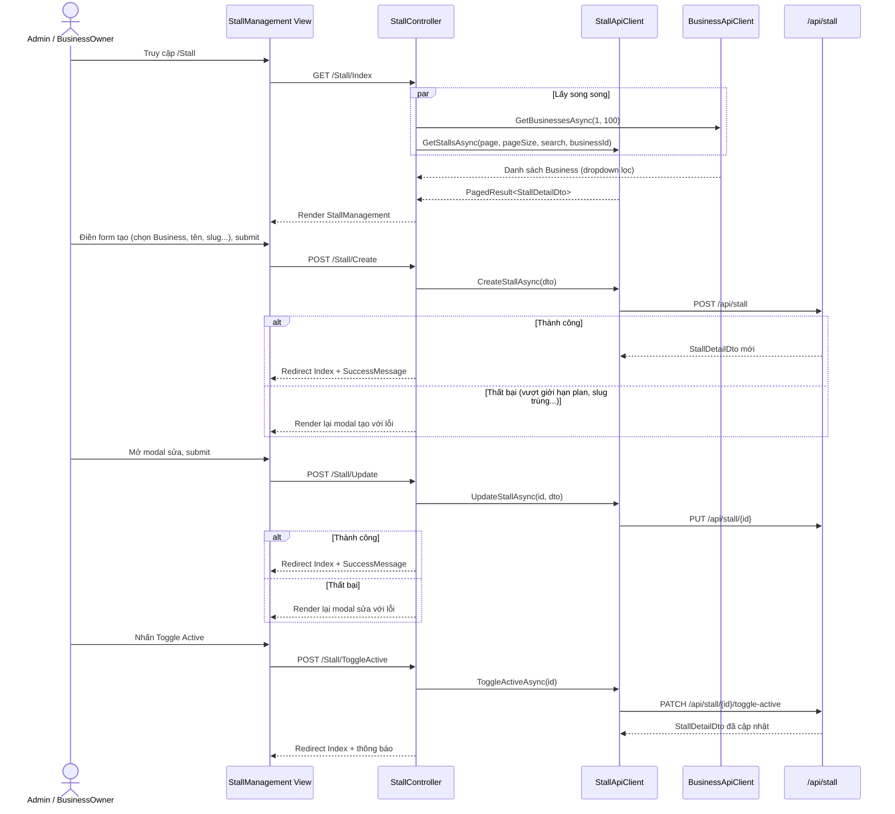
```mermaid
sequenceDiagram
    actor USER as Admin / BusinessOwner
    participant VIEW as StallManagement View
    participant CTR as StallController
    participant STALL as StallApiClient
    participant BIZ as BusinessApiClient
    participant API as /api/stall

    %% Xem danh sách
    USER->>VIEW: Truy cập /Stall
    VIEW->>CTR: GET /Stall/Index
    par Lấy song song
        CTR->>BIZ: GetBusinessesAsync(1, 100)
        CTR->>STALL: GetStallsAsync(page, pageSize, search, businessId)
    end
    BIZ-->>CTR: Danh sách Business (dropdown lọc)
    STALL-->>CTR: PagedResult<StallDetailDto>
    CTR-->>VIEW: Render StallManagement

    %% Tạo mới
    USER->>VIEW: Điền form tạo (chọn Business, tên, slug...), submit
    VIEW->>CTR: POST /Stall/Create
    CTR->>STALL: CreateStallAsync(dto)
    STALL->>API: POST /api/stall
    alt Thành công
        API-->>STALL: StallDetailDto mới
        CTR-->>VIEW: Redirect Index + SuccessMessage
    else Thất bại (vượt giới hạn plan, slug trùng...)
        CTR-->>VIEW: Render lại modal tạo với lỗi
    end

    %% Cập nhật
    USER->>VIEW: Mở modal sửa, submit
    VIEW->>CTR: POST /Stall/Update
    CTR->>STALL: UpdateStallAsync(id, dto)
    STALL->>API: PUT /api/stall/{id}
    alt Thành công
        CTR-->>VIEW: Redirect Index + SuccessMessage
    else Thất bại
        CTR-->>VIEW: Render lại modal sửa với lỗi
    end

    %% Toggle Active
    USER->>VIEW: Nhấn Toggle Active
    VIEW->>CTR: POST /Stall/ToggleActive
    CTR->>STALL: ToggleActiveAsync(id)
    STALL->>API: PATCH /api/stall/{id}/toggle-active
    API-->>STALL: StallDetailDto đã cập nhật
    CTR-->>VIEW: Redirect Index + thông báo
```

---

### SD-W06: Đặt vị trí Gian hàng trên bản đồ

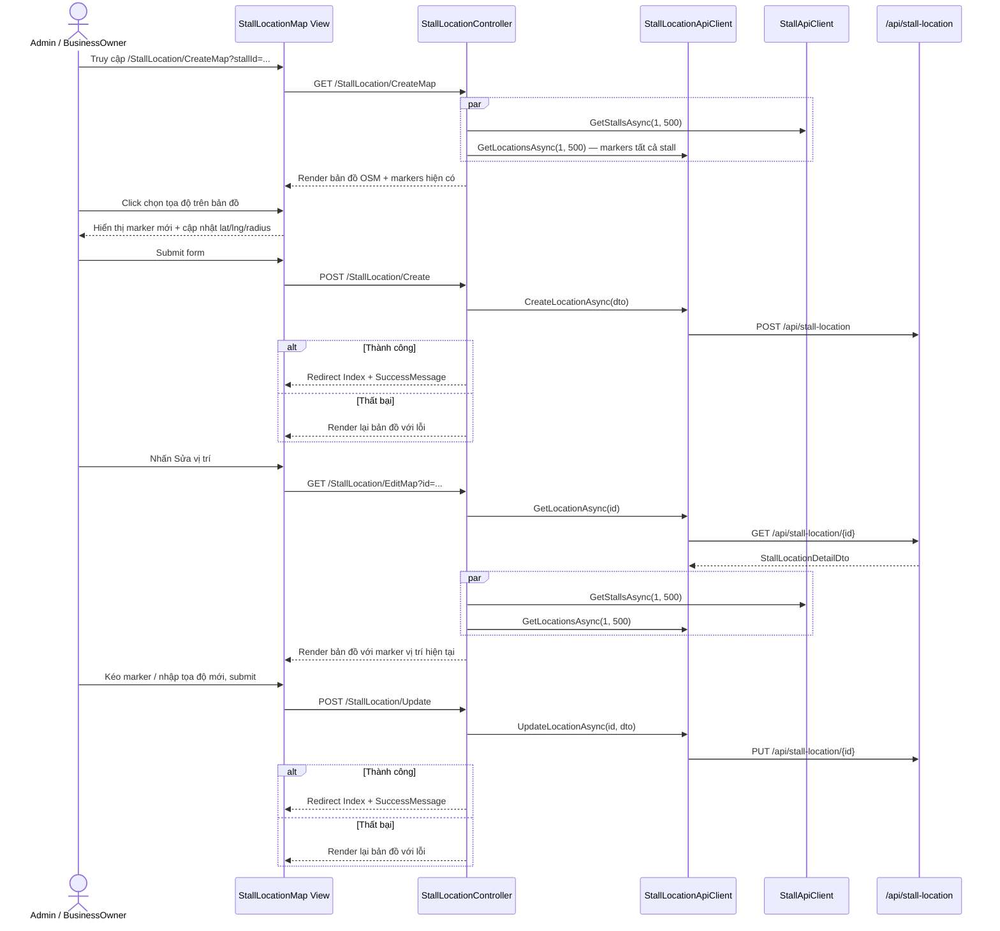
```mermaid
sequenceDiagram
    actor USER as Admin / BusinessOwner
    participant VIEW as StallLocationMap View
    participant CTR as StallLocationController
    participant LOC as StallLocationApiClient
    participant STALL as StallApiClient
    participant API as /api/stall-location

    %% Mở trang tạo
    USER->>VIEW: Truy cập /StallLocation/CreateMap?stallId=...
    VIEW->>CTR: GET /StallLocation/CreateMap
    par
        CTR->>STALL: GetStallsAsync(1, 500)
        CTR->>LOC: GetLocationsAsync(1, 500) — markers tất cả stall
    end
    CTR-->>VIEW: Render bản đồ OSM + markers hiện có

    USER->>VIEW: Click chọn tọa độ trên bản đồ
    VIEW-->>USER: Hiển thị marker mới + cập nhật lat/lng/radius

    USER->>VIEW: Submit form
    VIEW->>CTR: POST /StallLocation/Create
    CTR->>LOC: CreateLocationAsync(dto)
    LOC->>API: POST /api/stall-location
    alt Thành công
        CTR-->>VIEW: Redirect Index + SuccessMessage
    else Thất bại
        CTR-->>VIEW: Render lại bản đồ với lỗi
    end

    %% Chỉnh sửa
    USER->>VIEW: Nhấn Sửa vị trí
    VIEW->>CTR: GET /StallLocation/EditMap?id=...
    CTR->>LOC: GetLocationAsync(id)
    LOC->>API: GET /api/stall-location/{id}
    API-->>LOC: StallLocationDetailDto
    par
        CTR->>STALL: GetStallsAsync(1, 500)
        CTR->>LOC: GetLocationsAsync(1, 500)
    end
    CTR-->>VIEW: Render bản đồ với marker vị trí hiện tại

    USER->>VIEW: Kéo marker / nhập tọa độ mới, submit
    VIEW->>CTR: POST /StallLocation/Update
    CTR->>LOC: UpdateLocationAsync(id, dto)
    LOC->>API: PUT /api/stall-location/{id}
    alt Thành công
        CTR-->>VIEW: Redirect Index + SuccessMessage
    else Thất bại
        CTR-->>VIEW: Render lại bản đồ với lỗi
    end
```

---

### SD-W07: Quản lý Media Gian hàng

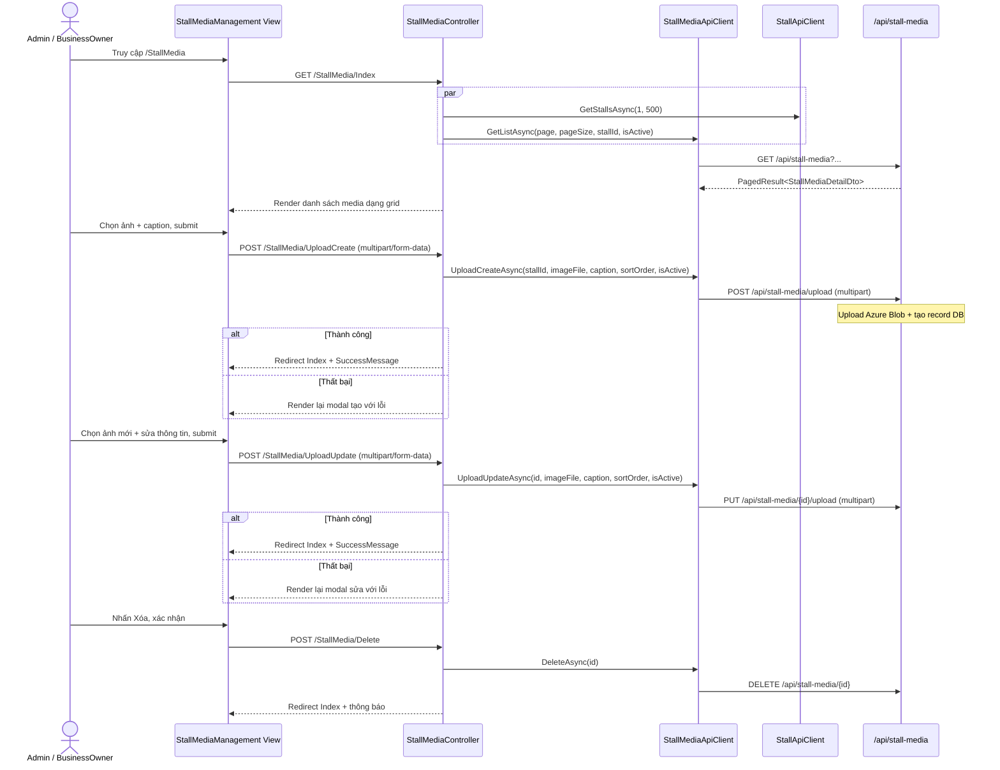
```mermaid
sequenceDiagram
    actor USER as Admin / BusinessOwner
    participant VIEW as StallMediaManagement View
    participant CTR as StallMediaController
    participant SVC as StallMediaApiClient
    participant STALL as StallApiClient
    participant API as /api/stall-media

    %% Xem danh sách
    USER->>VIEW: Truy cập /StallMedia
    VIEW->>CTR: GET /StallMedia/Index
    par
        CTR->>STALL: GetStallsAsync(1, 500)
        CTR->>SVC: GetListAsync(page, pageSize, stallId, isActive)
    end
    SVC->>API: GET /api/stall-media?...
    API-->>SVC: PagedResult<StallMediaDetailDto>
    CTR-->>VIEW: Render danh sách media dạng grid

    %% Upload ảnh mới
    USER->>VIEW: Chọn ảnh + caption, submit
    VIEW->>CTR: POST /StallMedia/UploadCreate (multipart/form-data)
    CTR->>SVC: UploadCreateAsync(stallId, imageFile, caption, sortOrder, isActive)
    SVC->>API: POST /api/stall-media/upload (multipart)
    Note over API: Upload Azure Blob + tạo record DB
    alt Thành công
        CTR-->>VIEW: Redirect Index + SuccessMessage
    else Thất bại
        CTR-->>VIEW: Render lại modal tạo với lỗi
    end

    %% Cập nhật ảnh
    USER->>VIEW: Chọn ảnh mới + sửa thông tin, submit
    VIEW->>CTR: POST /StallMedia/UploadUpdate (multipart/form-data)
    CTR->>SVC: UploadUpdateAsync(id, imageFile, caption, sortOrder, isActive)
    SVC->>API: PUT /api/stall-media/{id}/upload (multipart)
    alt Thành công
        CTR-->>VIEW: Redirect Index + SuccessMessage
    else Thất bại
        CTR-->>VIEW: Render lại modal sửa với lỗi
    end

    %% Xóa media
    USER->>VIEW: Nhấn Xóa, xác nhận
    VIEW->>CTR: POST /StallMedia/Delete
    CTR->>SVC: DeleteAsync(id)
    SVC->>API: DELETE /api/stall-media/{id}
    CTR-->>VIEW: Redirect Index + thông báo
```

---

### SD-W08: Quản lý Nội dung Thuyết minh

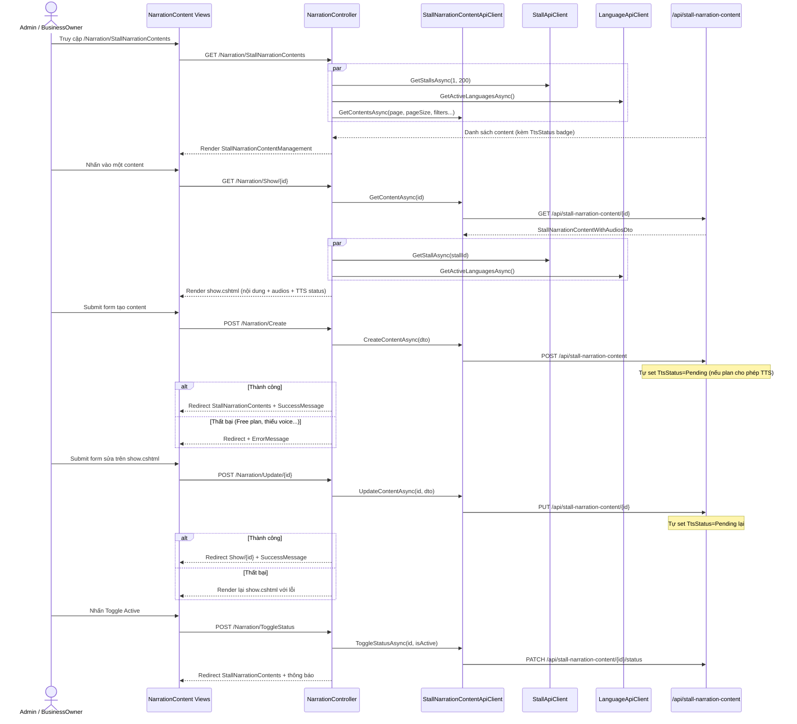
```mermaid
sequenceDiagram
    actor USER as Admin / BusinessOwner
    participant VIEW as NarrationContent Views
    participant CTR as NarrationController
    participant SVC as StallNarrationContentApiClient
    participant STALL as StallApiClient
    participant LANG as LanguageApiClient
    participant API as /api/stall-narration-content

    %% Xem danh sách
    USER->>VIEW: Truy cập /Narration/StallNarrationContents
    VIEW->>CTR: GET /Narration/StallNarrationContents
    par
        CTR->>STALL: GetStallsAsync(1, 200)
        CTR->>LANG: GetActiveLanguagesAsync()
        CTR->>SVC: GetContentsAsync(page, pageSize, filters...)
    end
    API-->>CTR: Danh sách content (kèm TtsStatus badge)
    CTR-->>VIEW: Render StallNarrationContentManagement

    %% Xem chi tiết
    USER->>VIEW: Nhấn vào một content
    VIEW->>CTR: GET /Narration/Show/{id}
    CTR->>SVC: GetContentAsync(id)
    SVC->>API: GET /api/stall-narration-content/{id}
    API-->>SVC: StallNarrationContentWithAudiosDto
    par
        CTR->>STALL: GetStallAsync(stallId)
        CTR->>LANG: GetActiveLanguagesAsync()
    end
    CTR-->>VIEW: Render show.cshtml (nội dung + audios + TTS status)

    %% Tạo mới
    USER->>VIEW: Submit form tạo content
    VIEW->>CTR: POST /Narration/Create
    CTR->>SVC: CreateContentAsync(dto)
    SVC->>API: POST /api/stall-narration-content
    Note over API: Tự set TtsStatus=Pending (nếu plan cho phép TTS)
    alt Thành công
        CTR-->>VIEW: Redirect StallNarrationContents + SuccessMessage
    else Thất bại (Free plan, thiếu voice...)
        CTR-->>VIEW: Redirect + ErrorMessage
    end

    %% Cập nhật
    USER->>VIEW: Submit form sửa trên show.cshtml
    VIEW->>CTR: POST /Narration/Update/{id}
    CTR->>SVC: UpdateContentAsync(id, dto)
    SVC->>API: PUT /api/stall-narration-content/{id}
    Note over API: Tự set TtsStatus=Pending lại
    alt Thành công
        CTR-->>VIEW: Redirect Show/{id} + SuccessMessage
    else Thất bại
        CTR-->>VIEW: Render lại show.cshtml với lỗi
    end

    %% Toggle Active
    USER->>VIEW: Nhấn Toggle Active
    VIEW->>CTR: POST /Narration/ToggleStatus
    CTR->>SVC: ToggleStatusAsync(id, isActive)
    SVC->>API: PATCH /api/stall-narration-content/{id}/status
    CTR-->>VIEW: Redirect StallNarrationContents + thông báo
```

---

### SD-W09: Theo dõi & Retry TTS

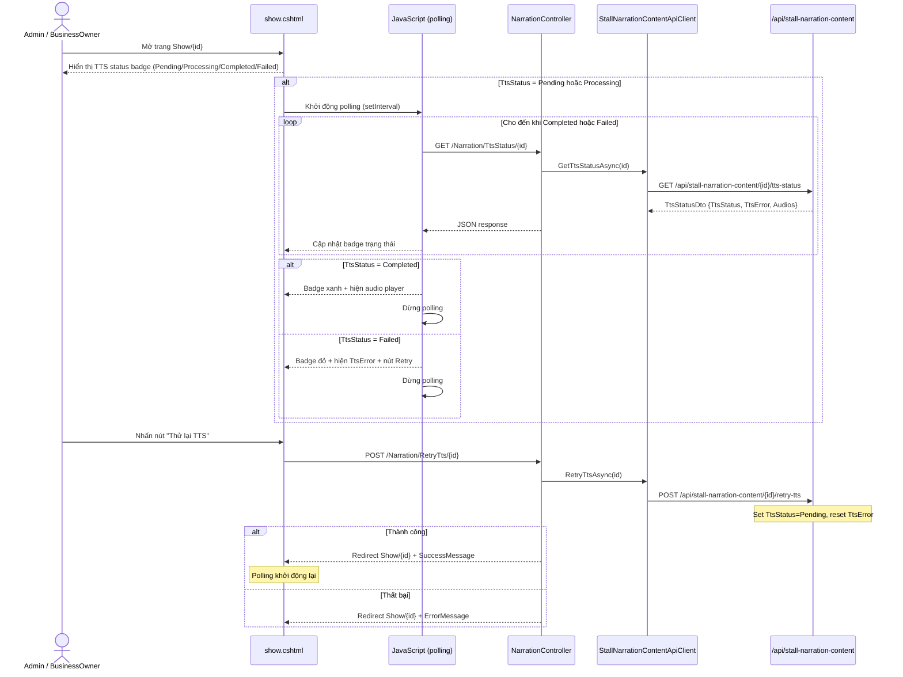
```mermaid
sequenceDiagram
    actor USER as Admin / BusinessOwner
    participant VIEW as show.cshtml
    participant JS as JavaScript (polling)
    participant CTR as NarrationController
    participant SVC as StallNarrationContentApiClient
    participant API as /api/stall-narration-content

    USER->>VIEW: Mở trang Show/{id}
    VIEW-->>USER: Hiển thị TTS status badge (Pending/Processing/Completed/Failed)

    alt TtsStatus = Pending hoặc Processing
        VIEW->>JS: Khởi động polling (setInterval)
        loop Cho đến khi Completed hoặc Failed
            JS->>CTR: GET /Narration/TtsStatus/{id}
            CTR->>SVC: GetTtsStatusAsync(id)
            SVC->>API: GET /api/stall-narration-content/{id}/tts-status
            API-->>SVC: TtsStatusDto {TtsStatus, TtsError, Audios}
            CTR-->>JS: JSON response
            JS-->>VIEW: Cập nhật badge trạng thái
        end

        alt TtsStatus = Completed
            JS-->>VIEW: Badge xanh + hiện audio player
            JS->>JS: Dừng polling
        else TtsStatus = Failed
            JS-->>VIEW: Badge đỏ + hiện TtsError + nút Retry
            JS->>JS: Dừng polling
        end
    end

    %% Retry TTS
    USER->>VIEW: Nhấn nút "Thử lại TTS"
    VIEW->>CTR: POST /Narration/RetryTts/{id}
    CTR->>SVC: RetryTtsAsync(id)
    SVC->>API: POST /api/stall-narration-content/{id}/retry-tts
    Note over API: Set TtsStatus=Pending, reset TtsError
    alt Thành công
        CTR-->>VIEW: Redirect Show/{id} + SuccessMessage
        Note over VIEW: Polling khởi động lại
    else Thất bại
        CTR-->>VIEW: Redirect Show/{id} + ErrorMessage
    end
```

---

### SD-W10: Upload Audio giọng người

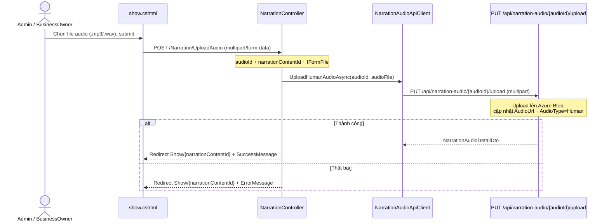
```mermaid
sequenceDiagram
    actor USER as Admin / BusinessOwner
    participant VIEW as show.cshtml
    participant CTR as NarrationController
    participant SVC as NarrationAudioApiClient
    participant API as PUT /api/narration-audio/{audioId}/upload

    USER->>VIEW: Chọn file audio (.mp3/.wav), submit
    VIEW->>CTR: POST /Narration/UploadAudio (multipart/form-data)
    Note over CTR: audioId + narrationContentId + IFormFile
    CTR->>SVC: UploadHumanAudioAsync(audioId, audioFile)
    SVC->>API: PUT /api/narration-audio/{audioId}/upload (multipart)
    Note over API: Upload lên Azure Blob,<br/>cập nhật AudioUrl + AudioType=Human

    alt Thành công
        API-->>SVC: NarrationAudioDetailDto
        CTR-->>VIEW: Redirect Show/{narrationContentId} + SuccessMessage
    else Thất bại
        CTR-->>VIEW: Redirect Show/{narrationContentId} + ErrorMessage
    end
```

---

### SD-W11: Xem bảng giá

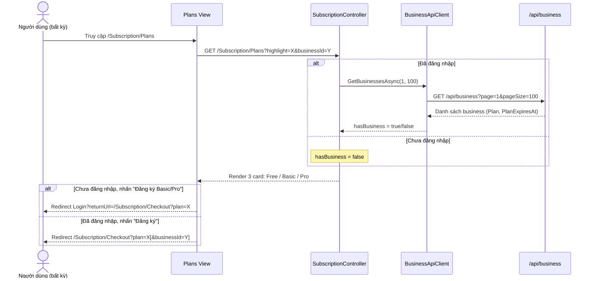
```mermaid
sequenceDiagram
    actor USER as Người dùng (bất kỳ)
    participant VIEW as Plans View
    participant CTR as SubscriptionController
    participant SVC as BusinessApiClient
    participant API as /api/business

    USER->>VIEW: Truy cập /Subscription/Plans
    VIEW->>CTR: GET /Subscription/Plans?highlight=X&businessId=Y

    alt Đã đăng nhập
        CTR->>SVC: GetBusinessesAsync(1, 100)
        SVC->>API: GET /api/business?page=1&pageSize=100
        API-->>SVC: Danh sách business (Plan, PlanExpiresAt)
        SVC-->>CTR: hasBusiness = true/false
    else Chưa đăng nhập
        Note over CTR: hasBusiness = false
    end

    CTR-->>VIEW: Render 3 card: Free / Basic / Pro

    alt Chưa đăng nhập, nhấn "Đăng ký Basic/Pro"
        VIEW-->>USER: Redirect Login?returnUrl=/Subscription/Checkout?plan=X
    else Đã đăng nhập, nhấn "Đăng ký"
        VIEW-->>USER: Redirect /Subscription/Checkout?plan=X[&businessId=Y]
    end
```

---

### SD-W12: Thanh toán đăng ký gói

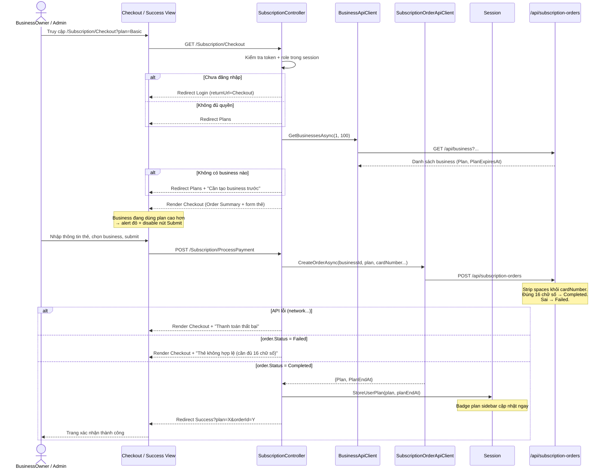
```mermaid
sequenceDiagram
    actor USER as BusinessOwner / Admin
    participant VIEW as Checkout / Success View
    participant CTR as SubscriptionController
    participant BIZ as BusinessApiClient
    participant ORD as SubscriptionOrderApiClient
    participant SESSION as Session
    participant API as /api/subscription-orders

    %% Mở trang Checkout
    USER->>VIEW: Truy cập /Subscription/Checkout?plan=Basic
    VIEW->>CTR: GET /Subscription/Checkout
    CTR->>CTR: Kiểm tra token + role trong session
    alt Chưa đăng nhập
        CTR-->>VIEW: Redirect Login (returnUrl=Checkout)
    else Không đủ quyền
        CTR-->>VIEW: Redirect Plans
    end

    CTR->>BIZ: GetBusinessesAsync(1, 100)
    BIZ->>API: GET /api/business?...
    API-->>BIZ: Danh sách business (Plan, PlanExpiresAt)

    alt Không có business nào
        CTR-->>VIEW: Redirect Plans + "Cần tạo business trước"
    end

    CTR-->>VIEW: Render Checkout (Order Summary + form thẻ)
    Note over VIEW: Business đang dùng plan cao hơn<br/>→ alert đỏ + disable nút Submit

    %% Xử lý thanh toán
    USER->>VIEW: Nhập thông tin thẻ, chọn business, submit
    VIEW->>CTR: POST /Subscription/ProcessPayment
    CTR->>ORD: CreateOrderAsync(businessId, plan, cardNumber...)
    ORD->>API: POST /api/subscription-orders
    Note over API: Strip spaces khỏi cardNumber.<br/>Đúng 16 chữ số → Completed.<br/>Sai → Failed.

    alt API lỗi (network...)
        CTR-->>VIEW: Render Checkout + "Thanh toán thất bại"
    else order.Status = Failed
        CTR-->>VIEW: Render Checkout + "Thẻ không hợp lệ (cần đủ 16 chữ số)"
    else order.Status = Completed
        ORD-->>CTR: {Plan, PlanEndAt}
        CTR->>SESSION: StoreUserPlan(plan, planEndAt)
        Note over SESSION: Badge plan sidebar cập nhật ngay
        CTR-->>VIEW: Redirect Success?plan=X&orderId=Y
        VIEW-->>USER: Trang xác nhận thành công
    end
```

---

### SD-W13: Dashboard Admin

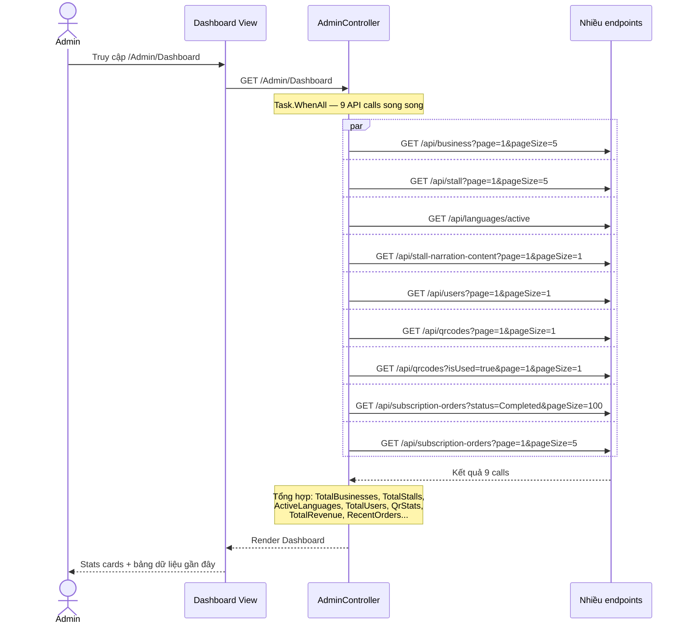
```mermaid
sequenceDiagram
    actor USER as Admin
    participant VIEW as Dashboard View
    participant CTR as AdminController
    participant API as Nhiều endpoints

    USER->>VIEW: Truy cập /Admin/Dashboard
    VIEW->>CTR: GET /Admin/Dashboard

    Note over CTR: Task.WhenAll — 9 API calls song song
    par
        CTR->>API: GET /api/business?page=1&pageSize=5
    and
        CTR->>API: GET /api/stall?page=1&pageSize=5
    and
        CTR->>API: GET /api/languages/active
    and
        CTR->>API: GET /api/stall-narration-content?page=1&pageSize=1
    and
        CTR->>API: GET /api/users?page=1&pageSize=1
    and
        CTR->>API: GET /api/qrcodes?page=1&pageSize=1
    and
        CTR->>API: GET /api/qrcodes?isUsed=true&page=1&pageSize=1
    and
        CTR->>API: GET /api/subscription-orders?status=Completed&pageSize=100
    and
        CTR->>API: GET /api/subscription-orders?page=1&pageSize=5
    end

    API-->>CTR: Kết quả 9 calls
    Note over CTR: Tổng hợp: TotalBusinesses, TotalStalls,<br/>ActiveLanguages, TotalUsers, QrStats,<br/>TotalRevenue, RecentOrders...
    CTR-->>VIEW: Render Dashboard
    VIEW-->>USER: Stats cards + bảng dữ liệu gần đây
```

---

### SD-W14: Quản lý User & Role

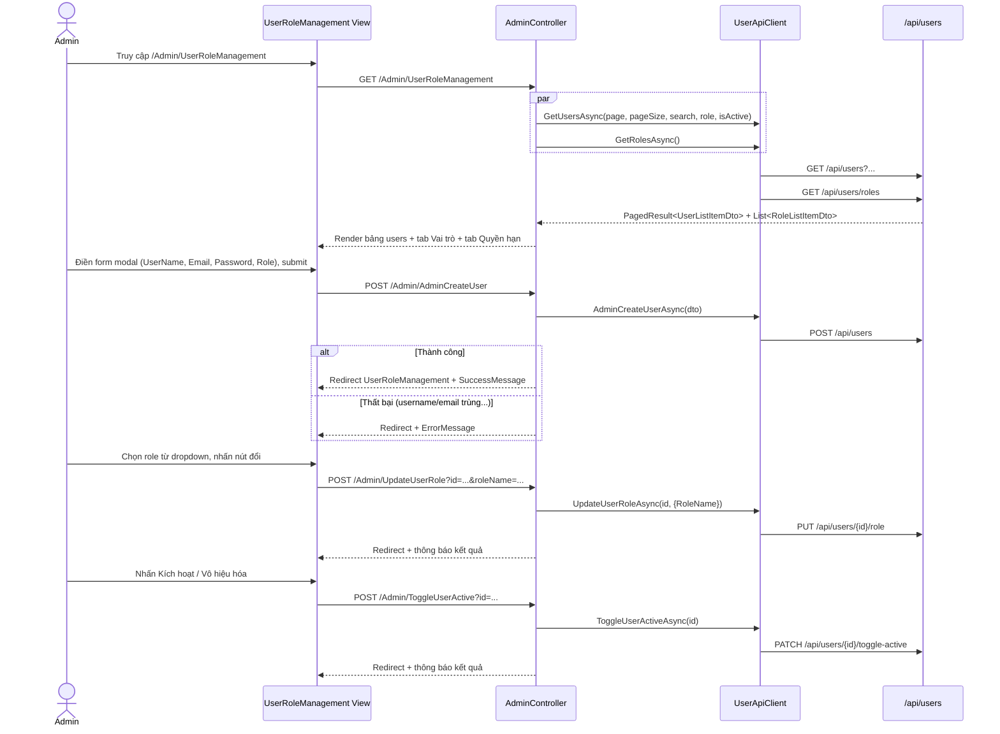
```mermaid
sequenceDiagram
    actor ADMIN as Admin
    participant VIEW as UserRoleManagement View
    participant CTR as AdminController
    participant SVC as UserApiClient
    participant API as /api/users

    %% Xem danh sách
    ADMIN->>VIEW: Truy cập /Admin/UserRoleManagement
    VIEW->>CTR: GET /Admin/UserRoleManagement
    par
        CTR->>SVC: GetUsersAsync(page, pageSize, search, role, isActive)
        CTR->>SVC: GetRolesAsync()
    end
    SVC->>API: GET /api/users?...
    SVC->>API: GET /api/users/roles
    API-->>CTR: PagedResult<UserListItemDto> + List<RoleListItemDto>
    CTR-->>VIEW: Render bảng users + tab Vai trò + tab Quyền hạn

    %% Tạo user mới
    ADMIN->>VIEW: Điền form modal (UserName, Email, Password, Role), submit
    VIEW->>CTR: POST /Admin/AdminCreateUser
    CTR->>SVC: AdminCreateUserAsync(dto)
    SVC->>API: POST /api/users
    alt Thành công
        CTR-->>VIEW: Redirect UserRoleManagement + SuccessMessage
    else Thất bại (username/email trùng...)
        CTR-->>VIEW: Redirect + ErrorMessage
    end

    %% Đổi role
    ADMIN->>VIEW: Chọn role từ dropdown, nhấn nút đổi
    VIEW->>CTR: POST /Admin/UpdateUserRole?id=...&roleName=...
    CTR->>SVC: UpdateUserRoleAsync(id, {RoleName})
    SVC->>API: PUT /api/users/{id}/role
    CTR-->>VIEW: Redirect + thông báo kết quả

    %% Toggle Active
    ADMIN->>VIEW: Nhấn Kích hoạt / Vô hiệu hóa
    VIEW->>CTR: POST /Admin/ToggleUserActive?id=...
    CTR->>SVC: ToggleUserActiveAsync(id)
    SVC->>API: PATCH /api/users/{id}/toggle-active
    CTR-->>VIEW: Redirect + thông báo kết quả
```

---

### SD-W15: Quản lý Mã QR

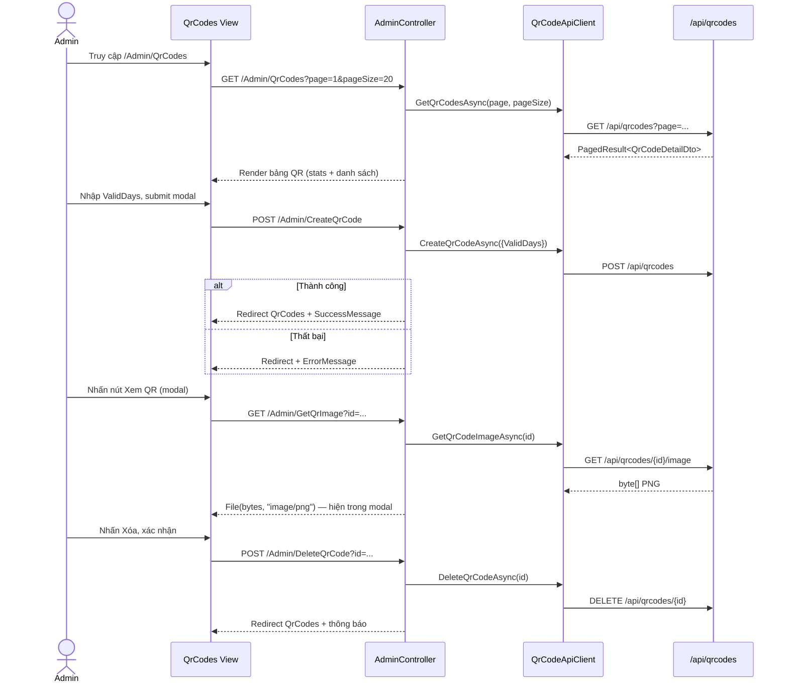
```mermaid
sequenceDiagram
    actor ADMIN as Admin
    participant VIEW as QrCodes View
    participant CTR as AdminController
    participant SVC as QrCodeApiClient
    participant API as /api/qrcodes

    %% Xem danh sách
    ADMIN->>VIEW: Truy cập /Admin/QrCodes
    VIEW->>CTR: GET /Admin/QrCodes?page=1&pageSize=20
    CTR->>SVC: GetQrCodesAsync(page, pageSize)
    SVC->>API: GET /api/qrcodes?page=...
    API-->>SVC: PagedResult<QrCodeDetailDto>
    CTR-->>VIEW: Render bảng QR (stats + danh sách)

    %% Tạo mã QR
    ADMIN->>VIEW: Nhập ValidDays, submit modal
    VIEW->>CTR: POST /Admin/CreateQrCode
    CTR->>SVC: CreateQrCodeAsync({ValidDays})
    SVC->>API: POST /api/qrcodes
    alt Thành công
        CTR-->>VIEW: Redirect QrCodes + SuccessMessage
    else Thất bại
        CTR-->>VIEW: Redirect + ErrorMessage
    end

    %% Xem ảnh QR
    ADMIN->>VIEW: Nhấn nút Xem QR (modal)
    VIEW->>CTR: GET /Admin/GetQrImage?id=...
    CTR->>SVC: GetQrCodeImageAsync(id)
    SVC->>API: GET /api/qrcodes/{id}/image
    API-->>SVC: byte[] PNG
    CTR-->>VIEW: File(bytes, "image/png") — hiện trong modal

    %% Xóa mã QR
    ADMIN->>VIEW: Nhấn Xóa, xác nhận
    VIEW->>CTR: POST /Admin/DeleteQrCode?id=...
    CTR->>SVC: DeleteQrCodeAsync(id)
    SVC->>API: DELETE /api/qrcodes/{id}
    CTR-->>VIEW: Redirect QrCodes + thông báo
```

---

### SD-W16: Kiosk Tạo QR Tự Động

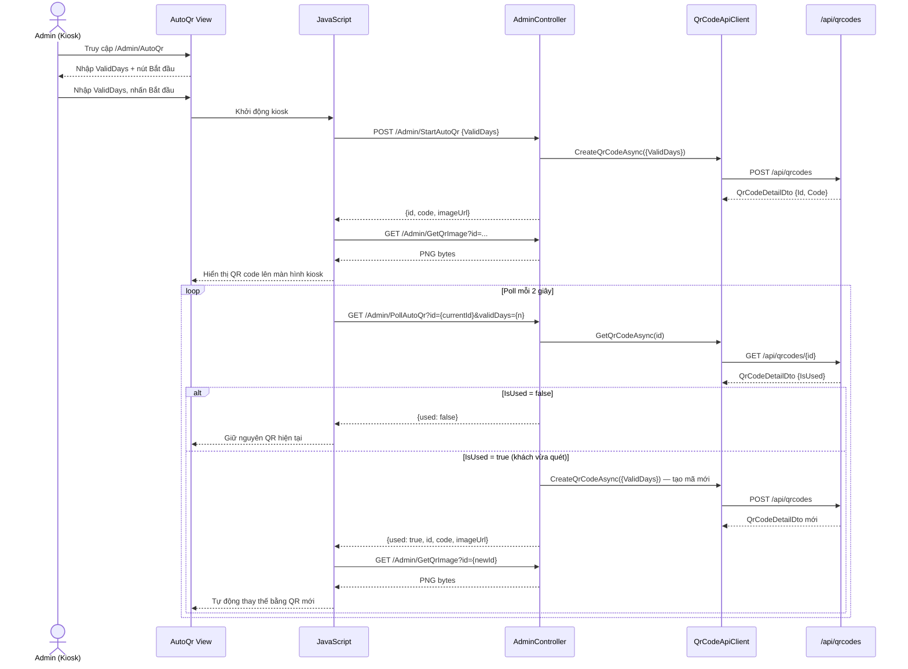
```mermaid
sequenceDiagram
    actor ADMIN as Admin (Kiosk)
    participant VIEW as AutoQr View
    participant JS as JavaScript
    participant CTR as AdminController
    participant SVC as QrCodeApiClient
    participant API as /api/qrcodes

    ADMIN->>VIEW: Truy cập /Admin/AutoQr
    VIEW-->>ADMIN: Nhập ValidDays + nút Bắt đầu

    ADMIN->>VIEW: Nhập ValidDays, nhấn Bắt đầu
    VIEW->>JS: Khởi động kiosk
    JS->>CTR: POST /Admin/StartAutoQr {ValidDays}
    CTR->>SVC: CreateQrCodeAsync({ValidDays})
    SVC->>API: POST /api/qrcodes
    API-->>SVC: QrCodeDetailDto {Id, Code}
    CTR-->>JS: {id, code, imageUrl}
    JS->>CTR: GET /Admin/GetQrImage?id=...
    CTR-->>JS: PNG bytes
    JS-->>VIEW: Hiển thị QR code lên màn hình kiosk

    loop Poll mỗi 2 giây
        JS->>CTR: GET /Admin/PollAutoQr?id={currentId}&validDays={n}
        CTR->>SVC: GetQrCodeAsync(id)
        SVC->>API: GET /api/qrcodes/{id}
        API-->>SVC: QrCodeDetailDto {IsUsed}

        alt IsUsed = false
            CTR-->>JS: {used: false}
            JS-->>VIEW: Giữ nguyên QR hiện tại
        else IsUsed = true (khách vừa quét)
            CTR->>SVC: CreateQrCodeAsync({ValidDays}) — tạo mã mới
            SVC->>API: POST /api/qrcodes
            API-->>SVC: QrCodeDetailDto mới
            CTR-->>JS: {used: true, id, code, imageUrl}
            JS->>CTR: GET /Admin/GetQrImage?id={newId}
            CTR-->>JS: PNG bytes
            JS-->>VIEW: Tự động thay thế bằng QR mới
        end
    end
```

---

### SD-W17: Admin cập nhật Subscription Business

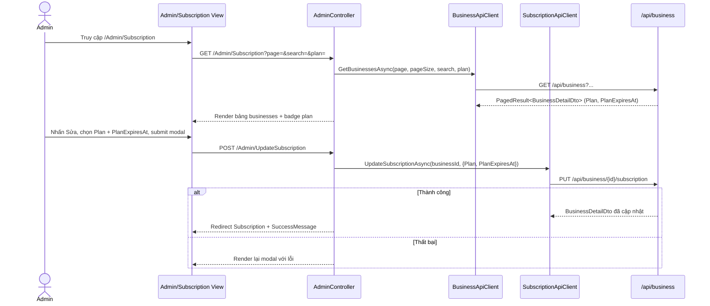
```mermaid
sequenceDiagram
    actor ADMIN as Admin
    participant VIEW as Admin/Subscription View
    participant CTR as AdminController
    participant BIZ as BusinessApiClient
    participant SUB as SubscriptionApiClient
    participant API as /api/business

    %% Xem danh sách
    ADMIN->>VIEW: Truy cập /Admin/Subscription
    VIEW->>CTR: GET /Admin/Subscription?page=&search=&plan=
    CTR->>BIZ: GetBusinessesAsync(page, pageSize, search, plan)
    BIZ->>API: GET /api/business?...
    API-->>BIZ: PagedResult<BusinessDetailDto> (Plan, PlanExpiresAt)
    CTR-->>VIEW: Render bảng businesses + badge plan

    %% Cập nhật plan
    ADMIN->>VIEW: Nhấn Sửa, chọn Plan + PlanExpiresAt, submit modal
    VIEW->>CTR: POST /Admin/UpdateSubscription
    CTR->>SUB: UpdateSubscriptionAsync(businessId, {Plan, PlanExpiresAt})
    SUB->>API: PUT /api/business/{id}/subscription
    alt Thành công
        API-->>SUB: BusinessDetailDto đã cập nhật
        CTR-->>VIEW: Redirect Subscription + SuccessMessage
    else Thất bại
        CTR-->>VIEW: Render lại modal với lỗi
    end
```

---

### SD-W18: Lịch sử Đơn đăng ký

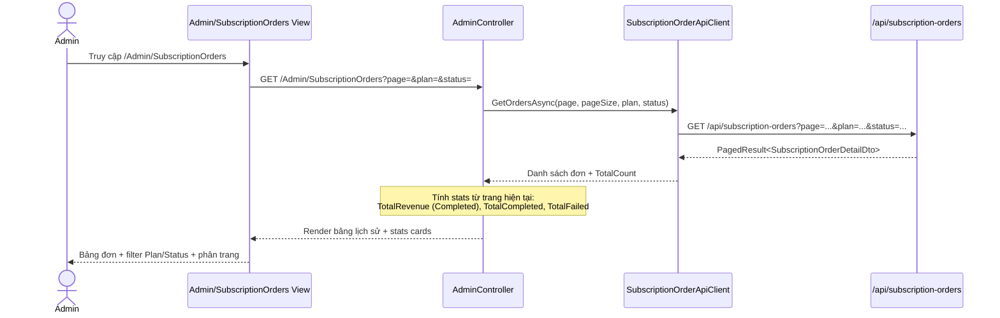
```mermaid
sequenceDiagram
    actor ADMIN as Admin
    participant VIEW as Admin/SubscriptionOrders View
    participant CTR as AdminController
    participant SVC as SubscriptionOrderApiClient
    participant API as /api/subscription-orders

    ADMIN->>VIEW: Truy cập /Admin/SubscriptionOrders
    VIEW->>CTR: GET /Admin/SubscriptionOrders?page=&plan=&status=
    CTR->>SVC: GetOrdersAsync(page, pageSize, plan, status)
    SVC->>API: GET /api/subscription-orders?page=...&plan=...&status=...
    API-->>SVC: PagedResult<SubscriptionOrderDetailDto>
    SVC-->>CTR: Danh sách đơn + TotalCount
    Note over CTR: Tính stats từ trang hiện tại:<br/>TotalRevenue (Completed), TotalCompleted, TotalFailed
    CTR-->>VIEW: Render bảng lịch sử + stats cards
    VIEW-->>ADMIN: Bảng đơn + filter Plan/Status + phân trang
```

---

### SD-W19: Theo dõi Thiết bị Online

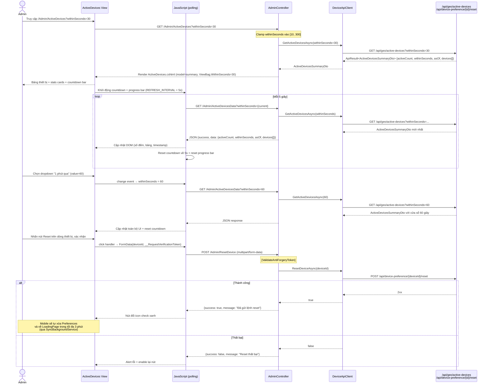
```mermaid
sequenceDiagram
    actor ADMIN as Admin
    participant VIEW as ActiveDevices View
    participant JS as JavaScript (polling)
    participant CTR as AdminController
    participant SVC as DeviceApiClient
    participant API as /api/geo/active-devices<br/>/api/device-preference/{id}/reset

    %% Tải trang lần đầu
    ADMIN->>VIEW: Truy cập /Admin/ActiveDevices?withinSeconds=30
    VIEW->>CTR: GET /Admin/ActiveDevices?withinSeconds=30
    Note over CTR: Clamp withinSeconds vào [10, 300]
    CTR->>SVC: GetActiveDevicesAsync(withinSeconds=30)
    SVC->>API: GET /api/geo/active-devices?withinSeconds=30
    API-->>SVC: ApiResult<ActiveDevicesSummaryDto> {activeCount, withinSeconds, asOf, devices[]}
    SVC-->>CTR: ActiveDevicesSummaryDto
    CTR-->>VIEW: Render ActiveDevices.cshtml (model=summary, ViewBag.WithinSeconds=30)
    VIEW-->>ADMIN: Bảng thiết bị + stats cards + countdown bar

    %% Vòng lặp tự động làm mới (mỗi 5 giây)
    VIEW->>JS: Khởi động countdown + progress bar (REFRESH_INTERVAL = 5s)
    loop Mỗi 5 giây
        JS->>CTR: GET /Admin/ActiveDevicesData?withinSeconds={current}
        CTR->>SVC: GetActiveDevicesAsync(withinSeconds)
        SVC->>API: GET /api/geo/active-devices?withinSeconds=...
        API-->>SVC: ActiveDevicesSummaryDto mới nhất
        CTR-->>JS: JSON {success, data: {activeCount, withinSeconds, asOf, devices[]}}
        JS-->>VIEW: Cập nhật DOM (số đếm, bảng, timestamp)
        JS->>JS: Reset countdown về 5s + reset progress bar
    end

    %% Admin thay đổi cửa sổ thời gian (dropdown: 30s/60s/120s/180s/300s)
    ADMIN->>VIEW: Chọn dropdown "1 phút qua" (value=60)
    VIEW->>JS: change event → withinSeconds = 60
    JS->>CTR: GET /Admin/ActiveDevicesData?withinSeconds=60
    CTR->>SVC: GetActiveDevicesAsync(60)
    SVC->>API: GET /api/geo/active-devices?withinSeconds=60
    API-->>SVC: ActiveDevicesSummaryDto với cửa sổ 60 giây
    CTR-->>JS: JSON response
    JS-->>VIEW: Cập nhật toàn bộ UI + reset countdown

    %% Reset thiết bị
    ADMIN->>VIEW: Nhấn nút Reset trên dòng thiết bị, xác nhận
    VIEW->>JS: click handler → FormData(deviceId, __RequestVerificationToken)
    JS->>CTR: POST /Admin/ResetDevice (multipart/form-data)
    Note over CTR: [ValidateAntiForgeryToken]
    CTR->>SVC: ResetDeviceAsync(deviceId)
    SVC->>API: POST /api/device-preference/{deviceId}/reset
    alt Thành công
        API-->>SVC: 2xx
        SVC-->>CTR: true
        CTR-->>JS: {success: true, message: "Đã gửi lệnh reset"}
        JS-->>VIEW: Nút đổi icon check xanh
        Note over VIEW,ADMIN: Mobile sẽ tự xóa Preferences<br/>và về LoadingPage trong tối đa 3 phút<br/>(qua SyncBackgroundService)
    else Thất bại
        SVC-->>CTR: false
        CTR-->>JS: {success: false, message: "Reset thất bại"}
        JS-->>VIEW: Alert lỗi + enable lại nút
    end
```

---

### SD-W20: Quản lý Tour

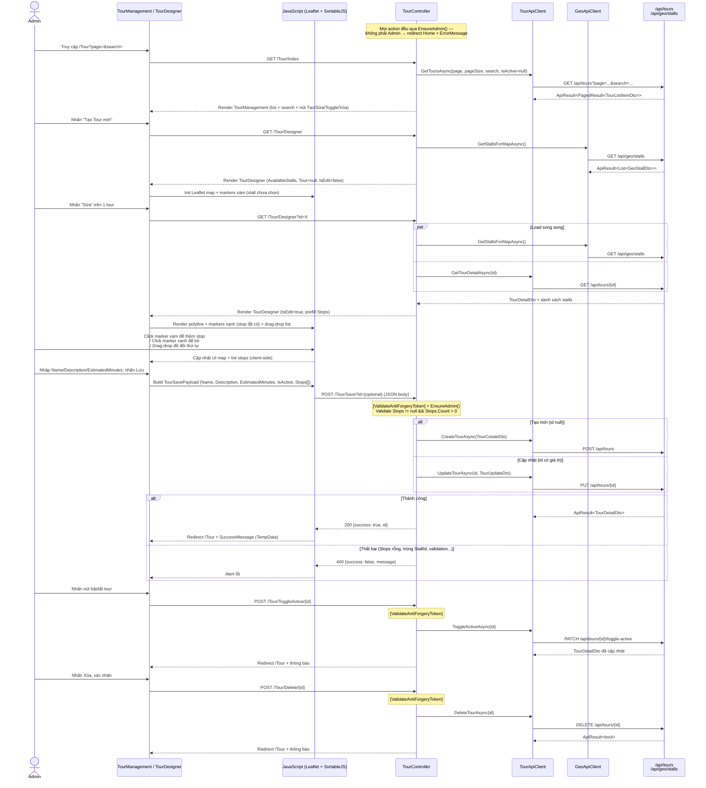
```mermaid
sequenceDiagram
    actor ADMIN as Admin
    participant VIEW as TourManagement / TourDesigner
    participant JS as JavaScript (Leaflet + SortableJS)
    participant CTR as TourController
    participant TOUR as TourApiClient
    participant GEO as GeoApiClient
    participant API as /api/tours<br/>/api/geo/stalls

    Note over CTR: Mọi action đều qua EnsureAdmin() —<br/>không phải Admin → redirect Home + ErrorMessage

    %% Xem danh sách
    ADMIN->>VIEW: Truy cập /Tour?page=&search=
    VIEW->>CTR: GET /Tour/Index
    CTR->>TOUR: GetToursAsync(page, pageSize, search, isActive=null)
    TOUR->>API: GET /api/tours?page=...&search=...
    API-->>TOUR: ApiResult<PagedResult<TourListItemDto>>
    CTR-->>VIEW: Render TourManagement (list + search + nút Tạo/Sửa/Toggle/Xóa)

    %% Mở Designer – tạo mới
    ADMIN->>VIEW: Nhấn "Tạo Tour mới"
    VIEW->>CTR: GET /Tour/Designer
    CTR->>GEO: GetStallsForMapAsync()
    GEO->>API: GET /api/geo/stalls
    API-->>GEO: ApiResult<List<GeoStallDto>>
    CTR-->>VIEW: Render TourDesigner (AvailableStalls, Tour=null, IsEdit=false)
    VIEW->>JS: Init Leaflet map + markers xám (stall chưa chọn)

    %% Mở Designer – chỉnh sửa
    ADMIN->>VIEW: Nhấn "Sửa" trên 1 tour
    VIEW->>CTR: GET /Tour/Designer?id=X
    par Load song song
        CTR->>GEO: GetStallsForMapAsync()
        GEO->>API: GET /api/geo/stalls
    and
        CTR->>TOUR: GetTourDetailAsync(id)
        TOUR->>API: GET /api/tours/{id}
    end
    API-->>CTR: TourDetailDto + danh sách stalls
    CTR-->>VIEW: Render TourDesigner (IsEdit=true, prefill Stops)
    VIEW->>JS: Render polyline + markers xanh (stop đã có) + drag-drop list

    %% Thao tác trên designer
    ADMIN->>JS: Click marker xám để thêm stop<br/>/ Click marker xanh để bỏ<br/>/ Drag-drop để đổi thứ tự
    JS-->>VIEW: Cập nhật UI map + list stops (client-side)

    %% Lưu tour (tạo mới hoặc cập nhật)
    ADMIN->>VIEW: Nhập Name/Description/EstimatedMinutes, nhấn Lưu
    VIEW->>JS: Build TourSavePayload (Name, Description, EstimatedMinutes, IsActive, Stops[])
    JS->>CTR: POST /Tour/Save?id={optional} (JSON body)
    Note over CTR: [ValidateAntiForgeryToken] + EnsureAdmin()<br/>Validate Stops != null && Stops.Count > 0
    alt Tạo mới (id null)
        CTR->>TOUR: CreateTourAsync(TourCreateDto)
        TOUR->>API: POST /api/tours
    else Cập nhật (id có giá trị)
        CTR->>TOUR: UpdateTourAsync(id, TourUpdateDto)
        TOUR->>API: PUT /api/tours/{id}
    end
    alt Thành công
        API-->>TOUR: ApiResult<TourDetailDto>
        CTR-->>JS: 200 {success: true, id}
        JS-->>VIEW: Redirect /Tour + SuccessMessage (TempData)
    else Thất bại (Stops rỗng, trùng StallId, validation...)
        CTR-->>JS: 400 {success: false, message}
        JS-->>VIEW: Alert lỗi
    end

    %% Toggle Active
    ADMIN->>VIEW: Nhấn nút bật/tắt tour
    VIEW->>CTR: POST /Tour/ToggleActive/{id}
    Note over CTR: [ValidateAntiForgeryToken]
    CTR->>TOUR: ToggleActiveAsync(id)
    TOUR->>API: PATCH /api/tours/{id}/toggle-active
    API-->>TOUR: TourDetailDto đã cập nhật
    CTR-->>VIEW: Redirect /Tour + thông báo

    %% Xóa
    ADMIN->>VIEW: Nhấn Xóa, xác nhận
    VIEW->>CTR: POST /Tour/Delete/{id}
    Note over CTR: [ValidateAntiForgeryToken]
    CTR->>TOUR: DeleteTourAsync(id)
    TOUR->>API: DELETE /api/tours/{id}
    API-->>TOUR: ApiResult<bool>
    CTR-->>VIEW: Redirect /Tour + thông báo
```

---

### SD-W21: Bản đồ nhiệt Vị trí Người dùng

```mermaid
sequenceDiagram
    actor ADMIN as Admin
    participant VIEW as Heatmap View
    participant JS as JavaScript (Leaflet + leaflet.heat)
    participant CTR as AdminController
    participant LOG as DeviceLocationLogApiClient
    participant GEO as GeoApiClient
    participant API as /api/device-location-log/heatmap<br/>/api/geo/stalls

    %% Tải trang lần đầu
    ADMIN->>VIEW: Truy cập /Admin/Heatmap
    VIEW->>CTR: GET /Admin/Heatmap?from=&to=&deviceId=
    Note over CTR: Mặc định: from = now-7 days, to = now (UTC)
    par Load song song (Task.WhenAll)
        CTR->>LOG: GetHeatmapAsync(fromUtc, toUtc, deviceId)
        LOG->>API: GET /api/device-location-log/heatmap?from=...&to=...&deviceId=...
        Note over API: AdminOnly. Group by (Lat, Lng) → HeatmapPointDto{Lat, Lng, Weight}.<br/>API trả 400 nếu (to-from) > 90 ngày
        API-->>LOG: ApiResult<List<HeatmapPointDto>>
    and
        CTR->>GEO: GetStallsForMapAsync()
        GEO->>API: GET /api/geo/stalls
        API-->>GEO: ApiResult<List<GeoStallDto>>
    end
    CTR-->>VIEW: Render Heatmap.cshtml (HeatmapViewModel: Points, Stalls, From, To, DeviceId)
    Note over VIEW: Preload JSON (camelCase) vào biến rawPoints / rawStalls<br/>(tránh gọi API client-side cross-origin)
    VIEW->>JS: Khởi tạo Leaflet map + OSM tile layer
    alt Có dữ liệu
        JS->>JS: Normalize weight về [0,1], build heatData [lat, lng, intensity]
        JS-->>VIEW: L.heatLayer(...).addTo(map) — gradient blue→cyan→lime→yellow→red
        JS->>JS: map.fitBounds(bounds dữ liệu)
    else Không có dữ liệu
        JS-->>VIEW: Chỉ hiển thị tile + stall markers, giữ view mặc định
    end
    JS-->>VIEW: Render stall markers (circle xanh) + vòng tròn radius từ rawStalls
    VIEW-->>ADMIN: Stats cards + bản đồ nhiệt + nút "Ẩn/Hiện gian hàng" / "Ẩn/Hiện tên"

    %% Lọc lại theo khoảng thời gian / device
    ADMIN->>VIEW: Chọn From/To/DeviceId, submit form (method=get)
    VIEW->>CTR: GET /Admin/Heatmap?from=...&to=...&deviceId=...
    Note over CTR,VIEW: Reload toàn trang — lặp lại toàn bộ flow trên
    CTR-->>VIEW: Render lại với dataset mới

    %% Tương tác client-side (không gọi API)
    ADMIN->>VIEW: Nhấn "Ẩn/Hiện gian hàng" / "Ẩn/Hiện tên"
    VIEW->>JS: Toggle showStalls / showLabels
    JS-->>VIEW: Re-render markers với tooltip permanent on/off
```
