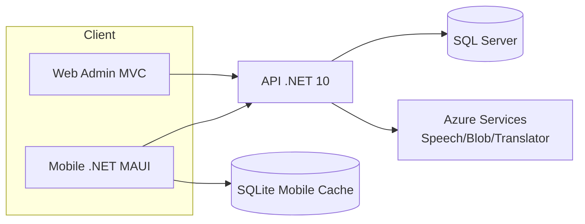
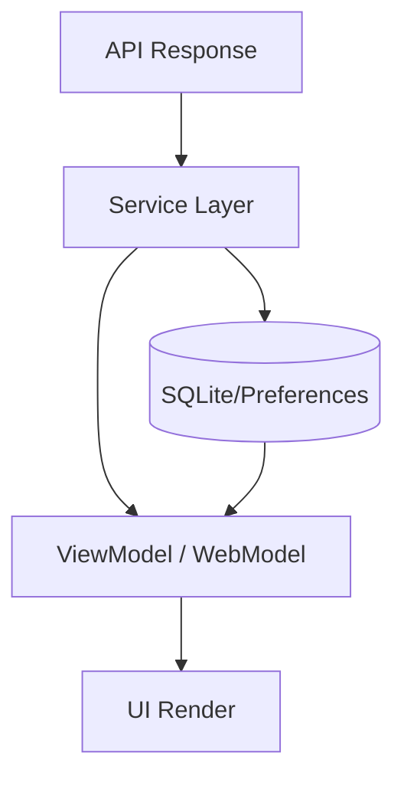

# PRD — Locate & Multilingual Narration System

> **Tài liệu yêu cầu sản phẩm (Product Requirements Document)**  
> Bản này đã được làm đẹp để preview rõ ràng, có mục lục điều hướng nhanh, và tách bạch phạm vi **[MOBILE]** / **[WEB]** / **[API]**.

---

## 📚 Mục lục

- [1. Tổng quan tài liệu](#1-tổng-quan-tài-liệu)
- [2. Bối cảnh sản phẩm](#2-bối-cảnh-sản-phẩm)
- [3. Mục tiêu & giá trị cốt lõi](#3-mục-tiêu--giá-trị-cốt-lõi)
- [4. Đối tượng người dùng (Personas)](#4-đối-tượng-người-dùng-personas)
- [5. Phạm vi triển khai](#5-phạm-vi-triển-khai)
  - [5.1 In Scope](#51-in-scope)
  - [5.2 Out of Scope](#52-out-of-scope)
- [6. Kiến trúc tổng quan](#6-kiến-trúc-tổng-quan)
- [7. Stack công nghệ](#7-stack-công-nghệ)
- [8. Yêu cầu chức năng chi tiết](#8-yêu-cầu-chức-năng-chi-tiết)
  - [8.1 MOBILE](#81-mobile)
  - [8.2 WEB](#82-web)
  - [8.3 API](#83-api)
- [9. Use Cases trọng yếu](#9-use-cases-trọng-yếu)
  - [9.1 MOBILE](#91-mobile)
  - [9.2 WEB](#92-web)
- [10. Data flow tổng quát](#10-data-flow-tổng-quát)
- [11. API Groups](#11-api-groups)
- [12. Phi chức năng (NFR)](#12-phi-chức-năng-nfr)
- [13. Rủi ro & khuyến nghị](#13-rủi-ro--khuyến-nghị)
- [14. Testing strategy](#14-testing-strategy)
- [15. Tài liệu liên quan](#15-tài-liệu-liên-quan)
- [16. Ghi chú phân tách bắt buộc](#16-ghi-chú-phân-tách-bắt-buộc)

---

## 1. Tổng quan tài liệu

Tài liệu này mô tả yêu cầu sản phẩm theo trạng thái triển khai thực tế của solution:

- `Mobile/` (.NET MAUI, .NET 10)
- `Web/` (ASP.NET Core MVC, .NET 10)
- `Api/` (ASP.NET Core Web API, .NET 10)

Mục tiêu:
1. Chuẩn hóa phạm vi chức năng theo từng kênh.
2. Làm baseline cho thiết kế, phát triển, kiểm thử, demo và handover.
3. Giảm nhầm lẫn giữa luồng **Mobile** và **Web Admin**.

---

## 2. Bối cảnh sản phẩm

Hệ thống phục vụ khu phố ẩm thực với hai nhóm sử dụng chính:

- **[MOBILE]** Khách tham quan (anonymous theo `DeviceId`)
- **[WEB]** Admin / BusinessOwner quản trị dữ liệu

Sản phẩm giải quyết bài toán:
- Cung cấp thuyết minh đa ngôn ngữ theo gian hàng.
- Hỗ trợ trải nghiệm map + QR + audio tại điểm đến.
- Cho phép quản trị nội dung tập trung trên web.

---

## 3. Mục tiêu & giá trị cốt lõi

| Nhóm mục tiêu | Mô tả |
|---|---|
| Trải nghiệm khách tham quan | Quét QR nhanh, chọn ngôn ngữ/giọng đọc, nghe narration theo stall |
| Vận hành nội dung | Admin/BusinessOwner cập nhật stall/media/narration thuận tiện |
| Độ ổn định ngoài thực địa | Hỗ trợ cache-first và offline fallback trên mobile |
| Khả năng mở rộng | Kiến trúc tách lớp Mobile/Web/API giúp mở rộng tính năng dễ dàng |

---

## 4. Đối tượng người dùng (Personas)

| Persona | Kênh | Mô tả |
|---|---|---|
| Visitor | [MOBILE] | Không cần tài khoản, truy cập bằng QR + DeviceId |
| BusinessOwner | [WEB] | Quản lý dữ liệu thuộc doanh nghiệp của mình |
| Admin | [WEB] | Quản trị toàn bộ hệ thống (user/role/language/subscription/QR) |

---

## 5. Phạm vi triển khai

### 5.1 In Scope

#### [MOBILE]
1. Startup routing (`LoadingPage`) theo DeviceId + QR validity + preference.
2. Scan QR (camera/gallery) và verify truy cập.
3. Chọn language/voice/speech rate/autoplay.
4. Bản đồ gian hàng + pin + popup + audio control.
5. Geofence queue autoplay theo GPS polling.
6. Cache-first stalls + audio cache + background sync.
7. Profile settings theo DeviceId.
8. Stall list (search/pagination).

#### [WEB]
1. Auth (login/register/logout).
2. Business / Stall management.
3. Stall location + geofence management.
4. Stall media management.
5. Narration content/audio management.
6. Language admin (Admin).
7. User/role admin.
8. Subscription/order management.
9. QR code admin/kiosk.

### 5.2 Out of Scope

- Social login.
- Push notification.
- Analytics realtime nâng cao.
- Collaboration workflow nâng cao.

---

## 6. Kiến trúc tổng quan

**Nguyên tắc phân tách:**
- **[MOBILE]** không truy cập SQL trực tiếp, chỉ qua API, lưu cache tại SQLite/Preferences.
- **[WEB]** không đặt business logic cốt lõi trong view.
- **[API]** là trung tâm xử lý nghiệp vụ và rule hệ thống.

---

## 7. Stack công nghệ

### [MOBILE]
- .NET MAUI (.NET 10)
- MVVM + DI
- Mapsui + OpenStreetMap
- ZXing.Net.Maui
- Plugin.Maui.Audio
- SQLite local cache (`sqlite-net-pcl`)
- Preferences (`DeviceId`, QR access, local preference)

### [WEB]
- ASP.NET Core MVC (.NET 10)
- HttpClientFactory + AuthTokenHandler
- Session token management
- Razor Views

### [API]
- ASP.NET Core Web API (.NET 10)
- EF Core + SQL Server
- JWT + Refresh Token
- Azure Speech / Blob / Translator

---

## 8. Yêu cầu chức năng chi tiết

### 8.1 MOBILE

| Mã | Chức năng | Mô tả |
|---|---|---|
| FR-M-01 | Startup Routing | `LoadingPage` điều hướng `ScanPage` / `MainPage` / `LanguagePage` |
| FR-M-02 | QR Verify | Verify QR với API, lưu expiry & trạng thái truy cập |
| FR-M-03 | Language/Voice | Tải active languages + voices theo language |
| FR-M-04 | Device Preference | Upsert preference theo DeviceId |
| FR-M-05 | Map & Pin | Hiển thị map, pin stall, geofence circles |
| FR-M-06 | Stall Popup | Hiển thị thông tin stall + image carousel + script |
| FR-M-07 | Audio Playback | Play/Pause/Stop narration, ưu tiên local audio |
| FR-M-08 | Geofence Queue | Poll GPS, enqueue stall vào vùng, phát tuần tự |
| FR-M-09 | Background Sync | Sync stalls + audio cache theo timer/reconnect |
| FR-M-10 | Location Batch | Buffer GPS và flush batch lên API |
| FR-M-11 | Profile | Cập nhật language/voice/speech rate/autoplay |
| FR-M-12 | Stall List | Search + pagination danh sách stall |

### 8.2 WEB

| Mã | Chức năng | Mô tả |
|---|---|---|
| FR-W-01 | Login/Register/Logout | Xác thực và quản lý phiên web |
| FR-W-02 | Business CRUD | Quản lý doanh nghiệp |
| FR-W-03 | Stall CRUD | Quản lý gian hàng |
| FR-W-04 | Stall Location | Quản lý tọa độ vị trí gian hàng |
| FR-W-05 | GeoFence CRUD | Quản lý vùng geofence |
| FR-W-06 | Stall Media | Upload/Cập nhật/Xóa ảnh |
| FR-W-07 | Narration Content | CRUD nội dung thuyết minh |
| FR-W-08 | Narration Audio | Quản lý audio narration |
| FR-W-09 | Language Management | Quản trị ngôn ngữ (Admin) |
| FR-W-10 | User/Role Management | Quản trị user/role (Admin) |
| FR-W-11 | Subscription/Order | Quản trị gói và đơn đăng ký |
| FR-W-12 | QR Management | Tạo/xem/xóa QR + kiosk flow |

### 8.3 API

| Mã | Chức năng | Mô tả |
|---|---|---|
| FR-A-01 | Auth API | Login/Register/Refresh/Logout |
| FR-A-02 | Geo API | Trả dữ liệu stalls/nearest stall cho mobile |
| FR-A-03 | DevicePreference API | Lưu/đọc preference theo DeviceId |
| FR-A-04 | Content API | CRUD business/stall/location/geofence/media/narration |
| FR-A-05 | QR API | Quản trị mã QR + verify QR cho mobile |
| FR-A-06 | User API | Quản trị user/role (Admin) |

---

## 9. Use Cases trọng yếu

### 9.1 MOBILE
1. UC-M01: Startup routing theo DeviceId/QR/preference.
2. UC-M02: Scan & verify QR.
3. UC-M03: Chọn language + voice và lưu preference.
4. UC-M04: Map interaction + chọn stall + popup.
5. UC-M05: Geofence autoplay queue.
6. UC-M06: Background sync + offline fallback.
7. UC-M07: Profile update.

### 9.2 WEB
1. UC-W01: Login.
2. UC-W02: Register BusinessOwner.
3. UC-W03: Business management.
4. UC-W04: Stall management.
5. UC-W05: Location/GeoFence management.
6. UC-W06: Narration content/audio management.
7. UC-W07: Language + User/Role admin.
8. UC-W08: Subscription + order flow.
9. UC-W09: QR admin flow.

> Sequence chi tiết: xem **`doc/sequence.md`**

---

## 10. Data flow tổng quát

Mô tả:
- **[MOBILE]** ưu tiên đọc cache trước rồi làm mới từ API.
- **[WEB]** luôn lấy dữ liệu API theo quyền hiện tại.

---

## 11. API Groups

### [MOBILE & WEB dùng chung]
- `/api/auth/*`
- `/api/geo/*`
- `/api/device-preference/*`
- `/api/languages/*`
- `/api/tts-voice-profiles/*`
- `/api/stall*`, `/api/business*`, `/api/stall-location*`, `/api/stall-geofence*`, `/api/stall-media*`
- `/api/stall-narration-content*`, `/api/narration-audio*`
- `/api/qrcodes*`
- `/api/subscription-orders*`
- `/api/users*`

---

## 12. Phi chức năng (NFR)

### 12.1 MOBILE
- Cache-first để tăng tốc hiển thị.
- Offline grace: đọc SQLite + local audio khi mất mạng.
- Timeout network hợp lý (10 giây cho client chính).
- Không crash khi API lỗi: có fallback/error message.

### 12.2 WEB
- Session + token handling ổn định.
- Phân trang/lọc dữ liệu quản trị.
- Phân quyền rõ theo Admin/BusinessOwner.

### 12.3 API
- Chuẩn response `ApiResult<T>` cho đa số endpoint.
- Stateless JWT, dễ scale ngang.
- Tích hợp cloud service theo service layer.

---

## 13. Rủi ro & khuyến nghị

### 13.1 Rủi ro
1. Logic map/geofence còn phân tán ở mobile page/viewmodel.
2. Chưa có test project chuyên sâu cho mobile flows.
3. Một số tài liệu cũ dùng tên flow chưa đồng bộ implementation hiện tại.

### 13.2 Khuyến nghị
1. Chuẩn hóa tài liệu theo implementation hiện tại (đã làm trong bản này).
2. Bổ sung unit/integration test cho startup, QR, geofence queue.
3. Tách thêm orchestration map để tăng testability.
4. Chuẩn hóa base-url và config môi trường.

---

## 14. Testing strategy

| Nhóm | Trọng tâm | Ví dụ |
|---|---|---|
| Unit test | Logic service/viewmodel | QR validity, geofence queue, mapping |
| Integration test | Luồng endpoint + data | DevicePreference upsert/get |
| UI/Flow test | End-to-end critical path | Scan -> Language -> Map -> Play |

---

## 15. Tài liệu liên quan

- `doc/mobile.md`
- `doc/sequence.md`
- `doc/PRD_docs_original.md`
- `doc/Sequence Diagrams – Web Admin.md`
- `.claude/CLAUDE.md`

---

## 16. Ghi chú phân tách bắt buộc

- Mục có tiền tố **[MOBILE]**: chỉ áp dụng cho app .NET MAUI.
- Mục có tiền tố **[WEB]**: chỉ áp dụng cho cổng quản trị MVC.
- Mục có tiền tố **[API]**: chỉ áp dụng cho backend.
- Mục chung sẽ ghi rõ **[MOBILE & WEB]**.
