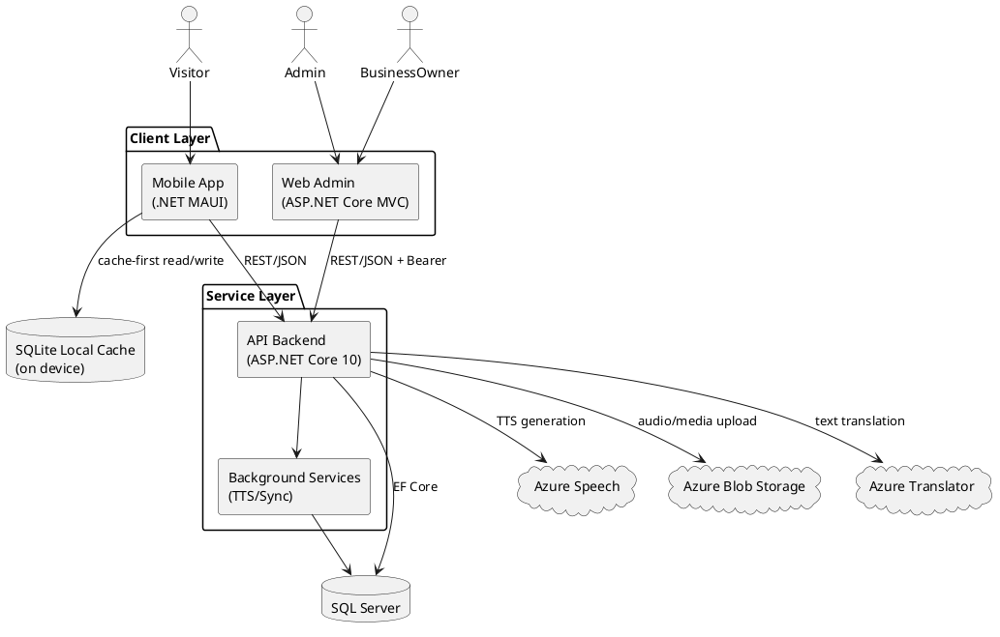
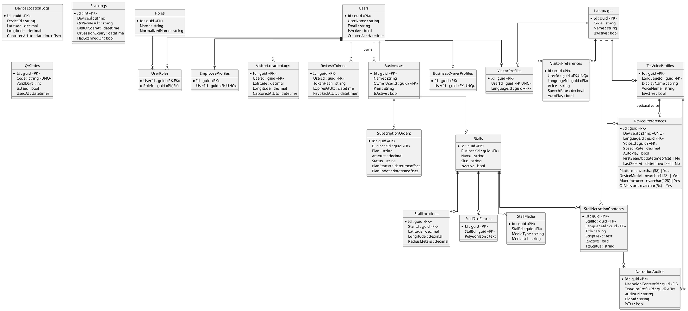
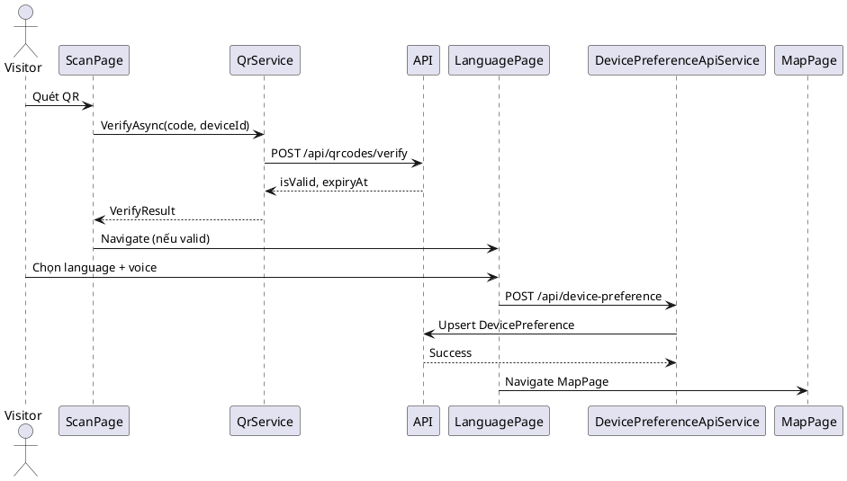
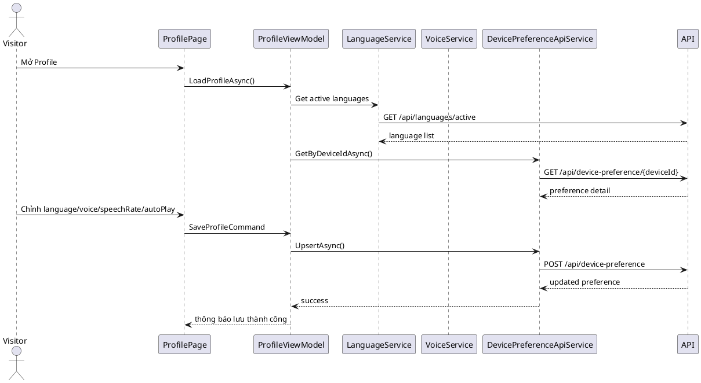
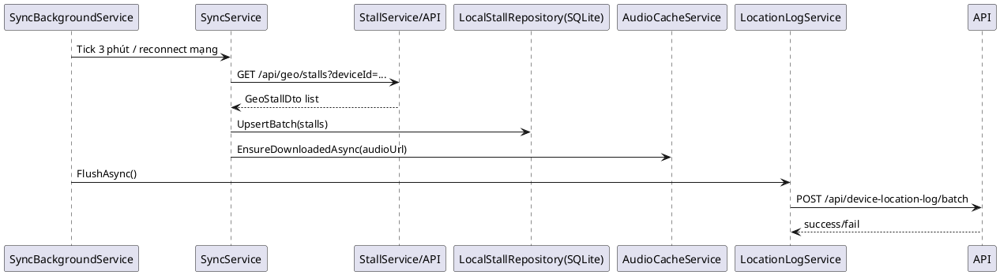
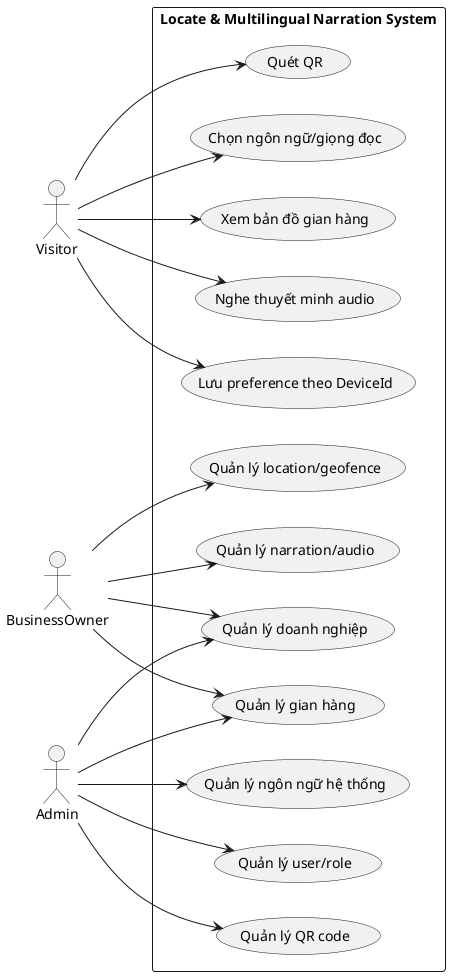
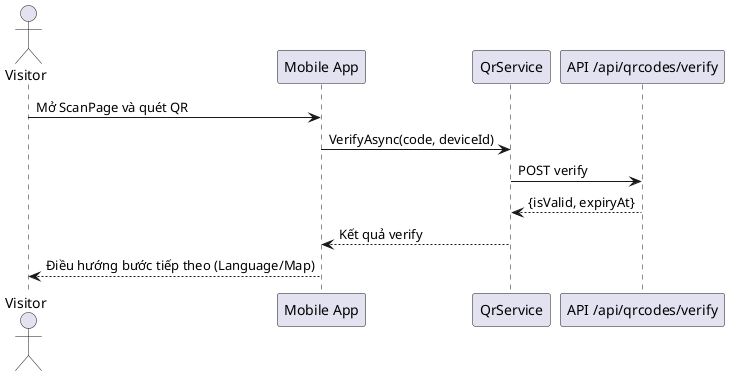
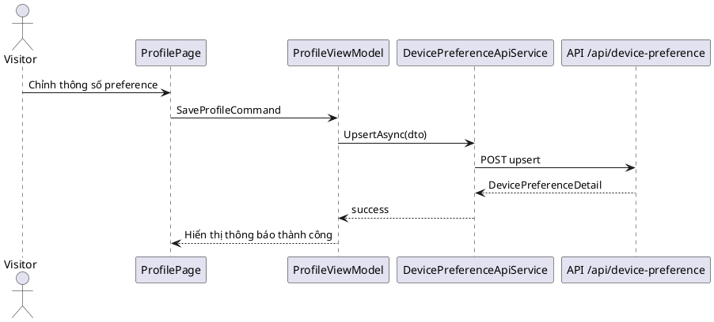

# PRD 2.0 — Hệ thống Thuyết minh Tự động Đa ngôn ngữ cho Phố Ẩm Thực  
## Locate & Multilingual Narration System

---

## 1. Trang bìa & Thông tin chung

| Thuộc tính | Nội dung |
|---|---|
| Tên dự án (VI) | **Hệ thống Thuyết minh Tự động Đa ngôn ngữ cho Phố Ẩm Thực** |
| Tên dự án (EN) | **Locate & Multilingual Narration System** |
| Loại tài liệu | Product Requirements Document (PRD) |
| Phiên bản | **2.0** |
| Ngày cập nhật | 16/04/2026 |
| Trạng thái | Đang phát triển & hoàn thiện |
| Đơn vị thực hiện | Nhóm đồ án tốt nghiệp CNTT |
| Đối tượng đọc | Hội đồng, giảng viên hướng dẫn, BA/PM, Dev, QA |
| Mục tiêu tài liệu | Chuẩn hóa yêu cầu sản phẩm, làm cơ sở phát triển, kiểm thử, nghiệm thu và bảo vệ đồ án |

---

## 2. Mục lục

- [1. Trang bìa & Thông tin chung](#1-trang-bìa--thông-tin-chung)
- [2. Mục lục](#2-mục-lục)
- [3. Tổng quan sản phẩm](#3-tổng-quan-sản-phẩm)
- [4. Vấn đề & Mục tiêu](#4-vấn-đề--mục-tiêu)
- [5. Người dùng mục tiêu (User Personas)](#5-người-dùng-mục-tiêu-user-personas)
- [6. Phạm vi sản phẩm](#6-phạm-vi-sản-phẩm)
- [7. Kiến trúc hệ thống tổng quan](#7-kiến-trúc-hệ-thống-tổng-quan)
- [8. Mô hình dữ liệu (ERD & Domain Model)](#8-mô-hình-dữ-liệu-erd--domain-model)
- [9. Yêu cầu chức năng](#9-yêu-cầu-chức-năng)
- [10. Luồng người dùng & Sequence Diagrams](#10-luồng-người-dùng--sequence-diagrams)
- [11. API Endpoints chính](#11-api-endpoints-chính)
- [12. Tích hợp dịch vụ ngoài](#12-tích-hợp-dịch-vụ-ngoài)
- [13. Yêu cầu phi chức năng](#13-yêu-cầu-phi-chức-năng)
- [14. Quyết định kỹ thuật quan trọng](#14-quyết-định-kỹ-thuật-quan-trọng)
- [15. Backlog & Tính năng chưa triển khai](#15-backlog--tính-năng-chưa-triển-khai)
- [16. Phụ lục](#16-phụ-lục)

---

## 3. Tổng quan sản phẩm

### 3.1 Mô tả sản phẩm
Hệ thống hỗ trợ khách tham quan Phố Ẩm Thực trải nghiệm thông tin gian hàng qua **bản đồ tương tác** và **thuyết minh audio đa ngôn ngữ**. Người dùng mobile hoạt động theo mô hình **anonymous (DeviceId-based)**, không bắt buộc đăng nhập. Dữ liệu và nội dung được quản trị tập trung qua cổng Web Admin, phục vụ bởi API Backend.

### 3.2 Thành phần hệ thống

| Thành phần | Mô tả | Người dùng chính |
|---|---|---|
| Mobile App (.NET MAUI) | Quét QR, chọn ngôn ngữ/giọng đọc, xem bản đồ, phát audio, cache offline, sync nền | Visitor |
| API Backend (ASP.NET Core 10) | Xử lý nghiệp vụ, xác thực, dữ liệu địa lý, preference, QR verify, narration/audio, tích hợp Azure | Tất cả client |
| Web Admin (ASP.NET Core MVC) | Quản trị doanh nghiệp, gian hàng, nội dung thuyết minh, media, người dùng, subscription | Admin, BusinessOwner |
| Shared (.NET 10 Class Library) | DTO dùng chung giữa Mobile/API/Web | Dev team |

### 3.3 Stack công nghệ (thực tế theo code)

| Nhóm | Công nghệ |
|---|---|
| Mobile | .NET MAUI (.NET 10), CommunityToolkit.Maui, Mapsui.Maui, ZXing.Net.Maui, Plugin.Maui.Audio, sqlite-net-pcl |
| Backend | ASP.NET Core Web API (.NET 10), EF Core 10, SQL Server, JWT Bearer, Hosted Service |
| Web Admin | ASP.NET Core MVC, Session, HttpClientFactory, AuthTokenHandler |
| Cloud | Azure Speech, Azure Blob Storage, Azure Translator |
| Hạ tầng dữ liệu | SQL Server (server), SQLite local cache (mobile) |

---

## 4. Vấn đề & Mục tiêu

### 4.1 Vấn đề thực tiễn
1. Khách tham quan khó tiếp cận thông tin gian hàng theo ngôn ngữ phù hợp.
2. Thuyết minh thủ công phụ thuộc nhân sự, thiếu đồng nhất.
3. Môi trường sự kiện đông người có thể mạng yếu/không ổn định.
4. Cần cơ chế quản trị nội dung tập trung và cập nhật nhanh.

### 4.2 Mục tiêu sản phẩm & KPI

| Mục tiêu | KPI đo lường | Ngưỡng mục tiêu |
|---|---|---|
| Tối ưu onboarding khách | Tỷ lệ vào MapPage thành công sau startup | ≥ 95% |
| Hỗ trợ đa ngôn ngữ | Số ngôn ngữ active + voice active khả dụng | ≥ 10 ngôn ngữ, voice theo ngôn ngữ |
| Cá nhân hóa theo thiết bị | Tỷ lệ lưu/đọc DevicePreference thành công | ≥ 98% |
| Trải nghiệm ổn định | Tỷ lệ crash phiên sử dụng | < 1% |
| Hỗ trợ offline cơ bản | Tỷ lệ hiển thị stall từ SQLite khi mất mạng | ≥ 90% trường hợp đã sync |
| Hiệu quả vận hành nội dung | Thời gian tạo/chỉnh sửa narration trên admin | < 5 phút/nội dung |

---

## 5. Người dùng mục tiêu (User Personas)

| Persona | Vai trò | Nhu cầu | Kịch bản điển hình |
|---|---|---|---|
| Visitor (Khách tham quan) | Người dùng mobile, anonymous | Quét QR nhanh, nghe audio ngôn ngữ phù hợp, xem vị trí gian hàng gần nhất | Mở app → Scan QR → chọn Language/Voice → vào Map → nghe narration |
| BusinessOwner | Chủ/đại diện doanh nghiệp | Quản lý gian hàng, media, nội dung narration | Đăng nhập web → cập nhật nội dung và audio |
| Admin | Quản trị hệ thống | Quản lý người dùng, role, language, giám sát toàn hệ thống | Quản trị danh mục và phân quyền |

---

## 6. Phạm vi sản phẩm

### 6.1 In Scope

**Mobile App**
- Startup định tuyến theo `DeviceId + QR validity + local preference`.
- Quét QR và verify phiên truy cập.
- Chọn ngôn ngữ/giọng đọc.
- Bản đồ gian hàng với Mapsui, chọn stall, popup thông tin.
- Phát audio (Play/Pause/Stop), ưu tiên local cache.
- Polling GPS qua service chuyên biệt (`IGpsPollingService`) và geofence queue.
- Offline SQLite cache + background sync định kỳ.

**API Backend**
- Auth (register/login/refresh/logout).
- DevicePreference theo DeviceId.
- Geo stalls, nearest stall.
- CRUD nghiệp vụ chính (Business, Stall, Location, GeoFence, Media, Narration).
- QR Code quản trị và verify.
- DeviceLocationLog batch ingest.

**Web Admin**
- Đăng nhập, quản trị business/stall/location/geofence/media/narration.
- Quản lý user/role (Admin).
- Quản lý gói subscription cơ bản.

### 6.2 Out of Scope (v2.0)
- Social login (Google/Apple/Facebook).
- BI dashboard nâng cao, analytics chuyên sâu.
- Audit log đầy đủ mức enterprise.
- Push notification.
- Realtime collaboration biên tập nội dung.

---

## 7. Kiến trúc hệ thống tổng quan

### 7.1 Mô tả kiến trúc
- Kiến trúc 3 lớp chính: **Client (Mobile/Web) → API → Database/Cloud Services**.
- Mobile áp dụng chiến lược **cache-first**, ưu tiên đọc SQLite trước khi gọi API.
- API là trung tâm nghiệp vụ, phân quyền qua JWT, cung cấp endpoint cho cả mobile và web admin.
- Dịch vụ Azure tách riêng vai trò: Speech (TTS), Blob (lưu audio/media), Translator (dịch nội dung).

### 7.2 Sơ đồ kiến trúc (PlantUML)


### 7.3 Cấu trúc solution
```plaintext
Exam/
├─ Api/      (ASP.NET Core Web API)
├─ Mobile/   (.NET MAUI)
├─ Web/      (ASP.NET Core MVC Admin)
├─ Shared/   (DTOs dùng chung)
└─ TestAPI/  (test project)
```

---

## 8. Mô hình dữ liệu (ERD & Domain Model)

### 8.1 ERD (PlantUML)



### 8.2 Danh sách entities/table (23 bảng)

| # | Entity | Table |
|---|---|---|
| 1 | User | Users |
| 2 | Role | Roles |
| 3 | UserRole | UserRoles |
| 4 | RefreshToken | RefreshTokens |
| 5 | Business | Businesses |
| 6 | BusinessOwnerProfile | BusinessOwnerProfiles |
| 7 | EmployeeProfile | EmployeeProfiles |
| 8 | Stall | Stalls |
| 9 | StallLocation | StallLocations |
| 10 | StallGeoFence | StallGeoFences |
| 11 | StallMedia | StallMedia |
| 12 | Language | Languages |
| 13 | TtsVoiceProfile | TtsVoiceProfiles |
| 14 | StallNarrationContent | StallNarrationContents |
| 15 | NarrationAudio | NarrationAudios |
| 16 | DevicePreference | DevicePreferences |
| 17 | VisitorProfile | VisitorProfiles |
| 18 | VisitorPreference | VisitorPreferences |
| 19 | VisitorLocationLog | VisitorLocationLogs |
| 20 | DeviceLocationLog | DeviceLocationLogs |
| 21 | ScanLog | ScanLogs |
| 22 | SubscriptionOrder | SubscriptionOrders |
| 23 | QrCode | QrCodes |

### 8.3 Chi tiết cột các bảng quan trọng

#### a) Users

| Column | Type | Nullable | PK/FK | Description |
|---|---|---|---|---|
| Id | uniqueidentifier | No | PK | Định danh user |
| UserName | nvarchar(256) | Yes |  | Tên đăng nhập |
| NormalizedUserName | nvarchar(256) | Yes |  | Chuẩn hóa username |
| Email | nvarchar(256) | Yes |  | Email |
| NormalizedEmail | nvarchar(256) | Yes |  | Chuẩn hóa email |
| PasswordHash | nvarchar(256) | Yes |  | BCrypt hash |
| PhoneNumber | nvarchar(32) | Yes |  | Số điện thoại |
| DisplayName | nvarchar(256) | Yes |  | Tên hiển thị |
| IsActive | bit | No |  | Trạng thái hoạt động |
| CreatedAt | datetime2(3) | No |  | Thời điểm tạo |
| UpdatedAt | datetime2(3) | No |  | Thời điểm cập nhật |
| LastLoginAt | datetime2(3) | Yes |  | Đăng nhập gần nhất |

#### b) Stalls

| Column | Type | Nullable | PK/FK | Description |
|---|---|---|---|---|
| Id | uniqueidentifier | No | PK | Định danh gian hàng |
| BusinessId | uniqueidentifier | No | FK -> Businesses.Id | Thuộc doanh nghiệp |
| Name | nvarchar(128) | No |  | Tên gian hàng |
| Slug | nvarchar(256) | No | Unique | Định danh URL-friendly |
| Description | nvarchar(256) | Yes |  | Mô tả |
| ContactPhone | nvarchar(16) | Yes |  | Liên hệ |
| ContactEmail | nvarchar(256) | Yes |  | Liên hệ email |
| IsActive | bit | No |  | Trạng thái hiển thị |
| CreatedAt | datetimeoffset | No |  | Ngày tạo |
| UpdatedAt | datetimeoffset | Yes |  | Ngày cập nhật |

#### c) DevicePreferences

| Column | Type | Nullable | PK/FK | Description |
|---|---|---|---|---|
| Id | uniqueidentifier | No | PK | Định danh |
| DeviceId | nvarchar(128) | No | Unique | Định danh thiết bị |
| LanguageId | uniqueidentifier | No | FK -> Languages.Id | Ngôn ngữ ưu tiên |
| VoiceId | uniqueidentifier | Yes | FK -> TtsVoiceProfiles.Id | Giọng đọc ưu tiên |
| SpeechRate | decimal(4,2) | No |  | Tốc độ đọc |
| AutoPlay | bit | No |  | Tự động phát |
| Platform | nvarchar(32) | Yes |  | Nền tảng thiết bị |
| DeviceModel | nvarchar(128) | Yes |  | Model |
| Manufacturer | nvarchar(128) | Yes |  | Hãng sản xuất |
| OsVersion | nvarchar(64) | Yes |  | Phiên bản OS |
| FirstSeenAt | datetimeoffset | No |  | Lần đầu ghi nhận |
| LastSeenAt | datetimeoffset | No |  | Lần gần nhất |

#### d) Languages

| Column | Type | Nullable | PK/FK | Description |
|---|---|---|---|---|
| Id | uniqueidentifier | No | PK | Định danh ngôn ngữ |
| Code | nvarchar(16) | No | Unique | Mã locale (vd: vi-VN) |
| Name | nvarchar(64) | No |  | Tên ngôn ngữ |
| DisplayName | nvarchar(64) | Yes |  | Tên hiển thị |
| FlagCode | nvarchar(8) | Yes |  | Mã cờ |
| IsActive | bit | No |  | Kích hoạt |

#### e) StallNarrationContents

| Column | Type | Nullable | PK/FK | Description |
|---|---|---|---|---|
| Id | uniqueidentifier | No | PK | Định danh nội dung |
| StallId | uniqueidentifier | No | FK -> Stalls.Id | Thuộc gian hàng |
| LanguageId | uniqueidentifier | No | FK -> Languages.Id | Ngôn ngữ nội dung |
| Title | nvarchar(128) | No |  | Tiêu đề |
| Description | nvarchar(256) | Yes |  | Mô tả ngắn |
| ScriptText | nvarchar(max) | No |  | Kịch bản thuyết minh |
| IsActive | bit | No |  | Trạng thái |
| TtsStatus | nvarchar(32) | No |  | Trạng thái sinh TTS |
| TtsError | nvarchar(512) | Yes |  | Thông tin lỗi TTS |
| UpdatedAt | datetimeoffset | Yes |  | Cập nhật gần nhất |

#### f) NarrationAudios

| Column | Type | Nullable | PK/FK | Description |
|---|---|---|---|---|
| Id | uniqueidentifier | No | PK | Định danh audio |
| NarrationContentId | uniqueidentifier | No | FK -> StallNarrationContents.Id | Nội dung gốc |
| TtsVoiceProfileId | uniqueidentifier | Yes | FK -> TtsVoiceProfiles.Id | Voice dùng để sinh |
| AudioUrl | nvarchar(512) | Yes |  | URL phát audio |
| BlobId | nvarchar(128) | Yes |  | ID blob |
| Voice | nvarchar(64) | Yes |  | Tên voice |
| Provider | nvarchar(64) | Yes |  | Nhà cung cấp |
| DurationSeconds | int | Yes |  | Thời lượng |
| IsTts | bit | No |  | Có phải audio TTS |
| UpdatedAt | datetimeoffset | Yes |  | Cập nhật |

---

## 9. Yêu cầu chức năng

### 9.1 Mobile App (FR-M-xx)

| Mã | Tên yêu cầu | Mô tả |
|---|---|---|
| FR-M-01 | Startup Routing | LoadingPage định tuyến theo DeviceId, QR validity, local cache preference |
| FR-M-02 | QR Verify | Quét QR, gọi verify API, lưu expiry vào Preferences |
| FR-M-03 | Language Selection | Tải `languages/active`, tìm kiếm và chọn ngôn ngữ |
| FR-M-04 | Voice Selection | Tải voice theo language, chọn giọng đọc |
| FR-M-05 | Device Preference Upsert | Lưu `language/voice/speechRate/autoPlay` theo DeviceId |
| FR-M-06 | Map Rendering | Hiển thị pin gian hàng + geofence trên Mapsui |
| FR-M-07 | Geofence Queue | Poll GPS qua `IGpsPollingService`, tự động queue audio khi vào vùng |
| FR-M-08 | Audio Control | Play/Pause/Stop; ưu tiên local file khi có |
| FR-M-09 | Offline Cache | Đọc stall từ SQLite khi mất mạng |
| FR-M-10 | Background Sync | Đồng bộ định kỳ 3 phút + khi mạng phục hồi |
| FR-M-11 | Profile Settings | Cập nhật preference từ trang Profile |
| FR-M-12 | Device Location Batch | Thu thập GPS và gửi batch lên API |

### 9.2 Web Admin (FR-W-xx)

| Mã | Tên yêu cầu | Mô tả |
|---|---|---|
| FR-W-01 | Auth | Login/Register/Logout |
| FR-W-02 | Business Management | CRUD doanh nghiệp, cập nhật subscription |
| FR-W-03 | Stall Management | CRUD gian hàng |
| FR-W-04 | Stall Location | CRUD tọa độ, bán kính |
| FR-W-05 | GeoFence Management | CRUD geofence/polygon |
| FR-W-06 | Stall Media | Upload/CRUD media |
| FR-W-07 | Narration Content | CRUD nội dung thuyết minh đa ngôn ngữ |
| FR-W-08 | Narration Audio | Upload human audio / quản lý audio |
| FR-W-09 | Language Admin | Quản lý language active/inactive (Admin) |
| FR-W-10 | User & Role Admin | Quản lý user, role (Admin) |

### 9.3 API Backend (tóm tắt)
- Cung cấp endpoint cho Mobile/Web theo chuẩn REST.
- Áp dụng JWT Bearer + policy authorization.
- Chuẩn hóa phản hồi qua `ApiResult<T>` (trừ một số endpoint legacy/raw).
- Hỗ trợ phân trang, lọc, tìm kiếm cho các endpoint quản trị.

---

## 10. Luồng người dùng & Sequence Diagrams

### 10.1 Flow 1: QR → Language/Voice → Map



### 10.2 Flow 2: Profile cập nhật preference



### 10.3 Flow 3: Background Sync + GPS sampling



---

## 11. API Endpoints chính

> Tóm tắt từ `api-endpoints-summary.txt` + rà soát controller hiện tại.

| Nhóm | Method | Endpoint | Auth | Mục đích |
|---|---|---|---|---|
| Auth | POST | `/api/Auth/register/business-owner` | Anonymous | Đăng ký BusinessOwner |
| Auth | POST | `/api/Auth/login` | Anonymous | Đăng nhập, cấp token |
| Auth | POST | `/api/Auth/refresh` | Anonymous | Làm mới access token |
| Auth | POST | `/api/Auth/logout` | Bearer | Thu hồi refresh token |
| Geo | GET | `/api/geo/stalls?deviceId=` | Anonymous | Lấy dữ liệu map |
| Language | GET | `/api/languages/active` | Anonymous | Danh sách ngôn ngữ active |
| Voice | GET | `/api/tts-voice-profiles/active?languageId=` | Anonymous | Danh sách voice active |
| Device Preference | GET | `/api/device-preference/{deviceId}` | Anonymous | Lấy preference theo device |
| Device Preference | POST | `/api/device-preference` | Anonymous | Upsert preference |
| QR | POST | `/api/qrcodes/verify` | Anonymous | Verify mã QR |
| QR | GET/POST/DELETE | `/api/qrcodes...` | Admin | Quản trị QR code |
| Device Log | POST | `/api/device-location-log/batch` | Anonymous | Nhận batch GPS |
| Business | GET/POST/PUT | `/api/Business...` | Bearer | Quản trị doanh nghiệp |
| Stall | GET/POST/PUT | `/api/Stall...` | Bearer | Quản trị gian hàng |
| Stall (public) | GET | `/api/stalls`, `/api/stalls/{id}` | Anonymous | Endpoint public map |
| Narration Content | CRUD | `/api/stall-narration-content...` | Bearer | Quản trị nội dung |
| Narration Audio | PUT | `/api/narration-audio/{id}/upload` | Bearer | Upload human audio |
| User | GET/POST/PUT | `/api/User...` | Bearer/Admin | Quản trị user-role |

---

## 12. Tích hợp dịch vụ ngoài

| Dịch vụ | Mục đích | Cách sử dụng |
|---|---|---|
| Azure Speech | Sinh TTS từ script | API gọi service tạo audio |
| Azure Blob Storage | Lưu audio/media | API upload blob, trả URL |
| Azure Translator | Dịch nội dung narration | API translation service |
| Mapsui + OSM | Hiển thị bản đồ | Mobile MapPage |
| ZXing.Net.MAUI | Quét QR | Mobile ScanPage |
| Plugin.Maui.Audio | Phát audio | Mobile AudioGuideService |
| SQLite | Cache cục bộ | LocalStallRepository |

---

## 13. Yêu cầu phi chức năng

| Nhóm | Yêu cầu | Mục tiêu |
|---|---|---|
| Performance | Startup nhanh, map render mượt | ≤ 3s vào màn hình chính (điều kiện thường) |
| Reliability | Không crash khi API lỗi/mất mạng | Có fallback local, xử lý exception |
| Security | JWT + role policy | Bảo vệ endpoint quản trị |
| Offline | Cache-first + audio local | Vẫn hiển thị dữ liệu đã sync |
| Scalability | API stateless, cloud storage | Dễ scale ngang |
| Maintainability | Tách service, DI, DTO shared | Dễ bảo trì/mở rộng |
| Logging/Observability | Logging theo tầng | Dễ truy vết sự cố |

---

## 14. Quyết định kỹ thuật quan trọng

| Quyết định | Lý do |
|---|---|
| DeviceId-based anonymous model | Giảm friction onboarding, phù hợp khách tham quan |
| Cache-first trên mobile | Tối ưu UX trong môi trường mạng không ổn định |
| Tách `GpsPollingService` khỏi `MapViewModel` | Giảm coupling UI, tăng khả năng test và tái sử dụng |
| Dùng Mapsui/OSM | Không phụ thuộc map provider trả phí |
| API response chuẩn `ApiResult<T>` | Đồng nhất xử lý lỗi trên client |
| Dùng SQLite + audio cache | Tăng khả năng hoạt động offline |
| DI toàn hệ thống | Quản lý vòng đời service rõ ràng |

---

## 15. Backlog & Tính năng chưa triển khai

### 15.1 Ưu tiên P1

| ID | Hạng mục | Mô tả | Trạng thái |
|---|---|---|---|
| P1-01 | Featured stalls MainPage | Hiển thị đầy đủ hình/chi tiết/khoảng cách | Đang làm |
| P1-02 | Nearest Stall flow | Tối ưu focus theo vị trí gần nhất | Đang làm |
| P1-03 | Haversine hiển thị khoảng cách | Đồng nhất khoảng cách UI | Chưa xong |
| P1-04 | 401 global handling | Xử lý token hết hạn đồng bộ client | Chưa xong |

### 15.2 Ưu tiên P2

| ID | Hạng mục | Mô tả | Trạng thái |
|---|---|---|---|
| P2-01 | Offline/audio lifecycle | Ổn định khi app sleep/resume | Đang làm |
| P2-02 | Stall search | Tìm kiếm trên map/home | Chưa xong |
| P2-03 | Test thiết bị thật | GPS/Camera/Audio thực địa | Cần thực hiện |
| P2-04 | Báo cáo kiểm thử hoàn chỉnh | Sequence/Test evidence | Cần bổ sung |

---

## 16. Phụ lục

### 16.1 Glossary

| Thuật ngữ | Giải thích |
|---|---|
| DeviceId | Định danh duy nhất của thiết bị mobile |
| Geofence | Vùng địa lý dùng trigger hành vi |
| Narration | Nội dung thuyết minh của gian hàng |
| TTS | Text-to-Speech |
| Cache-first | Ưu tiên đọc dữ liệu local trước API |
| Sync Background | Đồng bộ nền theo chu kỳ và trạng thái mạng |

### 16.2 References
- `PRD_2.0.txt`
- `PRD_extracted.txt`
- `Mobile/README.txt`
- `Mobile/Sequence_UserFlow_Report.txt`
- `api-endpoints-summary.txt`
- `Project_Summary_Todo.txt`
- Source code thực tế (`Api`, `Mobile`, `Web`, `Shared`)

### 16.3 Use Case Diagram (PlantUML)



### 16.4 Use Case Sequence UML (bổ sung)

#### UC-01: Khách tham quan quét QR và vào bản đồ

| Mục | Nội dung |
|---|---|
| Use Case ID | UC-01 |
| Actor chính | Visitor |
| Tiền điều kiện | App đã cài trên thiết bị, có quyền camera |
| Hậu điều kiện | QR hợp lệ được xác nhận, người dùng vào MapPage |
| Luồng chính | Mở ScanPage → Quét QR → Verify API → Điều hướng Language/Map |



#### UC-02: Cập nhật preference ngôn ngữ/giọng đọc

| Mục | Nội dung |
|---|---|
| Use Case ID | UC-02 |
| Actor chính | Visitor |
| Tiền điều kiện | Có DeviceId hợp lệ |
| Hậu điều kiện | Preference mới được lưu trên server và local |
| Luồng chính | Chọn language + voice + speech rate + auto play → Upsert API |



#### UC-03: Đồng bộ nền và ghi nhận GPS batch

| Mục | Nội dung |
|---|---|
| Use Case ID | UC-03 |
| Actor chính | Hệ thống (Background Service) |
| Tiền điều kiện | App đang chạy, có dữ liệu GPS trong buffer |
| Hậu điều kiện | Dữ liệu stall được đồng bộ, GPS được flush theo batch |
| Luồng chính | Timer/Reconnect → Sync stalls/audio → Flush location logs |

```plantuml
@startuml
participant "SyncBackgroundService" as BG
participant "SyncService" as Sync
participant "LocationLogService" as Loc
participant "API /api/geo/stalls" as GeoApi
participant "API /api/device-location-log/batch" as LogApi

BG -> Sync : Tick định kỳ / mạng reconnect
Sync -> GeoApi : GET stalls?deviceId=...
GeoApi --> Sync : Danh sách stall
BG -> Loc : FlushAsync()
Loc -> LogApi : POST location batch
LogApi --> Loc : success/fail
@enduml
