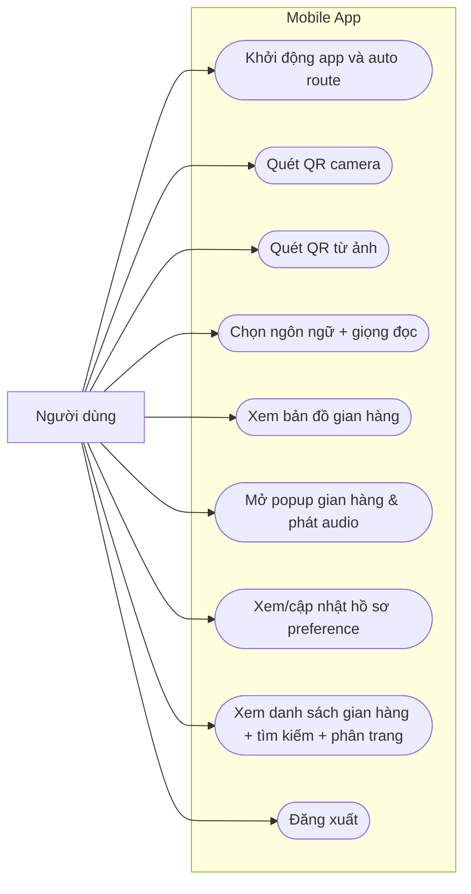
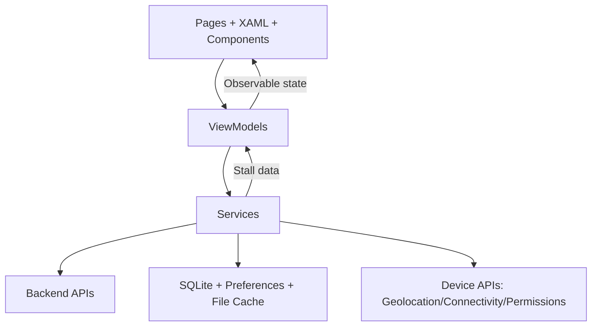
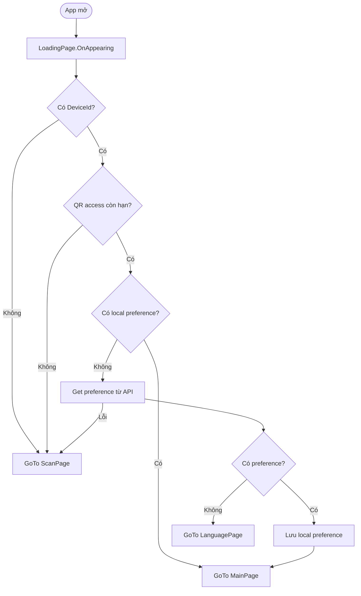
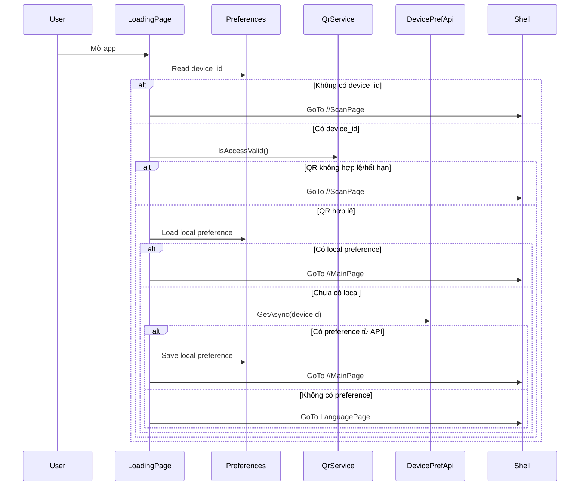
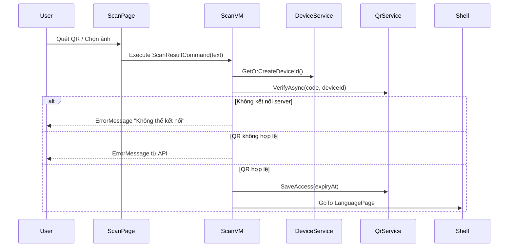
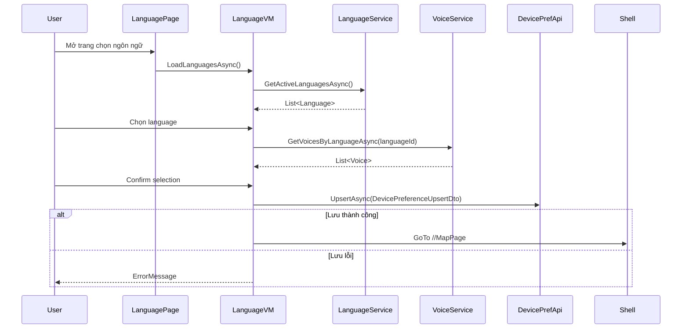
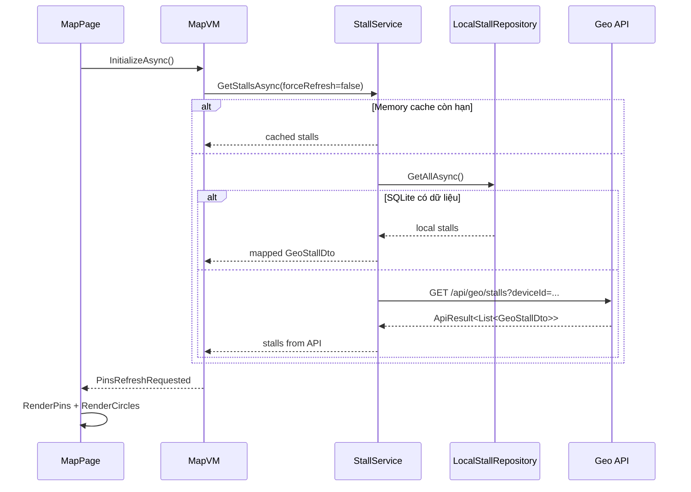
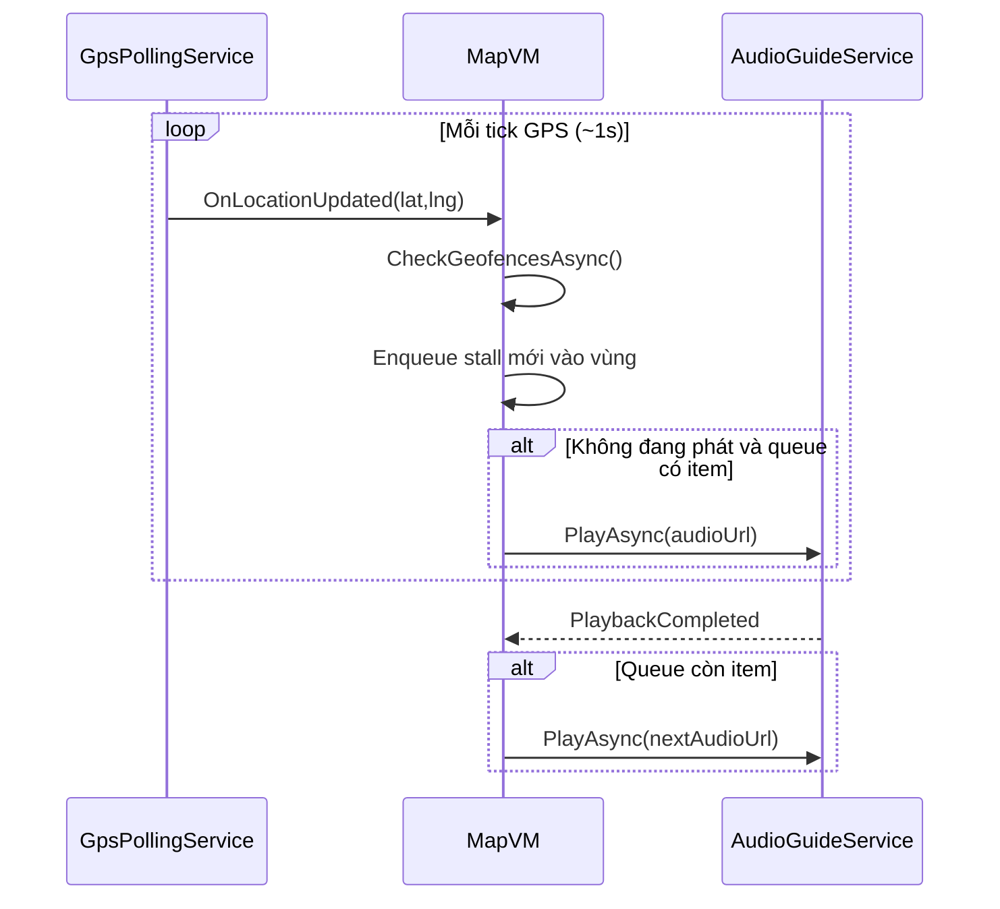
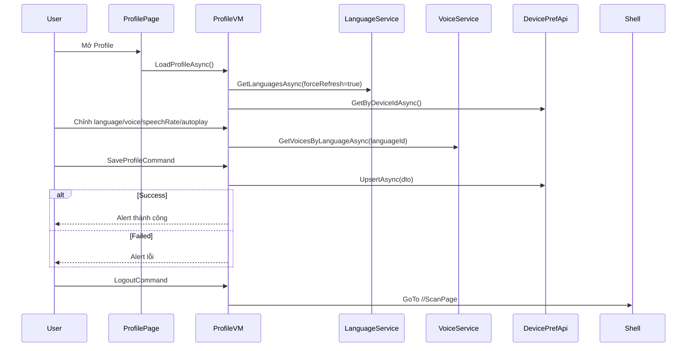
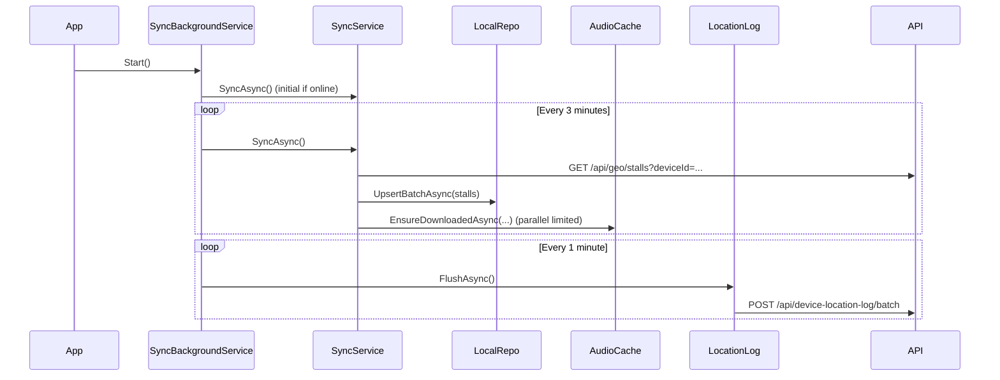

# 1. Tổng quan về Phần Mobile

## 1.1 Phạm vi phân tích
Tài liệu này chỉ phân tích phần **Mobile** trong project `D:\University\Subject\C#\Exam`, cụ thể là project `Mobile/Mobile.csproj` (.NET MAUI, đa nền tảng Android/iOS/Windows/MacCatalyst).

## 1.2 Tên app và stack công nghệ chính
- **Tên app (theo csproj):** `Mobile`
- **Framework:** .NET MAUI (.NET 10)
- **Ngôn ngữ:** C# + XAML
- **UI Toolkit:** MAUI Controls + CommunityToolkit.Maui (Popup)
- **Bản đồ:** Mapsui + OpenStreetMap
- **QR Scan:** ZXing.Net.Maui
- **Audio playback:** Plugin.Maui.Audio
- **Local storage:** Preferences + SQLite (`sqlite-net-pcl`)
- **Networking:** `HttpClientFactory`
- **Kiến trúc tổng thể:** MVVM + Service Layer + Local Cache (SQLite) + DI
- **Navigation:** Shell Navigation (`AppShell`, route absolute/relative)

## 1.3 Module/feature chính của mobile app
1. **Startup & access gating**
   - `LoadingPage`: quyết định vào `ScanPage`, `MainPage`, hoặc `LanguagePage` dựa trên DeviceId, QR validity, local preference.
2. **QR verification**
   - `ScanPage` + `ScanViewModel` + `QrService`: quét QR camera/ảnh, verify API, lưu quyền truy cập theo hạn dùng.
3. **Language/voice preference**
   - `LanguagePage` + `LanguageViewModel`: chọn ngôn ngữ, giọng đọc, tốc độ đọc, autoplay; lưu qua `DevicePreferenceApiService`.
4. **Map + stall interaction + narration**
   - `MapPage` + `MapViewModel`: tải stall, hiển thị pin + geofence, popup chi tiết, phát audio.
5. **Geofence auto narration queue**
   - `GpsPollingService` + `MapViewModel`: phát narration theo queue khi vào vùng bán kính stall.
6. **Background sync & offline hỗ trợ**
   - `SyncService`, `SyncBackgroundService`, `LocalStallRepository`, `AudioCacheService`.
7. **Profile settings**
   - `ProfilePage` + `ProfileViewModel`: chỉnh preference theo thiết bị, logout.
8. **Stall list**
   - `StallListPage` + `StallListViewModel`: danh sách, tìm kiếm, phân trang.

## 1.4 Kiến trúc tổng thể
- **Presentation:** Pages (XAML + code-behind), Components, ViewModels.
- **Application/Domain-ish services:** `StallService`, `LanguageService`, `VoiceService`, `QrService`, `DevicePreferenceApiService`, ...
- **Infrastructure local:** SQLite repository (`LocalStallRepository`), file cache audio (`AudioCacheService`), Preferences.
- **Infrastructure platform:** Permissions (Android), Geolocation, Connectivity.

## 1.5 Điểm mạnh
- DI rõ ràng trong `MauiProgram`.
- Chia module tương đối tốt theo `Pages / ViewModels / Services / LocalDb`.
- Có chiến lược cache-first + offline fallback (SQLite + audio local).
- Có background sync + location batching.
- Có guard chống double-navigation và race condition ở các flow nhạy cảm (scan/navigation).

## 1.6 Điểm cần cải thiện
- `MapPage` code-behind khá dày (UI + orchestration map logic), nên tiếp tục tách bớt hành vi để dễ test.
- Chưa thấy test project cho mobile (unit/integration/UI test).
- Base URL API hiện hardcode (`http://10.0.2.2:5299`) trong `MauiProgram`.
- Một số service dùng `CreateClient()` và một số dùng named client (`ApiHttp`) -> nên chuẩn hóa.

---

# 2. Use Cases (Trường hợp sử dụng)

## 2.1 Danh sách use case chính theo nhóm chức năng

### A. Access / Startup
- UC-A1: Khởi động app và điều hướng màn hình khởi điểm.
- UC-A2: Quét QR bằng camera.
- UC-A3: Quét QR từ ảnh thư viện.
- UC-A4: Đăng xuất (xóa quyền truy cập QR).

### B. Preferences
- UC-B1: Chọn ngôn ngữ + giọng đọc lần đầu.
- UC-B2: Cập nhật cấu hình từ Profile.

### C. Map / Narration
- UC-C1: Tải map và stall từ cache/API.
- UC-C2: Chọn stall từ pin và phát thuyết minh.
- UC-C3: Tự động phát narration theo geofence queue.

### D. Data / Sync
- UC-D1: Đồng bộ nền stall + audio cache.
- UC-D2: Thu thập GPS và gửi batch location logs.

### E. Browsing
- UC-E1: Xem danh sách stall, tìm kiếm, phân trang.

## 2.2 Mô tả chi tiết các use case quan trọng

### UC-A1: Khởi động app và điều hướng màn hình khởi điểm
| Thuộc tính | Nội dung |
|---|---|
| Actor | Người dùng |
| Preconditions | App đã cài đặt; có/không có DeviceId, QR access, local preference |
| Postconditions | Điều hướng đến `ScanPage` hoặc `MainPage` hoặc `LanguagePage` |
| Main Flow | `LoadingPage` đọc DeviceId -> kiểm tra QR access (`QrService.IsAccessValid`) -> đọc local preference -> nếu cần thì gọi API preference -> điều hướng |
| Alternative Flow | Có local preference hợp lệ -> vào `MainPage` ngay không cần gọi API |
| Exception Flow | Lỗi bất kỳ khi startup -> fallback `ScanPage` |

### UC-A2/A3: Quét QR và xác thực truy cập
| Thuộc tính | Nội dung |
|---|---|
| Actor | Người dùng |
| Preconditions | Người dùng đang ở `ScanPage`; camera permission (cho UC-A2) |
| Postconditions | QR hợp lệ: lưu expiry và vào `LanguagePage`; QR lỗi: hiển thị lỗi, cho quét lại |
| Main Flow | Scan camera hoặc decode từ ảnh -> `QrService.VerifyAsync(code, deviceId)` -> nếu valid `SaveAccess(expiryAt)` -> navigate `LanguagePage` |
| Alternative Flow | Người dùng chọn ảnh từ gallery thay vì camera |
| Exception Flow | Không có quyền camera / timeout mạng / API không phản hồi |

### UC-B1: Chọn ngôn ngữ + giọng đọc lần đầu
| Thuộc tính | Nội dung |
|---|---|
| Actor | Người dùng |
| Preconditions | Đã verify QR thành công; vào `LanguagePage` |
| Postconditions | Device preference được upsert; app điều hướng `MapPage` |
| Main Flow | Load active languages -> chọn language -> load voices theo language -> chỉnh speech rate/autoplay -> confirm -> upsert preference |
| Alternative Flow | Chỉ có 1 voice hoặc không có voice mặc định -> chọn item đầu tiên |
| Exception Flow | API language/voice lỗi, hoặc upsert thất bại -> hiển thị `ErrorMessage` |

### UC-B2: Cập nhật cấu hình từ Profile
| Thuộc tính | Nội dung |
|---|---|
| Actor | Người dùng |
| Preconditions | Người dùng vào `ProfilePage` |
| Postconditions | Cấu hình mới được lưu qua API |
| Main Flow | Load profile (languages + preference hiện tại) -> chọn language/voice/speech rate/autoplay -> lưu |
| Alternative Flow | Reset về mặc định (speech rate 1.0, autoplay true) |
| Exception Flow | Lỗi load/save -> alert lỗi |

### UC-C1/C2: Tương tác bản đồ và phát thuyết minh
| Thuộc tính | Nội dung |
|---|---|
| Actor | Người dùng |
| Preconditions | Người dùng ở `MapPage`; có dữ liệu stall (API hoặc cache) |
| Postconditions | Stall được focus/chọn; audio được phát hoặc thông báo thiếu audio |
| Main Flow | `MapViewModel.InitializeAsync` tải stalls -> `MapPage.RenderPins` -> tap pin mở `StallPopup` -> Play -> `AudioGuideService.PlayAsync` |
| Alternative Flow | Chọn stall từ danh sách `CollectionView` thay vì pin |
| Exception Flow | Không có location permission / stall không có audio / lỗi mạng audio |

### UC-C3: Auto narration theo geofence
| Thuộc tính | Nội dung |
|---|---|
| Actor | Hệ thống (GPS polling) |
| Preconditions | `MapPage` đang active và GPS polling đang chạy |
| Postconditions | Stall vào vùng geofence được enqueue và phát tuần tự |
| Main Flow | Poll GPS mỗi ~1s -> `CheckGeofencesAsync` -> enqueue stall mới vào vùng -> nếu không đang phát thì phát ngay -> khi audio kết thúc phát item kế tiếp |
| Alternative Flow | Stall rời vùng geofence -> remove khỏi queue/trigger set |
| Exception Flow | Lỗi GPS hoặc không lấy được location -> bỏ qua tick |

### UC-D1/D2: Sync nền và gửi location log
| Thuộc tính | Nội dung |
|---|---|
| Actor | Hệ thống |
| Preconditions | `SyncBackgroundService.Start()` đã chạy |
| Postconditions | SQLite và audio cache cập nhật; location logs được flush khi online |
| Main Flow | Timer stall sync 3 phút + flush location 1 phút -> online thì gọi sync/flush |
| Alternative Flow | Connectivity đổi sang online -> trigger sync ngay |
| Exception Flow | API lỗi: giữ dữ liệu cũ, retry tick sau |

---

# 3. UML Diagrams

## 3.a Use Case Diagram


## 3.b Component Diagram (kiến trúc chính)


## 3.c Activity Diagram - Startup routing


---

# 4. Sequence Diagrams (Sơ đồ tuần tự)

## 4.1 Startup auto-navigation


## 4.2 QR verification flow (camera/gallery)


## 4.3 Language + voice selection and save preference


## 4.4 Fetch stalls (cache-first) + render map


## 4.5 Geofence auto-play queue flow


## 4.6 Profile save flow


## 4.7 Background sync + location flush


---

# 5. Các thành phần chính khác

## 5.1 Data Flow
1. API `/api/geo/stalls` -> `StallService` -> `MapViewModel.Stalls` -> `MapPage` render pin/circle.
2. API language/voice -> `LanguageViewModel`/`ProfileViewModel` -> UI picker/collection.
3. Preference save:
   - UI chọn -> `DevicePreferenceApiService.UpsertAsync` -> lưu local (`LocalPreferenceService`) -> startup lần sau đọc local trước.
4. Đồng bộ offline:
   - `SyncService` -> map dữ liệu API thành `LocalStall` -> SQLite + audio file cache.

## 5.2 State Management
- Chủ đạo là **state trong ViewModel** (`INotifyPropertyChanged`, `ObservableCollection`).
- State local có tính bền vững:
  - Preferences: device_id, QR expiry, language/voice/speech rate/autoplay.
  - SQLite: stalls đã sync.
  - File system: cached mp3 theo language + stall.
- Có guard chống race/double action:
  - `ScanViewModel` (`_navigationGuard`)
  - `MainViewModel` (`_quickActionNavigationGuard`)

## 5.3 Navigation Structure
- Shell routes gốc (`AppShell.xaml`): `LoadingPage`, `ScanPage`, `MainPage`, `MapPage`, `profile`, `StallListPage`.
- Route phụ đăng ký code-behind: `LanguagePage`.
- Startup luôn đi qua `LoadingPage` để phân nhánh.

## 5.4 API Integration & Error Handling
- Tất cả API chính dùng `HttpClientFactory`.
- Mẫu xử lý lỗi hiện tại:
  - Trả list rỗng/null khi API fail ở một số service.
  - `try/catch` tại ViewModel và hiển thị `ErrorMessage` hoặc Alert.
  - Cache/local fallback trong `StallService`, `SyncService`.
- Timeout đã cấu hình ở `MauiProgram` (10 giây cho client chính).

## 5.5 Performance & Offline Support
- Memory cache stalls (TTL 10 phút) trong `StallService`.
- SQLite cache + cache file audio local cho offline.
- Sync nền chu kỳ + trigger khi mạng quay lại.
- Geofence queue hạn chế phát trùng stall nhờ `_triggeredStallIds`.

## 5.6 Security & Permissions
- QR access có expiry, lưu local, kiểm tra lúc startup.
- Android permissions khai báo:
  - `ACCESS_FINE_LOCATION`
  - `ACCESS_COARSE_LOCATION`
  - `CAMERA`
- Runtime permission được request tại `ScanPage` (camera), `MapPage` (location).
- Chưa thấy cơ chế token auth người dùng cuối trong mobile code hiện tại (thiết kế theo device-based access).

## 5.7 Testing strategy (hiện trạng & đề xuất)
### Hiện trạng từ codebase
- Chưa thấy project test chuyên biệt cho Mobile trong solution.

### Khuyến nghị ngắn
- Unit test cho:
  - `QrService.IsAccessValid()`
  - mapping trong `StallService`
  - logic queue/geofence trong `MapViewModel`
- Integration test cho:
  - startup routing (`LoadingPage` path)
  - flow save preference.
- UI test (smoke): Scan -> Language -> Map.

---

# 6. Kết luận & Khuyến nghị

## 6.1 Đánh giá tổng thể
Phần Mobile có nền tảng kiến trúc tốt theo MVVM + DI, tích hợp nhiều tính năng thực tế (QR access, map, geofence narration, sync nền, offline cache). Dòng dữ liệu chính rõ và có fallback tương đối đầy đủ khi offline/lỗi mạng.

## 6.2 Rủi ro/điểm tiềm ẩn
1. **Maintainability:** `MapPage` và một số ViewModel đang chứa nhiều logic nghiệp vụ + điều phối.
2. **Testability:** thiếu test tự động cho các flow quan trọng.
3. **Config management:** base URL hardcode có thể gây khó cho môi trường staging/production.
4. **Consistency:** chuẩn hóa cách dùng `HttpClient` (named/default) để giảm sai cấu hình.

## 6.3 Đề xuất cải thiện ưu tiên
1. Tách dần orchestration map/geofence sang service/domain để giảm code-behind.
2. Bổ sung test project cho Mobile (ưu tiên logic QR/startup/geofence).
3. Đưa API endpoint vào cấu hình môi trường (Debug/Release).
4. Chuẩn hóa error model (thay vì trộn null/list rỗng/exception ở nhiều service).

---

## Gợi ý lệnh commit
```bash
git add docs/mobile.md
git commit -m "docs(mobile): add architecture, use cases, UML and sequence diagrams for MAUI app"
git push origin dev
```