# Sequence Diagrams — Mobile & Web

> Tài liệu sequence tổng hợp, có phân nhóm rõ **[MOBILE]** và **[WEB]**.

---

## A. [MOBILE] Sequences

## M-01 Startup Routing (Loading -> Scan/Main/Language)
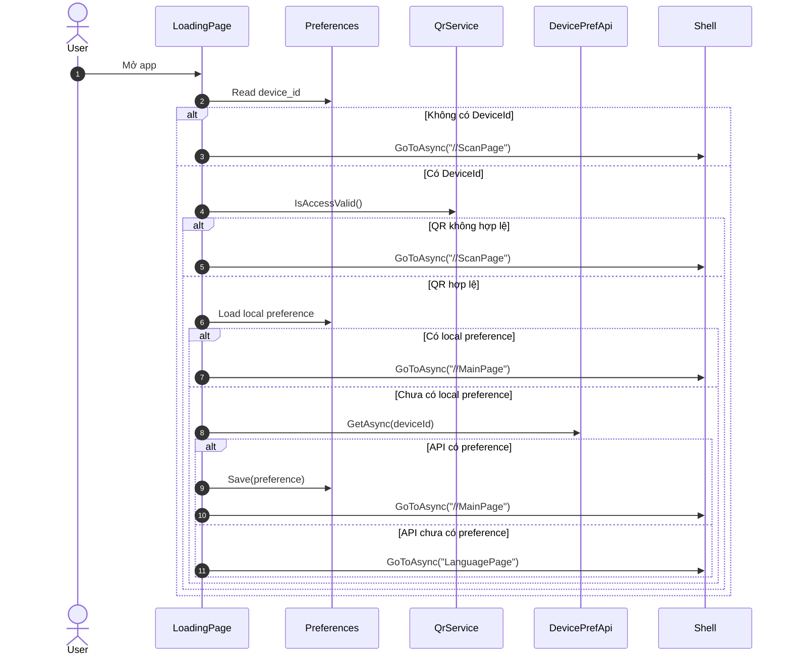

## M-02 QR Scan & Verify (camera/gallery)
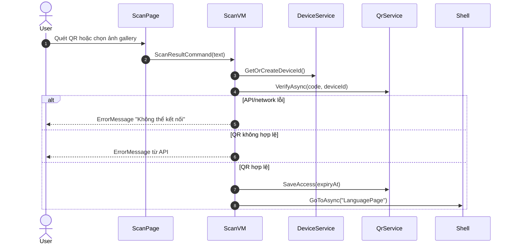

## M-03 Chọn Language + Voice và lưu DevicePreference
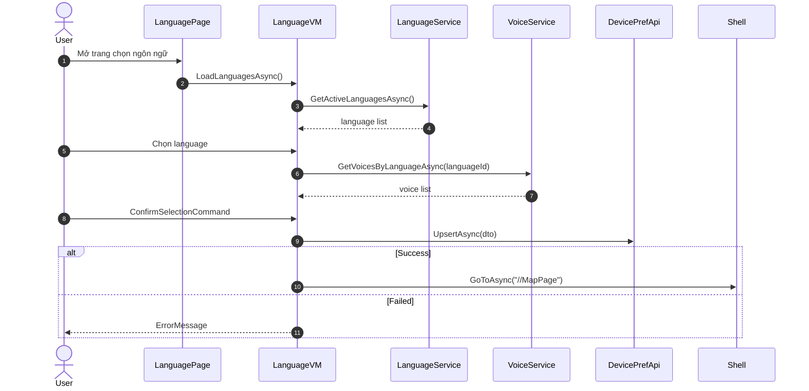

## M-04 Map load (cache-first) + pin render
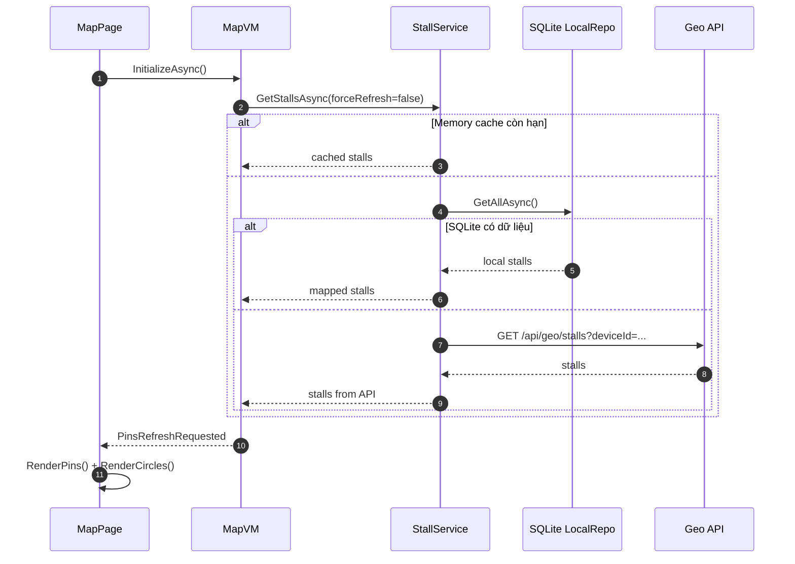

## M-05 Tap pin -> Popup -> Play narration
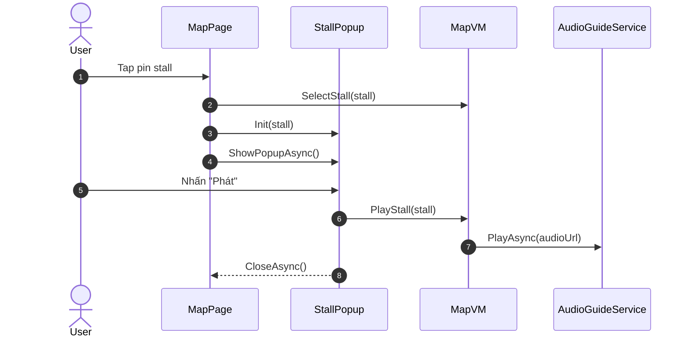

## M-06 Geofence auto-play queue
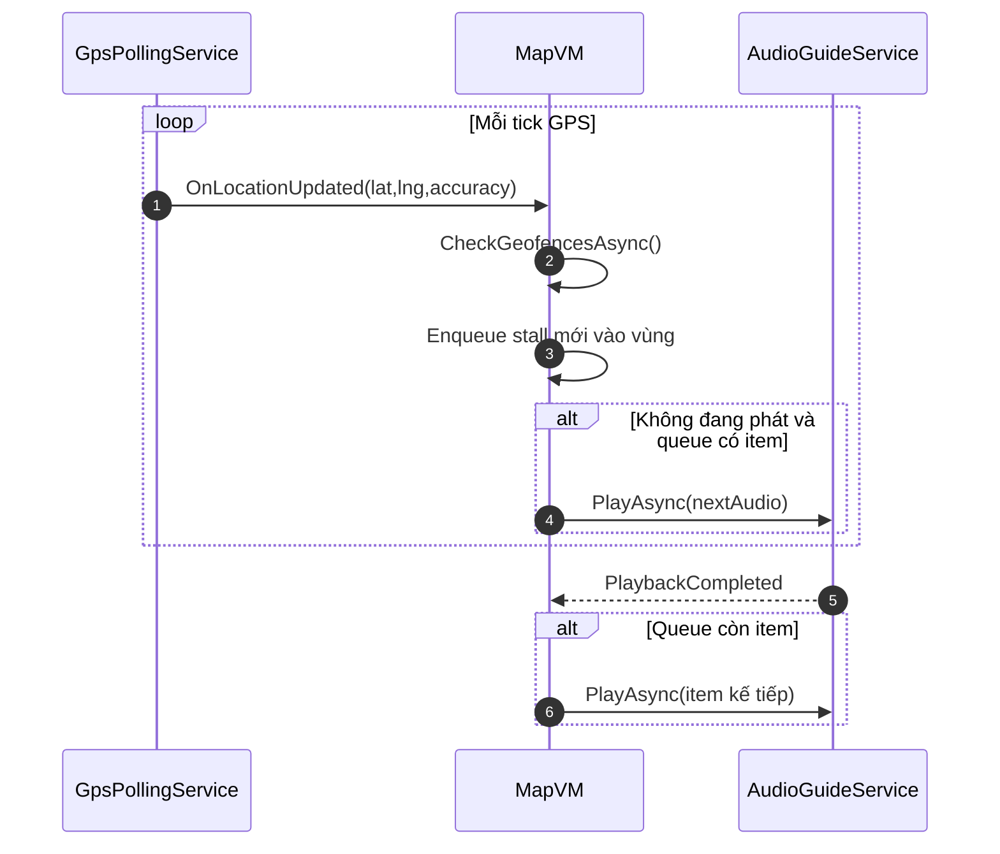

## M-07 Background sync + location flush
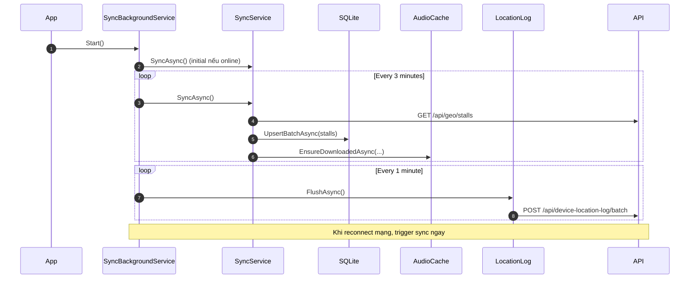

---

## B. [WEB] Sequences

## W-01 Login
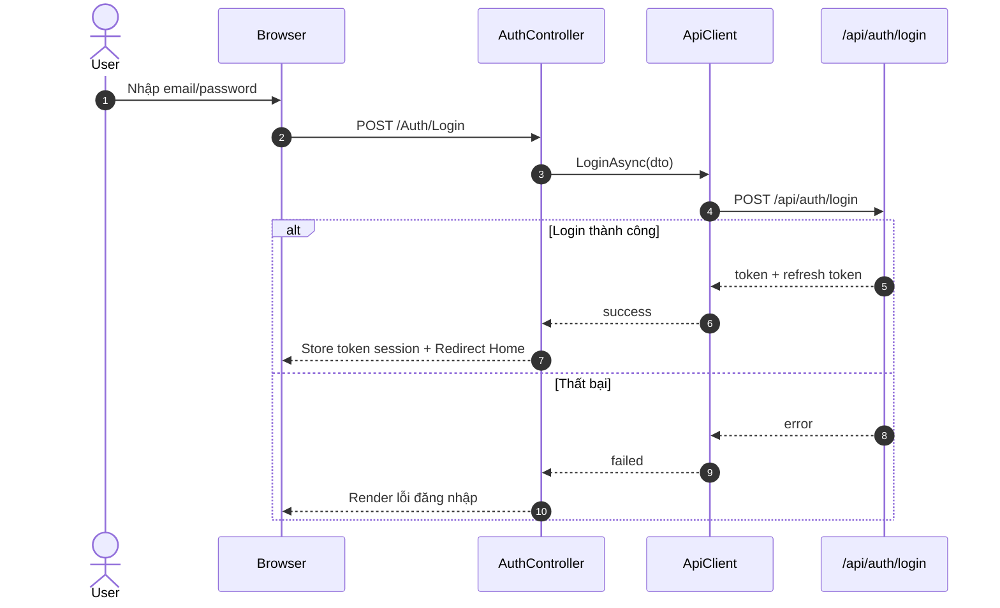

## W-02 Register BusinessOwner
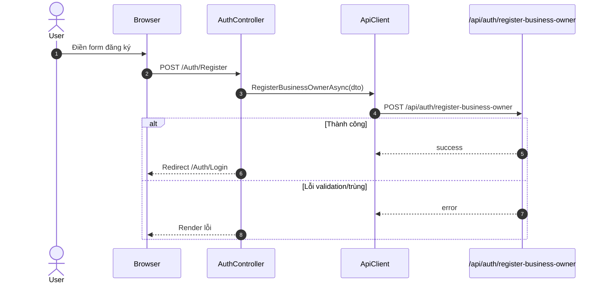

## W-03 Business list/search
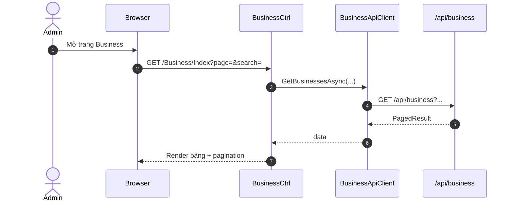

## W-04 Create/Update Stall
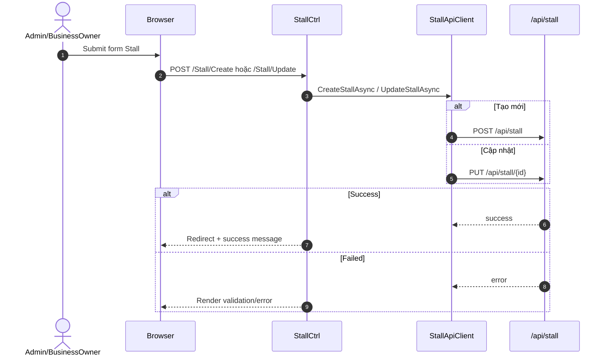

## W-05 Stall Location + GeoFence quản lý
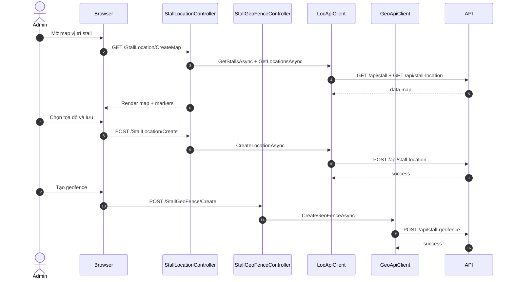

## W-06 Narration content + audio
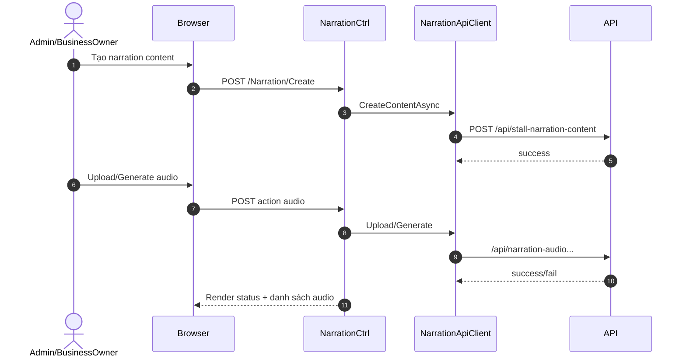

## W-07 User/Role Admin
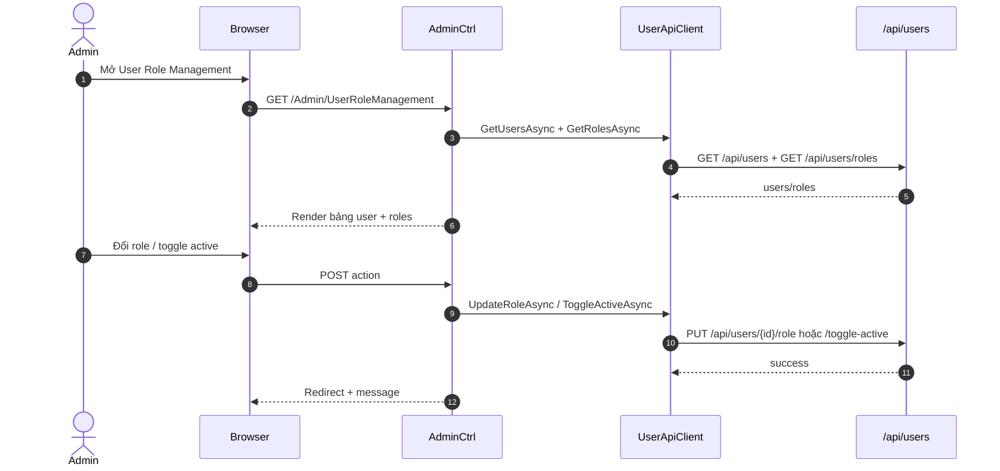

## W-08 Subscription order flow
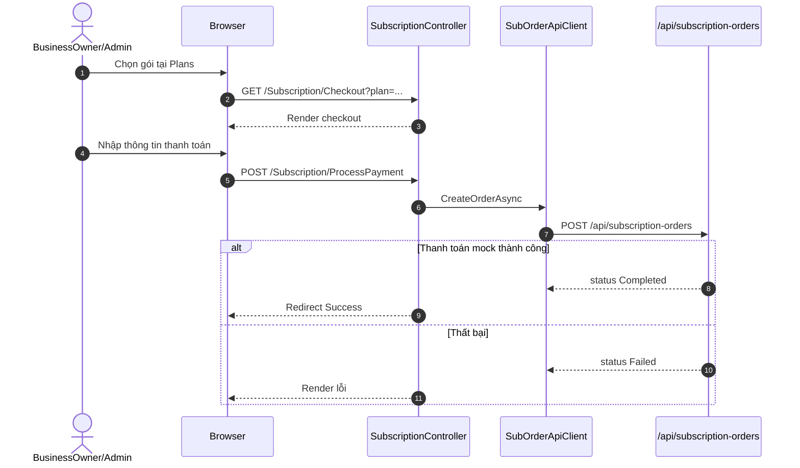

## W-09 QR admin + kiosk auto flow
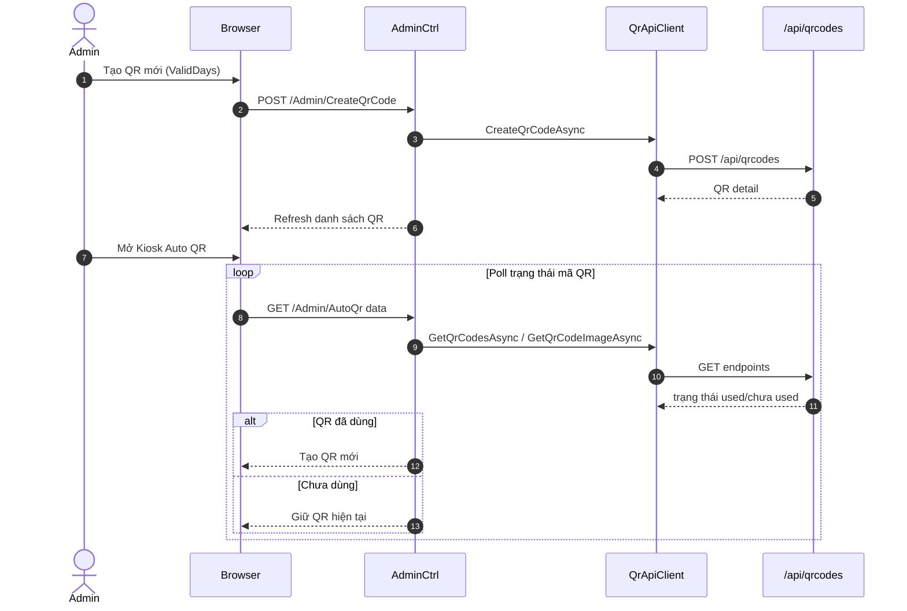
