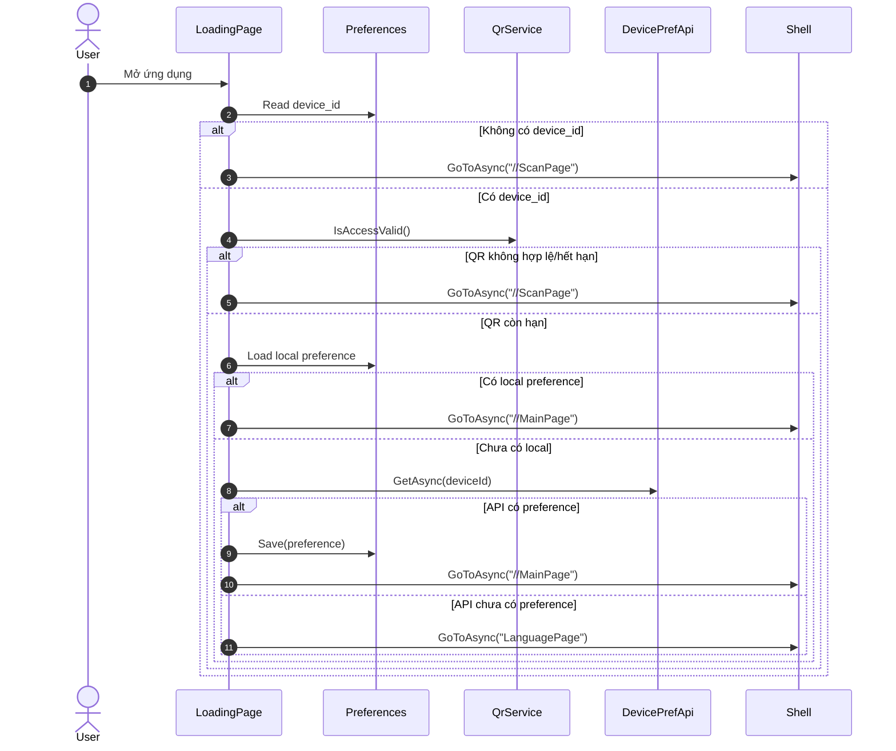
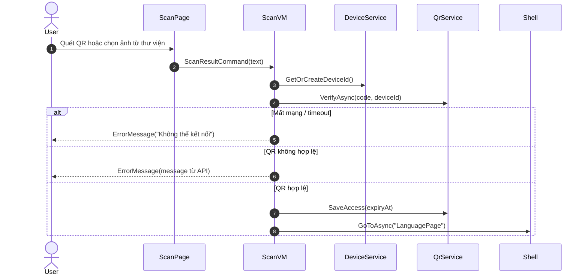
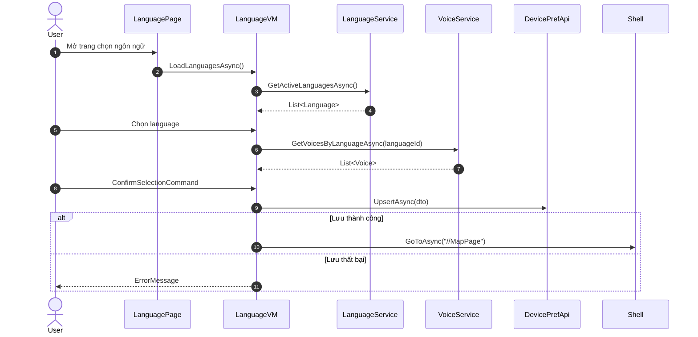
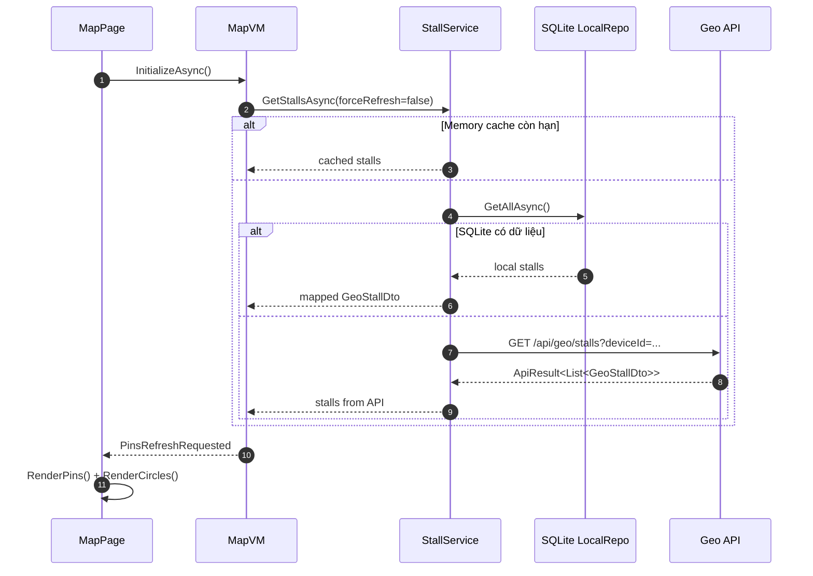
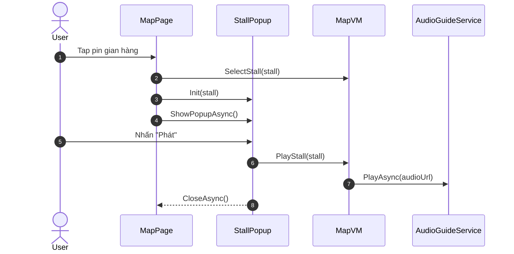
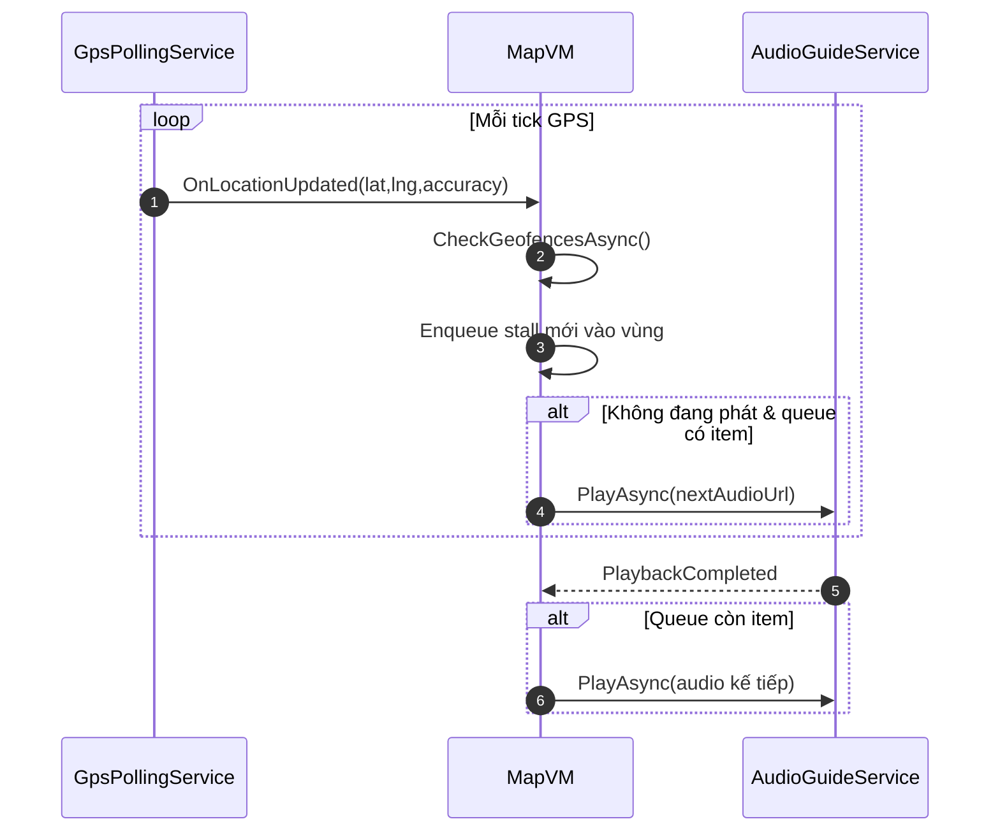
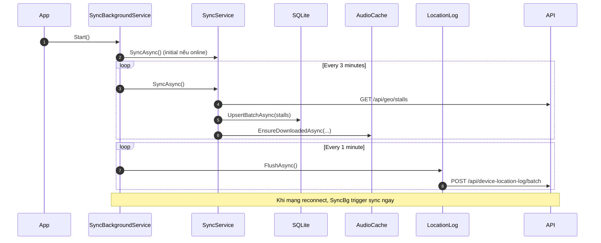

# Sequence Diagrams - Mobile App

Tài liệu này tập trung vẽ sẵn các sequence diagram quan trọng cho phần Mobile (.NET MAUI).

## 1) Startup Routing (Loading -> Scan/Main/Language)

## 2) QR Scan & Verify (Camera/Gallery)

## 3) Chọn ngôn ngữ + giọng đọc và lưu preference

## 4) Tải stall (cache-first) và render map

## 5) Tap pin -> Popup -> Play narration

## 6) Geofence auto-play queue

## 7) Background sync + flush location logs

